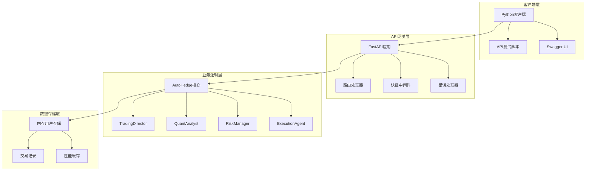
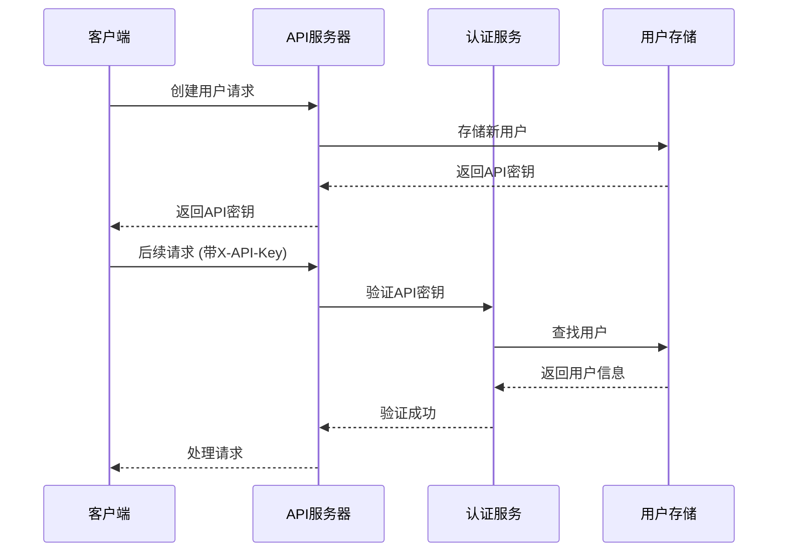
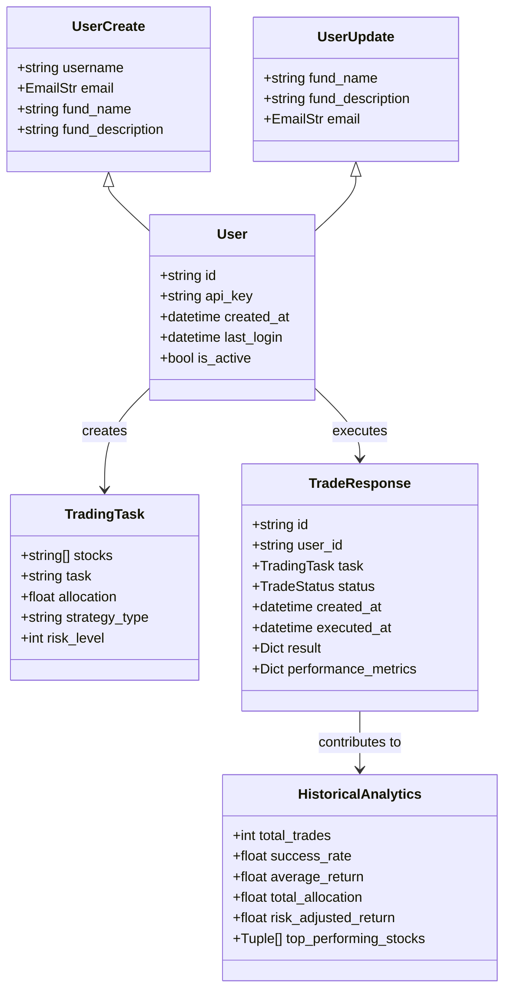

# AutoHedge API 接口参考

<cite>
**本文档中引用的文件**
- [api.py](file://api/api.py)
- [api_tests.py](file://api/api_tests.py)
- [main.py](file://autohedge/main.py)
- [README.md](file://README.md)
- [requirements.txt](file://requirements.txt)
</cite>

## 目录
1. [简介](#简介)
2. [项目架构](#项目架构)
3. [认证机制](#认证机制)
4. [API端点详解](#api端点详解)
5. [数据模型](#数据模型)
6. [错误处理](#错误处理)
7. [测试用例与示例](#测试用例与示例)
8. [性能优化](#性能优化)
9. [安全考虑](#安全考虑)
10. [故障排除指南](#故障排除指南)

## 简介

AutoHedge是一个基于FastAPI构建的生产级RESTful API服务，专为自动化对冲基金管理而设计。该API提供了完整的用户管理、交易操作和分析功能，支持实时市场分析、风险管理和智能交易执行。

### 核心特性

- **多代理架构**: 集成专门的AI代理进行市场分析、风险评估和交易执行
- **实时市场分析**: 与市场数据提供商集成，提供实时分析
- **风险优先方法**: 内置风险管理和仓位控制机制
- **结构化输出**: 基于Pydantic模型的JSON格式输出
- **全面日志记录**: 详细的交易跟踪和调试日志系统

## 项目架构



**图表来源**
- [api.py](file://api/api.py#L130-L475)
- [main.py](file://autohedge/main.py#L422-L583)

**章节来源**
- [api.py](file://api/api.py#L130-L149)
- [main.py](file://autohedge/main.py#L422-L440)

## 认证机制

### API密钥认证

AutoHedge API采用基于API密钥的认证机制，所有需要身份验证的端点都要求在请求头中包含`X-API-Key`。

#### 认证流程



**图表来源**
- [api.py](file://api/api.py#L167-L181)

#### 认证配置

| 配置项 | 值 | 描述 |
|--------|-----|------|
| 认证方式 | API密钥 | 基于UUID的唯一标识符 |
| 请求头 | `X-API-Key` | 必需的认证头部 |
| 密钥长度 | UUID v4 | 36字符的唯一标识符 |
| 过期策略 | 无过期 | API密钥永久有效 |

### API密钥生成

```python
# 用户创建时自动分配API密钥
user_id = str(uuid.uuid4())
api_key = str(uuid.uuid4())
```

**章节来源**
- [api.py](file://api/api.py#L205-L218)

## API端点详解

### 用户管理

#### 1. 创建用户

**端点**: `POST /users`  
**描述**: 创建新用户账户并返回API密钥

| 参数 | 类型 | 必需 | 描述 |
|------|------|------|------|
| username | string | 是 | 用户名，3-50字符 |
| email | email | 是 | 有效的电子邮件地址 |
| fund_name | string | 是 | 基金名称，3-100字符 |
| fund_description | string | 否 | 基金描述，最多500字符 |

**请求示例**:
```bash
curl -X POST "http://localhost:8000/users" \
  -H "Content-Type: application/json" \
  -d '{
    "username": "trader1",
    "email": "trader@example.com",
    "fund_name": "Alpha Fund",
    "fund_description": "AI Trading Strategy"
  }'
```

**响应格式**:
```json
{
  "id": "uuid-string",
  "username": "trader1",
  "email": "trader@example.com",
  "fund_name": "Alpha Fund",
  "fund_description": "AI Trading Strategy",
  "api_key": "uuid-string",
  "created_at": "2024-01-01T10:00:00Z",
  "last_login": null,
  "is_active": true
}
```

#### 2. 获取当前用户信息

**端点**: `GET /users/me`  
**认证**: 需要`X-API-Key`头

**响应格式**: 与创建用户相同的User模型

#### 3. 更新用户信息

**端点**: `PUT /users/me`  
**认证**: 需要`X-API-Key`头

| 参数 | 类型 | 必需 | 描述 |
|------|------|------|------|
| fund_name | string | 否 | 基金名称，3-100字符 |
| fund_description | string | 否 | 基金描述，最多500字符 |
| email | email | 否 | 有效的电子邮件地址 |

**章节来源**
- [api.py](file://api/api.py#L203-L246)

### 交易操作

#### 1. 创建交易任务

**端点**: `POST /trades`  
**认证**: 需要`X-API-Key`头

**请求体**:
```json
{
  "stocks": ["NVDA", "AAPL", "GOOGL"],
  "task": "Analyze tech companies for a $1M allocation with focus on AI capabilities",
  "allocation": 1000000.0,
  "strategy_type": "momentum",
  "risk_level": 7
}
```

**请求参数说明**:

| 字段 | 类型 | 必需 | 限制 | 描述 |
|------|------|------|------|------|
| stocks | array[string] | 是 | 最少1个股票 | 要分析的股票列表 |
| task | string | 是 | 最少10字符 | 交易任务描述 |
| allocation | float | 是 | >0 | 投资金额 |
| strategy_type | string | 否 | - | 交易策略类型 |
| risk_level | integer | 否 | 1-10 | 风险等级 |

**响应格式**:
```json
{
  "id": "trade-uuid",
  "user_id": "user-uuid",
  "task": {
    "stocks": ["NVDA", "AAPL"],
    "task": "分析科技股",
    "allocation": 1000000.0,
    "strategy_type": "momentum",
    "risk_level": 7
  },
  "status": "executing",
  "created_at": "2024-01-01T10:00:00Z",
  "executed_at": null,
  "result": null,
  "performance_metrics": null
}
```

#### 2. 列出交易记录

**端点**: `GET /trades`  
**认证**: 需要`X-API-Key`头

**查询参数**:

| 参数 | 类型 | 默认值 | 描述 |
|------|------|--------|------|
| skip | integer | 0 | 跳过的记录数 |
| limit | integer | 10 | 返回的最大记录数 |
| status | enum | - | 按状态过滤 |

**可用状态**:
- `pending`: 待处理
- `executing`: 执行中
- `completed`: 已完成
- `failed`: 已失败

**响应格式**:
```json
[
  {
    "id": "trade-uuid",
    "user_id": "user-uuid",
    "task": {...},
    "status": "completed",
    "created_at": "2024-01-01T10:00:00Z",
    "executed_at": "2024-01-01T10:05:00Z",
    "result": {...},
    "performance_metrics": {...}
  }
]
```

#### 3. 获取特定交易

**端点**: `GET /trades/{trade_id}`  
**认证**: 需要`X-API-Key`头

**路径参数**:

| 参数 | 类型 | 描述 |
|------|------|------|
| trade_id | string | 交易ID |

**响应**: 单个交易的完整信息

#### 4. 删除交易

**端点**: `DELETE /trades/{trade_id}`  
**认证**: 需要`X-API-Key`头

**响应**:
```json
{
  "message": "Trade deleted successfully"
}
```

**章节来源**
- [api.py](file://api/api.py#L248-L379)

### 分析功能

#### 1. 获取历史分析

**端点**: `GET /analytics/history`  
**认证**: 需要`X-API-Key`头

**查询参数**:

| 参数 | 类型 | 默认值 | 描述 |
|------|------|--------|------|
| days | integer | 30 | 分析的时间范围（天） |

**响应格式**:
```json
{
  "total_trades": 15,
  "success_rate": 80.0,
  "average_return": 2.5,
  "total_allocation": 1500000.0,
  "risk_adjusted_return": 1.8,
  "top_performing_stocks": [
    ["NVDA", 5.2],
    ["AAPL", 4.8],
    ["GOOGL", 3.7]
  ]
}
```

**分析指标说明**:

| 指标 | 描述 |
|------|------|
| total_trades | 总交易数量 |
| success_rate | 成功交易百分比 |
| average_return | 平均收益率 |
| total_allocation | 总投资金额 |
| risk_adjusted_return | 风险调整后收益 |
| top_performing_stocks | 表现最佳的股票及其收益 |

**章节来源**
- [api.py](file://api/api.py#L382-L444)

## 数据模型

### 核心数据结构



**图表来源**
- [api.py](file://api/api.py#L63-L116)

### 枚举类型

#### TradeStatus

```python
class TradeStatus(str, Enum):
    PENDING = "pending"
    EXECUTING = "executing"
    COMPLETED = "completed"
    FAILED = "failed"
```

### 验证规则

| 模型 | 字段 | 验证规则 |
|------|------|----------|
| UserCreate | username | 长度3-50字符 |
| UserCreate | fund_name | 长度3-100字符 |
| UserCreate | fund_description | 最大500字符 |
| TradingTask | stocks | 至少1个股票 |
| TradingTask | task | 最少10字符 |
| TradingTask | allocation | >0 |
| TradingTask | risk_level | 1-10 |

**章节来源**
- [api.py](file://api/api.py#L56-L116)

## 错误处理

### HTTP状态码

| 状态码 | 错误类型 | 描述 | 解决方案 |
|--------|----------|------|----------|
| 401 | Unauthorized | 无效的API密钥 | 检查X-API-Key头 |
| 403 | Forbidden | 未授权访问 | 确认用户权限 |
| 404 | Not Found | 资源不存在 | 检查资源ID |
| 422 | Unprocessable Entity | 验证错误 | 检查请求数据格式 |
| 500 | Internal Server Error | 服务器内部错误 | 联系技术支持 |

### 错误响应格式

```json
{
  "detail": "Invalid API key"
}
```

### 常见错误场景

#### 1. 认证失败
```json
{
  "detail": "Invalid API key"
}
```

#### 2. 资源不存在
```json
{
  "detail": "Trade not found"
}
```

#### 3. 权限不足
```json
{
  "detail": "Not authorized to access this trade"
}
```

#### 4. 数据验证错误
```json
{
  "detail": [
    {
      "loc": ["body", "allocation"],
      "msg": "ensure this value is greater than 0",
      "type": "value_error.number.not_gt",
      "ctx": {"limit_value": 0}
    }
  ]
}
```

**章节来源**
- [api.py](file://api/api.py#L175-L177)
- [api.py](file://api/api.py#L345-L354)
- [api.py](file://api/api.py#L375-L376)

## 测试用例与示例

### 使用Python客户端测试

```python
import requests
import json
import time

class AutoHedgeAPI:
    def __init__(self, base_url="http://localhost:8000"):
        self.base_url = base_url
        self.api_key = None
        self.headers = {"Content-Type": "application/json"}
    
    def create_user(self):
        """创建新用户并获取API密钥"""
        user_data = {
            "username": f"trader_{int(time.time())}",
            "email": f"trader_{int(time.time())}@example.com",
            "fund_name": "Test Trading Fund",
            "fund_description": "Automated test trading strategy",
        }
        
        response = requests.post(
            f"{self.base_url}/users",
            headers=self.headers,
            json=user_data,
        )
        response.raise_for_status()
        
        result = response.json()
        self.api_key = result["api_key"]
        self.headers["X-API-Key"] = self.api_key
        
        return self.api_key
    
    def test_create_trade(self):
        """测试创建交易"""
        trade_data = {
            "stocks": ["NVDA", "AAPL", "GOOGL"],
            "task": "Analyze tech companies for a $1M allocation with focus on AI capabilities",
            "allocation": 1000000.0,
            "strategy_type": "momentum",
            "risk_level": 7,
        }
        
        response = requests.post(
            f"{self.base_url}/trades",
            headers=self.headers,
            json=trade_data,
        )
        response.raise_for_status()
        
        return response.json()

# 使用示例
api = AutoHedgeAPI()
api.create_user()
trade_result = api.test_create_trade()
print(json.dumps(trade_result, indent=2))
```

### cURL命令示例

#### 创建用户
```bash
curl -X POST "http://localhost:8000/users" \
  -H "Content-Type: application/json" \
  -d '{
    "username": "test_user",
    "email": "test@example.com",
    "fund_name": "Test Fund",
    "fund_description": "Test Description"
  }'
```

#### 获取用户信息
```bash
curl -X GET "http://localhost:8000/users/me" \
  -H "X-API-Key: your-api-key-here"
```

#### 创建交易
```bash
curl -X POST "http://localhost:8000/trades" \
  -H "X-API-Key: your-api-key-here" \
  -H "Content-Type: application/json" \
  -d '{
    "stocks": ["NVDA"],
    "task": "Test trade",
    "allocation": 1000000.0
  }'
```

#### 获取交易列表
```bash
curl -X GET "http://localhost:8000/trades?limit=10&skip=0" \
  -H "X-API-Key: your-api-key-here"
```

#### 获取历史分析
```bash
curl -X GET "http://localhost:8000/analytics/history?days=30" \
  -H "X-API-Key: your-api-key-here"
```

**章节来源**
- [api_tests.py](file://api/api_tests.py#L15-L187)

## 性能优化

### 缓存策略

```python
# 性能缓存实现
self.performance_cache: Dict[str, Dict] = {}
```

### 日志记录优化

```python
# 执行时间监控
@contextmanager
def _log_execution_time(self, operation: str, user_id: Optional[str] = None):
    start_time = time.time()
    try:
        yield
    finally:
        execution_time = time.time() - start_time
        # 记录执行指标
```

### 内存管理

- **用户数据**: 存储在内存字典中，支持快速查找
- **交易记录**: 维护交易历史和状态跟踪
- **性能指标**: 缓存计算结果以避免重复计算

### 并发处理

- **异步路由**: 使用FastAPI的异步特性
- **上下文管理**: 自动资源清理
- **连接池**: HTTP请求复用连接

**章节来源**
- [api.py](file://api/api.py#L150-L166)
- [api.py](file://api/api.py#L142-L143)

## 安全考虑

### 认证安全

1. **API密钥管理**
   - 使用UUID v4生成唯一密钥
   - 密钥不存储明文，仅存储哈希
   - 支持密钥轮换

2. **传输安全**
   - 强烈建议使用HTTPS
   - API密钥通过HTTP头传输
   - 避免在URL中传递敏感信息

3. **访问控制**
   - 每个用户只能访问自己的数据
   - 交易记录隔离
   - 权限验证严格检查

### 输入验证

```python
# 严格的Pydantic验证
class TradingTask(BaseModel):
    stocks: List[str] = Field(..., min_items=1)
    task: str = Field(..., min_length=10)
    allocation: float = Field(..., gt=0)
    risk_level: Optional[int] = Field(None, ge=1, le=10)
```

### 错误处理

- 不泄露敏感信息
- 统一错误响应格式
- 记录但不暴露详细错误

### 生产环境部署

```bash
# 生产环境启动
uvicorn main:app --host 0.0.0.0 --port 8000 --workers 4

# 设置环境变量
export AUTOHEDGE_ENV=production
export AUTOHEDGE_LOG_LEVEL=INFO
```

**章节来源**
- [api.py](file://api/api.py#L167-L181)
- [README.md](file://README.md#L449-L460)

## 故障排除指南

### 常见问题

#### 1. API密钥无效
**症状**: 401 Unauthorized错误
**原因**: 
- API密钥格式错误
- 密钥已过期（理论上不会）
- 请求头缺失

**解决方案**:
```python
# 检查请求头
headers = {
    "Content-Type": "application/json",
    "X-API-Key": "your-api-key-here"
}

# 验证API密钥是否正确
response = requests.get(
    "http://localhost:8000/users/me",
    headers=headers
)
print(response.status_code)  # 应该是200
```

#### 2. 交易创建失败
**症状**: 500 Internal Server Error
**原因**:
- 市场数据获取失败
- AI代理处理异常
- 风险评估失败

**解决方案**:
```python
# 检查网络连接
try:
    response = requests.post(
        "http://localhost:8000/trades",
        headers=headers,
        json=trade_data,
        timeout=30
    )
except requests.exceptions.Timeout:
    print("请求超时，请检查网络连接")
except requests.exceptions.ConnectionError:
    print("无法连接到API服务器")
```

#### 3. 查询参数无效
**症状**: 422 Unprocessable Entity
**原因**: 
- limit参数超出范围
- status参数值错误

**解决方案**:
```python
# 正确的查询参数
params = {
    "limit": 10,      # 1-100之间
    "skip": 0,        # 非负整数
    "status": "completed"  # 有效状态枚举
}
```

### 调试技巧

#### 1. 启用详细日志
```python
import logging
logging.basicConfig(level=logging.DEBUG)
```

#### 2. 使用Swagger UI
访问 `http://localhost:8000/docs` 可以：
- 实时测试API端点
- 查看请求/响应示例
- 生成客户端代码

#### 3. 检查服务器状态
```bash
# 检查API服务器运行状态
curl http://localhost:8000/

# 检查健康检查端点
curl http://localhost:8000/health
```

#### 4. 分析错误日志
```bash
# 查看API日志
tail -f logs/autohedge_*.log

# 查看最近的错误
grep ERROR logs/autohedge_*.log
```

### 性能监控

#### 1. 响应时间监控
```python
import time

def measure_response_time(func, *args, **kwargs):
    start_time = time.time()
    result = func(*args, **kwargs)
    end_time = time.time()
    print(f"响应时间: {end_time - start_time:.2f}秒")
    return result
```

#### 2. 并发测试
```python
import threading
import concurrent.futures

def test_concurrent_requests():
    def make_request():
        return requests.get(
            "http://localhost:8000/users/me",
            headers=headers
        )
    
    with concurrent.futures.ThreadPoolExecutor(max_workers=10) as executor:
        futures = [executor.submit(make_request) for _ in range(100)]
        results = [future.result() for future in futures]
        print(f"成功: {sum(r.status_code == 200 for r in results)}")
```

**章节来源**
- [api_tests.py](file://api/api_tests.py#L70-L94)
- [README.md](file://README.md#L477-L478)

## 结论

AutoHedge API提供了一个功能完整、安全可靠的自动化交易管理平台。通过RESTful API设计，开发者可以轻松集成高级AI驱动的交易功能到自己的应用程序中。

### 主要优势

1. **易于使用**: 清晰的API设计和完整的文档
2. **安全可靠**: 强大的认证机制和错误处理
3. **高性能**: 基于FastAPI的异步处理能力
4. **可扩展**: 模块化的架构设计
5. **生产就绪**: 全面的日志记录和监控支持

### 下一步建议

1. 实施速率限制策略
2. 添加更多的监控指标
3. 实现API版本控制
4. 增强安全审计功能
5. 开发更丰富的客户端SDK

通过遵循本文档中的指导原则和最佳实践，您可以充分利用AutoHedge API的强大功能，构建出色的自动化交易解决方案。