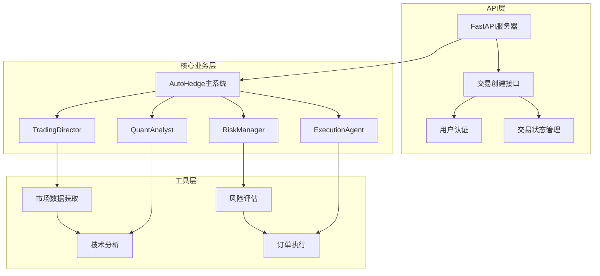
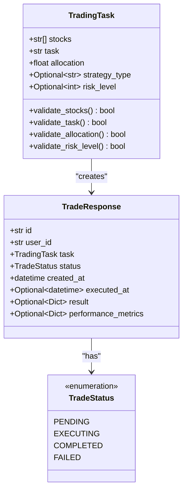
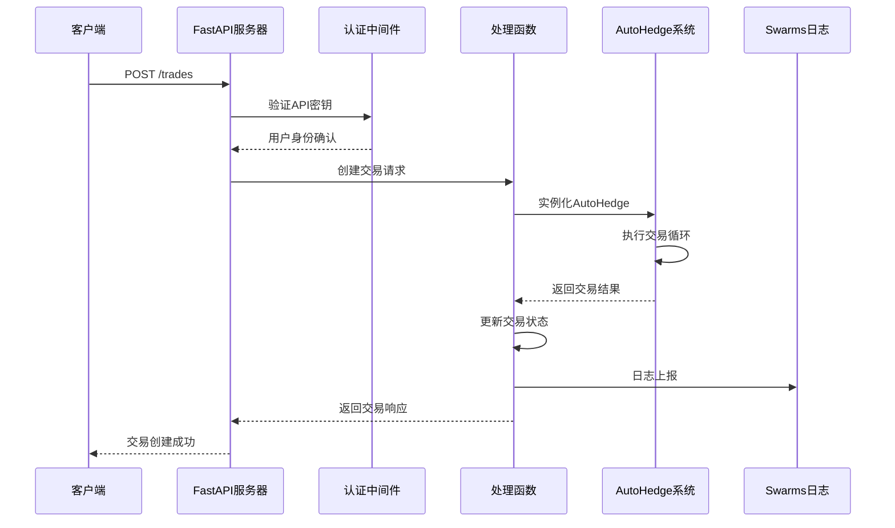
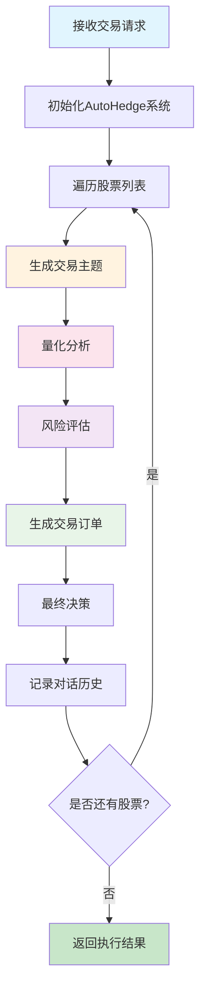
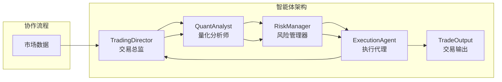
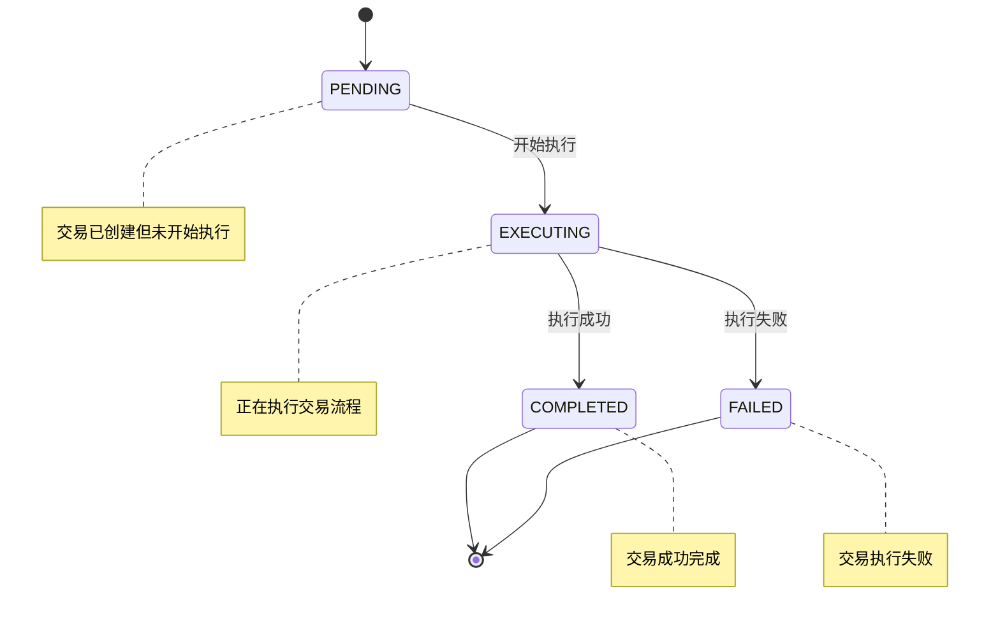
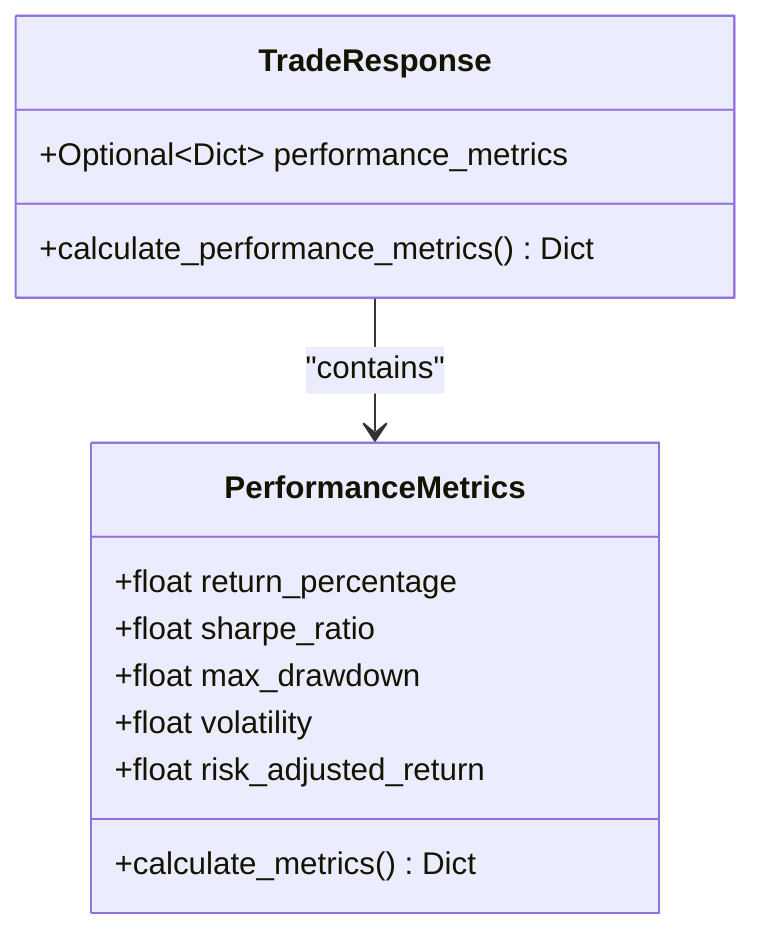
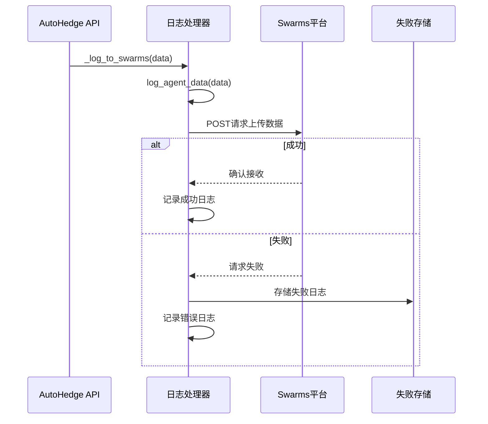

# 交易创建与执行

<cite>
**本文档中引用的文件**
- [api/api.py](file://api/api.py)
- [api/api_tests.py](file://api/api_tests.py)
- [autohedge/main.py](file://autohedge/main.py)
- [README.md](file://README.md)
- [requirements.txt](file://requirements.txt)
- [example.py](file://example.py)
</cite>

## 目录
1. [简介](#简介)
2. [项目结构概览](#项目结构概览)
3. [TradingTask模型详解](#tradingsystem模型详解)
4. [交易创建接口实现](#交易创建接口实现)
5. [交易执行流程](#交易执行流程)
6. [多代理协同机制](#多代理协同机制)
7. [交易状态管理](#交易状态管理)
8. [性能指标计算](#性能指标计算)
9. [Swarms系统日志集成](#swarms系统日志集成)
10. [测试用例分析](#测试用例分析)
11. [最佳实践指南](#最佳实践指南)
12. [总结](#总结)

## 简介

AutoHedge是一个基于多智能体架构的自动化交易系统，通过Swarm Intelligence技术实现智能化的市场分析、风险管理和交易执行。该系统的核心是交易创建接口(`/trades`)，它提供了完整的交易生命周期管理功能，从API请求处理到最终的交易执行和结果反馈。

本文档详细解析了交易创建接口的实现机制，重点说明TradingTask模型的字段定义及其数据验证规则，深入分析交易执行流程，展示多代理协同工作机制，并说明与Swarms系统的日志集成方式。

## 项目结构概览

AutoHedge采用模块化的架构设计，主要包含以下核心组件：



**图表来源**
- [api/api.py](file://api/api.py#L130-L149)
- [autohedge/main.py](file://autohedge/main.py#L422-L476)

**章节来源**
- [api/api.py](file://api/api.py#L1-L50)
- [autohedge/main.py](file://autohedge/main.py#L1-L50)

## TradingTask模型详解

TradingTask是交易创建接口的核心数据模型，使用Pydantic进行严格的数据验证和类型检查。

### 字段定义与验证规则



**图表来源**
- [api/api.py](file://api/api.py#L86-L95)
- [api/api.py](file://api/api.py#L56-L60)
- [api/api.py](file://api/api.py#L98-L106)

### 字段详细说明

| 字段名 | 类型 | 验证规则 | 描述 |
|--------|------|----------|------|
| stocks | List[str] | min_items=1 | 股票代码列表，至少包含一个股票 |
| task | str | min_length=10 | 交易任务描述，最小长度为10个字符 |
| allocation | float | gt=0 | 资金分配金额，必须大于0 |
| strategy_type | Optional[str] | - | 交易策略类型（可选） |
| risk_level | Optional[int] | ge=1, le=10 | 风险等级，范围1-10 |

### 数据验证机制

系统在多个层面实施数据验证：

1. **API层验证**：FastAPI自动验证请求数据格式
2. **Pydantic验证**：TradingTask模型内置验证规则
3. **业务逻辑验证**：AutoHedge系统进一步验证参数合理性

**章节来源**
- [api/api.py](file://api/api.py#L86-L95)

## 交易创建接口实现

交易创建接口位于`/trades`端点，实现了完整的RESTful API功能。

### 接口路由定义



**图表来源**
- [api/api.py](file://api/api.py#L248-L310)

### 核心实现逻辑

交易创建接口的核心实现包含以下步骤：

1. **用户认证**：验证API密钥有效性
2. **参数验证**：使用TradingTask模型验证输入参数
3. **系统初始化**：创建AutoHedge实例
4. **交易执行**：调用run()方法执行完整交易周期
5. **状态更新**：更新交易状态为COMPLETED
6. **结果返回**：返回完整的交易响应

**章节来源**
- [api/api.py](file://api/api.py#L248-L310)

## 交易执行流程

AutoHedge采用多阶段的交易执行流程，每个阶段由专门的智能体负责。

### 完整执行流程



**图表来源**
- [autohedge/main.py](file://autohedge/main.py#L477-L582)

### 关键执行步骤

1. **主题生成阶段**：TradingDirector分析市场条件生成交易主题
2. **量化分析阶段**：QuantAnalyst执行技术指标分析和统计模式评估
3. **风险评估阶段**：RiskManager计算风险指标和推荐仓位大小
4. **订单生成阶段**：ExecutionAgent生成具体的交易指令
5. **决策阶段**：TradingDirector综合所有信息做出最终决策

**章节来源**
- [autohedge/main.py](file://autohedge/main.py#L477-L582)

## 多代理协同机制

AutoHedge采用多智能体协作模式，每个智能体专注于特定的交易环节。

### 智能体角色分工



**图表来源**
- [autohedge/main.py](file://autohedge/main.py#L242-L272)
- [autohedge/main.py](file://autohedge/main.py#L356-L380)
- [autohedge/main.py](file://autohedge/main.py#L159-L189)
- [autohedge/main.py](file://autohedge/main.py#L190-L240)

### 智能体职责详解

| 智能体 | 主要职责 | 输入 | 输出 |
|--------|----------|------|------|
| TradingDirector | 生成交易主题，协调策略 | 市场数据、交易任务 | 交易主题、市场分析 |
| QuantAnalyst | 技术分析，概率评估 | 股票信息、交易主题 | 技术评分、统计分析 |
| RiskManager | 风险评估，仓位控制 | 交易主题、量化分析 | 风险评估报告 |
| ExecutionAgent | 订单生成，执行管理 | 交易主题、风险评估 | 交易订单 |

**章节来源**
- [autohedge/main.py](file://autohedge/main.py#L242-L272)
- [autohedge/main.py](file://autohedge/main.py#L356-L380)
- [autohedge/main.py](file://autohedge/main.py#L159-L189)
- [autohedge/main.py](file://autohedge/main.py#L190-L240)

## 交易状态管理

系统实现了完整的交易状态生命周期管理。

### 状态转换图



**图表来源**
- [api/api.py](file://api/api.py#L56-L60)

### 状态管理实现

交易状态的转换通过以下机制实现：

1. **初始状态**：创建交易时设置为PENDING
2. **执行状态**：调用AutoHedge.run()方法时设置为EXECUTING
3. **完成状态**：交易成功完成后设置为COMPLETED
4. **错误状态**：发生异常时设置为FAILED

**章节来源**
- [api/api.py](file://api/api.py#L56-L60)
- [api/api.py](file://api/api.py#L266-L288)

## 性能指标计算

系统提供标准化的性能指标计算框架。

### 性能指标结构



**图表来源**
- [api/api.py](file://api/api.py#L183-L200)

### 指标计算逻辑

当前实现提供基础的性能指标框架，实际计算逻辑需要根据具体交易结果数据来填充：

1. **收益率计算**：基于交易前后的资产价值变化
2. **夏普比率**：风险调整后的收益指标
3. **最大回撤**：资产价值的最大跌幅
4. **波动率**：资产收益的标准差

**章节来源**
- [api/api.py](file://api/api.py#L183-L200)

## Swarms系统日志集成

系统集成了Swarms平台的日志上报功能，实现交易数据的实时监控和分析。

### 日志上报机制



**图表来源**
- [api/api.py](file://api.py#L445-L458)
- [api/api.py](file://api/api.py#L24-L52)

### 上报数据结构

日志上报包含以下关键数据：

| 字段名 | 类型 | 描述 |
|--------|------|------|
| trade_id | str | 交易唯一标识符 |
| user_id | str | 用户唯一标识符 |
| task | dict | 交易任务详情 |
| result | dict | 交易执行结果 |
| performance_metrics | dict | 性能指标数据 |

**章节来源**
- [api/api.py](file://api/api.py#L294-L302)
- [api/api.py](file://api/api.py#L445-L458)

## 测试用例分析

系统提供了完整的测试用例来验证交易创建功能。

### test_create_trade测试用例

测试用例展示了真实的交易请求示例：

```python
# 测试用例参数配置
trade_data = {
    "stocks": ["NVDA", "AAPL", "GOOGL"],  # 股票列表
    "task": "Analyze tech companies for a $1M allocation with focus on AI capabilities",  # 任务描述
    "allocation": 1000000.0,  # 资金分配
    "strategy_type": "momentum",  # 策略类型
    "risk_level": 7,  # 风险等级
}
```

### 请求示例

基于测试用例，以下是完整的HTTP请求示例：

```bash
POST http://localhost:8000/trades
Content-Type: application/json
X-API-Key: your-api-key

{
    "stocks": ["NVDA", "AAPL", "GOOGL"],
    "task": "Analyze tech companies for a $1M allocation with focus on AI capabilities",
    "allocation": 1000000.0,
    "strategy_type": "momentum",
    "risk_level": 7
}
```

**章节来源**
- [api/api_tests.py](file://api/api_tests.py#L107-L123)

## 最佳实践指南

### 参数配置建议

1. **股票选择**：
   - 至少包含2-3只相关股票以分散风险
   - 确保股票流动性良好
   - 考虑行业相关性

2. **任务描述**：
   - 提供清晰明确的交易目标
   - 包含时间框架和预期回报
   - 说明投资策略和限制条件

3. **资金分配**：
   - 根据账户总资金合理分配
   - 考虑单笔交易的风险承受能力
   - 预留足够的现金头寸

4. **风险等级设置**：
   - 低风险（1-3）：保守型投资者
   - 中等风险（4-7）：平衡型投资者
   - 高风险（8-10）：积极型投资者

### 错误处理建议

1. **网络异常**：实现重试机制和超时处理
2. **数据验证**：确保输入参数符合验证规则
3. **系统异常**：捕获并记录详细的错误信息
4. **资源限制**：监控API调用频率和并发数

### 监控和调试

1. **日志记录**：启用详细的日志记录
2. **性能监控**：跟踪API响应时间和成功率
3. **错误追踪**：建立完善的错误报告机制
4. **数据验证**：定期检查交易数据的完整性

## 总结

AutoHedge的交易创建接口提供了一个完整、可靠的自动化交易解决方案。通过严格的模型验证、多智能体协作和完整的状态管理，系统能够安全高效地执行复杂的交易策略。

### 核心优势

1. **安全性**：多层次的数据验证和错误处理
2. **可靠性**：分布式智能体架构确保系统稳定性
3. **可扩展性**：模块化设计支持功能扩展
4. **可观测性**：完整的日志记录和监控机制

### 技术特点

- 基于Pydantic的强类型数据验证
- 多智能体协作的交易执行流程
- 完整的交易状态生命周期管理
- 与Swarms平台的深度集成
- 标准化的性能指标计算

该系统为金融机构和个人投资者提供了一个强大的自动化交易工具，通过智能化的市场分析和风险管理，帮助用户实现更好的投资回报。