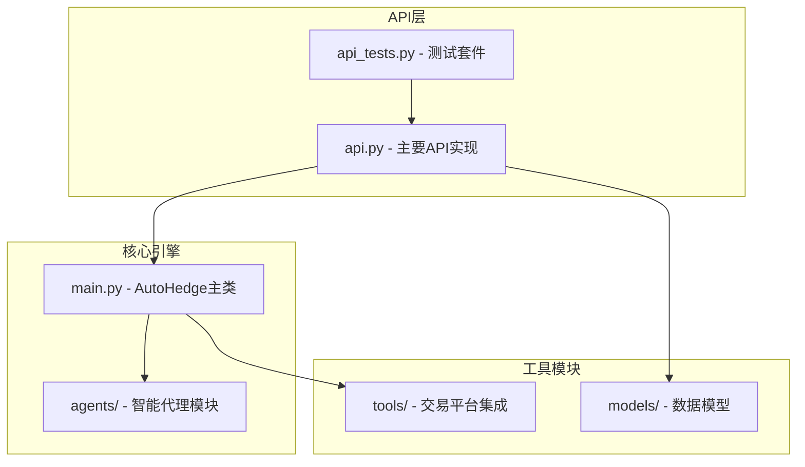
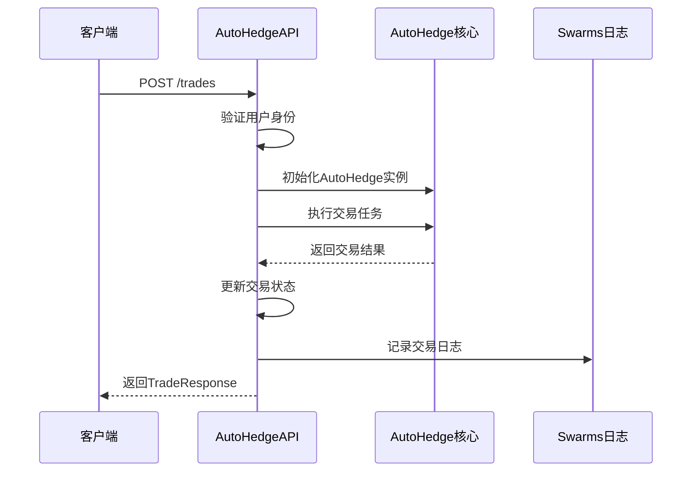
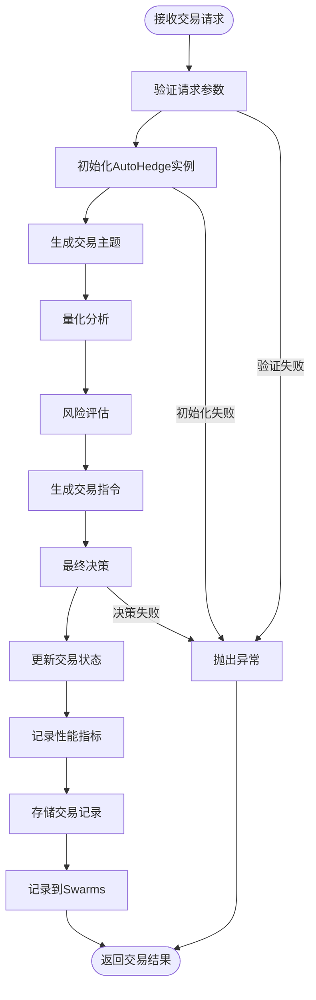
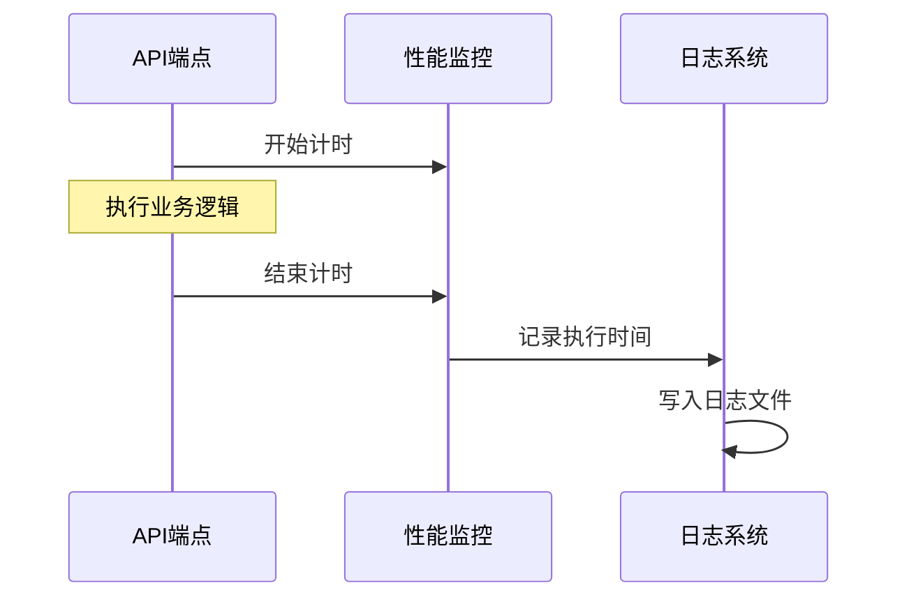
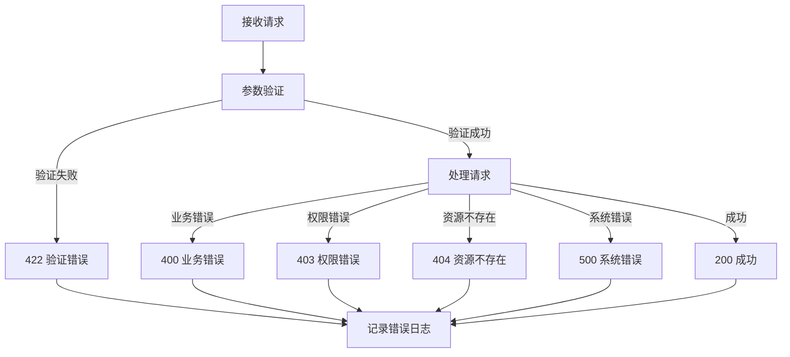

# 交易操作接口详细文档

<cite>
**本文档中引用的文件**
- [api.py](file://api/api.py)
- [api_tests.py](file://api/api_tests.py)
- [main.py](file://autohedge/main.py)
- [__init__.py](file://autohedge/__init__.py)
</cite>

## 目录
1. [简介](#简介)
2. [项目结构概览](#项目结构概览)
3. [核心API端点](#核心api端点)
4. [数据模型详解](#数据模型详解)
5. [交易执行流程](#交易执行流程)
6. [分页查询与过滤](#分页查询与过滤)
7. [性能监控与日志记录](#性能监控与日志记录)
8. [错误处理机制](#错误处理机制)
9. [完整使用示例](#完整使用示例)
10. [最佳实践建议](#最佳实践建议)

## 简介

AutoHedge是一个基于FastAPI构建的自动化对冲基金管理平台，提供了完整的交易操作接口。该系统采用微服务架构，通过Pydantic模型进行数据验证，并集成了Swarm智能代理网络来执行复杂的交易策略。

本文档详细介绍了交易相关的四个核心API端点：创建交易、查询交易列表、获取单个交易详情和删除交易。同时深入解析了TradingTask和TradeResponse模型的字段定义、数据验证规则以及与AutoHedge核心系统的集成机制。

## 项目结构概览

AutoHedge项目采用模块化设计，主要包含以下核心组件：



**图表来源**
- [api.py](file://api/api.py#L1-L50)
- [main.py](file://autohedge/main.py#L1-L50)

**章节来源**
- [api.py](file://api/api.py#L1-L476)
- [main.py](file://autohedge/main.py#L1-L583)

## 核心API端点

### 1. 创建交易 (/trades)

**端点**: `POST /trades`

**功能**: 创建新的交易任务，触发AutoHedge核心系统执行交易策略。

**请求参数**: 
- `task`: TradingTask对象，包含股票列表、任务描述、资金分配等信息
- `current_user`: 通过API密钥认证的当前用户

**响应**: TradeResponse对象，包含交易的完整信息

**实现流程**:


**图表来源**
- [api.py](file://api/api.py#L248-L311)

### 2. 查询交易列表 (/trades)

**端点**: `GET /trades`

**功能**: 获取当前用户的交易历史列表，支持分页和状态过滤。

**查询参数**:
- `skip` (可选): 跳过的记录数，默认为0
- `limit` (可选): 返回的最大记录数，默认为10，范围1-100
- `status` (可选): 按交易状态过滤

**响应**: 包含多个TradeResponse对象的列表

### 3. 获取单个交易详情 (/trades/{trade_id})

**端点**: `GET /trades/{trade_id}`

**功能**: 获取指定交易的详细信息。

**路径参数**:
- `trade_id`: 交易的唯一标识符

**权限控制**: 只有交易的所有者可以访问对应的交易详情。

### 4. 删除交易 (/trades/{trade_id})

**端点**: `DELETE /trades/{trade_id}`

**功能**: 删除指定的交易记录。

**路径参数**: 同上

**权限控制**: 同获取交易详情

**章节来源**
- [api.py](file://api/api.py#L248-L379)

## 数据模型详解

### TradingTask模型

TradingTask是交易任务的核心数据模型，定义了创建交易所需的所有必要信息：

| 字段名 | 类型 | 必填 | 验证规则 | 描述 |
|--------|------|------|----------|------|
| stocks | List[str] | 是 | min_items=1 | 要交易的股票列表，至少包含一个股票 |
| task | str | 是 | min_length=10 | 详细的交易任务描述，至少10个字符 |
| allocation | float | 是 | gt=0 | 投资金额，必须大于0 |
| strategy_type | str | 否 | - | 交易策略类型（如'momentum'） |
| risk_level | int | 否 | ge=1, le=10 | 风险等级，1-10分制 |

**业务含义**:
- `stocks`: 支持多股票组合交易，便于分散风险
- `task`: 提供详细的交易指导，帮助AI代理理解投资目标
- `allocation`: 明确的资金规模，用于后续的风险管理和绩效计算
- `strategy_type`: 指定使用的交易策略，影响执行方式
- `risk_level`: 用户的风险承受能力评估，用于个性化调整

### TradeResponse模型

TradeResponse包含了交易的完整生命周期信息：

| 字段名 | 类型 | 描述 |
|--------|------|------|
| id | str | 交易的唯一标识符 |
| user_id | str | 创建交易的用户ID |
| task | TradingTask | 原始交易任务 |
| status | TradeStatus | 当前交易状态 |
| created_at | datetime | 交易创建时间 |
| executed_at | datetime | 交易执行完成时间 |
| result | Dict[str, Any] | 交易执行结果 |
| performance_metrics | Dict[str, float] | 性能指标 |

**状态枚举**:
- `PENDING`: 交易等待执行
- `EXECUTING`: 交易正在执行
- `COMPLETED`: 交易成功完成
- `FAILED`: 交易执行失败

### 性能指标模型

系统自动计算以下性能指标：

| 指标名称 | 类型 | 计算方式 |
|----------|------|----------|
| return_percentage | float | 收益率百分比 |
| sharpe_ratio | float | 夏普比率 |
| max_drawdown | float | 最大回撤 |
| volatility | float | 波动率 |

**章节来源**
- [api.py](file://api/api.py#L56-L107)
- [api.py](file://api/api.py#L183-L200)

## 交易执行流程

### AutoHedge核心系统集成

交易创建时，API会初始化AutoHedge核心系统并与之集成：



**图表来源**
- [api.py](file://api/api.py#L258-L311)
- [main.py](file://autohedge/main.py#L477-L582)

### 代理协作机制

AutoHedge系统采用多智能体协作模式：

1. **TradingDirector**: 负责整体策略制定和市场分析
2. **QuantAnalyst**: 执行技术分析和统计建模
3. **RiskManager**: 进行风险评估和仓位管理
4. **ExecutionAgent**: 生成具体的交易指令

每个代理都有明确的职责分工，通过Conversation机制进行信息共享和协调。

**章节来源**
- [main.py](file://autohedge/main.py#L242-L582)

## 分页查询与过滤

### 分页参数

API支持灵活的分页查询：

| 参数 | 默认值 | 范围 | 描述 |
|------|--------|------|------|
| skip | 0 | ≥0 | 跳过的记录数 |
| limit | 10 | 1-100 | 每页返回的记录数 |

**使用示例**:
- 获取第一页的5条记录: `/trades?skip=0&limit=5`
- 获取第二页的5条记录: `/trades?skip=5&limit=5`

### 状态过滤

支持按交易状态进行过滤：

```python
# 获取已完成的交易
GET /trades?status=completed

# 获取所有交易（默认）
GET /trades
```

### 排序机制

交易列表按创建时间降序排列，确保最新的交易优先显示。

**章节来源**
- [api.py](file://api/api.py#L312-L333)

## 性能监控与日志记录

### 执行时间监控

系统内置了详细的性能监控机制：



**图表来源**
- [api.py](file://api/api.py#L150-L166)

### Swarms日志集成

系统集成了Swarms智能代理网络的日志记录功能：

1. **实时日志**: 交易执行过程中的关键事件
2. **性能追踪**: 交易结果和性能指标
3. **错误报告**: 异常情况和故障诊断
4. **审计跟踪**: 完整的操作历史记录

**日志内容结构**:
```json
{
    "trade_id": "uuid",
    "user_id": "uuid", 
    "task": {...},
    "result": {...},
    "performance_metrics": {...}
}
```

### 文件日志配置

系统使用loguru进行结构化日志记录：

- **轮转策略**: 500MB大小后轮转
- **保留期**: 10天
- **格式**: 时间戳 + 日志级别 + 模块信息 + 具体消息
- **详细程度**: 支持调试和诊断信息

**章节来源**
- [api.py](file://api/api.py#L118-L127)
- [api.py](file://api/api.py#L445-L458)

## 错误处理机制

### HTTP状态码规范

| 状态码 | 场景 | 描述 |
|--------|------|------|
| 200 | 成功 | 请求正常处理 |
| 401 | 认证失败 | 无效的API密钥 |
| 403 | 权限不足 | 无权访问资源 |
| 404 | 资源不存在 | 交易或用户不存在 |
| 500 | 服务器错误 | 内部处理异常 |

### 错误处理流程



**图表来源**
- [api.py](file://api/api.py#L167-L181)
- [api.py](file://api/api.py#L306-L310)

### 重试机制

对于外部服务调用（如Swarms日志），系统实现了重试机制：

1. **指数退避**: 初始延迟2秒，最大10秒
2. **最大重试**: 3次尝试
3. **失败存储**: 将失败的日志存储在本地，等待后续重试

**章节来源**
- [api.py](file://api/api.py#L445-L458)

## 完整使用示例

### 测试用例分析

基于api_tests.py中的test_create_trade测试用例，以下是完整的请求示例：

#### 创建交易请求

```json
{
    "stocks": ["NVDA", "AAPL", "GOOGL"],
    "task": "Analyze tech companies for a $1M allocation with focus on AI capabilities",
    "allocation": 1000000.0,
    "strategy_type": "momentum",
    "risk_level": 7
}
```

#### 请求头设置

```http
POST /trades HTTP/1.1
Content-Type: application/json
X-API-Key: your_api_key_here
```

#### 响应示例

```json
{
    "id": "uuid-transaction-id",
    "user_id": "uuid-user-id",
    "task": {
        "stocks": ["NVDA", "AAPL", "GOOGL"],
        "task": "Analyze tech companies for a $1M allocation with focus on AI capabilities",
        "allocation": 1000000.0,
        "strategy_type": "momentum",
        "risk_level": 7
    },
    "status": "completed",
    "created_at": "2024-01-15T10:30:00Z",
    "executed_at": "2024-01-15T10:35:00Z",
    "result": {
        "analysis": "...",
        "orders": [...],
        "decisions": "..."
    },
    "performance_metrics": {
        "return_percentage": 2.5,
        "sharpe_ratio": 1.8,
        "max_drawdown": -1.2,
        "volatility": 0.03
    }
}
```

### 查询交易列表

#### 基本查询

```bash
curl -H "X-API-Key: your_api_key" \
     "http://localhost:8000/trades?skip=0&limit=10"
```

#### 带状态过滤

```bash
curl -H "X-API-Key: your_api_key" \
     "http://localhost:8000/trades?status=completed&limit=5"
```

### 获取单个交易详情

```bash
curl -H "X-API-Key: your_api_key" \
     "http://localhost:8000/trades/uuid-transaction-id"
```

### 删除交易

```bash
curl -X DELETE -H "X-API-Key: your_api_key" \
     "http://localhost:8000/trades/uuid-transaction-id"
```

**章节来源**
- [api_tests.py](file://api/api_tests.py#L106-L124)

## 最佳实践建议

### 1. 请求参数优化

- **股票选择**: 建议每笔交易包含2-5只股票，避免过度分散
- **任务描述**: 提供具体的投资目标和时间框架
- **资金分配**: 根据风险承受能力合理分配资金
- **风险等级**: 设置符合个人风险偏好的数值

### 2. 错误处理策略

- 实现客户端重试机制
- 设置合理的超时时间
- 记录详细的错误上下文
- 提供有意义的错误提示

### 3. 性能优化

- 使用适当的分页大小
- 避免频繁的全量查询
- 利用状态过滤减少数据传输
- 监控API响应时间

### 4. 安全考虑

- 保护API密钥不被泄露
- 使用HTTPS加密通信
- 实施适当的访问频率限制
- 定期轮换API密钥

### 5. 监控与维护

- 定期检查日志文件
- 监控系统性能指标
- 跟踪交易成功率
- 分析用户行为模式

通过遵循这些最佳实践，可以最大化利用AutoHedge交易操作接口的功能，确保系统的稳定性和安全性。