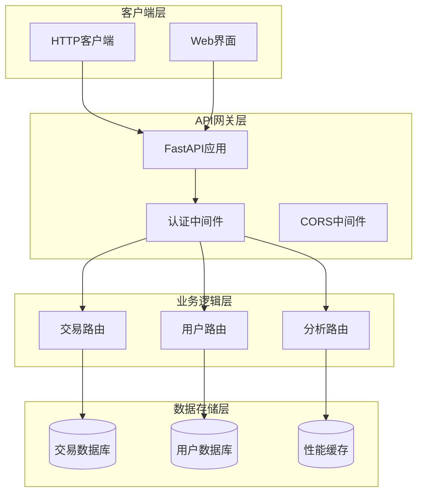
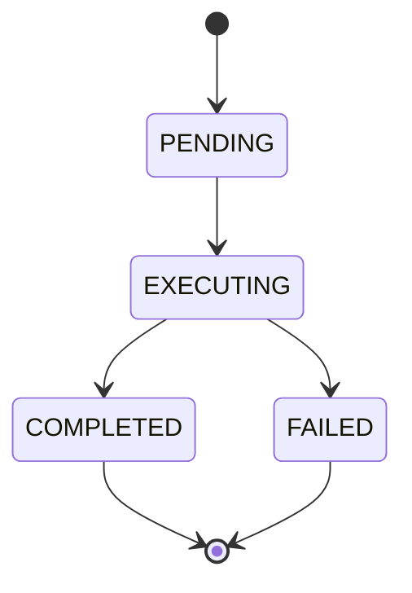
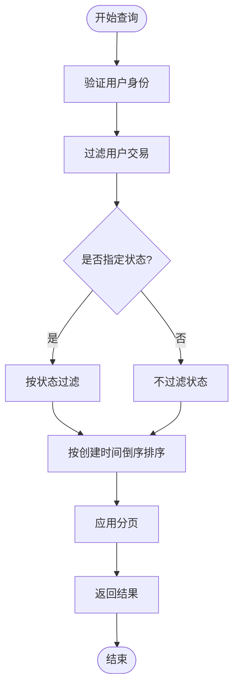
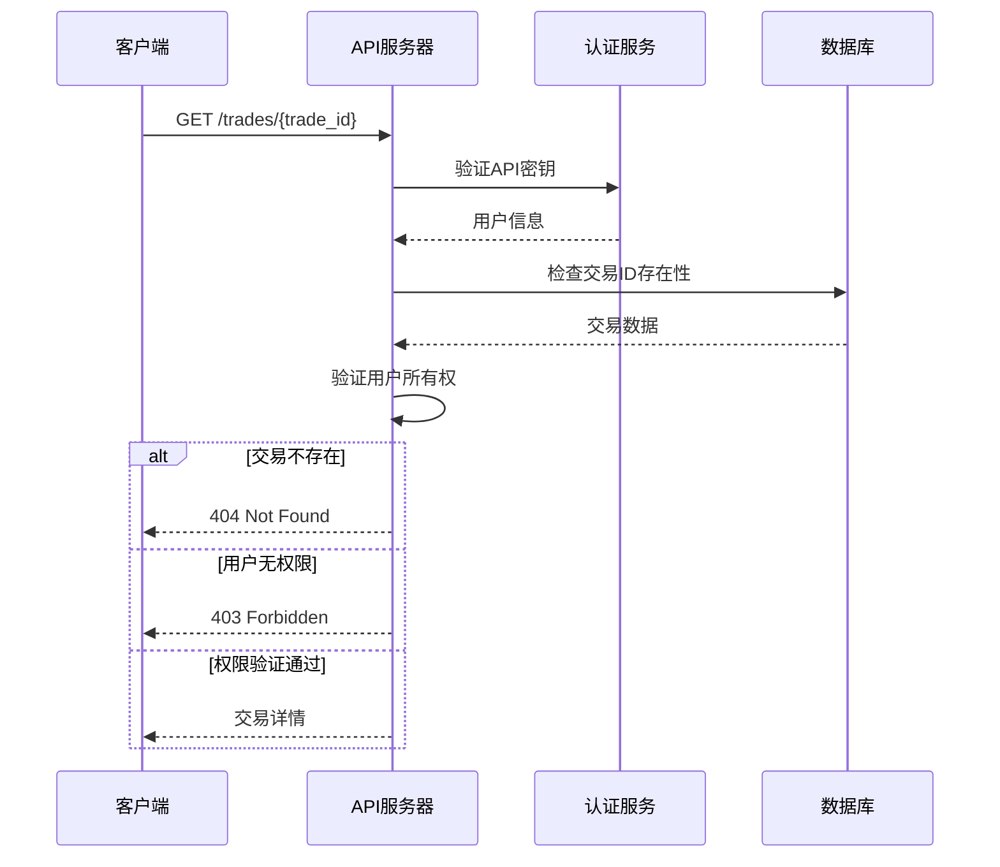
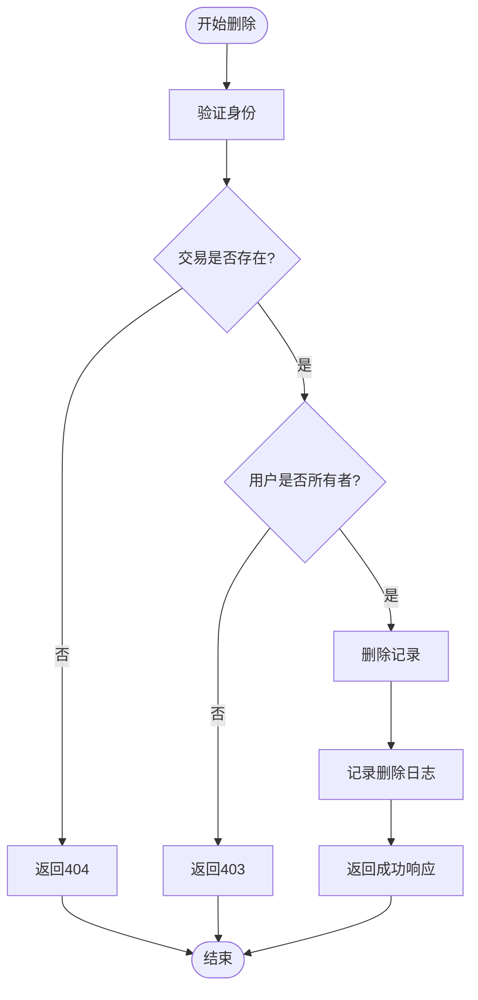
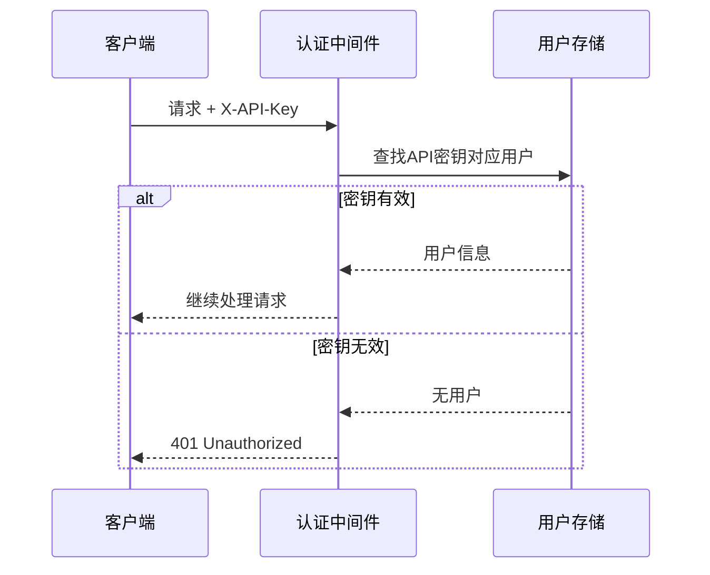
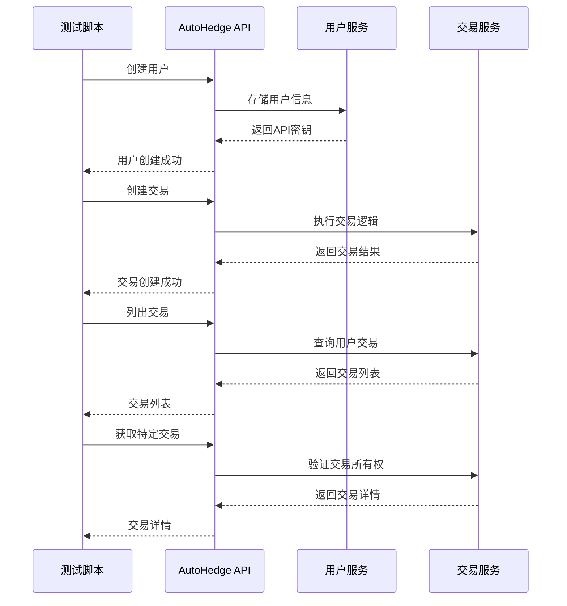

# 交易查询与管理API文档

<cite>
**本文档中引用的文件**
- [api.py](file://api/api.py)
- [api_tests.py](file://api/api_tests.py)
- [main.py](file://autohedge/main.py)
- [README.md](file://README.md)
</cite>

## 目录
1. [简介](#简介)
2. [项目架构概览](#项目架构概览)
3. [核心数据模型](#核心数据模型)
4. [交易查询API详解](#交易查询api详解)
5. [交易详情API详解](#交易详情api详解)
6. [交易删除API详解](#交易删除api详解)
7. [分页参数详解](#分页参数详解)
8. [状态过滤机制](#状态过滤机制)
9. [权限验证机制](#权限验证机制)
10. [错误处理与响应格式](#错误处理与响应格式)
11. [实际测试示例](#实际测试示例)
12. [最佳实践建议](#最佳实践建议)

## 简介

AutoHedge是一个基于AI的自动化对冲基金管理系统，提供了完整的交易查询与管理API。该系统采用FastAPI框架构建，支持RESTful API设计模式，为用户提供安全、高效的交易数据访问和管理功能。

本文档详细介绍了三个核心API端点：
- 获取交易列表 (`GET /trades`)
- 获取单个交易详情 (`GET /trades/{trade_id}`)
- 删除交易 (`DELETE /trades/{trade_id}`)

这些API端点都实现了严格的权限控制和数据验证机制，确保用户只能访问和操作自己的交易数据。

## 项目架构概览

AutoHedge API采用模块化架构设计，主要包含以下组件：



**图表来源**
- [api.py](file://api/api.py#L130-L150)

**章节来源**
- [api.py](file://api/api.py#L130-L150)

## 核心数据模型

### 交易状态枚举

系统定义了四种交易状态，用于跟踪交易的执行进度：



**图表来源**
- [api.py](file://api/api.py#L56-L60)

### 交易响应模型

每个交易记录包含以下核心字段：

| 字段名 | 类型 | 描述 | 必填 |
|--------|------|------|------|
| id | string | 唯一交易标识符 | 是 |
| user_id | string | 创建交易的用户ID | 是 |
| task | TradingTask | 交易任务配置 | 是 |
| status | TradeStatus | 交易执行状态 | 是 |
| created_at | datetime | 交易创建时间 | 是 |
| executed_at | datetime | 交易执行时间 | 否 |
| result | dict | 交易执行结果 | 否 |
| performance_metrics | dict | 性能指标 | 否 |

**章节来源**
- [api.py](file://api/api.py#L98-L106)

## 交易查询API详解

### 端点概述

`GET /trades` 端点用于获取当前用户的交易历史记录，支持分页查询和状态过滤。

### 请求参数

| 参数名 | 类型 | 默认值 | 取值范围 | 描述 |
|--------|------|--------|----------|------|
| skip | integer | 0 | ≥0 | 跳过的记录数，用于分页 |
| limit | integer | 10 | 1-100 | 每页返回的最大记录数 |
| status | TradeStatus | null | 枚举值 | 按交易状态过滤 |

### 实现逻辑

list_trades函数的核心实现逻辑如下：



**图表来源**
- [api.py](file://api/api.py#L312-L333)

### 权限过滤机制

系统通过以下方式确保数据隔离：

1. **用户ID匹配**：只返回属于当前用户的交易记录
2. **状态过滤**：可选的状态参数进一步限制结果集
3. **时间排序**：默认按创建时间倒序排列，最新交易优先显示

**章节来源**
- [api.py](file://api/api.py#L312-L333)

## 交易详情API详解

### 端点概述

`GET /trades/{trade_id}` 端点用于获取特定交易的详细信息。

### 验证机制

get_trade接口实现了双重验证机制：



**图表来源**
- [api.py](file://api/api.py#L338-L356)

### 错误处理

该端点会抛出两种类型的HTTP异常：

1. **404 Not Found**：当交易ID不存在时
2. **403 Forbidden**：当用户不是交易所有者时

**章节来源**
- [api.py](file://api/api.py#L338-L356)

## 交易删除API详解

### 端点概述

`DELETE /trades/{trade_id}` 端点用于删除指定的交易记录。

### 幂等性处理

删除操作具有幂等性特征：



**图表来源**
- [api.py](file://api/api.py#L358-L379)

### 响应格式

删除成功后返回标准JSON响应：

```json
{
    "message": "Trade deleted successfully"
}
```

**章节来源**
- [api.py](file://api/api.py#L358-L379)

## 分页参数详解

### skip参数

- **类型**：integer
- **默认值**：0
- **最小值**：≥0
- **用途**：跳过前面的记录数，用于实现分页浏览

### limit参数

- **类型**：integer
- **默认值**：10
- **最小值**：1
- **最大值**：100
- **用途**：限制每页返回的记录数量

### 分页计算公式

分页查询的实际执行逻辑：
```python
paginated_results = sorted_trades[skip:skip + limit]
```

### 使用示例

1. **第一页（前10条）**：`GET /trades?skip=0&limit=10`
2. **第二页（11-20条）**：`GET /trades?skip=10&limit=10`
3. **第三页（21-30条）**：`GET /trades?skip=20&limit=10`

**章节来源**
- [api.py](file://api/api.py#L315-L316)

## 状态过滤机制

### 支持的交易状态

系统支持以下交易状态进行过滤：

| 状态值 | 描述 | 适用场景 |
|--------|------|----------|
| pending | 待执行 | 显示待处理的交易 |
| executing | 执行中 | 显示正在处理的交易 |
| completed | 已完成 | 显示成功的交易 |
| failed | 已失败 | 显示执行失败的交易 |

### 过滤实现

状态过滤通过简单的条件判断实现：
```python
if status is None or trade.status == status:
    # 匹配状态条件
```

### 组合查询示例

1. **获取已完成交易**：`GET /trades?status=completed`
2. **获取所有交易**：`GET /trades`（不带status参数）
3. **获取待执行交易**：`GET /trades?status=pending`

**章节来源**
- [api.py](file://api/api.py#L317-L317)

## 权限验证机制

### API密钥认证

系统使用API密钥进行用户身份验证：



**图表来源**
- [api.py](file://api/api.py#L167-L181)

### 用户所有权验证

在访问特定交易时，系统会验证：
1. 交易是否存在
2. 当前用户是否为交易的所有者

这种双重验证确保了数据的安全性和隐私性。

**章节来源**
- [api.py](file://api/api.py#L167-L181)

## 错误处理与响应格式

### HTTP状态码

| 状态码 | 错误类型 | 触发条件 |
|--------|----------|----------|
| 401 | Unauthorized | API密钥无效或缺失 |
| 403 | Forbidden | 用户无权限访问资源 |
| 404 | Not Found | 资源不存在（交易、用户等） |
| 422 | Unprocessable Entity | 请求参数验证失败 |
| 500 | Internal Server Error | 服务器内部错误 |

### 错误响应格式

所有错误响应遵循统一的JSON格式：
```json
{
    "detail": "错误描述信息"
}
```

### 具体错误场景

1. **API密钥无效**：`401 Unauthorized`
2. **交易不存在**：`404 Not Found`
3. **非交易所有者**：`403 Forbidden`
4. **参数超出范围**：`422 Unprocessable Entity`

**章节来源**
- [api.py](file://api/api.py#L344-L356)

## 实际测试示例

### 测试环境设置

根据api_tests.py中的测试用例，我们可以看到完整的测试流程：



**图表来源**
- [api_tests.py](file://api/api_tests.py#L125-L134)

### 分页查询示例

基于api_tests.py中的test_list_trades测试用例，以下是实际的分页查询示例：

1. **基础查询**：`GET /trades?limit=5`
2. **带分页的查询**：`GET /trades?skip=0&limit=5`
3. **带状态过滤的分页查询**：`GET /trades?skip=5&limit=5&status=completed`

### 错误场景模拟

1. **无效API密钥**：返回401状态码
2. **不存在的交易ID**：返回404状态码
3. **访问他人交易**：返回403状态码

**章节来源**
- [api_tests.py](file://api/api_tests.py#L125-L134)

## 最佳实践建议

### 客户端开发建议

1. **错误处理**：始终处理可能的HTTP错误状态码
2. **重试机制**：对于临时性错误（如5xx），实现指数退避重试
3. **缓存策略**：合理缓存交易列表数据，减少API调用频率
4. **分页优化**：使用适当的limit值平衡响应时间和数据量

### 安全考虑

1. **API密钥保护**：安全存储API密钥，避免泄露
2. **HTTPS使用**：生产环境中必须使用HTTPS传输
3. **速率限制**：在客户端实现合理的请求频率控制
4. **审计日志**：记录重要的API调用以便审计

### 性能优化

1. **批量查询**：尽可能使用分页查询而非一次性获取所有数据
2. **状态过滤**：利用状态参数减少不必要的数据传输
3. **缓存策略**：对频繁访问的数据实施适当的缓存机制
4. **连接池**：使用HTTP连接池提高网络效率

### 监控与维护

1. **健康检查**：定期检查API服务的可用性
2. **性能监控**：监控API响应时间和错误率
3. **容量规划**：根据使用情况调整服务器资源配置
4. **版本管理**：保持API版本的向后兼容性

通过遵循这些最佳实践，可以确保交易查询与管理API的稳定、安全和高效运行。