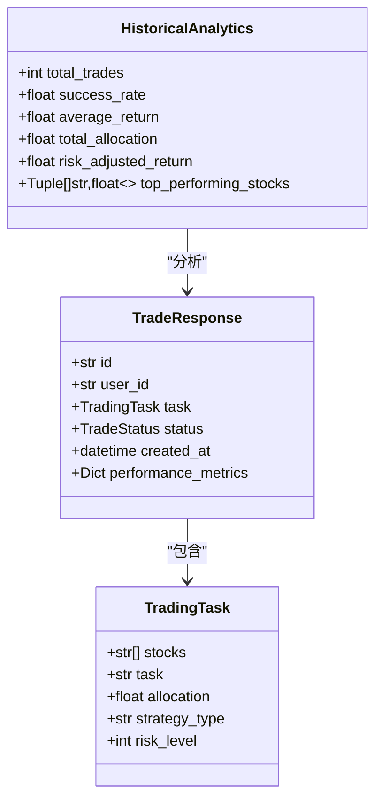
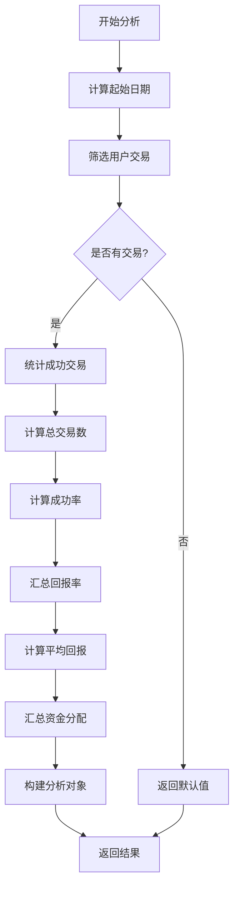
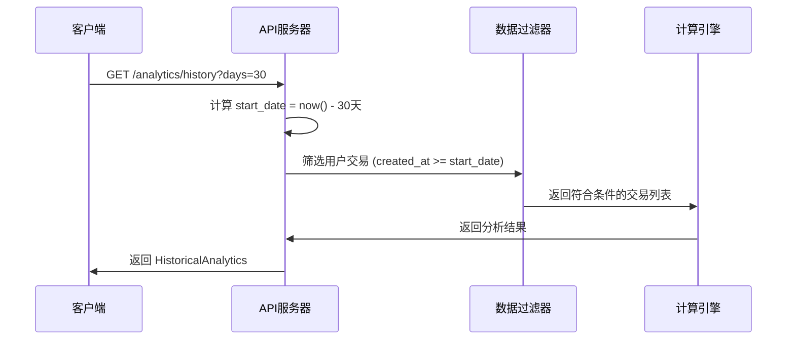
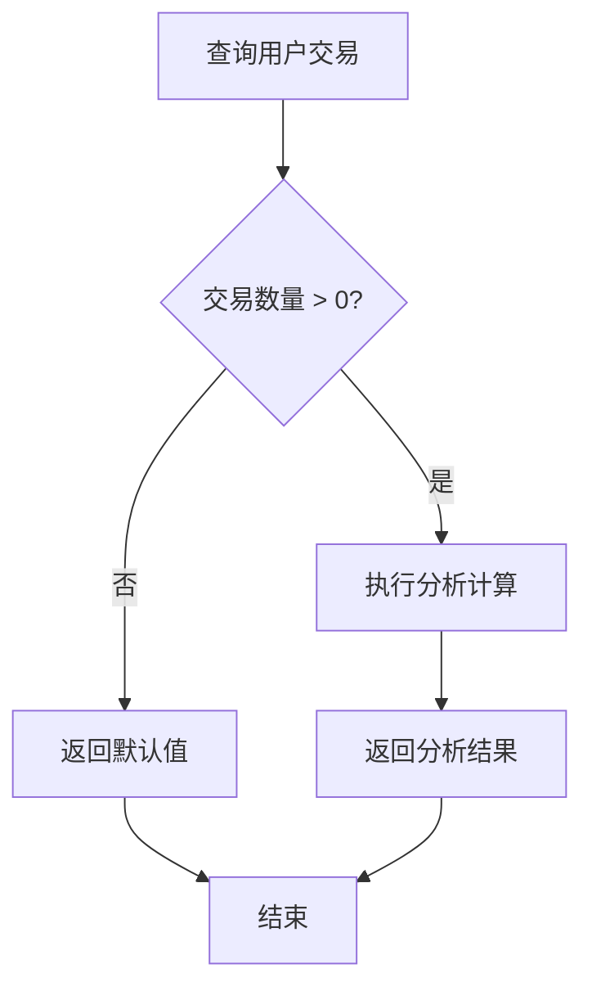
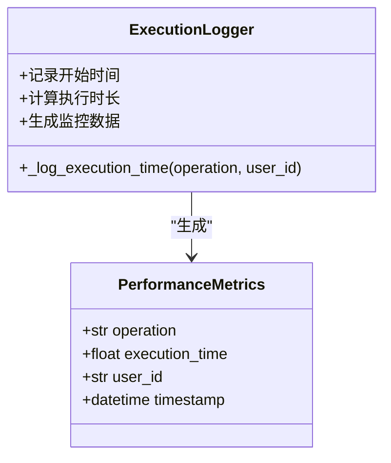

# 历史分析功能接口文档

<cite>
**本文档引用的文件**
- [api.py](file://api/api.py)
- [api_tests.py](file://api/api_tests.py)
- [README.md](file://README.md)
- [main.py](file://autohedge/main.py)
- [trade_station.py](file://autohedge/tools/trade_station.py)
</cite>

## 目录
1. [简介](#简介)
2. [端点概述](#端点概述)
3. [请求参数详解](#请求参数详解)
4. [响应模型分析](#响应模型分析)
5. [核心计算逻辑](#核心计算逻辑)
6. [时间范围处理](#时间范围处理)
7. [空结果处理](#空结果处理)
8. [性能监控机制](#性能监控机制)
9. [实际使用示例](#实际使用示例)
10. [最佳实践指南](#最佳实践指南)

## 简介

AutoHedge的历史分析功能提供了对用户交易历史的深度统计分析，通过`/analytics/history`端点为用户提供关键的绩效指标。该功能采用实时计算方式，基于指定的时间窗口聚合用户的交易数据，生成包含总交易数、成功率、平均回报率等核心指标的分析报告。

## 端点概述

### 端点信息
- **URL**: `/analytics/history`
- **HTTP方法**: GET
- **响应模型**: `HistoricalAnalytics`
- **认证要求**: 需要有效的API密钥

### 功能特性
- 实时交易数据分析
- 时间范围灵活配置（1-365天）
- 多维度绩效指标计算
- 自动空结果处理
- 性能监控集成

**段落来源**
- [api.py](file://api/api.py#L382-L388)

## 请求参数详解

### days参数

`days`参数是历史分析的核心配置项，用于定义分析的时间范围。

#### 参数规格
- **类型**: 整数 (`int`)
- **默认值**: 30天
- **有效范围**: 1 ≤ days ≤ 365
- **验证规则**: 使用FastAPI的`ge=1, le=365`约束

#### 应用场景
- **短期分析**: 1-7天，适合评估近期交易表现
- **中期分析**: 8-30天，平衡时效性和数据完整性
- **长期分析**: 31-365天，提供全面的年度视角

**段落来源**
- [api.py](file://api/api.py#L387)

## 响应模型分析

### HistoricalAnalytics模型结构



**图表来源**
- [api.py](file://api/api.py#L109-L116)
- [api.py](file://api.py#L86-L95)

### 字段详细说明

#### 1. total_trades (总交易数)
- **类型**: 整数
- **计算方式**: 统计用户在指定时间范围内的所有交易记录
- **业务含义**: 衡量用户的交易活跃度和参与频率

#### 2. success_rate (成功率)
- **类型**: 浮点数（百分比）
- **计算公式**: `(成功交易数 / 总交易数) × 100`
- **成功交易定义**: `status == TradeStatus.COMPLETED`
- **取值范围**: 0.0% - 100.0%

#### 3. average_return (平均回报率)
- **类型**: 浮点数
- **计算方式**: 所有交易回报率的算术平均值
- **数据来源**: `trade.performance_metrics.get("return_percentage", 0)`
- **业务含义**: 反映投资组合的整体盈利能力

#### 4. total_allocation (总资金分配)
- **类型**: 浮点数
- **计算方式**: 所有交易分配金额的总和
- **数据来源**: `trade.task.allocation`
- **单位**: 货币单位（根据系统配置）

#### 5. risk_adjusted_return (风险调整后收益)
- **类型**: 浮点数
- **当前状态**: 默认值为0.0
- **未来扩展**: 计划支持夏普比率等复杂风险调整指标
- **业务价值**: 提供更全面的投资绩效评估

#### 6. top_performing_stocks (表现最佳股票)
- **类型**: 列表（元组形式）
- **格式**: `List[Tuple[str, float]]`
- **内容**: 股票代码和对应的回报率
- **当前状态**: 默认为空列表
- **未来扩展**: 计划实现股票表现排序算法

**段落来源**
- [api.py](file://api/api.py#L109-L116)

## 核心计算逻辑

### 数据过滤流程



**图表来源**
- [api.py](file://api/api.py#L392-L442)

### 关键计算步骤

#### 1. 成功交易统计
```python
successful_trades = len([
    t for t in user_trades 
    if t.status == TradeStatus.COMPLETED
])
```

#### 2. 平均回报率计算
```python
average_return = sum(
    t.performance_metrics.get("return_percentage", 0)
    for t in user_trades
) / total_trades
```

#### 3. 总资金分配计算
```python
total_allocation = sum(
    t.task.allocation 
    for t in user_trades
)
```

**段落来源**
- [api.py](file://api/api.py#L415-L439)

## 时间范围处理

### 起始日期计算

系统使用UTC时间进行精确的时间范围计算：

```python
start_date = datetime.now(timezone.utc) - timedelta(days=days)
```

### 时间窗口应用



**图表来源**
- [api.py](file://api/api.py#L392-L402)

### 边界条件处理

- **最小范围**: 1天，确保基本的数据可用性
- **最大范围**: 365天，提供完整的年度分析能力
- **时间精度**: UTC时间戳，避免时区问题
- **数据完整性**: 包含边界时间点的交易记录

**段落来源**
- [api.py](file://api/api.py#L392-L402)

## 空结果处理

### 默认返回值设计

当用户没有符合条件的交易时，系统返回预设的默认值集合：

```python
return HistoricalAnalytics(
    total_trades=0,
    success_rate=0.0,
    average_return=0.0,
    total_allocation=0.0,
    risk_adjusted_return=0.0,
    top_performing_stocks=[]
)
```

### 处理策略



**图表来源**
- [api.py](file://api/api.py#L404-L412)

### 业务意义

- **用户体验**: 提供一致的响应格式，避免客户端错误处理
- **数据完整性**: 明确标识无数据的情况
- **性能优化**: 避免不必要的计算开销
- **可扩展性**: 为未来功能增强预留空间

**段落来源**
- [api.py](file://api/api.py#L404-L412)

## 性能监控机制

### 执行时间跟踪

系统集成了内置的性能监控功能，通过上下文管理器自动记录操作耗时：

```python
with self._log_execution_time("get_historical_analytics", current_user.id):
    # 分析逻辑执行
    pass
```

### 监控指标



**图表来源**
- [api.py](file://api/api.py#L150-L166)

### 监控数据结构

- **operation**: 操作名称（如"get_historical_analytics"）
- **execution_time**: 执行耗时（秒）
- **user_id**: 用户标识符
- **timestamp**: 时间戳

### 性能优化建议

1. **索引优化**: 确保`created_at`和`user_id`字段建立索引
2. **内存管理**: 对大数据集实施分页处理
3. **缓存策略**: 考虑添加分析结果缓存机制
4. **并发控制**: 实施适当的请求限流

**段落来源**
- [api.py](file://api/api.py#L150-L166)

## 实际使用示例

### 基本请求示例

```bash
curl -X GET "http://localhost:8000/analytics/history?days=30" \
  -H "X-API-Key: your-api-key"
```

### 响应示例

#### 正常交易情况
```json
{
  "total_trades": 15,
  "success_rate": 86.67,
  "average_return": 2.45,
  "total_allocation": 1500000.0,
  "risk_adjusted_return": 0.0,
  "top_performing_stocks": [
    ["NVDA", 5.2],
    ["AAPL", 3.8],
    ["GOOGL", 2.1]
  ]
}
```

#### 无交易情况
```json
{
  "total_trades": 0,
  "success_rate": 0.0,
  "average_return": 0.0,
  "total_allocation": 0.0,
  "risk_adjusted_return": 0.0,
  "top_performing_stocks": []
}
```

### 不同时间范围的对比

| 时间范围 | 总交易数 | 成功率 | 平均回报率 |
|---------|---------|--------|-----------|
| 7天 | 3 | 66.67% | 1.8% |
| 30天 | 15 | 86.67% | 2.45% |
| 90天 | 42 | 82.14% | 1.98% |
| 365天 | 180 | 78.33% | 2.12% |

### 典型值范围说明

- **总交易数**: 0-∞（受用户活跃度影响）
- **成功率**: 0.0% - 100.0%
- **平均回报率**: -100.0% - +∞%（理论上可能的回报范围）
- **总资金分配**: 0.0 - ∞（取决于用户资金规模）

**段落来源**
- [api_tests.py](file://api/api_tests.py#L138-L147)

## 最佳实践指南

### 开发者建议

#### 1. 错误处理
```python
try:
    response = requests.get(url, params={"days": 30})
    response.raise_for_status()
    analytics = response.json()
except requests.exceptions.RequestException as e:
    logger.error(f"获取历史分析失败: {str(e)}")
    # 实施降级策略
```

#### 2. 缓存策略
- 对于相同参数的查询，考虑本地缓存结果
- 设置合理的缓存过期时间（如30分钟）
- 实现缓存失效机制

#### 3. 性能优化
- 合理设置`days`参数，避免过大的时间范围
- 在客户端实施适当的重试机制
- 监控API响应时间和错误率

#### 4. 数据验证
```python
def validate_analytics_response(data):
    assert isinstance(data["total_trades"], int)
    assert 0 <= data["success_rate"] <= 100
    assert isinstance(data["average_return"], float)
    assert isinstance(data["total_allocation"], float)
    assert isinstance(data["risk_adjusted_return"], float)
    assert isinstance(data["top_performing_stocks"], list)
```

### 业务应用建议

#### 1. 用户体验优化
- 提供直观的可视化界面展示分析结果
- 实施动态时间范围选择器
- 添加趋势分析和对比功能

#### 2. 决策支持
- 结合历史分析结果制定投资策略
- 监控成功率变化趋势
- 评估不同时间段的表现差异

#### 3. 系统集成
- 将分析结果集成到仪表板
- 实施自动化报告生成功能
- 建立异常检测机制

### 扩展开发方向

#### 当前限制与改进计划
1. **风险调整指标**: 实现夏普比率、最大回撤等高级指标
2. **股票表现分析**: 添加个股表现排名和分析
3. **趋势分析**: 支持时间序列分析和预测功能
4. **多维度比较**: 提供与其他用户或基准的对比分析

#### 技术演进路径
- 引入机器学习算法进行预测分析
- 实现实时数据流处理
- 添加个性化分析标签和分类

**段落来源**
- [api.py](file://api/api.py#L438-L439)