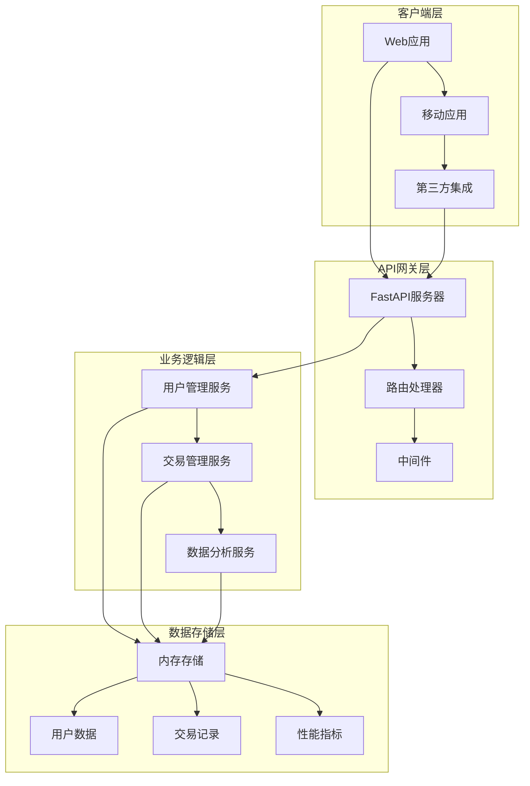
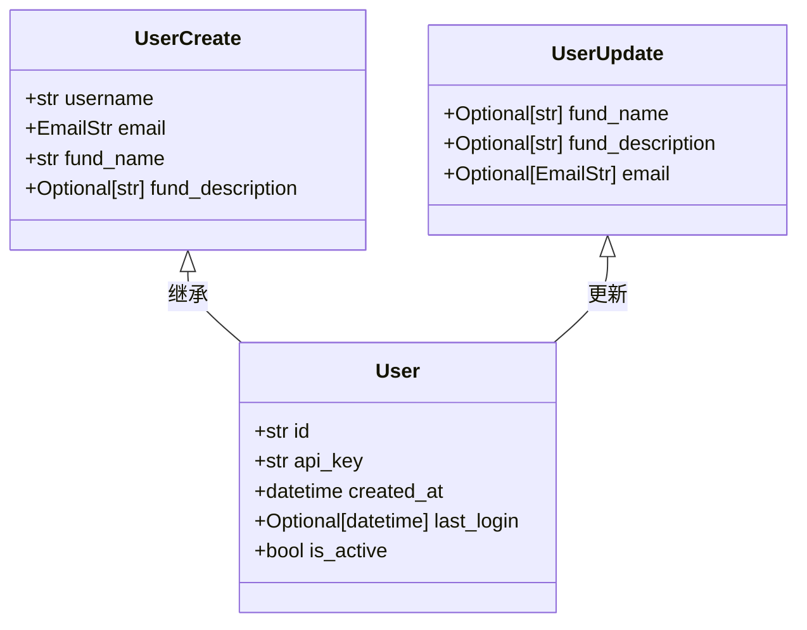
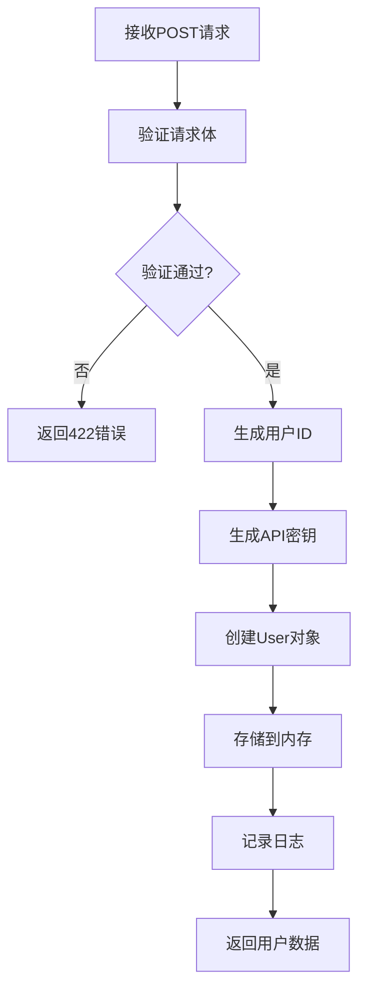
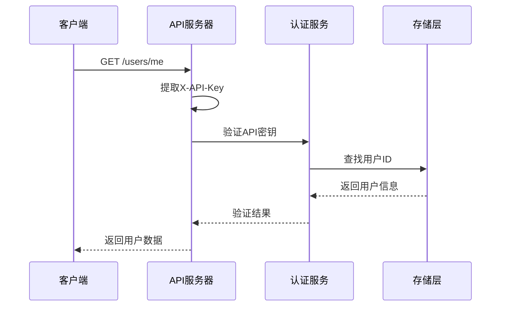
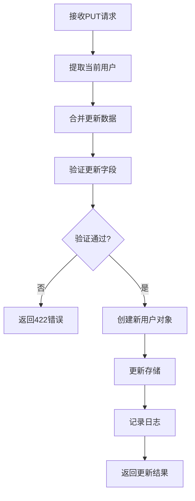
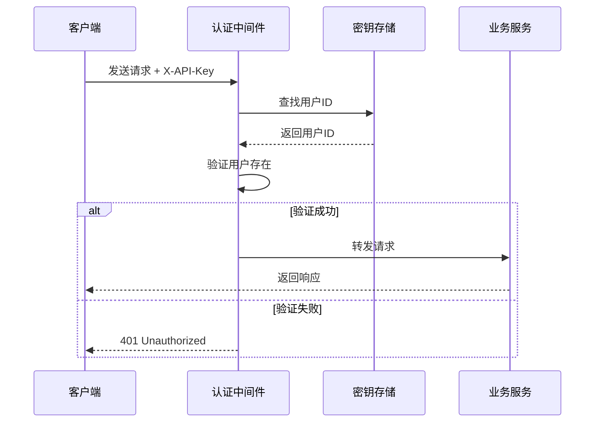
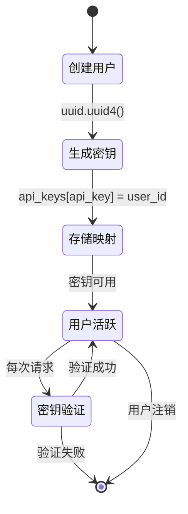
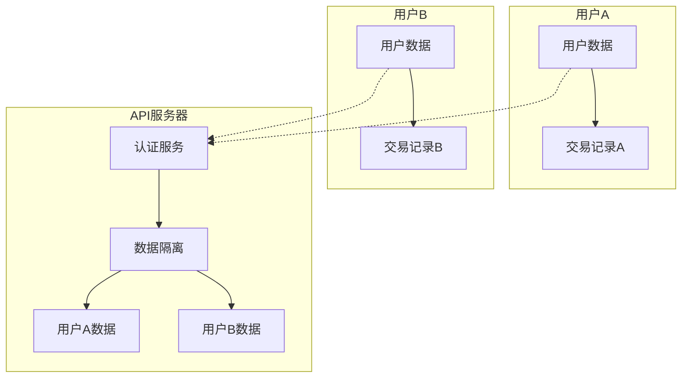

# 用户管理接口

<cite>
**本文档中引用的文件**
- [api.py](file://api/api.py)
- [api_tests.py](file://api/api_tests.py)
- [README.md](file://README.md)
</cite>

## 目录
1. [简介](#简介)
2. [项目架构概览](#项目架构概览)
3. [核心数据结构](#核心数据结构)
4. [用户管理接口详解](#用户管理接口详解)
5. [身份认证机制](#身份认证机制)
6. [错误处理与状态码](#错误处理与状态码)
7. [API密钥生成机制](#api密钥生成机制)
8. [安全考虑](#安全考虑)
9. [使用示例](#使用示例)
10. [故障排除指南](#故障排除指南)

## 简介

AutoHedge是一个基于Swarm智能体架构的自动化对冲基金管理系统，提供了完整的用户管理接口。该系统采用FastAPI框架构建，支持RESTful API设计，并实现了基于API密钥的身份认证机制。

本文档详细介绍了用户管理相关的三个核心API端点：创建用户(/users)、获取当前用户信息(/users/me)和更新用户信息(/users/me)，以及相关的安全机制和最佳实践。

## 项目架构概览

AutoHedge API采用模块化架构设计，主要包含以下组件：



**图表来源**
- [api.py](file://api/api.py#L130-L148)

**章节来源**
- [api.py](file://api/api.py#L130-L148)

## 核心数据结构

系统定义了三个核心的Pydantic模型来处理用户数据：

### UserCreate 模型
用于创建新用户时的输入验证：

| 字段名 | 类型 | 必填 | 长度限制 | 描述 |
|--------|------|------|----------|------|
| username | str | 是 | 最小3字符，最大50字符 | 用户唯一标识符 |
| email | EmailStr | 是 | 有效的电子邮件格式 | 用户联系邮箱 |
| fund_name | str | 是 | 最小3字符，最大100字符 | 基金名称 |
| fund_description | Optional[str] | 否 | 最大500字符 | 基金描述信息 |

### UserUpdate 模型
用于更新用户信息时的输入验证：

| 字段名 | 类型 | 可选 | 长度限制 | 描述 |
|--------|------|------|----------|------|
| fund_name | Optional[str] | 是 | 最小3字符，最大100字符 | 基金名称（可选更新） |
| fund_description | Optional[str] | 是 | 最大500字符 | 基金描述（可选更新） |
| email | Optional[EmailStr] | 是 | 有效电子邮件格式 | 联系邮箱（可选更新） |

### User 完整模型
继承自UserCreate，包含所有用户属性：

| 字段名 | 类型 | 默认值 | 描述 |
|--------|------|--------|------|
| id | str | 自动生成 | 用户唯一标识符 |
| api_key | str | 自动生成 | 用户API密钥 |
| created_at | datetime | 自动设置 | 用户创建时间 |
| last_login | Optional[datetime] | None | 最后登录时间 |
| is_active | bool | True | 用户账户状态 |



**图表来源**
- [api.py](file://api/api.py#L63-L84)

**章节来源**
- [api.py](file://api/api.py#L63-L84)

## 用户管理接口详解

### 1. 创建用户 (/users)

#### HTTP方法
- **POST**

#### 请求头
- `Content-Type: application/json`
- 无需X-API-Key头部（特殊例外）

#### 请求体结构
```json
{
    "username": "trader1",
    "email": "trader@example.com",
    "fund_name": "Alpha Fund",
    "fund_description": "AI Trading Strategy"
}
```

#### 响应格式
成功创建用户后返回完整的User对象：

```json
{
    "id": "uuid-string",
    "username": "trader1",
    "email": "trader@example.com",
    "fund_name": "Alpha Fund",
    "fund_description": "AI Trading Strategy",
    "api_key": "uuid-string",
    "created_at": "2024-01-01T12:00:00Z",
    "last_login": null,
    "is_active": true
}
```

#### 状态码
- `200 OK`: 用户创建成功
- `422 Unprocessable Entity`: 请求参数验证失败

#### 实现流程


**图表来源**
- [api.py](file://api/api.py#L203-L220)

**章节来源**
- [api.py](file://api/api.py#L203-L220)

### 2. 获取当前用户信息 (/users/me)

#### HTTP方法
- **GET**

#### 请求头
- `X-API-Key: your-api-key` (必需)

#### 查询参数
无

#### 响应格式
返回当前认证用户的完整信息：

```json
{
    "id": "uuid-string",
    "username": "trader1",
    "email": "trader@example.com",
    "fund_name": "Alpha Fund",
    "fund_description": "AI Trading Strategy",
    "api_key": "uuid-string",
    "created_at": "2024-01-01T12:00:00Z",
    "last_login": "2024-01-01T15:30:00Z",
    "is_active": true
}
```

#### 状态码
- `200 OK`: 成功获取用户信息
- `401 Unauthorized`: API密钥无效或过期
- `403 Forbidden`: 权限不足

#### 认证流程


**图表来源**
- [api.py](file://api/api.py#L167-L181)

**章节来源**
- [api.py](file://api/api.py#L222-L226)

### 3. 更新用户信息 (/users/me)

#### HTTP方法
- **PUT**

#### 请求头
- `X-API-Key: your-api-key` (必需)
- `Content-Type: application/json`

#### 请求体结构
可以更新一个或多个字段：

```json
{
    "fund_name": "Updated Fund Name",
    "fund_description": "Updated description",
    "email": "new-email@example.com"
}
```

#### 响应格式
返回更新后的用户信息：

```json
{
    "id": "uuid-string",
    "username": "trader1",
    "email": "new-email@example.com",
    "fund_name": "Updated Fund Name",
    "fund_description": "Updated description",
    "api_key": "uuid-string",
    "created_at": "2024-01-01T12:00:00Z",
    "last_login": "2024-01-01T15:30:00Z",
    "is_active": true
}
```

#### 状态码
- `200 OK`: 用户信息更新成功
- `401 Unauthorized`: API密钥无效
- `422 Unprocessable Entity`: 请求参数验证失败

#### 更新逻辑


**图表来源**
- [api.py](file://api/api.py#L228-L245)

**章节来源**
- [api.py](file://api/api.py#L228-L245)

## 身份认证机制

### X-API-Key 头部验证

系统采用基于API密钥的认证机制，所有需要身份验证的端点都要求在请求头中包含X-API-Key：

```http
GET /users/me
X-API-Key: your-api-key-here
```

### 认证流程



**图表来源**
- [api.py](file://api/api.py#L167-L181)

### 认证失败处理

当API密钥无效或不存在时，系统会：
1. 记录警告日志
2. 返回401状态码
3. 包含详细错误信息

**章节来源**
- [api.py](file://api/api.py#L167-L181)

## 错误处理与状态码

### 全局错误状态码

| 状态码 | 错误类型 | 描述 | 解决方案 |
|--------|----------|------|----------|
| 401 | Unauthorized | API密钥无效或缺失 | 检查X-API-Key是否正确设置 |
| 403 | Forbidden | 权限不足或资源访问被拒绝 | 确认API密钥对应的有效用户 |
| 404 | Not Found | 请求的资源不存在 | 检查URL路径和资源ID |
| 422 | Unprocessable Entity | 请求参数验证失败 | 检查请求体格式和字段约束 |
| 500 | Internal Server Error | 服务器内部错误 | 联系技术支持 |

### 特定场景错误

#### 用户管理端点错误
- **创建用户**: 仅在用户名重复或参数无效时返回422
- **获取用户**: 401表示API密钥无效
- **更新用户**: 422表示更新字段不符合验证规则

#### 交易相关错误
- **获取特定交易**: 404表示交易不存在，403表示无权限访问
- **删除交易**: 404表示交易不存在，403表示无权限删除

**章节来源**
- [README.md](file://README.md#L462-L467)

## API密钥生成机制

### 密钥生成算法

系统使用UUID v4算法生成唯一且随机的API密钥：

```python
# 用户创建时的密钥生成
user_id = str(uuid.uuid4())      # 生成用户唯一标识
api_key = str(uuid.uuid4())     # 生成API密钥
```

### 密钥存储结构

系统维护两个内存字典来管理用户和密钥映射：

```python
# 用户存储结构
self.users: Dict[str, User] = {}

# API密钥映射
self.api_keys: Dict[str, str] = {}
```

### 密钥生命周期



**图表来源**
- [api.py](file://api/api.py#L205-L218)

### 密钥安全性

1. **随机性**: 使用标准UUID v4算法确保密钥不可预测
2. **唯一性**: 每个用户拥有独立的API密钥
3. **临时性**: 内存存储，重启后丢失
4. **访问控制**: 严格的密钥验证机制

**章节来源**
- [api.py](file://api/api.py#L205-L218)

## 安全考虑

### API密钥安全

#### 存储安全
- **内存存储**: API密钥仅存储在内存中，重启后丢失
- **最小权限**: 每个密钥只能访问其对应的用户数据
- **定期轮换**: 生产环境中建议实现密钥轮换机制

#### 传输安全
- **HTTPS强制**: 生产环境必须使用HTTPS加密传输
- **头部保护**: API密钥通过HTTP头部传输，避免URL泄露
- **日志脱敏**: 日志中只记录密钥前8位用于审计

### 访问控制策略

#### 用户隔离


#### 数据访问控制
1. **用户级隔离**: 每个用户只能访问自己的数据
2. **资源验证**: 所有资源操作都验证用户所有权
3. **审计日志**: 记录所有敏感操作

### 最佳实践建议

1. **密钥管理**
   - 在生产环境中使用环境变量存储API密钥
   - 实施定期密钥轮换策略
   - 监控异常访问模式

2. **网络安全**
   - 使用反向代理和防火墙保护API服务器
   - 实施速率限制防止滥用
   - 启用HTTPS加密传输

3. **监控与审计**
   - 记录所有API调用
   - 监控异常访问行为
   - 设置告警机制

**章节来源**
- [api.py](file://api/api.py#L167-L181)

## 使用示例

### 创建用户

```bash
curl -X POST "http://localhost:8000/users" \
  -H "Content-Type: application/json" \
  -d '{
    "username": "trader1",
    "email": "trader@example.com",
    "fund_name": "Alpha Fund",
    "fund_description": "AI Trading Strategy"
  }'
```

**响应示例**:
```json
{
    "id": "550e8400-e29b-41d4-a716-446655440000",
    "username": "trader1",
    "email": "trader@example.com",
    "fund_name": "Alpha Fund",
    "fund_description": "AI Trading Strategy",
    "api_key": "550e8400-e29b-41d4-a716-446655440001",
    "created_at": "2024-01-01T12:00:00Z",
    "last_login": null,
    "is_active": true
}
```

### 获取用户信息

```bash
curl -X GET "http://localhost:8000/users/me" \
  -H "X-API-Key: 550e8400-e29b-41d4-a716-446655440001"
```

### 更新用户信息

```bash
curl -X PUT "http://localhost:8000/users/me" \
  -H "X-API-Key: 550e8400-e29b-41d4-a716-446655440001" \
  -H "Content-Type: application/json" \
  -d '{
    "fund_name": "Updated Alpha Fund",
    "email": "new-trader@example.com"
  }'
```

### 错误处理示例

#### 无效API密钥
```bash
curl -X GET "http://localhost:8000/users/me" \
  -H "X-API-Key: invalid-key"
```

**响应**:
```json
{
    "detail": "Invalid API key"
}
```

**状态码**: 401

**章节来源**
- [api_tests.py](file://api/api_tests.py#L15-L84)

## 故障排除指南

### 常见问题及解决方案

#### 1. API密钥无效错误 (401)
**症状**: 收到"Invalid API key"错误
**可能原因**:
- API密钥拼写错误
- 密钥已过期（内存中）
- 请求头格式不正确

**解决方案**:
```bash
# 检查请求头格式
curl -X GET "http://localhost:8000/users/me" \
  -H "X-API-Key: your-api-key-here" \
  -v
```

#### 2. 权限不足错误 (403)
**症状**: 收到"Unauthorized access"错误
**可能原因**:
- 使用了其他用户的API密钥
- 用户账户被禁用

**解决方案**:
1. 确认使用正确的API密钥
2. 检查用户账户状态
3. 重新创建用户账户

#### 3. 参数验证错误 (422)
**症状**: 收到验证错误信息
**常见原因**:
- 用户名长度不符合要求
- 邮箱格式不正确
- 基金描述过长

**解决方案**:
```json
{
    "username": "valid-name",  // 至少3字符
    "email": "valid@email.com", // 有效邮箱格式
    "fund_name": "Valid Fund Name", // 至少3字符
    "fund_description": "不超过500字符的描述" // 可选
}
```

#### 4. 服务器内部错误 (500)
**症状**: 收到500错误
**可能原因**:
- 系统内部异常
- 数据库连接问题
- 代码逻辑错误

**解决方案**:
1. 检查服务器日志
2. 重启API服务
3. 联系技术支持

### 调试工具

#### 日志配置
系统使用loguru库进行日志记录：

```python
logger.add(
    "logs/autohedge_{time}.log",
    rotation="500 MB",
    retention="10 days",
    level="INFO",
    format="{time:YYYY-MM-DD at HH:mm:ss} | {level} | {module}:{function}:{line} | {message}"
)
```

#### 测试脚本
系统提供了完整的测试脚本：

```python
# 初始化API客户端
api = AutoHedgeAPI()

# 获取或创建API密钥
api.load_or_create_key()

# 运行完整测试套件
results = api.run_all_tests()
```

**章节来源**
- [api_tests.py](file://api/api_tests.py#L174-L187)

## 结论

AutoHedge的用户管理接口提供了完整的用户生命周期管理功能，采用基于API密钥的安全认证机制。系统设计遵循RESTful原则，具有良好的可扩展性和安全性。

### 主要特性总结

1. **完整的用户管理**: 支持创建、查询和更新用户信息
2. **安全的认证机制**: 基于UUID的API密钥系统
3. **严格的访问控制**: 用户数据完全隔离
4. **完善的错误处理**: 清晰的错误信息和状态码
5. **易于使用的API**: 符合RESTful设计规范

### 生产环境建议

1. **密钥管理**: 使用环境变量存储API密钥
2. **网络安全**: 实施HTTPS和防火墙保护
3. **监控审计**: 启用详细日志记录
4. **备份恢复**: 定期备份用户数据
5. **性能优化**: 考虑使用持久化存储替代内存存储

通过遵循本文档中的指导原则和最佳实践，开发者可以安全有效地使用AutoHedge的用户管理接口，构建可靠的自动化交易系统。