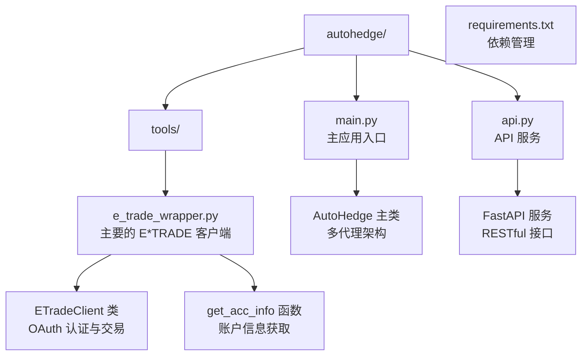
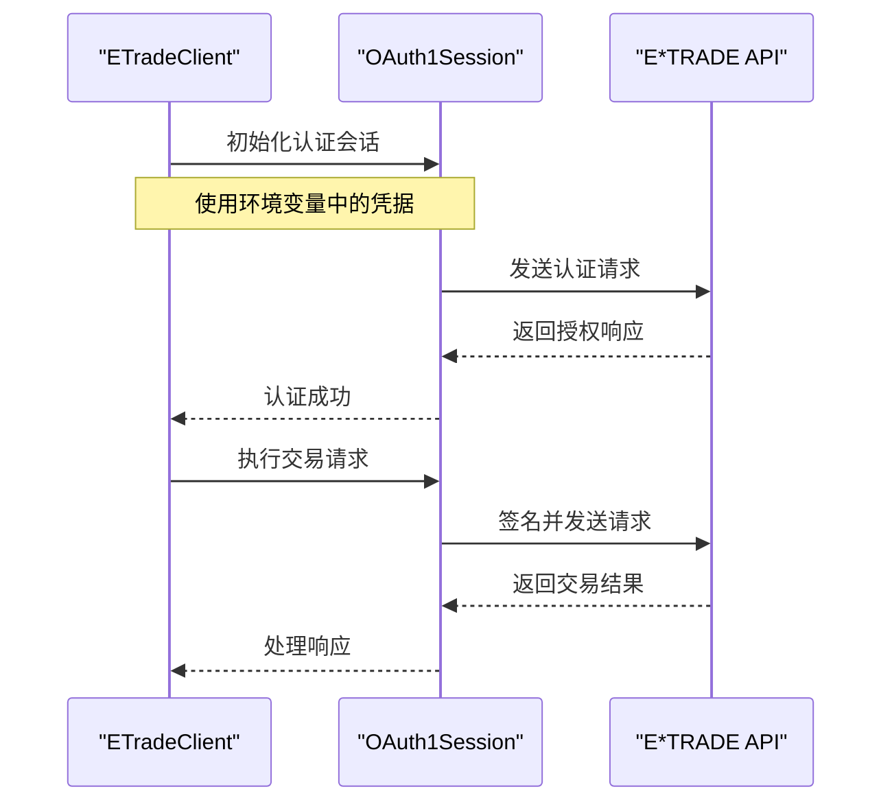
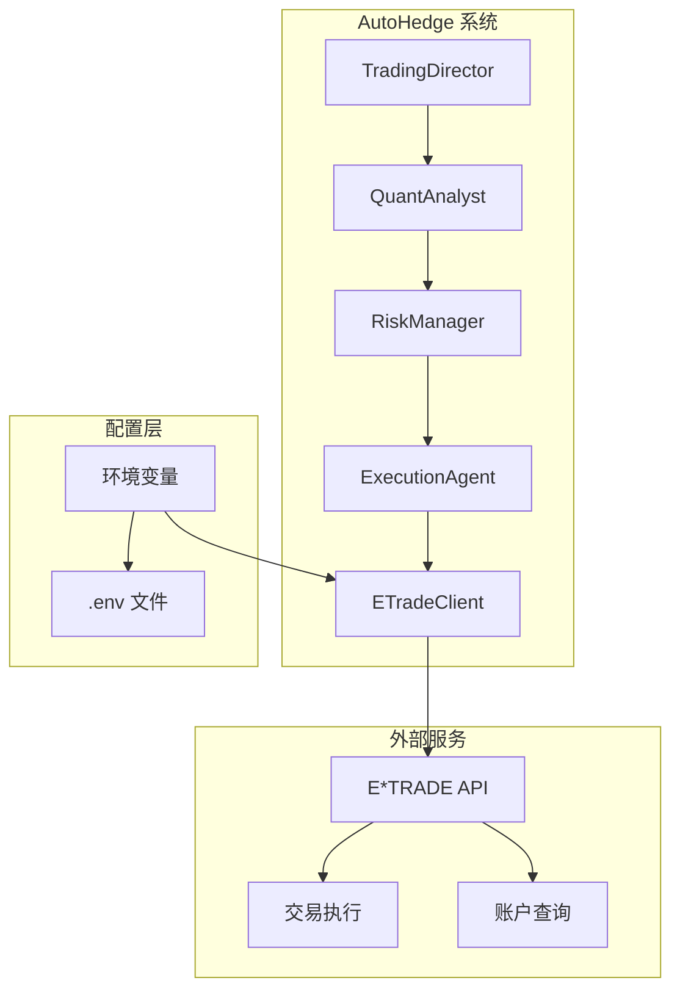
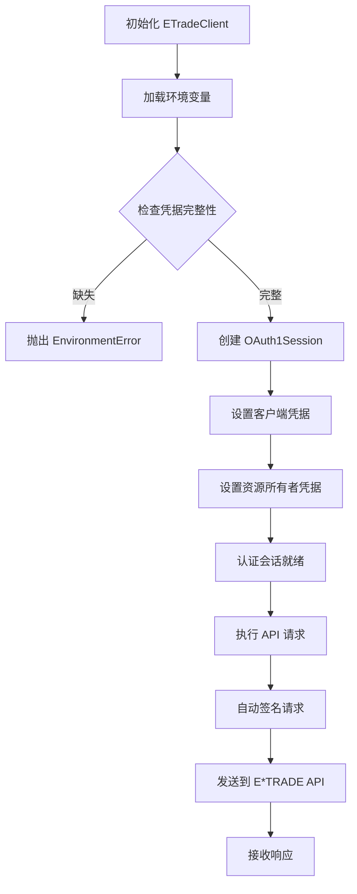
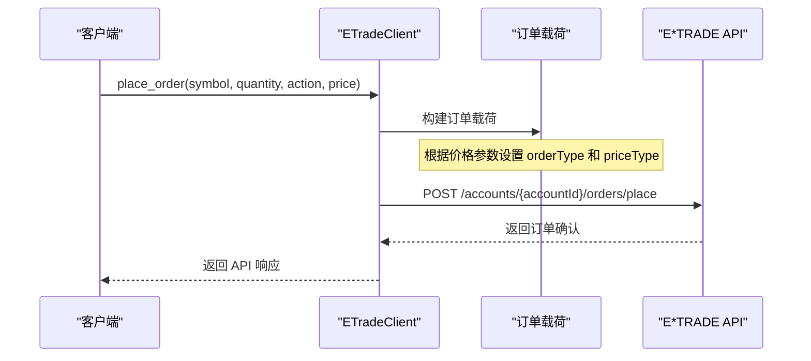
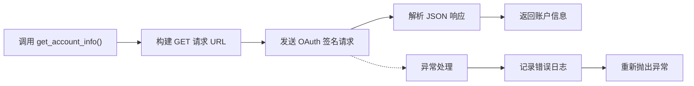
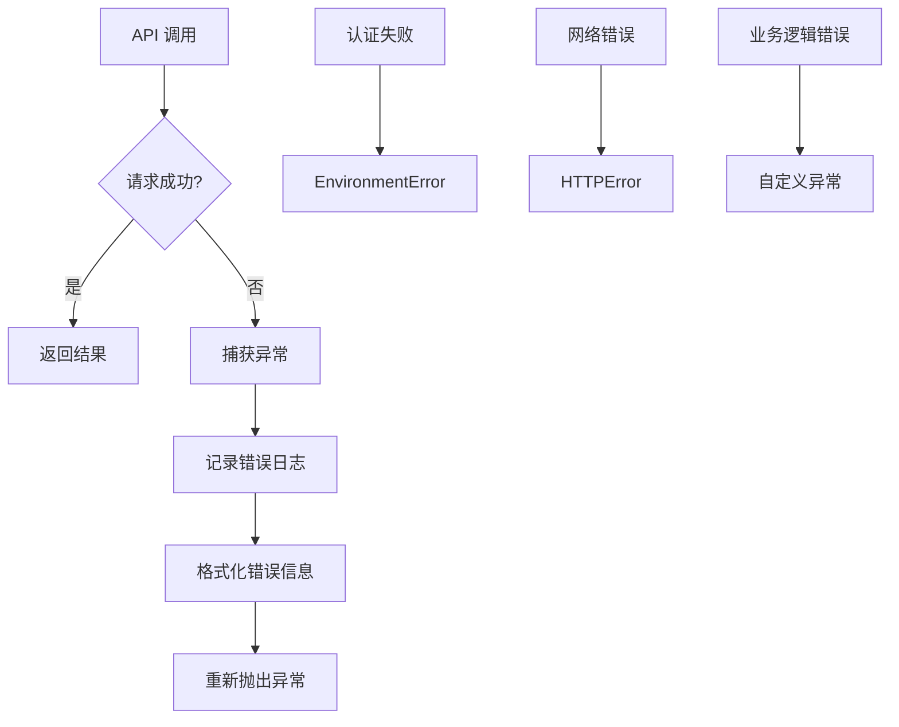
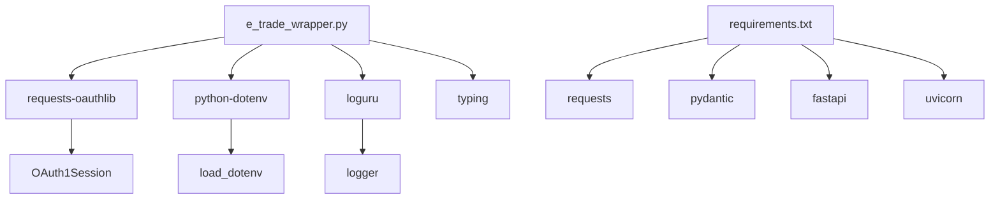
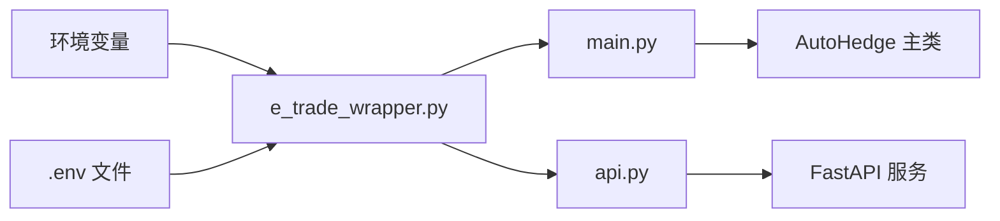

# E*TRADE 集成

<cite>
**本文档中引用的文件**
- [e_trade_wrapper.py](file://autohedge/tools/e_trade_wrapper.py)
- [main.py](file://autohedge/main.py)
- [api.py](file://api/api.py)
- [requirements.txt](file://requirements.txt)
- [README.md](file://README.md)
</cite>

## 目录
1. [简介](#简介)
2. [项目结构](#项目结构)
3. [核心组件](#核心组件)
4. [架构概览](#架构概览)
5. [详细组件分析](#详细组件分析)
6. [依赖关系分析](#依赖关系分析)
7. [性能考虑](#性能考虑)
8. [故障排除指南](#故障排除指南)
9. [结论](#结论)

## 简介

E*TRADE 集成模块是 AutoHedge 自动化交易系统中的重要组成部分，负责与 E*TRADE 投资平台进行安全通信和交易操作。该模块通过 OAuth1.0a 认证协议确保交易的安全性，提供了完整的订单管理和账户查询功能。

本模块的核心特性包括：
- 基于 OAuth1Session 的安全认证机制
- 支持市价单和限价单的订单提交
- 账户信息查询和余额管理
- 完整的日志记录和错误处理
- 环境变量驱动的配置管理

## 项目结构

AutoHedge 项目采用模块化架构设计，E*TRADE 集成相关的文件组织如下：



**图表来源**
- [e_trade_wrapper.py](file://autohedge/tools/e_trade_wrapper.py#L1-L174)
- [main.py](file://autohedge/main.py#L1-L583)
- [api.py](file://api/api.py#L1-L476)

**章节来源**
- [e_trade_wrapper.py](file://autohedge/tools/e_trade_wrapper.py#L1-L174)
- [main.py](file://autohedge/main.py#L1-L583)

## 核心组件

### ETradeClient 类

ETradeClient 是 E*TRADE 集成的核心类，负责与 E*TRADE API 进行安全通信。该类实现了完整的 OAuth1.0a 认证流程，并提供了交易执行和账户管理功能。

#### 关键字段说明

| 字段名 | 类型 | 描述 | 配置方式 |
|--------|------|------|----------|
| BASE_URL | str | E*TRADE API 基础 URL | 固定值：`https://api.etrade.com/v1` |
| consumer_key | str | 消费者密钥 | 环境变量：`ETRADE_CONSUMER_KEY` |
| consumer_secret | str | 消费者密钥秘密 | 环境变量：`ETRADE_CONSUMER_SECRET` |
| oauth_token | str | OAuth 访问令牌 | 环境变量：`ETRADE_OAUTH_TOKEN` |
| oauth_token_secret | str | OAuth 访问令牌秘密 | 环境变量：`ETRADE_OAUTH_TOKEN_SECRET` |
| account_id | str | E*TRADE 账户 ID | 初始化参数 |

#### OAuth1Session 实现



**图表来源**
- [e_trade_wrapper.py](file://autohedge/tools/e_trade_wrapper.py#L45-L50)

**章节来源**
- [e_trade_wrapper.py](file://autohedge/tools/e_trade_wrapper.py#L11-L174)

## 架构概览

E*TRADE 集成在 AutoHedge 系统中扮演着关键的外部接口角色，与其他组件协同工作：



**图表来源**
- [main.py](file://autohedge/main.py#L242-L583)
- [e_trade_wrapper.py](file://autohedge/tools/e_trade_wrapper.py#L11-L174)

## 详细组件分析

### OAuth1.0a 安全认证机制

#### 认证流程



**图表来源**
- [e_trade_wrapper.py](file://autohedge/tools/e_trade_wrapper.py#L20-L51)

#### 环境变量配置

要正确配置 E*TRADE 集成，需要设置以下环境变量：

| 变量名 | 必需性 | 描述 | 示例值 |
|--------|--------|------|--------|
| `ETRADE_CONSUMER_KEY` | 必需 | E*TRADE 应用消费者密钥 | `abc123def456ghi789` |
| `ETRADE_CONSUMER_SECRET` | 必需 | E*TRADE 应用消费者密钥秘密 | `secret123456` |
| `ETRADE_OAUTH_TOKEN` | 必需 | 用户 OAuth 访问令牌 | `token123456` |
| `ETRADE_OAUTH_TOKEN_SECRET` | 必需 | 用户 OAuth 访问令牌秘密 | `tokensecret123` |
| `ETRADE_ACCOUNT_ID` | 推荐 | E*TRADE 账户标识符 | `12345678` |

#### place_order 方法详解

place_order 方法封装了完整的订单提交流程：



**图表来源**
- [e_trade_wrapper.py](file://autohedge/tools/e_trade_wrapper.py#L53-L104)

##### 订单载荷结构分析

订单载荷包含以下关键字段：

| 字段名 | 类型 | 描述 | 默认值 |
|--------|------|------|--------|
| `orderType` | str | 订单类型：LIMIT 或 MARKET | 动态计算 |
| `clientOrderId` | str | 客户端订单 ID | `"12345"` |
| `orderAction` | str | 订单动作：BUY 或 SELL | 动态转换为大写 |
| `instrument.symbol` | str | 证券代码 | 输入参数 |
| `instrument.quantity` | int | 数量 | 输入参数 |
| `priceType` | str | 价格类型：LIMIT 或 MARKET | 动态计算 |
| `limitPrice` | float | 限价（可选） | 限价单时为输入价格 |
| `marketSession` | str | 市场时段 | `"REGULAR"` |
| `orderTerm` | str | 订单期限 | `"GOOD_FOR_DAY"` |

#### get_account_info 方法

该方法用于获取账户详细信息：



**图表来源**
- [e_trade_wrapper.py](file://autohedge/tools/e_trade_wrapper.py#L106-L128)

**章节来源**
- [e_trade_wrapper.py](file://autohedge/tools/e_trade_wrapper.py#L53-L128)

### 错误处理与日志记录

#### 异常处理策略



#### 日志记录层次

系统使用 loguru 库实现分层日志记录：

| 日志级别 | 用途 | 示例消息 |
|----------|------|----------|
| DEBUG | 详细调试信息 | `"Placing BUY order for 10 shares of AAPL (Limit: 150.0)"` |
| INFO | 一般信息记录 | `"Fetching account information..."` |
| SUCCESS | 成功操作 | `"Order placed successfully."` |
| WARNING | 警告信息 | `"Invalid API key attempt..."` |
| ERROR | 错误信息 | `"Failed to place order: Network timeout"` |

**章节来源**
- [e_trade_wrapper.py](file://autohedge/tools/e_trade_wrapper.py#L92-L104)
- [e_trade_wrapper.py](file://autohedge/tools/e_trade_wrapper.py#L118-L124)

## 依赖关系分析

### 外部依赖



**图表来源**
- [requirements.txt](file://requirements.txt#L1-L8)
- [e_trade_wrapper.py](file://autohedge/tools/e_trade_wrapper.py#L1-L6)

### 内部依赖关系



**章节来源**
- [requirements.txt](file://requirements.txt#L1-L8)
- [e_trade_wrapper.py](file://autohedge/tools/e_trade_wrapper.py#L1-L6)

## 性能考虑

### 并发处理

当前实现采用同步模式，建议在高并发场景下考虑以下优化：

1. **连接池管理**：使用 `requests.Session` 管理持久连接
2. **异步支持**：考虑迁移到 `aiohttp` 和 `httpx` 实现异步调用
3. **缓存策略**：对频繁查询的账户信息实施缓存机制

### 网络优化

- **超时设置**：合理设置请求超时时间避免长时间阻塞
- **重试机制**：实现指数退避重试策略处理临时性网络问题
- **连接复用**：保持 HTTP 连接以减少握手开销

### 内存管理

- **对象生命周期**：及时释放不再使用的 OAuth 会话对象
- **日志轮转**：配置适当的日志轮转策略防止磁盘空间耗尽
- **异常清理**：确保异常情况下资源得到正确释放

## 故障排除指南

### 常见错误及解决方案

#### 1. 凭据缺失错误

**错误信息**：`E*TRADE credentials are not set in the environment variables.`

**原因分析**：缺少必要的环境变量配置

**解决方案**：
```bash
# 设置环境变量
export ETRADE_CONSUMER_KEY="your_consumer_key"
export ETRADE_CONSUMER_SECRET="your_consumer_secret"
export ETRADE_OAUTH_TOKEN="your_oauth_token"
export ETRADE_OAUTH_TOKEN_SECRET="your_oauth_token_secret"
export ETRADE_ACCOUNT_ID="your_account_id"

# 或创建 .env 文件
echo "ETRADE_CONSUMER_KEY=your_consumer_key" >> .env
echo "ETRADE_CONSUMER_SECRET=your_consumer_secret" >> .env
echo "ETRADE_OAUTH_TOKEN=your_oauth_token" >> .env
echo "ETRADE_OAUTH_TOKEN_SECRET=your_oauth_token_secret" >> .env
echo "ETRADE_ACCOUNT_ID=your_account_id" >> .env
```

#### 2. 令牌过期错误

**错误表现**：API 返回 401 或 403 状态码

**诊断步骤**：
1. 检查 OAuth 令牌的有效期
2. 验证令牌是否被撤销或修改
3. 确认消费者密钥和密钥秘密的正确性

**解决方案**：
```python
# 重新获取 OAuth 令牌
def refresh_oauth_token():
    # 实现令牌刷新逻辑
    pass
```

#### 3. 网络连接错误

**错误信息**：`Failed to place order: Connection error`

**排查方法**：
1. 检查网络连接状态
2. 验证防火墙设置
3. 确认 E*TRADE API 服务状态

#### 4. 订单验证失败

**错误信息**：`Failed to place order: Bad request`

**常见原因**：
- 无效的证券代码
- 不合理的数量或价格
- 账户权限不足

**解决步骤**：
```python
# 添加输入验证
def validate_order_params(symbol, quantity, price):
    # 实现参数验证逻辑
    pass
```

### 调试技巧

#### 启用详细日志

```python
import logging
logging.basicConfig(level=logging.DEBUG)
```

#### 请求追踪

```python
# 在 API 调用前后添加追踪点
logger.debug(f"Request URL: {url}")
logger.debug(f"Request payload: {order_payload}")
response = self.oauth_session.post(url, json=order_payload)
logger.debug(f"Response status: {response.status_code}")
logger.debug(f"Response body: {response.text}")
```

#### 环境变量验证

```python
def validate_environment_variables():
    required_vars = [
        "ETRADE_CONSUMER_KEY",
        "ETRADE_CONSUMER_SECRET", 
        "ETRADE_OAUTH_TOKEN",
        "ETRADE_OAUTH_TOKEN_SECRET",
        "ETRADE_ACCOUNT_ID"
    ]
    
    missing_vars = [var for var in required_vars if not os.getenv(var)]
    
    if missing_vars:
        logger.error(f"Missing environment variables: {missing_vars}")
        return False
    
    return True
```

**章节来源**
- [e_trade_wrapper.py](file://autohedge/tools/e_trade_wrapper.py#L32-L44)
- [e_trade_wrapper.py](file://autohedge/tools/e_trade_wrapper.py#L92-L104)

## 结论

E*TRADE 集成模块为 AutoHedge 系统提供了安全可靠的交易接口。通过 OAuth1.0a 认证机制确保了交易的安全性，完善的错误处理和日志记录机制提高了系统的可维护性。

### 主要优势

1. **安全性**：基于 OAuth1.0a 的强认证机制
2. **可靠性**：完整的异常处理和日志记录
3. **易用性**：简洁的 API 设计和环境变量配置
4. **可扩展性**：模块化设计便于功能扩展

### 改进建议

1. **异步支持**：考虑添加异步 API 调用能力
2. **重试机制**：实现智能重试策略
3. **监控集成**：添加健康检查和性能监控
4. **单元测试**：完善测试覆盖率

### 扩展方向

开发者可以通过以下方式扩展此模块：

1. **添加新 API 端点**：如持仓查询、历史交易记录等
2. **实现批量操作**：支持同时提交多个订单
3. **增强错误恢复**：添加自动重试和降级策略
4. **性能优化**：引入连接池和缓存机制

通过持续的改进和扩展，E*TRADE 集成模块将为 AutoHedge 系统提供更加稳定和强大的交易能力。