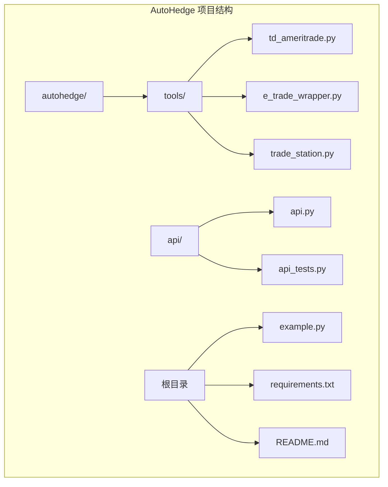
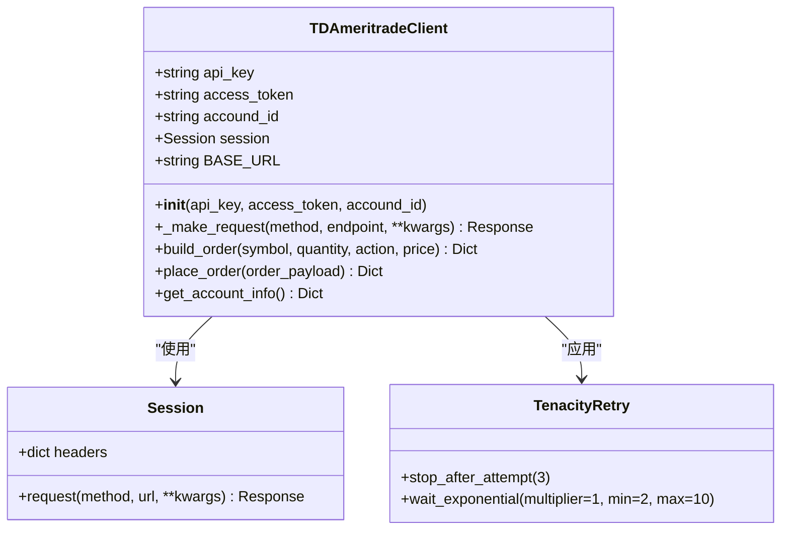
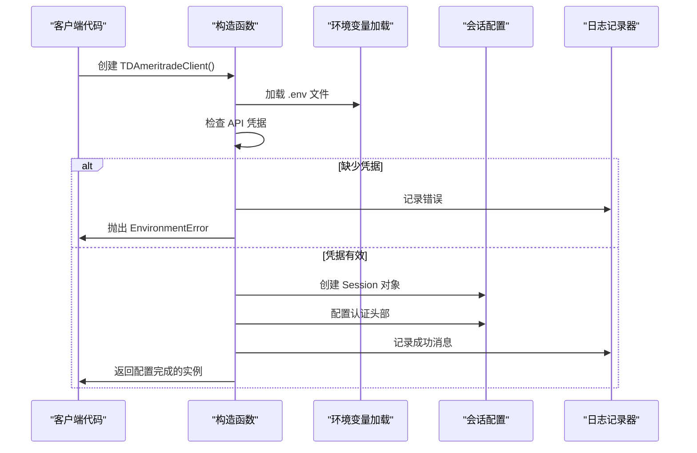
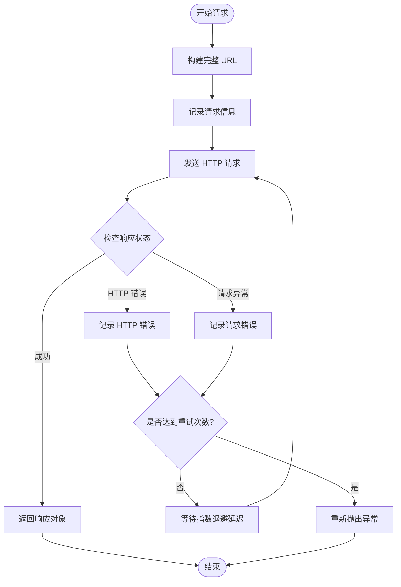
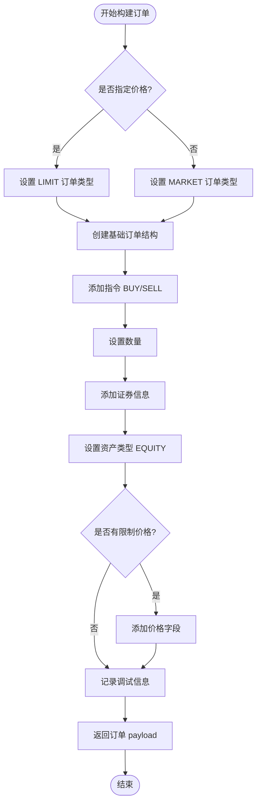
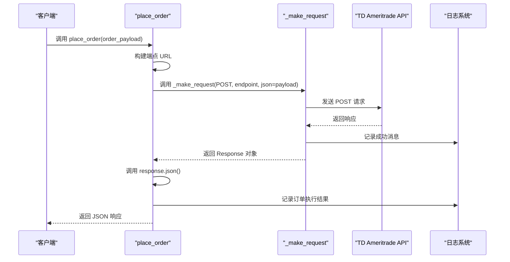
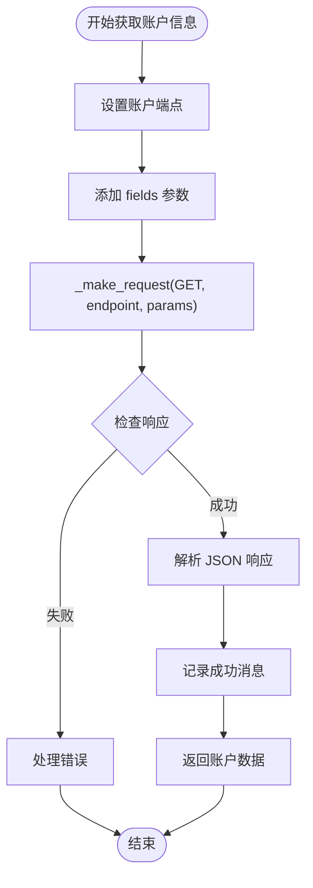
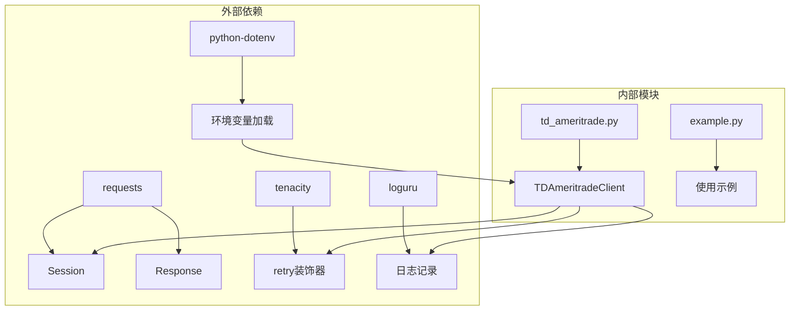
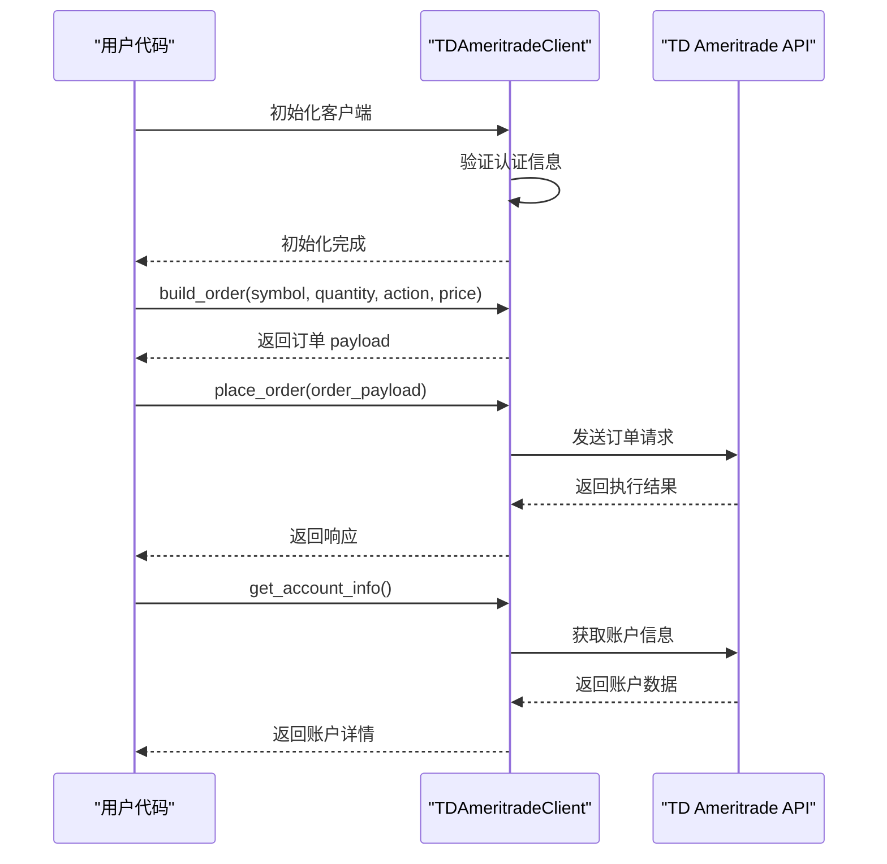

# TD Ameritrade 集成

<cite>
**本文档中引用的文件**
- [td_ameritrade.py](file://autohedge/tools/td_ameritrade.py)
- [example.py](file://example.py)
- [README.md](file://README.md)
- [requirements.txt](file://requirements.txt)
- [api.py](file://api/api.py)
- [api_tests.py](file://api/api_tests.py)
</cite>

## 目录
1. [简介](#简介)
2. [项目结构](#项目结构)
3. [核心组件](#核心组件)
4. [架构概览](#架构概览)
5. [详细组件分析](#详细组件分析)
6. [依赖关系分析](#依赖关系分析)
7. [性能考虑](#性能考虑)
8. [故障排除指南](#故障排除指南)
9. [结论](#结论)

## 简介

TD Ameritrade 集成是 AutoHedge 自动化交易系统的核心组件之一，提供了与 TD Ameritrade 投资平台的完整 API 集成。该集成支持双重认证机制（API Key 和 Bearer Token），实现了稳健的网络请求处理和订单管理功能。

本文档深入分析了 TDAmeritradeClient 类的实现机制，重点探讨了其初始化流程、认证策略、重试机制以及订单处理功能。

## 项目结构

AutoHedge 项目采用模块化架构，TD Ameritrade 集成位于专门的工具模块中：

**图表来源**
- [td_ameritrade.py](file://autohedge/tools/td_ameritrade.py#L1-L209)
- [api.py](file://api/api.py#L1-L181)

**章节来源**
- [td_ameritrade.py](file://autohedge/tools/td_ameritrade.py#L1-L209)
- [README.md](file://README.md#L1-L510)

## 核心组件

### TDAmeritradeClient 类

TDAmeritradeClient 是整个 TD Ameritrade 集成的核心类，提供了完整的 API 客户端功能：

#### 主要特性：
- **双重认证支持**：同时支持 API Key 和 OAuth 2.0 Bearer Token 认证
- **会话管理**：自动配置 HTTP 头部和认证信息
- **重试机制**：基于 tenacity 库的智能重试策略
- **订单管理**：完整的订单构建和执行流程
- **账户信息查询**：支持多种账户信息获取方式

#### 关键属性：
- `api_key`: TD Ameritrade API 密钥
- `access_token`: OAuth 2.0 访问令牌  
- `session`: 配置好的 requests.Session 对象
- `BASE_URL`: API 基础 URL 地址

**章节来源**
- [td_ameritrade.py](file://autohedge/tools/td_ameritrade.py#L14-L56)

## 架构概览

TD Ameritrade 集成采用分层架构设计，确保了代码的可维护性和扩展性：

**图表来源**
- [td_ameritrade.py](file://autohedge/tools/td_ameritrade.py#L14-L56)
- [td_ameritrade.py](file://autohedge/tools/td_ameritrade.py#L58-L91)

## 详细组件分析

### 初始化流程分析

TDAmeritradeClient 的初始化过程包含了完整的认证和配置逻辑：

**图表来源**
- [td_ameritrade.py](file://autohedge/tools/td_ameritrade.py#L21-L56)

#### 认证机制详解

系统支持两种认证方式：

1. **API Key 认证**：通过 `TD_API_KEY` 环境变量或直接传入
2. **Bearer Token 认证**：通过 `TD_ACCESS_TOKEN` 环境变量或直接传入

认证头部配置策略：
- 使用 Bearer 令牌格式
- 设置 Content-Type 为 application/json
- 自动处理认证失败情况

**章节来源**
- [td_ameritrade.py](file://autohedge/tools/td_ameritrade.py#L21-L56)

### _make_request 方法的重试机制

_build_request 方法实现了基于 tenacity 库的智能重试策略：

**图表来源**
- [td_ameritrade.py](file://autohedge/tools/td_ameritrade.py#L62-L91)

#### 重试策略配置

- **最大重试次数**：3 次
- **等待策略**：指数退避算法
- **延迟范围**：最小 2 秒，最大 10 秒
- **乘数因子**：1（每次重试延迟翻倍）

这种策略能够有效应对网络不稳定、临时服务器问题等情况，显著提高 API 调用的可靠性。

**章节来源**
- [td_ameritrade.py](file://autohedge/tools/td_ameritrade.py#L58-L91)

### build_order 方法的订单构建

build_order 方法负责根据输入参数构建符合 TD Ameritrade 规范的订单 payload：

**图表来源**
- [td_ameritrade.py](file://autohedge/tools/td_ameritrade.py#L131-L174)

#### 订单结构详解

构建的订单 payload 包含以下关键字段：

| 字段名 | 类型 | 描述 | 示例值 |
|--------|------|------|--------|
| orderType | string | 订单类型 | "LIMIT" 或 "MARKET" |
| session | string | 交易时段 | "NORMAL" |
| duration | string | 订单有效期 | "DAY" |
| orderStrategyType | string | 订单策略类型 | "SINGLE" |
| orderLegCollection | array | 订单腿集合 | 包含指令、数量、证券信息 |
| price | float | 限制价格 | 可选 |

**章节来源**
- [td_ameritrade.py](file://autohedge/tools/td_ameritrade.py#L131-L174)

### place_order 方法的订单执行

place_order 方法实现了订单的最终提交和响应处理：

**图表来源**
- [td_ameritrade.py](file://autohedge/tools/td_ameritrade.py#L93-L111)

**章节来源**
- [td_ameritrade.py](file://autohedge/tools/td_ameritrade.py#L93-L111)

### get_account_info 方法的账户信息获取

get_account_info 方法展示了如何获取账户详细信息：

**图表来源**
- [td_ameritrade.py](file://autohedge/tools/td_ameritrade.py#L113-L129)

#### fields 参数的作用

fields 参数控制返回的数据范围：
- `"positions"`：仅返回持仓信息
- 默认情况下，系统会包含所有可用的账户信息字段

**章节来源**
- [td_ameritrade.py](file://autohedge/tools/td_ameritrade.py#L113-L129)

## 依赖关系分析

TD Ameritrade 集成的依赖关系展现了清晰的模块化设计：

**图表来源**
- [td_ameritrade.py](file://autohedge/tools/td_ameritrade.py#L1-L9)
- [requirements.txt](file://requirements.txt#L1-L8)

### 关键依赖说明

1. **requests**: 提供 HTTP 请求功能
2. **tenacity**: 实现智能重试机制
3. **loguru**: 提供结构化日志记录
4. **python-dotenv**: 支持环境变量配置

**章节来源**
- [td_ameritrade.py](file://autohedge/tools/td_ameritrade.py#L1-L9)
- [requirements.txt](file://requirements.txt#L1-L8)

## 性能考虑

### 网络请求优化

1. **连接复用**：使用 requests.Session 维持持久连接
2. **智能重试**：避免频繁的快速重试，减少服务器压力
3. **指数退避**：随着重试次数增加，延迟时间呈指数增长

### 内存管理

1. **按需加载**：仅在需要时加载环境变量
2. **响应处理**：及时释放 HTTP 响应资源
3. **日志控制**：可配置的日志级别，避免过度记录

### 并发处理

虽然当前实现是同步的，但可以轻松扩展为异步版本以支持高并发场景。

## 故障排除指南

### 常见错误码及处理

| HTTP 错误码 | 描述 | 处理建议 |
|-------------|------|----------|
| 401 | 未授权访问 | 检查 API Key 和 Access Token 是否正确设置 |
| 403 | 禁止访问 | 验证账户权限和 API 访问范围 |
| 404 | 资源未找到 | 检查账户 ID 和端点路径 |
| 422 | 验证错误 | 检查订单参数格式和有效性 |
| 429 | 请求过于频繁 | 实现客户端限流机制 |
| 500 | 服务器内部错误 | 检查网络连接和服务器状态 |

### 认证问题排查

1. **环境变量检查**：确认 `.env` 文件中包含正确的 `TD_API_KEY` 和 `TD_ACCESS_TOKEN`
2. **令牌有效性**：验证 OAuth 令牌是否过期
3. **API 密钥权限**：确保 API 密钥具有必要的交易权限

### 网络问题处理

1. **重试机制**：系统内置的重试机制可以处理大多数临时网络问题
2. **超时设置**：建议在生产环境中设置合理的请求超时时间
3. **监控告警**：建立 API 调用监控和告警机制

**章节来源**
- [td_ameritrade.py](file://autohedge/tools/td_ameritrade.py#L85-L91)
- [README.md](file://README.md#L462-L467)

### 使用示例流程

以下是完整的使用示例，展示了从初始化到执行交易的完整流程：

**图表来源**
- [td_ameritrade.py](file://autohedge/tools/td_ameritrade.py#L178-L208)

**章节来源**
- [td_ameritrade.py](file://autohedge/tools/td_ameritrade.py#L178-L208)

## 结论

TD Ameritrade 集成展现了现代自动化交易系统的设计精髓：

1. **安全性优先**：双重认证机制确保了系统的安全性
2. **可靠性保障**：智能重试机制提高了 API 调用的成功率
3. **易用性设计**：简洁的接口设计降低了使用门槛
4. **可扩展性**：模块化架构便于功能扩展和维护

该集成不仅满足了当前的交易需求，还为未来的功能扩展奠定了坚实的基础。通过合理的错误处理和日志记录，系统具备了生产环境所需的稳定性和可观测性。