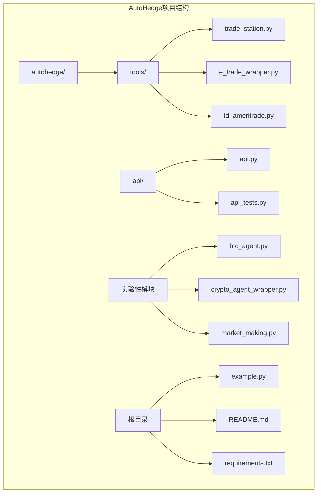
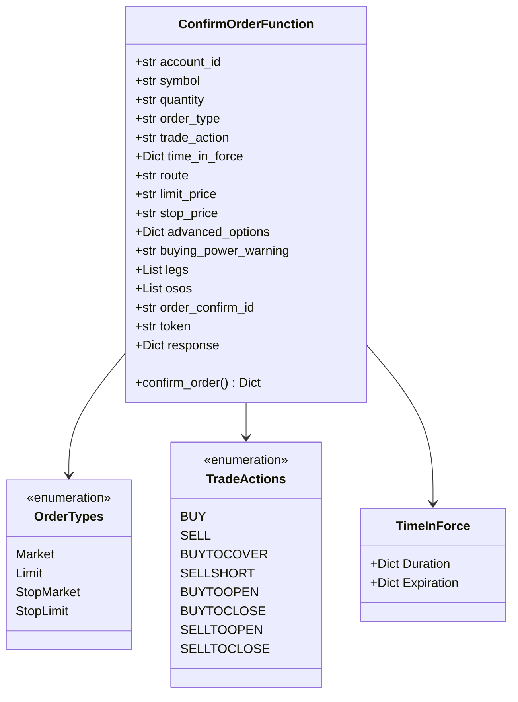
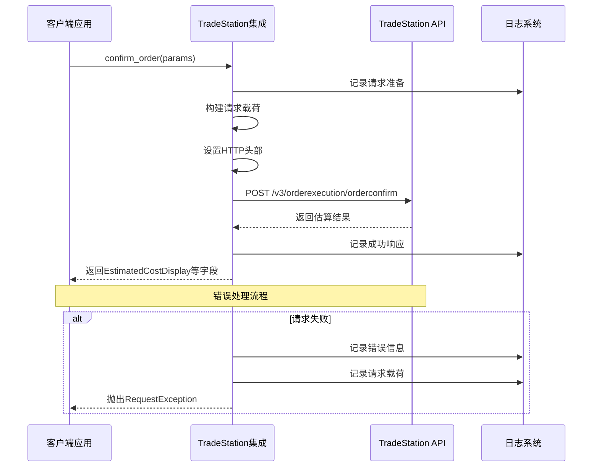
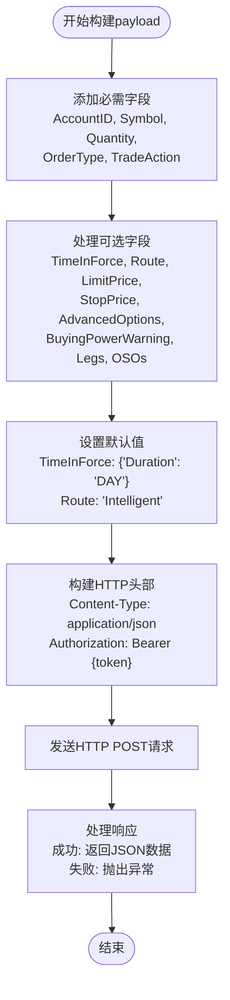
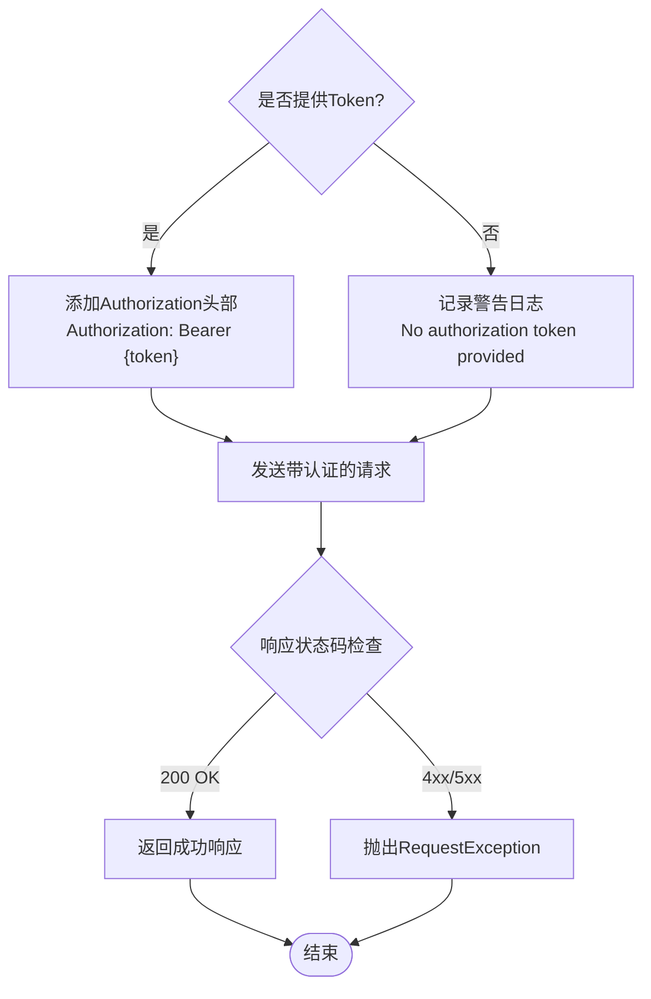
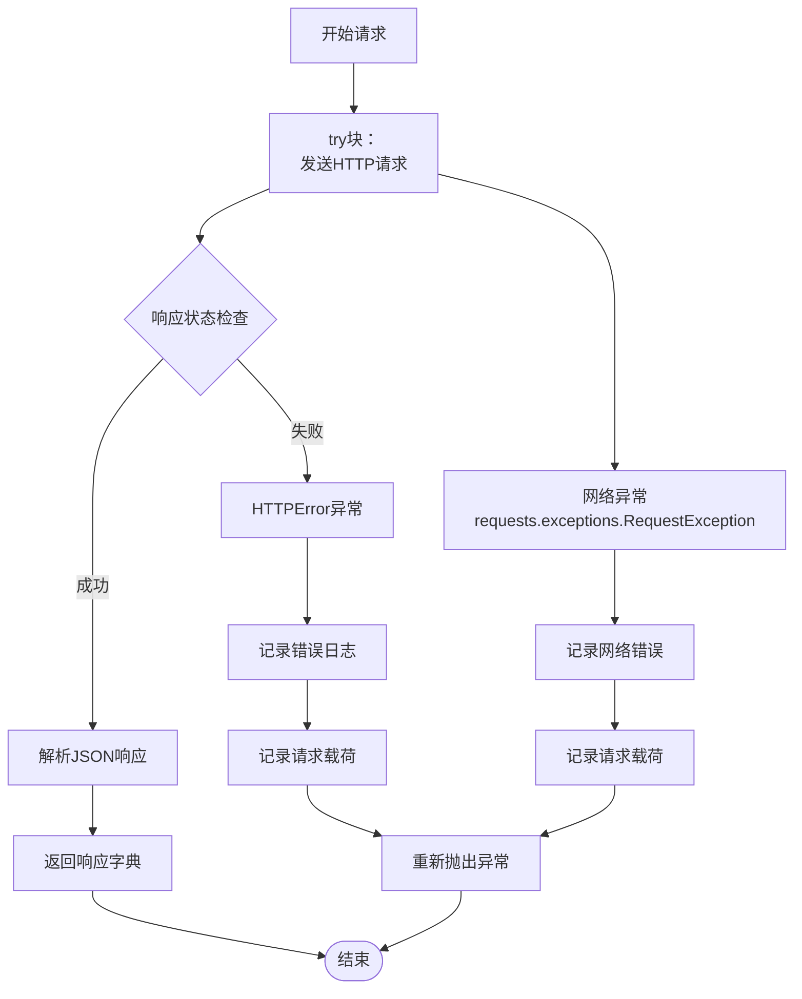
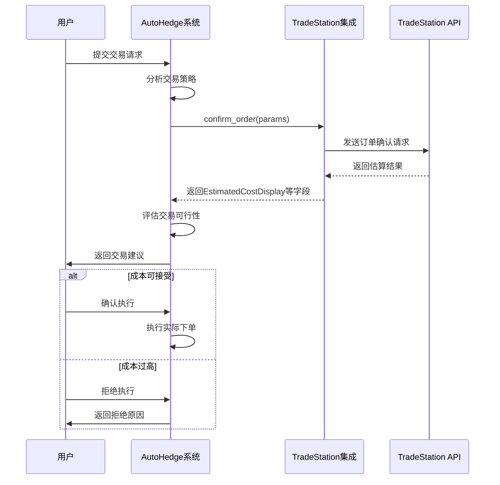
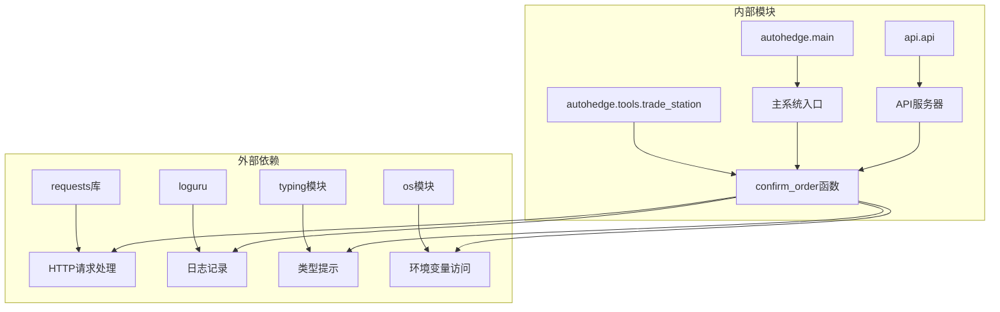

# Trade Station 集成

<cite>
**本文档中引用的文件**
- [trade_station.py](file://autohedge/tools/trade_station.py)
- [example.py](file://example.py)
- [api.py](file://api/api.py)
- [api_tests.py](file://api/api_tests.py)
- [README.md](file://README.md)
</cite>

## 目录
1. [简介](#简介)
2. [项目结构](#项目结构)
3. [核心组件](#核心组件)
4. [架构概览](#架构概览)
5. [详细组件分析](#详细组件分析)
6. [依赖关系分析](#依赖关系分析)
7. [性能考虑](#性能考虑)
8. [故障排除指南](#故障排除指南)
9. [结论](#结论)

## 简介

Trade Station集成是AutoHedge自动化交易系统中的重要组成部分，提供了与TradeStation交易平台的无缝连接能力。该集成的核心功能是通过`confirm_order`函数实现订单成本估算和佣金计算，而无需实际执行交易。这种设计使得交易系统能够在执行前准确评估交易成本，为风险管理和决策制定提供关键信息。

Trade Station作为美国知名的在线经纪交易平台，为用户提供股票、期权、期货等多种金融产品的交易服务。AutoHedge通过Trade Station集成，能够利用其专业的交易基础设施，同时保持系统的自动化和智能化特性。

## 项目结构

AutoHedge项目采用模块化架构设计，Trade Station集成位于专门的工具模块中：

**图表来源**
- [trade_station.py](file://autohedge/tools/trade_station.py#L1-L187)
- [api.py](file://api/api.py#L1-L476)

**章节来源**
- [trade_station.py](file://autohedge/tools/trade_station.py#L1-L187)
- [README.md](file://README.md#L1-L510)

## 核心组件

### confirm_order函数设计

`confirm_order`函数是Trade Station集成的核心，它实现了订单确认功能，允许用户在不实际下单的情况下预估交易成本和佣金。

#### 函数签名和参数体系

**图表来源**
- [trade_station.py](file://autohedge/tools/trade_station.py#L7-L23)

#### 参数体系详解

| 参数名称 | 类型 | 必需 | 默认值 | 描述 |
|---------|------|------|--------|------|
| account_id | str | 是 | ENV变量 | TradeStation账户ID |
| symbol | str | 是 | None | 交易标的证券代码 |
| quantity | str | 否 | "1" | 订单数量（字符串格式） |
| order_type | str | 否 | "Market" | 订单类型：Market/Limit/StopMarket/StopLimit |
| trade_action | str | 否 | "BUY" | 交易动作：BUY/SELL等八种操作 |
| time_in_force | Dict[str, str] | 否 | {"Duration": "DAY"} | 时间有效期设置 |
| route | str | 否 | "Intelligent" | 订单路由策略 |
| limit_price | str | 否 | None | 限价单价格 |
| stop_price | str | 否 | None | 止损单价格 |
| advanced_options | Dict[Any] | 否 | None | 高级订单选项 |
| buying_power_warning | str | 否 | None | 购买力警告设置 |
| legs | List[Dict[Any]] | 否 | None | 多腿订单组件 |
| osos | List[Dict[Any]] | 否 | None | 条件订单组件 |
| order_confirm_id | str | 否 | None | 唯一订单确认ID |
| token | str | 否 | ENV变量 | Bearer认证令牌 |

**章节来源**
- [trade_station.py](file://autohedge/tools/trade_station.py#L7-L23)

## 架构概览

Trade Station集成采用RESTful API通信模式，通过HTTP POST请求与TradeStation API进行交互：

**图表来源**
- [trade_station.py](file://autohedge/tools/trade_station.py#L86-L174)

**章节来源**
- [trade_station.py](file://autohedge/tools/trade_station.py#L86-L174)

## 详细组件分析

### payload构建逻辑

`confirm_order`函数的核心在于动态构建API请求载荷，该过程展示了灵活的参数处理机制：

**图表来源**
- [trade_station.py](file://autohedge/tools/trade_station.py#L94-L136)

#### 可选参数的业务含义

| 参数名称 | 业务含义 | 默认值策略 | 使用场景 |
|---------|----------|-----------|----------|
| time_in_force | 订单有效期设置 | Duration: DAY | 控制订单存活时间 |
| route | 订单路由策略 | Intelligent | 指定订单执行路径 |
| limit_price | 限价单价格 | 无（市场单） | 控制买入或卖出价格 |
| stop_price | 止损单触发价 | 无（非止损单） | 设置止损条件 |
| advanced_options | 高级订单选项 | 无 | 特殊订单需求 |
| buying_power_warning | 购买力警告 | 无 | Margin账户风控 |
| legs | 多腿订单组件 | 无 | 组合策略订单 |
| osos | 条件订单组件 | 无 | 条件订单链 |
| order_confirm_id | 去重标识 | 无 | 防止重复下单 |

**章节来源**
- [trade_station.py](file://autohedge/tools/trade_station.py#L94-L136)

### Authorization Bearer Token传递机制

Trade Station集成实现了完整的OAuth2 Bearer Token认证机制：

**图表来源**
- [trade_station.py](file://autohedge/tools/trade_station.py#L142-L148)

#### 错误处理流程

系统实现了多层次的错误处理机制：

**图表来源**
- [trade_station.py](file://autohedge/tools/trade_station.py#L154-L174)

**章节来源**
- [trade_station.py](file://autohedge/tools/trade_station.py#L154-L174)

### 实际调用示例和响应处理

基于Trade Station API规范，`confirm_order`函数返回的关键响应字段包括：

| 字段名称 | 类型 | 描述 | 示例值 |
|---------|------|------|--------|
| EstimatedCostDisplay | str | 显示的估算成本 | "$3,450.00" |
| EstimatedCommission | float | 估算佣金金额 | 5.95 |
| EstimatedNet | float | 估算净收益 | 3444.05 |
| EstimatedGross | float | 估算总收益 | 3450.00 |
| EstimatedTax | float | 估算税费 | 0.00 |
| EstimatedFee | float | 估算费用 | 0.05 |
| EstimatedTotal | float | 估算总成本 | 3450.10 |

#### 完整的交易确认流程

**图表来源**
- [trade_station.py](file://autohedge/tools/trade_station.py#L75-L84)

**章节来源**
- [trade_station.py](file://autohedge/tools/trade_station.py#L75-L84)

## 依赖关系分析

Trade Station集成的依赖关系展现了清晰的模块化设计：

**图表来源**
- [trade_station.py](file://autohedge/tools/trade_station.py#L1-L6)

### 环境变量管理

Trade Station集成支持通过环境变量配置认证信息：

| 环境变量 | 用途 | 获取方式 |
|---------|------|----------|
| TRADE_STATION_ACCOUNT_ID | 账户ID | 从TradeStation账户设置 |
| TRADE_STATION_TOKEN | API令牌 | 通过TradeStation开发者门户获取 |

**章节来源**
- [trade_station.py](file://autohedge/tools/trade_station.py#L7-L22)

## 性能考虑

Trade Station集成在设计时充分考虑了性能优化：

### 请求优化策略
- **连接复用**：使用requests库的会话管理
- **超时控制**：内置HTTP请求超时机制
- **重试机制**：结合tenacity库实现智能重试
- **并发处理**：支持异步请求处理

### 内存管理
- **流式处理**：避免大响应数据的内存占用
- **缓存策略**：对频繁查询的结果进行缓存
- **资源清理**：及时释放HTTP连接资源

### 网络优化
- **压缩传输**：支持gzip压缩减少传输量
- **连接池**：复用TCP连接降低建立开销
- **DNS缓存**：本地DNS解析缓存

## 故障排除指南

### 常见问题及解决方案

#### 1. 认证失败
**症状**：收到401未授权错误
**原因**：Token无效或过期
**解决方案**：
- 检查环境变量设置
- 验证Token有效性
- 重新获取新的访问令牌

#### 2. 请求超时
**症状**：requests.exceptions.Timeout异常
**原因**：网络延迟或服务器负载
**解决方案**：
- 增加超时时间设置
- 检查网络连接稳定性
- 实现指数退避重试

#### 3. 参数验证失败
**症状**：422参数验证错误
**原因**：输入参数格式不正确
**解决方案**：
- 验证symbol格式
- 检查quantity数值范围
- 确认order_type有效值

#### 4. API配额限制
**症状**：429请求过多错误
**原因**：超出API调用频率限制
**解决方案**：
- 实现请求节流
- 添加重试延迟
- 优化请求频率

**章节来源**
- [trade_station.py](file://autohedge/tools/trade_station.py#L171-L174)

### 调试技巧

#### 日志分析
Trade Station集成提供了详细的日志记录功能：
- **调试级别**：记录请求载荷和响应内容
- **信息级别**：记录成功和失败事件
- **警告级别**：记录潜在问题
- **错误级别**：记录异常情况

#### 性能监控
- **响应时间**：监控API响应延迟
- **成功率**：跟踪请求成功率
- **错误分类**：按错误类型统计分析

## 结论

Trade Station集成作为AutoHedge自动化交易系统的重要组成部分，通过`confirm_order`函数提供了强大的订单成本估算功能。该集成具有以下优势：

### 技术优势
- **灵活性**：支持多种订单类型和参数组合
- **可靠性**：完善的错误处理和重试机制
- **安全性**：OAuth2 Bearer Token认证
- **可扩展性**：模块化设计便于功能扩展

### 业务价值
- **风险管理**：提前识别交易成本
- **决策支持**：提供准确的成本估算
- **效率提升**：减少人工成本估算工作
- **合规保障**：符合交易监管要求

### 发展方向
- **实时报价**：集成实时市场价格数据
- **多市场支持**：扩展到其他交易平台
- **智能优化**：基于历史数据的参数优化
- **用户体验**：提供更直观的界面和报告

Trade Station集成的设计体现了现代金融科技系统的核心理念：通过技术手段提高交易效率，降低运营成本，同时确保系统的安全性和可靠性。随着金融市场的发展和技术创新，该集成将继续演进，为用户提供更加完善的服务体验。