# 交易平台集成

<cite>
**本文档中引用的文件**
- [e_trade_wrapper.py](file://autohedge/tools/e_trade_wrapper.py)
- [td_ameritrade.py](file://autohedge/tools/td_ameritrade.py)
- [trade_station.py](file://autohedge/tools/trade_station.py)
- [main.py](file://autohedge/main.py)
- [api.py](file://api/api.py)
- [example.py](file://example.py)
- [README.md](file://README.md)
- [requirements.txt](file://requirements.txt)
</cite>

## 目录
1. [简介](#简介)
2. [系统架构概览](#系统架构概览)
3. [E*TRADE 平台集成](#e-trade-平台集成)
4. [TD Ameritrade 平台集成](#td-americade-平台集成)
5. [Trade Station 平台集成](#trade-station-平台集成)
6. [统一接口设计](#统一接口设计)
7. [配置管理](#配置管理)
8. [错误处理与故障排除](#错误处理与故障排除)
9. [性能优化建议](#性能优化建议)
10. [扩展新平台指南](#扩展新平台指南)
11. [总结](#总结)

## 简介

autoHedge 系统是一个基于人工智能的自动化交易框架，通过统一的接口设计实现了对多个第三方交易平台的无缝集成。该系统支持三大主流交易平台：E*TRADE、TD Ameritrade 和 Trade Station，为用户提供一致的交易体验。

### 核心特性

- **多平台统一接口**：通过标准化的抽象层，屏蔽不同平台的API差异
- **智能认证管理**：支持OAuth2和API密钥等多种认证方式
- **健壮的错误处理**：内置重试机制和异常处理策略
- **实时性能监控**：提供详细的交易执行和性能指标
- **可扩展架构**：易于添加新的交易平台支持

## 系统架构概览

autoHedge 的交易平台集成采用分层架构设计，确保了系统的可维护性和扩展性。

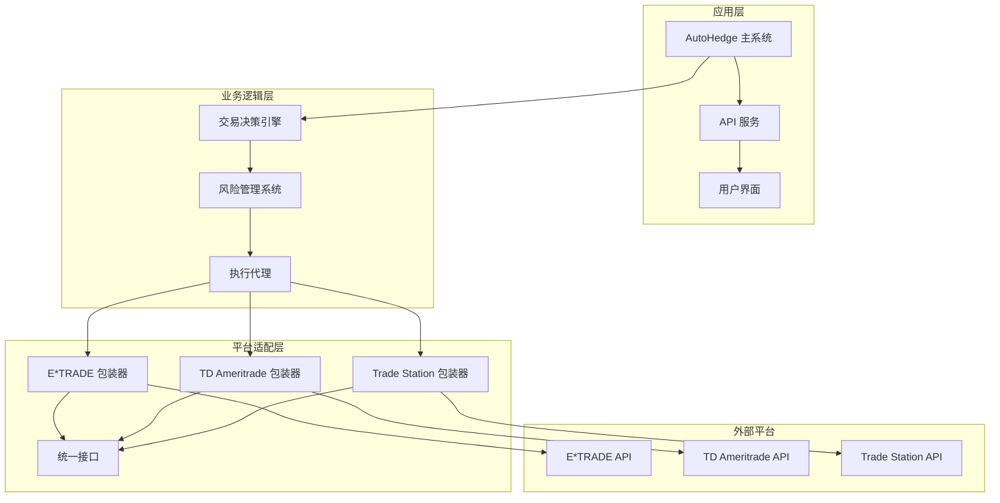

**图表来源**
- [main.py](file://autohedge/main.py#L422-L583)
- [api.py](file://api/api.py#L130-L305)

**章节来源**
- [main.py](file://autohedge/main.py#L1-L50)
- [README.md](file://README.md#L70-L120)

## E*TRADE 平台集成

### 认证机制

E*TRADE 集成采用 OAuth1.0a 认证协议，提供安全的API访问控制。

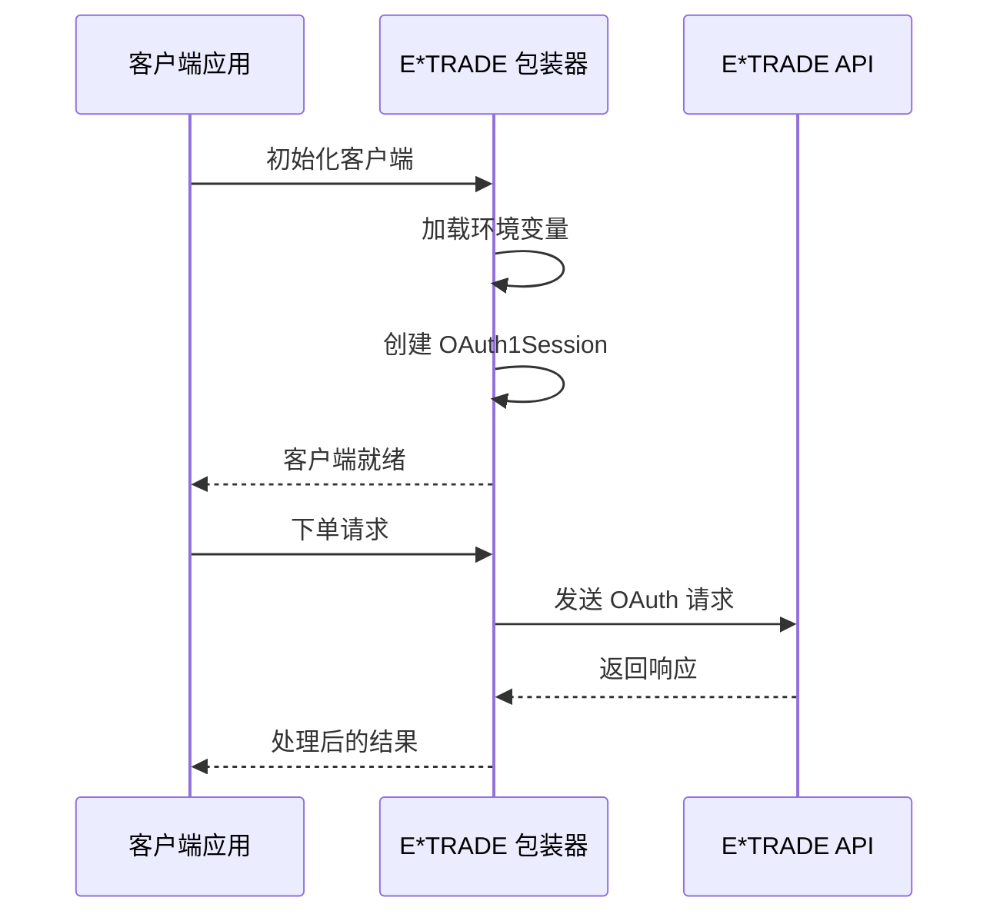

**图表来源**
- [e_trade_wrapper.py](file://autohedge/tools/e_trade_wrapper.py#L20-L51)

### 核心功能实现

#### 1. 客户端初始化

E*TRADE 包装器通过环境变量加载认证凭据：

| 配置项 | 描述 | 必需性 |
|--------|------|--------|
| ETRADE_CONSUMER_KEY | 消费者密钥 | 必需 |
| ETRADE_CONSUMER_SECRET | 消费者密钥秘密 | 必需 |
| ETRADE_OAUTH_TOKEN | OAuth 访问令牌 | 必需 |
| ETRADE_OAUTH_TOKEN_SECRET | OAuth 令牌秘密 | 必需 |
| ETRADE_ACCOUNT_ID | 账户标识符 | 必需 |

#### 2. 订单处理流程

订单处理遵循标准的 RESTful API 模式：

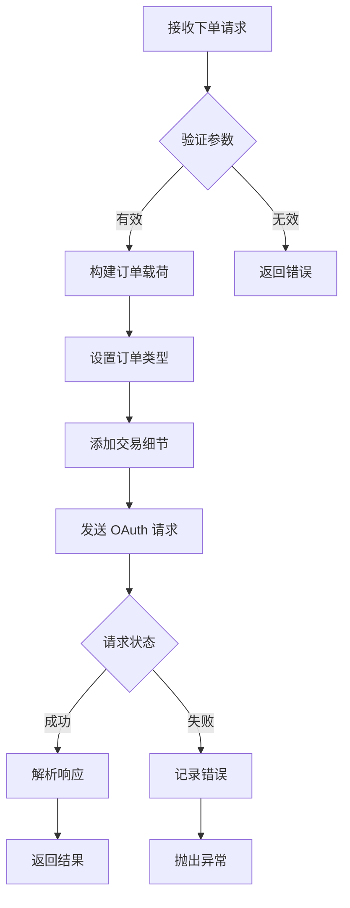

**图表来源**
- [e_trade_wrapper.py](file://autohedge/tools/e_trade_wrapper.py#L53-L104)

#### 3. 支持的订单类型

| 订单类型 | 描述 | 使用场景 |
|----------|------|----------|
| 市价单 | 立即以当前市场价格成交 | 追求快速执行 |
| 限价单 | 设置特定价格限制的订单 | 控制买入/卖出价格 |
| 停止单 | 达到特定价格时触发市价单 | 止损和止盈 |

**章节来源**
- [e_trade_wrapper.py](file://autohedge/tools/e_trade_wrapper.py#L1-L174)

## TD Ameritrade 平台集成

### 认证机制

TD Ameritrade 采用 OAuth2.0 认证协议，提供更现代的安全认证方式。

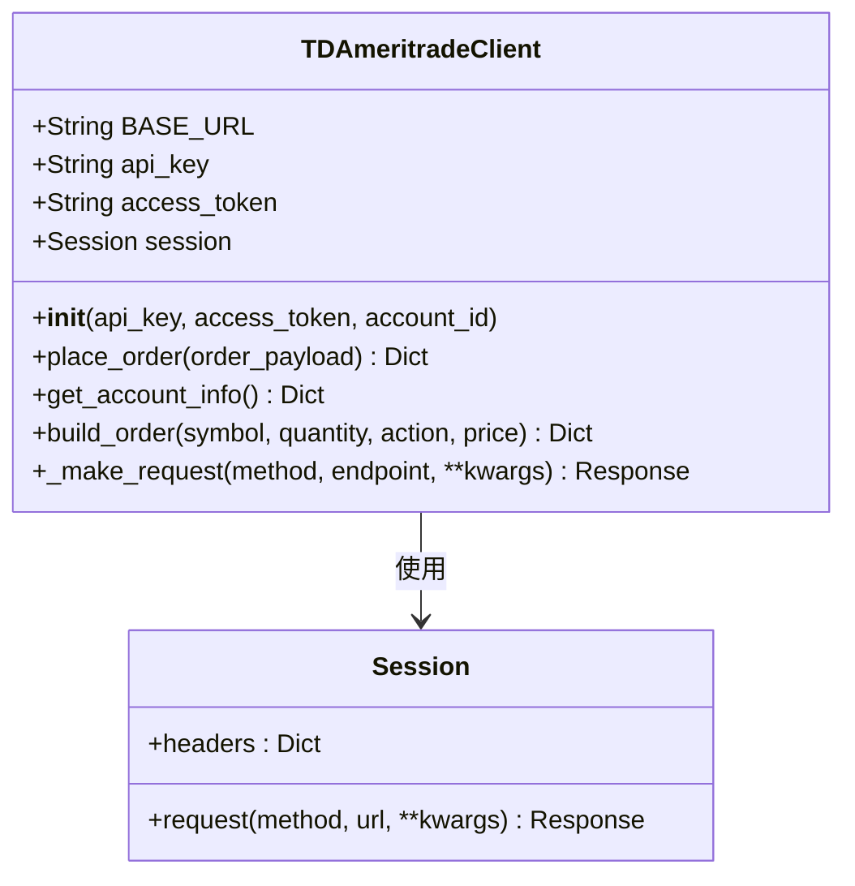

**图表来源**
- [td_ameritrade.py](file://autohedge/tools/td_ameritrade.py#L14-L61)

### 核心功能特性

#### 1. 重试机制设计

TD Ameritrade 包装器内置了智能重试机制，应对网络不稳定和API限制：

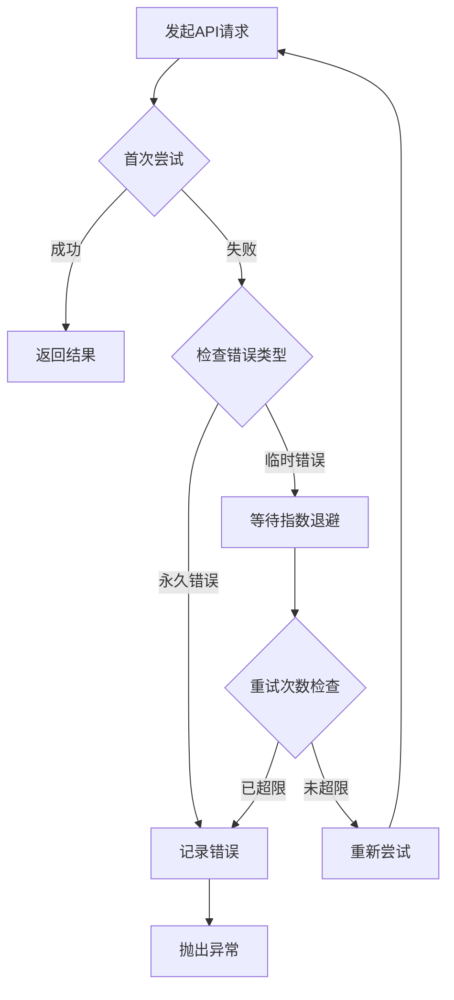

**图表来源**
- [td_ameritrade.py](file://autohedge/tools/td_ameritrade.py#L58-L92)

#### 2. 订单构建器

订单构建器提供了灵活的订单参数配置：

| 参数 | 类型 | 描述 | 默认值 |
|------|------|------|--------|
| symbol | String | 股票代码 | 必需 |
| quantity | Integer | 交易数量 | 必需 |
| action | String | 买卖方向 | BUY/SELL |
| price | Float | 限价价格 | 可选 |
| orderType | String | 订单类型 | MARKET/LIMIT |
| duration | String | 有效期 | DAY |
| session | String | 交易时段 | NORMAL |

#### 3. 错误处理策略

系统实现了多层次的错误处理：

- **HTTP 状态码处理**：自动识别和处理各种HTTP错误
- **网络异常捕获**：处理连接超时和网络中断
- **API 限制应对**：智能等待和重试机制
- **数据验证**：确保请求参数的有效性

**章节来源**
- [td_ameritrade.py](file://autohedge/tools/td_ameritrade.py#L1-L209)

## Trade Station 平台集成

### API 设计理念

Trade Station 集成采用了函数式编程风格，提供简洁的订单确认接口。

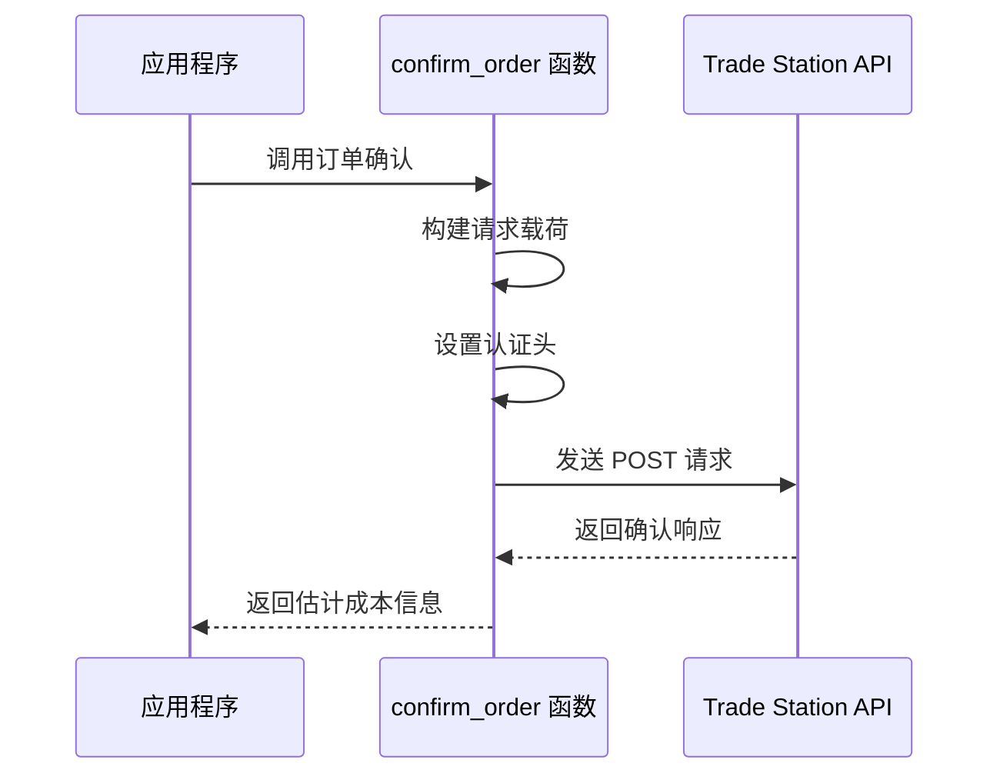

**图表来源**
- [trade_station.py](file://autohedge/tools/trade_station.py#L7-L170)

### 核心功能特点

#### 1. 订单确认机制

Trade Station 的独特之处在于其订单确认功能，允许用户在实际下单前获得详细的费用估算：

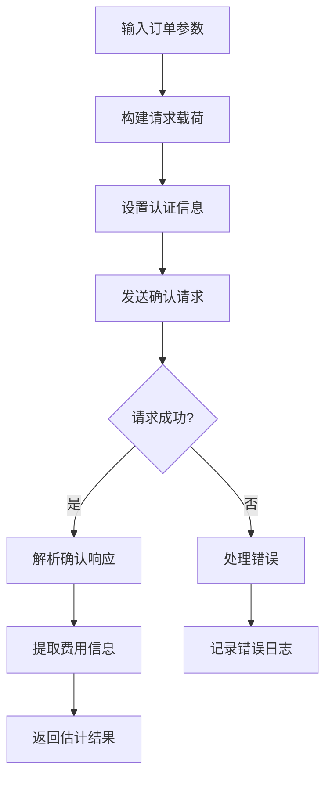

**图表来源**
- [trade_station.py](file://autohedge/tools/trade_station.py#L154-L170)

#### 2. 支持的订单类型

| 订单类型 | 描述 | 特点 |
|----------|------|------|
| Market | 市价单 | 立即执行，价格不确定 |
| Limit | 限价单 | 限定价格，可能不成交 |
| StopMarket | 停止单 | 达到止损价时转市价 |
| StopLimit | 停止限价单 | 达到止损价时转限价 |

#### 3. 高级参数配置

Trade Station 支持丰富的订单参数配置：

- **时间在场**：定义订单的有效期限
- **路由选项**：选择最优执行路径
- **高级选项**：复杂的组合订单策略
- **购买力警告**：保证金账户的风险提示

**章节来源**
- [trade_station.py](file://autohedge/tools/trade_station.py#L1-L187)

## 统一接口设计

### 抽象层架构

为了实现多平台的统一管理，autoHedge 设计了标准化的接口抽象层：

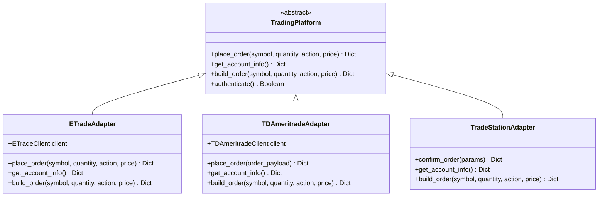

**图表来源**
- [main.py](file://autohedge/main.py#L422-L583)
- [api.py](file://api/api.py#L259-L288)

### 接口一致性保证

#### 1. 标准化方法签名

所有平台都实现了相同的方法签名，确保调用的一致性：

| 方法名 | 参数 | 返回值 | 平台兼容性 |
|--------|------|--------|------------|
| place_order | symbol, quantity, action, price | Dict | 全部支持 |
| get_account_info | - | Dict | 全部支持 |
| build_order | symbol, quantity, action, price | Dict | 全部支持 |

#### 2. 异常处理标准化

系统定义了统一的异常处理机制：

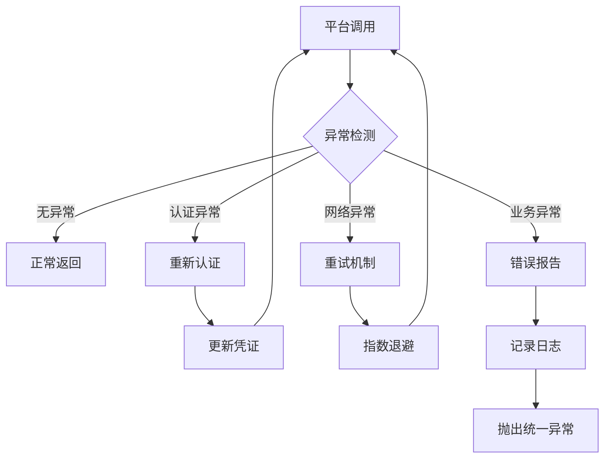

**章节来源**
- [main.py](file://autohedge/main.py#L477-L583)

## 配置管理

### 环境变量配置

autoHedge 使用环境变量进行平台配置管理，支持开发和生产环境的灵活切换。

#### E*TRADE 配置

```bash
# E*TRADE 认证配置
ETRADE_CONSUMER_KEY=your_consumer_key
ETRADE_CONSUMER_SECRET=your_consumer_secret
ETRADE_OAUTH_TOKEN=your_oauth_token
ETRADE_OAUTH_TOKEN_SECRET=your_oauth_secret
ETRADE_ACCOUNT_ID=your_account_id
```

#### TD Ameritrade 配置

```bash
# TD Ameritrade 认证配置
TD_API_KEY=your_api_key
TD_ACCESS_TOKEN=your_access_token
TD_ACCOUNT_ID=your_account_id
```

#### Trade Station 配置

```bash
# Trade Station 认证配置
TRADE_STATION_TOKEN=your_bearer_token
TRADE_STATION_ACCOUNT_ID=your_account_id
```

### 配置验证机制

系统在启动时会验证所有必需的配置项：

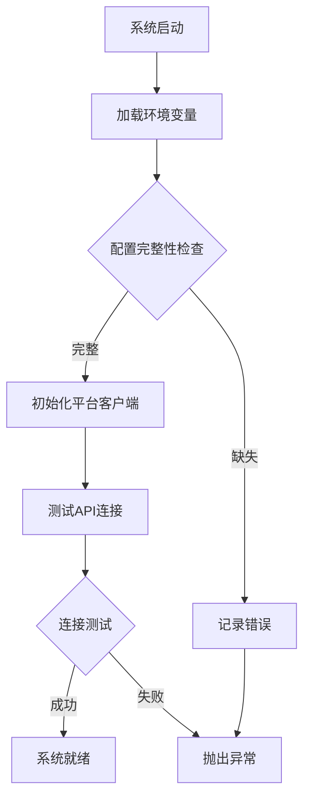

**图表来源**
- [e_trade_wrapper.py](file://autohedge/tools/e_trade_wrapper.py#L32-L44)
- [td_ameritrade.py](file://autohedge/tools/td_ameritrade.py#L40-L53)

**章节来源**
- [e_trade_wrapper.py](file://autohedge/tools/e_trade_wrapper.py#L24-L39)
- [td_ameritrade.py](file://autohedge/tools/td_ameritrade.py#L34-L45)

## 错误处理与故障排除

### 常见问题诊断

#### 1. 认证相关问题

| 问题类型 | 症状 | 解决方案 |
|----------|------|----------|
| 凭证过期 | 401 Unauthorized | 更新OAuth令牌或API密钥 |
| IP 限制 | 403 Forbidden | 检查白名单设置 |
| 权限不足 | 403 Forbidden | 验证账户权限级别 |
| 格式错误 | 400 Bad Request | 检查认证参数格式 |

#### 2. 网络连接问题

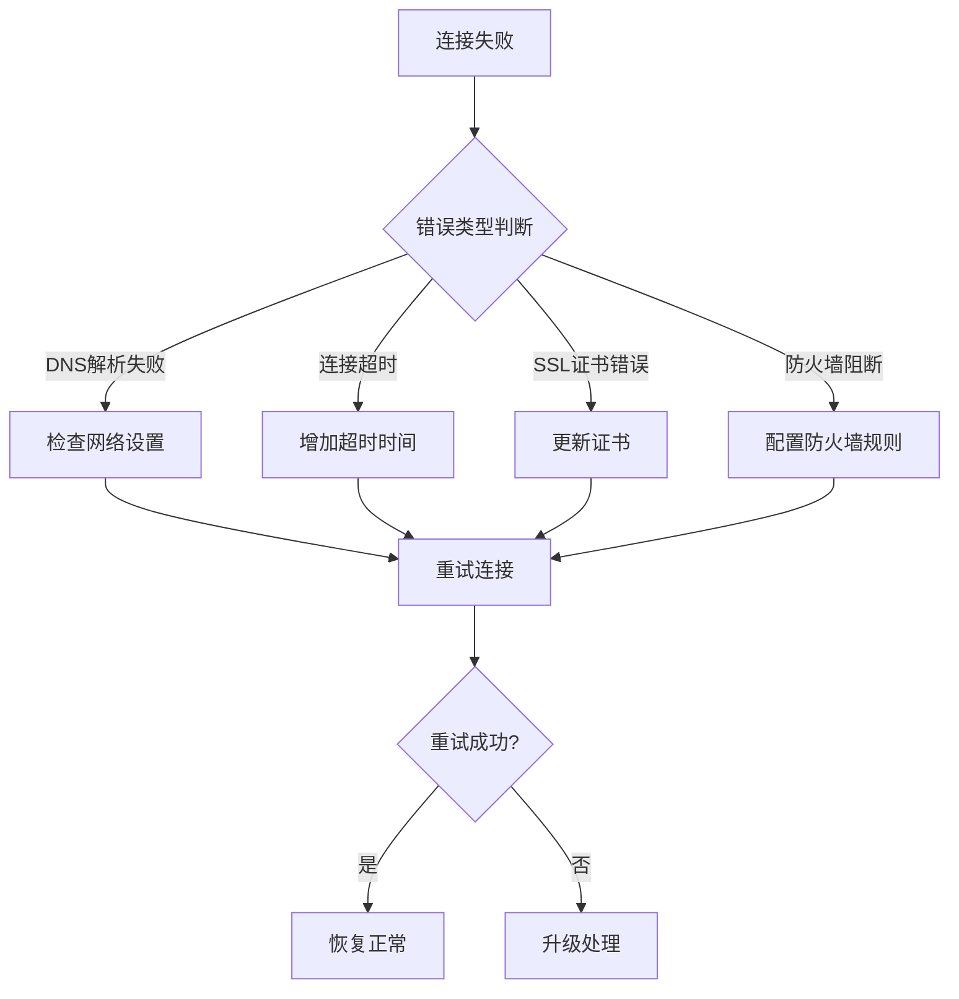

#### 3. API 限制应对

不同平台有不同的速率限制策略：

- **E*TRADE**：基于OAuth令牌的频率限制
- **TD Ameritrade**：基于API密钥的请求限制
- **Trade Station**：基于账户级别的并发限制

### 故障恢复策略

#### 自动重试机制

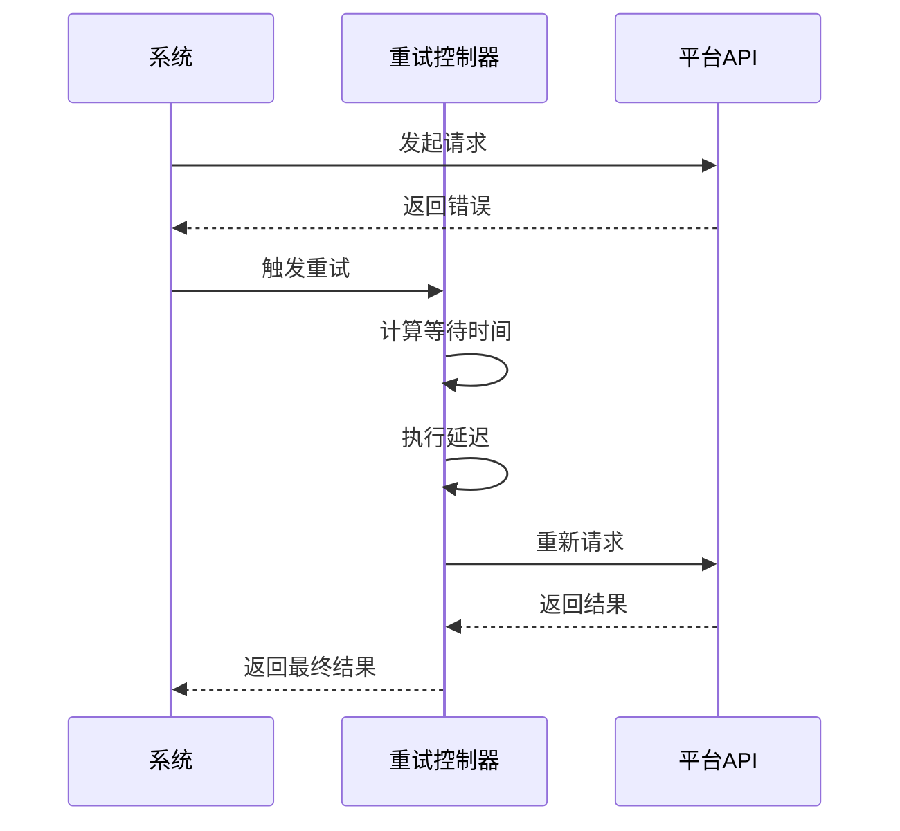

**图表来源**
- [td_ameritrade.py](file://autohedge/tools/td_ameritrade.py#L58-L92)

#### 监控和告警

系统提供了完善的监控机制：

- **实时状态监控**：跟踪各平台的健康状态
- **性能指标收集**：记录API响应时间和成功率
- **异常事件告警**：及时通知系统管理员
- **日志审计**：完整的操作记录和回溯能力

**章节来源**
- [e_trade_wrapper.py](file://autohedge/tools/e_trade_wrapper.py#L92-L104)
- [td_ameritrade.py](file://autohedge/tools/td_ameritrade.py#L85-L92)

## 性能优化建议

### 1. 连接池管理

对于高频率交易场景，建议启用连接池以提高性能：

```python
# 示例：连接池配置
import requests
from requests.adapters import HTTPAdapter
from urllib3.util.retry import Retry

session = requests.Session()
retry_strategy = Retry(
    total=3,
    backoff_factor=1,
    status_forcelist=[429, 500, 502, 503, 504],
)
adapter = HTTPAdapter(
    pool_connections=10,
    pool_maxsize=20,
    max_retries=retry_strategy
)
session.mount("https://", adapter)
```

### 2. 缓存策略

实施智能缓存机制减少API调用：

- **账户信息缓存**：缓存账户余额和持仓信息
- **市场数据缓存**：缓存股票报价和交易量数据
- **配置信息缓存**：缓存平台配置和用户偏好

### 3. 并发优化

利用异步编程提高系统吞吐量：

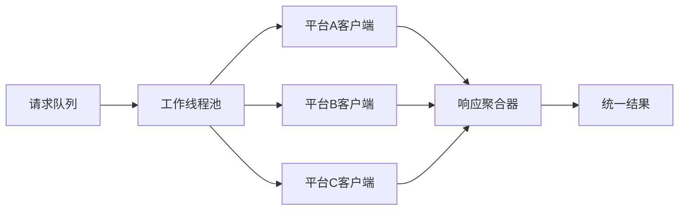

### 4. 监控指标

关键性能指标监控：

| 指标类别 | 具体指标 | 目标值 |
|----------|----------|--------|
| 响应时间 | API平均响应时间 | < 2秒 |
| 可用性 | 系统可用率 | > 99.9% |
| 吞吐量 | 每秒请求数 | > 100 RPS |
| 错误率 | API错误率 | < 0.1% |

## 扩展新平台指南

### 开发步骤

#### 1. 实现基础接口

创建新的平台适配器类，继承通用接口：

```python
class NewPlatformAdapter:
    def __init__(self, config):
        # 初始化配置和认证
        pass
    
    def place_order(self, symbol, quantity, action, price):
        # 实现下单逻辑
        pass
    
    def get_account_info(self):
        # 实现账户信息获取
        pass
    
    def build_order(self, symbol, quantity, action, price):
        # 实现订单构建
        pass
```

#### 2. 认证集成

根据平台要求实现相应的认证机制：

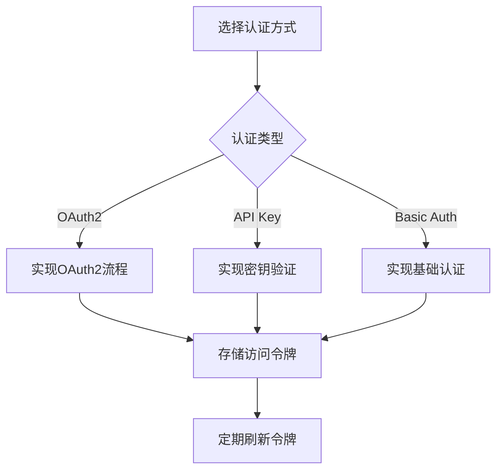

#### 3. 测试验证

实施全面的测试套件：

- **单元测试**：验证各个方法的功能正确性
- **集成测试**：测试与主系统的集成效果
- **压力测试**：评估系统在高负载下的表现
- **兼容性测试**：确保向后兼容性

### 最佳实践

#### 1. 错误处理规范

- 实现统一的异常类型
- 提供详细的错误信息
- 支持错误恢复机制
- 记录完整的错误日志

#### 2. 性能考虑

- 实施连接池管理
- 优化API调用频率
- 使用异步编程模式
- 实现智能缓存策略

#### 3. 文档维护

- 编写详细的API文档
- 提供示例代码
- 维护变更日志
- 更新用户指南

**章节来源**
- [main.py](file://autohedge/main.py#L422-L583)

## 总结

autoHedge 的交易平台集成功为自动化交易系统提供了强大而灵活的基础架构。通过统一的接口设计和模块化的平台适配器，系统成功地整合了E*TRADE、TD Ameritrade和Trade Station三大主流交易平台。

### 主要优势

1. **统一的用户体验**：无论使用哪个平台，用户都能获得一致的操作体验
2. **强大的错误处理**：完善的异常处理和重试机制确保系统稳定性
3. **灵活的配置管理**：支持多种认证方式和环境配置
4. **可扩展的架构**：易于添加新的交易平台支持

### 技术特色

- **多认证协议支持**：OAuth1.0a、OAuth2.0和API密钥认证
- **智能重试机制**：基于指数退避的智能重试策略
- **实时性能监控**：全面的系统监控和性能指标
- **标准化接口**：统一的API设计确保互操作性

### 应用价值

autoHedge 的交易平台集成不仅简化了多平台交易的复杂性，更为构建复杂的量化交易策略提供了坚实的技术基础。通过持续的优化和扩展，该系统能够适应不断变化的市场需求和技术发展。