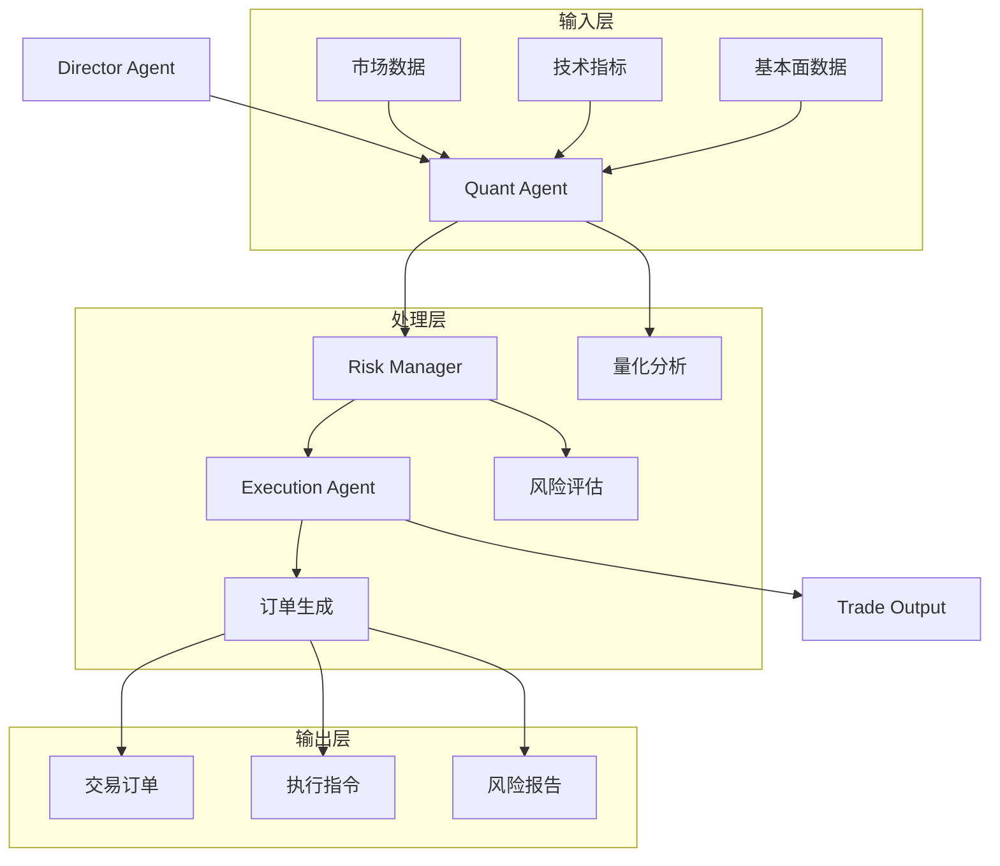
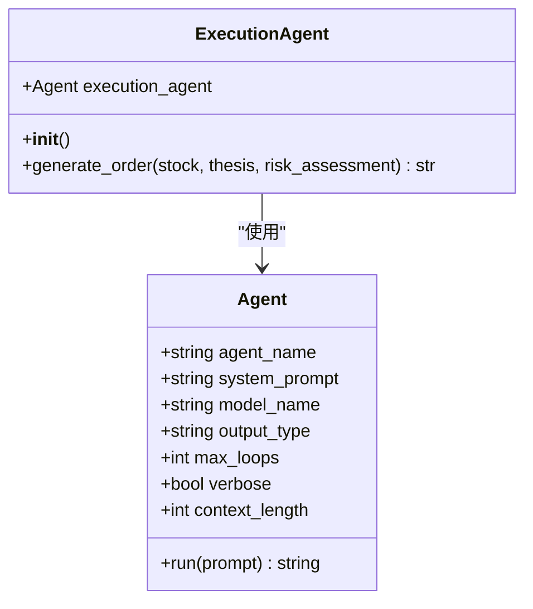
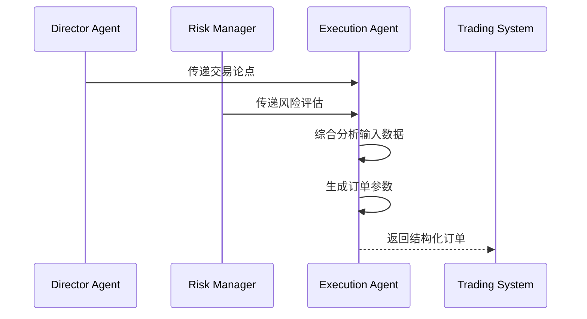
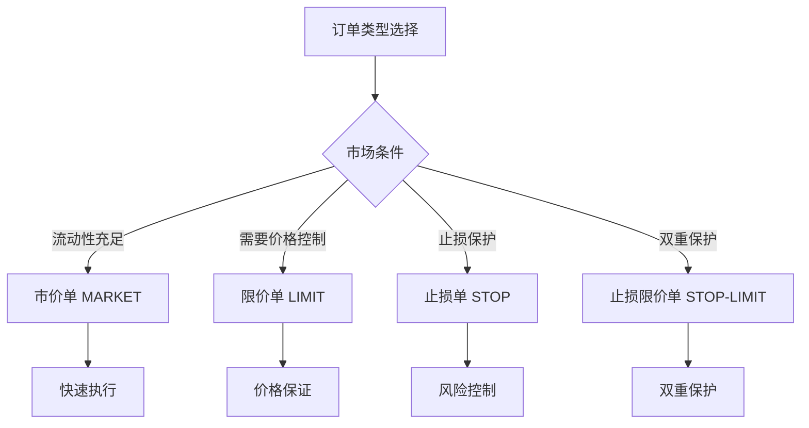
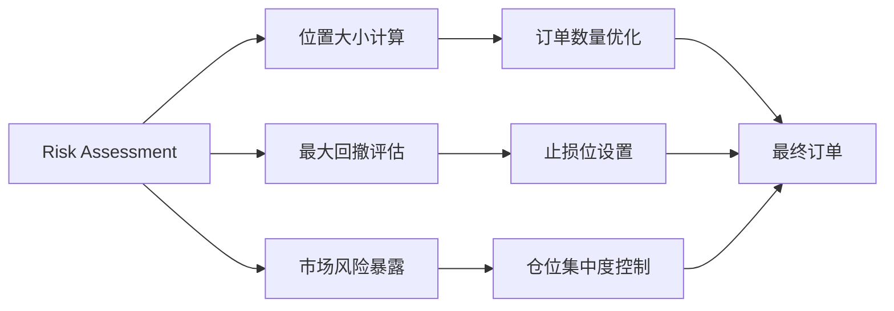
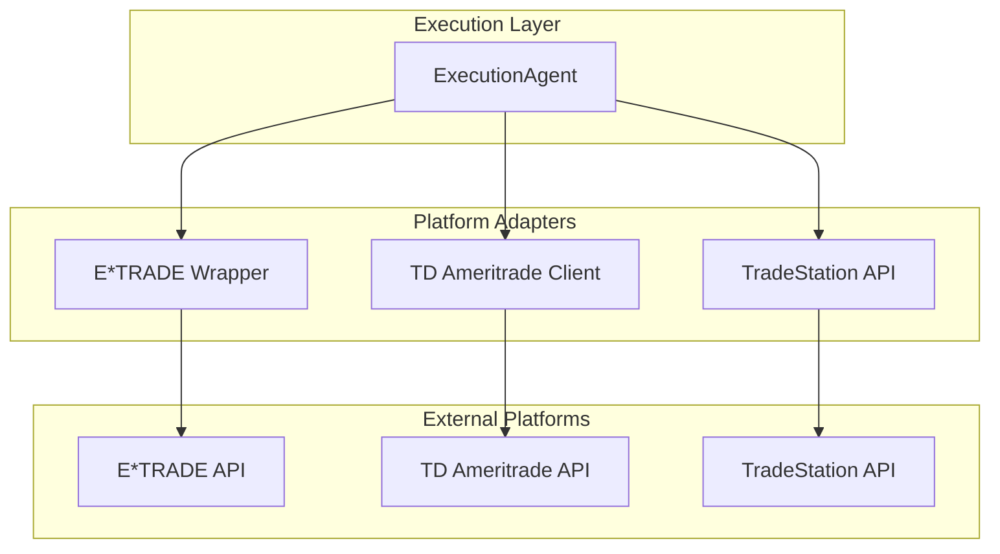
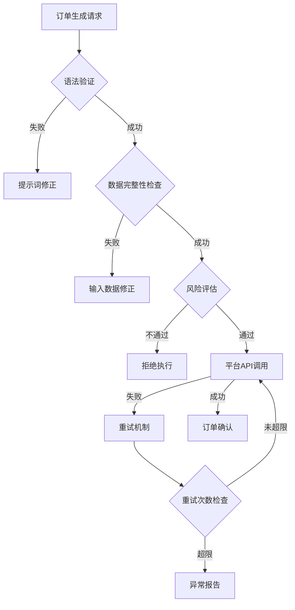
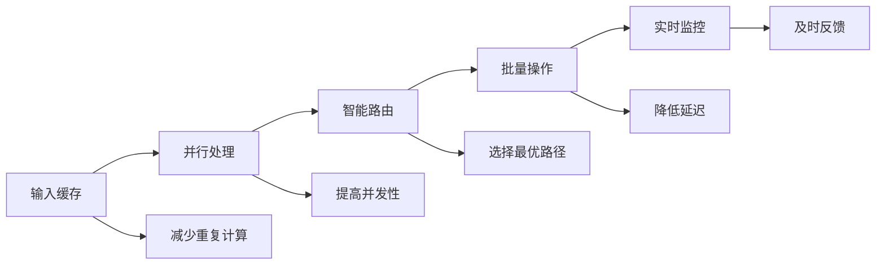

# 交易指令生成与执行

<cite>
**本文档中引用的文件**
- [autohedge/main.py](file://autohedge/main.py)
- [autohedge/tools/e_trade_wrapper.py](file://autohedge/tools/e_trade_wrapper.py)
- [autohedge/tools/td_ameritrade.py](file://autohedge/tools/td_ameritrade.py)
- [autohedge/tools/trade_station.py](file://autohedge/tools/trade_station.py)
- [experimental/crypto_agent_wrapper.py](file://experimental/crypto_agent_wrapper.py)
- [README.md](file://README.md)
</cite>

## 目录
1. [简介](#简介)
2. [系统架构概览](#系统架构概览)
3. [ExecutionAgent核心组件](#executionagent核心组件)
4. [订单生成机制详解](#订单生成机制详解)
5. [订单类型与参数设计](#订单类型与参数设计)
6. [风险评估与订单优化](#风险评估与订单优化)
7. [交易平台集成](#交易平台集成)
8. [异常处理机制](#异常处理机制)
9. [性能优化与最佳实践](#性能优化与最佳实践)
10. [扩展与定制指南](#扩展与定制指南)
11. [总结](#总结)

## 简介

AutoHedge是一个基于多智能体架构的自动化交易系统，其中ExecutionAgent扮演着将风险评估结果转化为可执行交易订单的关键角色。该系统通过AI驱动的决策流程，实现了从市场分析到订单执行的完整自动化交易闭环。

ExecutionAgent的核心职责是将来自Director Agent的交易论点和Risk Manager的风险评估数据转化为结构化的交易指令，确保每笔交易都符合预设的风险管理和执行策略。

## 系统架构概览

AutoHedge采用分层的多智能体架构，每个组件都有明确的专业分工：



**图表来源**
- [autohedge/main.py](file://autohedge/main.py#L242-L583)

**章节来源**
- [autohedge/main.py](file://autohedge/main.py#L1-L50)
- [README.md](file://README.md#L70-L120)

## ExecutionAgent核心组件

### 执行代理初始化

ExecutionAgent继承自Swarm框架的Agent类，具有以下核心特性：



**图表来源**
- [autohedge/main.py](file://autohedge/main.py#L210-L240)

### 提示词设计原则

ExecutionAgent的提示词设计遵循以下核心原则：

1. **精确性原则**：要求提供确切的交易执行细节
2. **结构化输出**：强制使用结构化格式返回结果
3. **风险管理优先**：强调最优利润潜力和风险管理
4. **时间约束**：明确指定交易的时间框架

**章节来源**
- [autohedge/main.py](file://autohedge/main.py#L190-L207)

## 订单生成机制详解

### generate_order()方法实现

ExecutionAgent的订单生成功能通过`generate_order()`方法实现，该方法接收三个核心输入参数：



**图表来源**
- [autohedge/main.py](file://autohedge/main.py#L222-L239)

### 输入数据整合

订单生成过程整合了以下关键信息：

| 输入组件 | 数据内容 | 用途 |
|---------|---------|------|
| 股票代码 | 标准股票符号 | 确定交易标的 |
| 交易论点 | 市场观点和策略 | 指导交易方向 |
| 风险评估 | 位置大小和风险指标 | 控制仓位和风险 |

**章节来源**
- [autohedge/main.py](file://autohedge/main.py#L222-L239)

## 订单类型与参数设计

### 支持的订单类型

系统支持多种订单类型，每种类型都有特定的应用场景：



### 关键订单参数

订单生成器会确定以下核心参数：

| 参数类别 | 具体参数 | 描述 | 示例值 |
|---------|---------|------|--------|
| 基础信息 | 股票符号 | 交易标的代码 | "NVDA" |
| 数量参数 | 交易数量 | 股票数量 | 100 |
| 价格参数 | 入场价格 | 开仓价格 | 150.00 |
| 风险参数 | 止损价 | 最大亏损限制 | 145.00 |
| 风险参数 | 止盈价 | 目标盈利水平 | 160.00 |
| 时间参数 | 时效限制 | 订单有效期 | "DAY" |

**章节来源**
- [autohedge/tools/td_ameritrade.py](file://autohedge/tools/td_ameritrade.py#L131-L174)
- [autohedge/tools/e_trade_wrapper.py](file://autohedge/tools/e_trade_wrapper.py#L53-L90)
- [autohedge/tools/trade_station.py](file://autohedge/tools/trade_station.py#L7-L186)

## 风险评估与订单优化

### 风险参数整合

ExecutionAgent在生成订单时会深度整合风险评估数据：



**图表来源**
- [autohedge/main.py](file://autohedge/main.py#L122-L156)

### 位置大小管理

系统通过以下公式计算最优位置大小：

```
位置大小 = (可用资金 × 风险承受比例) ÷ 单股最大回撤
```

这种动态调整机制确保每次交易的风险都在可控范围内。

**章节来源**
- [autohedge/main.py](file://autohedge/main.py#L122-L156)

## 交易平台集成

### 多平台支持架构

AutoHedge支持多个主流交易平台，每个平台都有专门的适配器：



**图表来源**
- [autohedge/tools/e_trade_wrapper.py](file://autohedge/tools/e_trade_wrapper.py#L11-L174)
- [autohedge/tools/td_ameritrade.py](file://autohedge/tools/td_ameritrade.py#L14-L209)
- [autohedge/tools/trade_station.py](file://autohedge/tools/trade_station.py#L1-L187)

### 平台特定订单构建

不同平台的订单构建方式略有差异：

| 平台 | 订单类型 | 特殊参数 | 时间约束 |
|------|---------|---------|---------|
| E*TRADE | MARKET/LIMIT | limitPrice | GOOD_FOR_DAY |
| TD Ameritrade | SINGLE | price | DAY |
| TradeStation | 多种类型 | StopPrice, LimitPrice | Duration |

**章节来源**
- [autohedge/tools/e_trade_wrapper.py](file://autohedge/tools/e_trade_wrapper.py#L53-L90)
- [autohedge/tools/td_ameritrade.py](file://autohedge/tools/td_ameritrade.py#L131-L174)
- [autohedge/tools/trade_station.py](file://autohedge/tools/trade_station.py#L7-L186)

## 异常处理机制

### 分层异常处理

系统采用分层的异常处理策略：



### 错误恢复策略

系统实现了多种错误恢复机制：

1. **自动重试**：对于临时性网络错误
2. **降级处理**：当高级功能不可用时使用基础功能
3. **异常隔离**：防止单个错误影响整个交易流程
4. **日志记录**：详细的错误日志便于问题诊断

**章节来源**
- [autohedge/tools/td_ameritrade.py](file://autohedge/tools/td_ameritrade.py#L58-L92)
- [autohedge/tools/trade_station.py](file://autohedge/tools/trade_station.py#L150-L174)

## 性能优化与最佳实践

### 执行效率优化

为了提升订单生成和执行的效率，系统采用了以下优化策略：



### 最佳实践建议

1. **提示词优化**：保持提示词简洁明确，避免歧义
2. **参数验证**：在生成订单前严格验证所有输入参数
3. **监控告警**：建立完善的监控和告警机制
4. **测试验证**：在生产环境前进行充分的模拟测试

### 性能指标监控

关键性能指标包括：

| 指标 | 目标值 | 监控方法 |
|------|-------|---------|
| 订单生成时间 | < 2秒 | 内置计时器 |
| 执行成功率 | > 95% | 自动统计 |
| 响应延迟 | < 500ms | 实时监控 |
| 错误率 | < 1% | 日志分析 |

**章节来源**
- [autohedge/main.py](file://autohedge/main.py#L477-L583)

## 扩展与定制指南

### 添加新订单类型

要扩展支持新的订单类型，需要：

1. **更新提示词**：添加新订单类型的说明
2. **修改订单构建函数**：添加相应的参数处理
3. **更新平台适配器**：支持新类型的API调用
4. **增加验证逻辑**：确保参数有效性

### 自定义配置选项

系统提供了灵活的配置选项：

```python
# 自定义ExecutionAgent配置
execution_agent = ExecutionAgent(
    model_name="custom-model",
    max_loops=2,
    verbose=True,
    context_length=32000
)
```

### 第三方平台集成

集成新交易平台的步骤：

1. **创建适配器类**：继承基础客户端接口
2. **实现订单构建**：转换为平台特定格式
3. **添加错误处理**：处理平台特有的异常
4. **编写测试用例**：确保功能正确性

**章节来源**
- [autohedge/tools/e_trade_wrapper.py](file://autohedge/tools/e_trade_wrapper.py#L11-L174)
- [autohedge/tools/td_ameritrade.py](file://autohedge/tools/td_ameritrade.py#L14-L209)

## 总结

AutoHedge的ExecutionAgent代表了现代算法交易系统的核心创新。通过将复杂的AI决策转化为精确的交易指令，它实现了：

1. **智能化订单生成**：基于多维度数据分析的自动化订单创建
2. **风险导向的执行**：将风险评估深度整合到订单参数中
3. **多平台兼容性**：支持主流交易平台的无缝集成
4. **高可靠性保障**：完善的异常处理和错误恢复机制
5. **持续优化能力**：支持功能扩展和性能改进

这种设计不仅提高了交易执行的准确性和效率，还为未来的功能扩展和系统优化奠定了坚实的基础。随着AI技术的不断发展，ExecutionAgent将继续演进，为用户提供更加智能和可靠的交易解决方案。