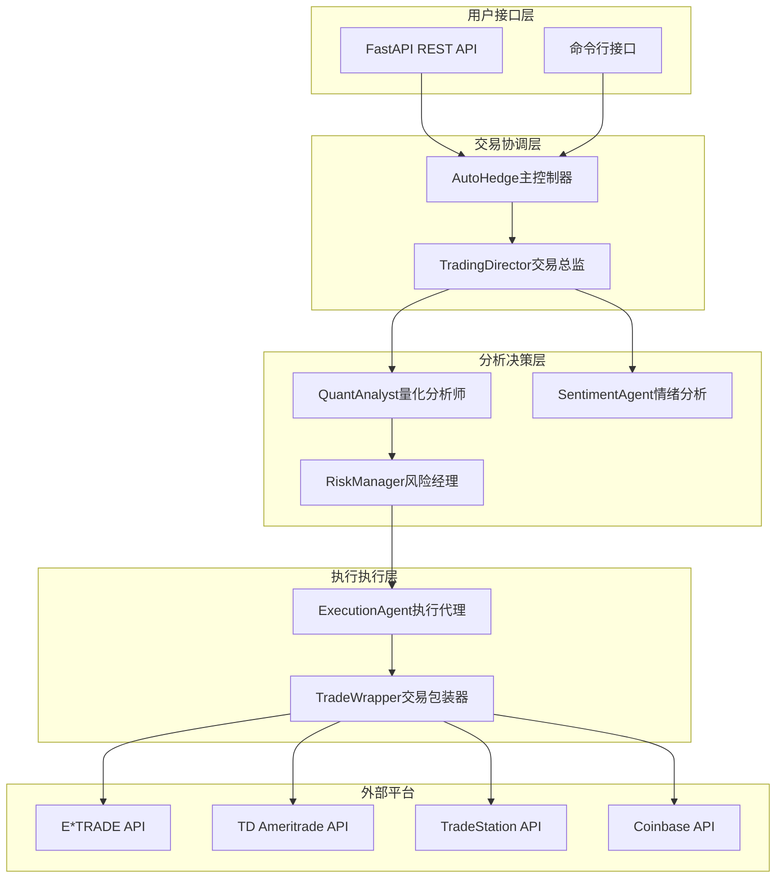
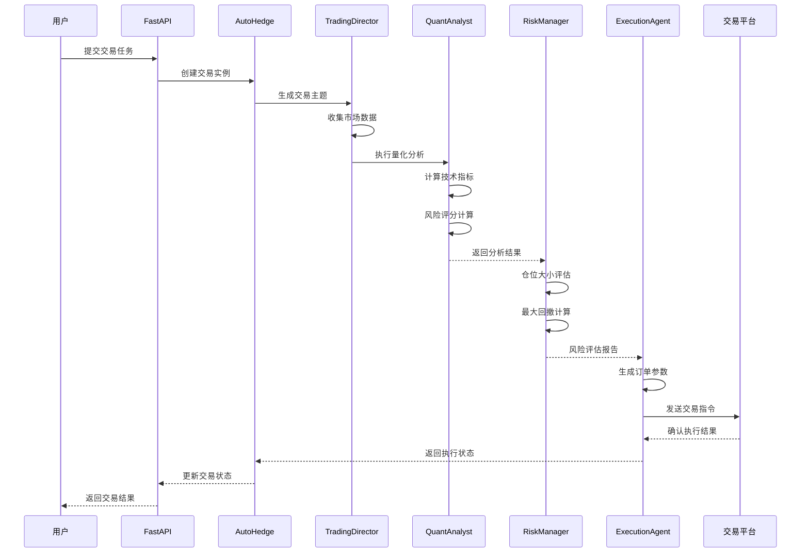
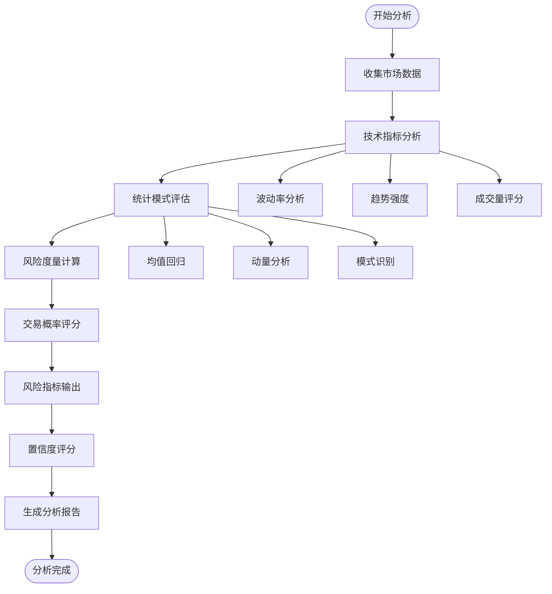
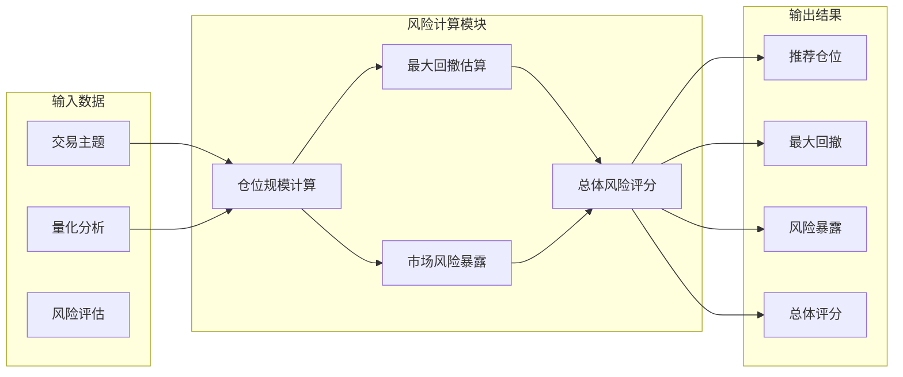
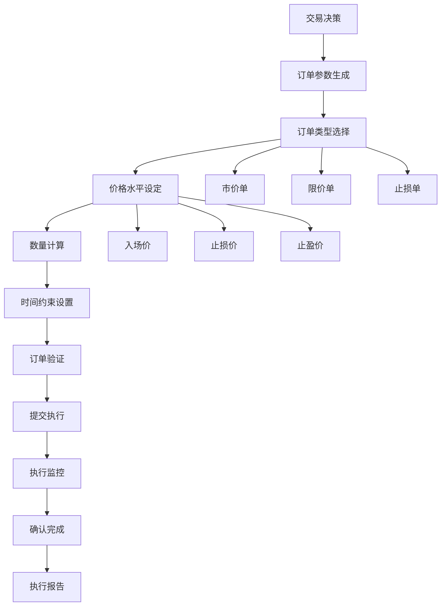
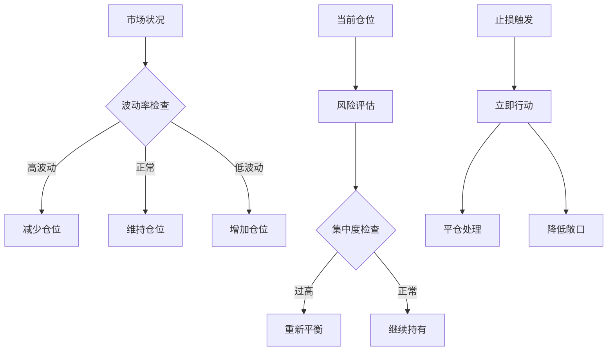
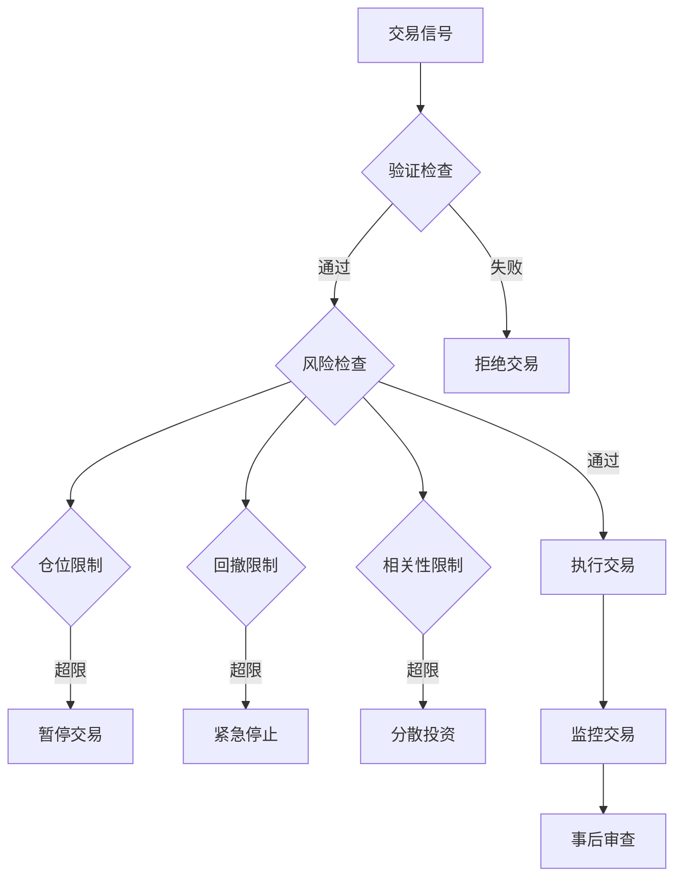
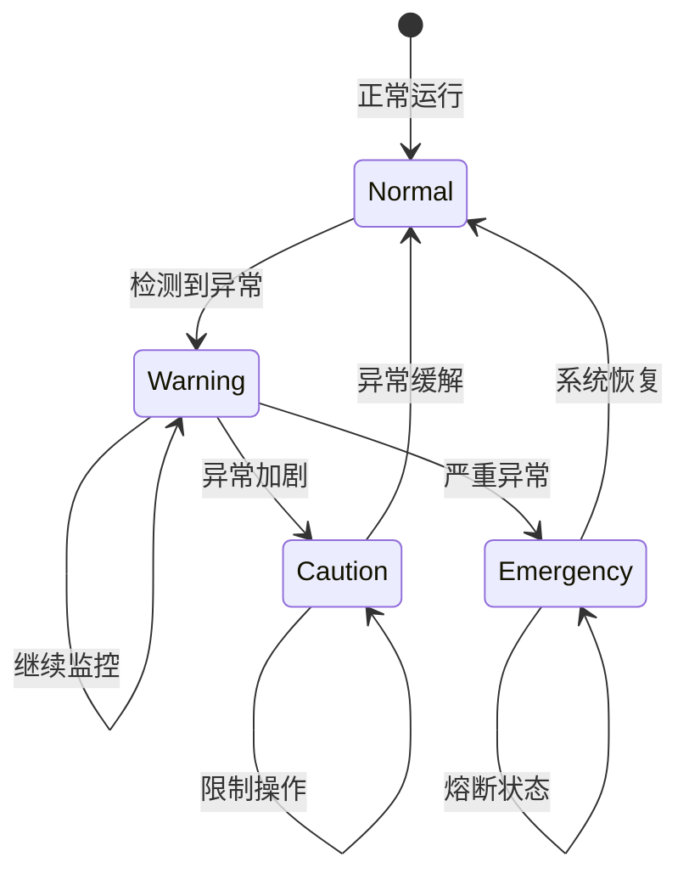

# 交易流程与风险管理

<cite>
**本文档中引用的文件**
- [autohedge/main.py](file://autohedge/main.py)
- [autohedge/__init__.py](file://autohedge/__init__.py)
- [api/api.py](file://api/api.py)
- [example.py](file://example.py)
- [autohedge/tools/e_trade_wrapper.py](file://autohedge/tools/e_trade_wrapper.py)
- [autohedge/tools/td_ameritrade.py](file://autohedge/tools/td_ameritrade.py)
- [autohedge/tools/trade_station.py](file://autohedge/tools/trade_station.py)
- [experimental/btc_agent.py](file://experimental/btc_agent.py)
- [experimental/crypto_agent_wrapper.py](file://experimental/crypto_agent_wrapper.py)
- [experimental/market_making.py](file://experimental/market_making.py)
- [requirements.txt](file://requirements.txt)
</cite>

## 目录
1. [系统概述](#系统概述)
2. [核心组件架构](#核心组件架构)
3. [交易执行流程](#交易执行流程)
4. [QuantAnalyst信号生成](#quantanalyst信号生成)
5. [RiskManager风险评估](#riskmanager风险评估)
6. [ExecutionAgent订单执行](#executionagent订单执行)
7. [风险控制机制](#风险控制机制)
8. [异常处理与熔断逻辑](#异常处理与熔断逻辑)
9. [API接口设计](#api接口设计)
10. [配置与扩展指南](#配置与扩展指南)
11. [总结](#总结)

## 系统概述

autoHedge是一个完全自动化的交易系统，采用多智能体协作架构，通过人工智能代理实现从市场信号检测到最终下单的全流程自动化交易。该系统具备强大的风险管理能力和灵活的扩展性，支持多种交易平台集成。

### 主要特性

- **多智能体协作**：TradingDirector、QuantAnalyst、RiskManager、ExecutionAgent协同工作
- **实时市场分析**：集成多种数据源和分析工具
- **智能风险管理**：动态仓位调整和风险监控
- **多平台支持**：支持E*TRADE、TD Ameritrade、TradeStation等交易平台
- **RESTful API**：提供完整的交易管理接口
- **实验性功能**：包含加密货币交易和做市策略

## 核心组件架构

autoHedge系统采用分层架构设计，主要包含以下核心组件：



**图表来源**
- [autohedge/main.py](file://autohedge/main.py#L422-L583)
- [api/api.py](file://api/api.py#L130-L476)

**章节来源**
- [autohedge/main.py](file://autohedge/main.py#L422-L583)
- [api/api.py](file://api/api.py#L130-L476)

## 交易执行流程

autoHedge的交易执行遵循严格的流程控制，确保每个环节都有充分的风险评估和决策支持。

### 完整交易生命周期



**图表来源**
- [autohedge/main.py](file://autohedge/main.py#L477-L583)
- [api/api.py](file://api/api.py#L248-L311)

### 流程详解

#### 1. 任务初始化阶段
系统接收用户提交的交易任务，解析股票列表和交易目标，初始化各个智能体组件。

#### 2. 市场主题生成
TradingDirector负责生成全面的市场分析主题，包括：
- 技术面分析（趋势、支撑阻力、成交量）
- 基本面因素评估
- 宏观经济环境分析
- 行业对比研究

#### 3. 量化分析执行
QuantAnalyst进行深度的技术和统计分析：
- **技术指标分析**：移动平均线、RSI、布林带等
- **统计模式识别**：均值回归、动量策略、波动率分析
- **风险度量计算**：VaR、预期损失、希腊字母
- **交易成功概率**：基于历史数据分析的概率评分

#### 4. 风险评估阶段
RiskManager综合评估交易风险：
- **仓位规模确定**：基于资金管理和风险承受能力
- **潜在回撤计算**：最大可能损失预测
- **市场风险因子**：波动性、流动性、市场情绪
- **相关性风险**：不同资产间的关联性分析

#### 5. 订单生成与执行
ExecutionAgent根据分析结果生成精确的交易指令：
- **订单类型选择**：市价单、限价单、止损单等
- **价格水平设定**：入场点、出场点、止损点
- **时间约束定义**：有效期限、成交条件
- **特殊要求处理**：冰山委托、时间加权平均价格等

**章节来源**
- [autohedge/main.py](file://autohedge/main.py#L477-L583)

## QuantAnalyst信号生成

QuantAnalyst是系统的核心分析引擎，负责生成高质量的交易信号和风险评估。

### 分析框架



**图表来源**
- [autohedge/main.py](file://autohedge/main.py#L356-L421)

### 关键分析指标

| 指标类别 | 具体指标 | 计算方法 | 权重 |
|---------|---------|---------|------|
| 技术评分 | 移动平均线交叉 | MA(20) vs MA(50) | 25% |
| 技术评分 | RSI相对强弱指数 | RSI(14) > 70/30 | 20% |
| 技术评分 | 布林带位置 | 当前价相对于布林带 | 15% |
| 成交量评分 | 相对成交量 | 当前成交量/平均成交量 | 15% |
| 趋势强度 | 趋势线斜率 | 线性回归斜率 | 15% |
| 波动率 | 历史波动率 | 标准差计算 | 10% |

### 信号生成逻辑

QuantAnalyst采用多维度评分体系生成交易信号：

1. **技术信号权重**：基于技术指标的强弱程度
2. **成交量确认**：成交量是否支持价格走势
3. **趋势一致性**：短期和长期趋势是否一致
4. **市场环境**：宏观经济和行业环境影响
5. **历史概率**：类似条件下的历史胜率

**章节来源**
- [autohedge/main.py](file://autohedge/main.py#L356-L421)

## RiskManager风险评估

RiskManager负责全面的风险评估和仓位管理，确保交易在可接受的风险范围内进行。

### 风险评估框架



**图表来源**
- [autohedge/main.py](file://autohedge/main.py#L159-L188)

### 风险控制参数

| 参数类型 | 计算公式 | 默认值 | 说明 |
|---------|---------|--------|------|
| 仓位规模 | (可用资金 × 风险系数) / 单位风险 | 2% | 每笔交易最大风险敞口 |
| 最大回撤 | 基于历史波动率计算 | 15% | 单笔交易最大允许回撤 |
| 止损距离 | 技术分析确定的止损点 | 2% | 固定或动态止损 |
| 止盈目标 | 风险回报比设定 | 2:1 | 盈利目标与亏损容忍度 |
| 头寸集中度 | 单个头寸占总资金比例 | 10% | 防止过度集中风险 |

### 动态风险调整

RiskManager实现了智能的风险调整机制：

1. **波动率适应**：根据市场波动性动态调整仓位
2. **流动性考虑**：低流动性证券降低仓位规模
3. **相关性管理**：避免高度相关的多头持仓
4. **时间衰减**：临近重要事件时降低仓位

**章节来源**
- [autohedge/main.py](file://autohedge/main.py#L159-L188)

## ExecutionAgent订单执行

ExecutionAgent负责将智能决策转化为具体的交易指令，并确保执行的准确性和及时性。

### 订单执行流程



**图表来源**
- [autohedge/main.py](file://autohedge/main.py#L190-L239)

### 多平台适配

系统支持多个交易平台的统一接口：

#### E*TRADE集成
- **认证方式**：OAuth1.0a授权
- **订单类型**：市价单、限价单、止损单
- **账户管理**：多账户支持
- **错误处理**：重试机制和异常恢复

#### TD Ameritrade集成
- **API版本**：v1 REST API
- **认证方式**：Bearer Token
- **高级功能**：期权交易、保证金账户
- **可靠性**：指数退避重试

#### TradeStation集成
- **确认机制**：订单预确认功能
- **复杂订单**：OCO（互斥订单）支持
- **高级选项**：时间加权平均价格等
- **实时数据**：市场深度信息

**章节来源**
- [autohedge/main.py](file://autohedge/main.py#L190-L239)
- [autohedge/tools/e_trade_wrapper.py](file://autohedge/tools/e_trade_wrapper.py#L11-L174)
- [autohedge/tools/td_ameritrade.py](file://autohedge/tools/td_ameritrade.py#L14-L209)
- [autohedge/tools/trade_station.py](file://autohedge/tools/trade_station.py#L7-L187)

## 风险控制机制

autoHedge实现了多层次的风险控制体系，涵盖市场风险、信用风险、操作风险等多个维度。

### 动态仓位调整



**图表来源**
- [experimental/market_making.py](file://experimental/market_making.py#L136-L161)

### 最大回撤限制

系统实现了严格的最大回撤控制：

1. **实时监控**：持续跟踪投资组合价值变化
2. **阈值设定**：根据风险偏好设置回撤上限
3. **自动保护**：达到阈值时自动触发保护措施
4. **恢复机制**：回撤恢复后的仓位调整策略

### 异常交易熔断逻辑



**图表来源**
- [experimental/market_making.py](file://experimental/market_making.py#L221-L248)

**章节来源**
- [experimental/market_making.py](file://experimental/market_making.py#L136-L248)

## 异常处理与熔断逻辑

系统设计了完善的异常处理机制，确保在各种异常情况下能够安全运行。

### 异常分类与处理

| 异常类型 | 处理策略 | 恢复机制 | 通知方式 |
|---------|---------|---------|---------|
| 网络连接异常 | 自动重试 | 指数退避 | 日志记录 |
| API限流 | 等待重试 | 动态延迟 | 邮件通知 |
| 数据异常 | 数据验证 | 替代数据源 | 警报系统 |
| 认证失效 | 自动刷新 | 重新登录 | 管理员通知 |
| 系统故障 | 降级服务 | 缓存响应 | 实时监控 |

### 熔断机制



**章节来源**
- [autohedge/tools/td_ameritrade.py](file://autohedge/tools/td_ameritrade.py#L58-L91)
- [experimental/btc_agent.py](file://experimental/btc_agent.py#L138-L147)

## API接口设计

autoHedge提供了完整的RESTful API接口，支持交易管理的全生命周期操作。

### 核心API端点

```mermaid
graph TB
subgraph "用户管理"
CreateUser[POST /users]
GetUser[GET /users/me]
UpdateUser[PUT /users/me]
end
subgraph "交易管理"
CreateTrade[POST /trades]
ListTrades[GET /trades]
GetTrade[GET /trades/{id}]
DeleteTrade[DELETE /trades/{id}]
end
subgraph "数据分析"
GetAnalytics[GET /analytics/history]
end
CreateUser --> CreateTrade
GetUser --> ListTrades
UpdateUser --> GetTrade
GetTrade --> DeleteTrade
ListTrades --> GetAnalytics
```

**图表来源**
- [api/api.py](file://api/api.py#L202-L444)

### API功能详解

#### 用户管理API
- **创建用户**：注册新用户账户
- **获取用户信息**：查询个人信息和配置
- **更新用户信息**：修改基金名称、描述等

#### 交易管理API
- **创建交易任务**：提交新的交易指令
- **列出交易历史**：查看所有交易记录
- **获取交易详情**：查询特定交易的详细信息
- **删除交易记录**：清理历史数据

#### 数据分析API
- **历史数据分析**：统计交易表现和风险指标
- **性能指标计算**：收益率、夏普比率、最大回撤等
- **投资组合分析**：资产配置和收益分解

**章节来源**
- [api/api.py](file://api/api.py#L202-L444)

## 配置与扩展指南

### 基础配置

#### 环境变量设置
```bash
# API密钥配置
OPENAI_API_KEY=your_openai_key
ETRADE_CONSUMER_KEY=your_consumer_key
ETRADE_CONSUMER_SECRET=your_consumer_secret
ETRADE_OAUTH_TOKEN=your_oauth_token
ETRADE_OAUTH_TOKEN_SECRET=your_token_secret
TD_API_KEY=your_td_api_key
TD_ACCESS_TOKEN=your_access_token
TRADE_STATION_TOKEN=your_trade_station_token
```

#### 系统依赖安装
```bash
pip install -r requirements.txt
```

### 自定义交易策略

#### 添加新的分析模块
1. **继承基类**：创建新的分析器类
2. **实现接口**：定义分析方法和输出格式
3. **集成测试**：验证新模块的功能正确性

#### 扩展交易平台支持
1. **创建包装器**：实现交易平台特定的接口
2. **添加认证**：配置API认证机制
3. **测试集成**：验证订单执行功能

### 风险参数配置

#### 动态参数调整
```python
# 风险参数配置示例
risk_params = {
    'position_size': 0.02,      # 2%仓位
    'max_drawdown': 0.15,       # 15%最大回撤
    'stop_loss': 0.02,          # 2%止损
    'take_profit': 0.06,        # 6%止盈
    'correlation_limit': 0.8,   # 80%相关性限制
}
```

#### 实验性功能启用
系统提供了多个实验性功能模块：

1. **加密货币交易**：支持主流加密货币的交易
2. **做市策略**：自动化的做市算法
3. **比特币实时监控**：监控特定地址的交易活动

**章节来源**
- [requirements.txt](file://requirements.txt#L1-L8)
- [experimental/crypto_agent_wrapper.py](file://experimental/crypto_agent_wrapper.py#L10-L52)
- [experimental/market_making.py](file://experimental/market_making.py#L19-L352)

## 总结

autoHedge系统代表了现代量化交易的发展方向，通过人工智能和自动化技术实现了高效、安全、可扩展的交易解决方案。系统的主要优势包括：

### 技术创新
- **多智能体协作**：各组件分工明确，协同工作
- **实时数据分析**：快速响应市场变化
- **智能风险管理**：动态调整和多重保护机制

### 实用价值
- **降低交易成本**：自动化减少人工干预
- **提高交易效率**：毫秒级决策和执行
- **增强风险控制**：多层次风险管理体系

### 扩展潜力
- **模块化设计**：易于添加新功能
- **平台兼容**：支持多种交易平台
- **实验性功能**：持续创新和优化

autoHedge不仅是一个交易系统，更是未来金融科技创新的重要实践，为机构投资者和个人交易者提供了专业级的自动化交易解决方案。