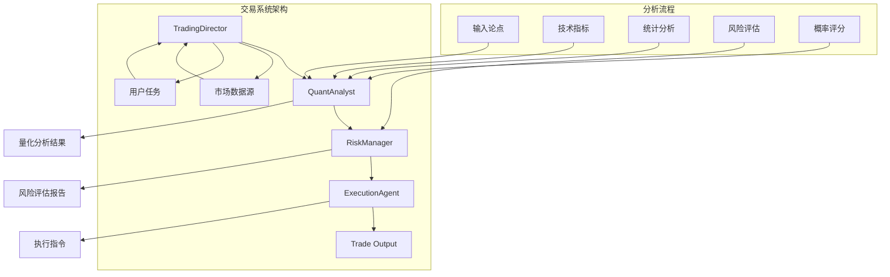
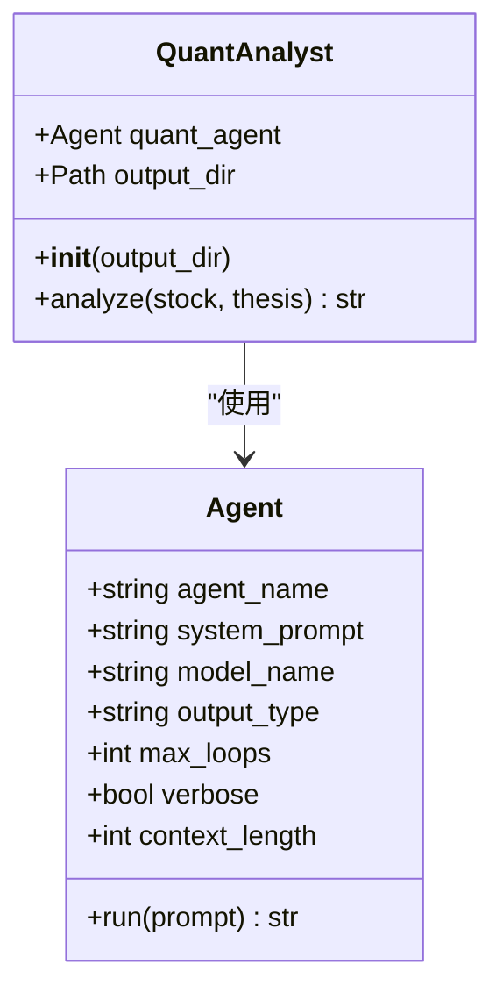
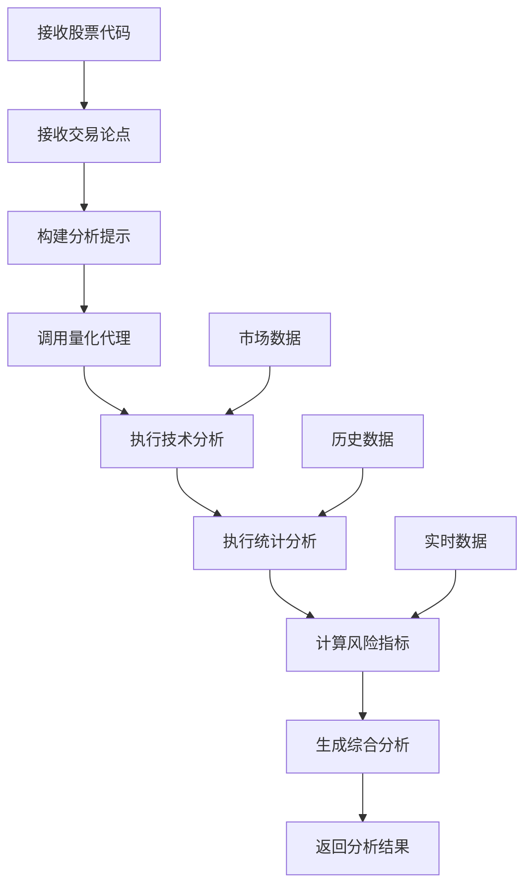
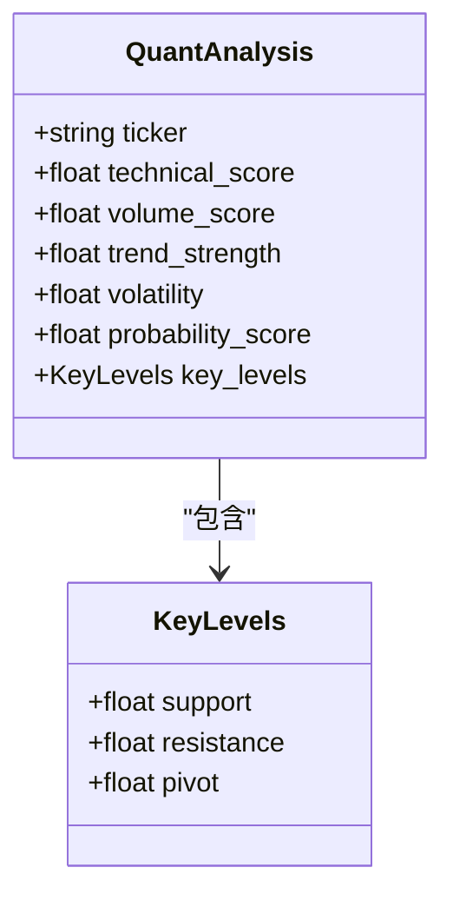
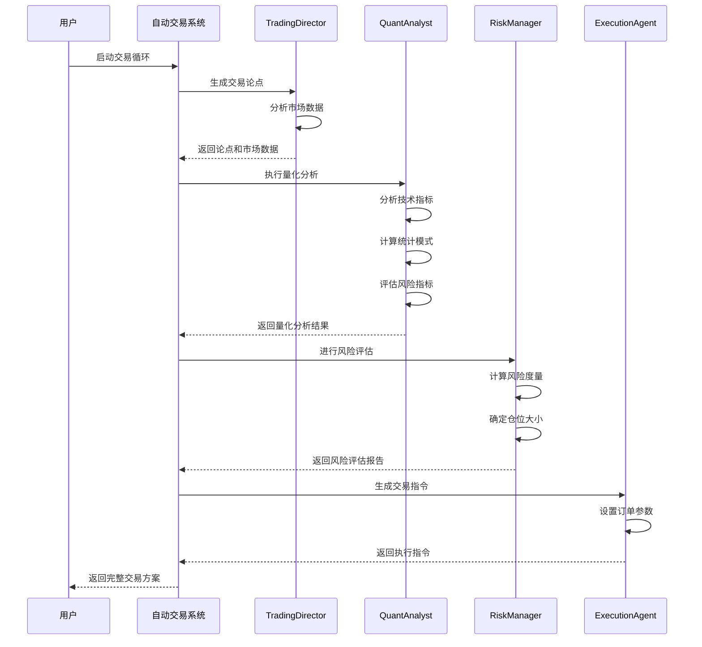
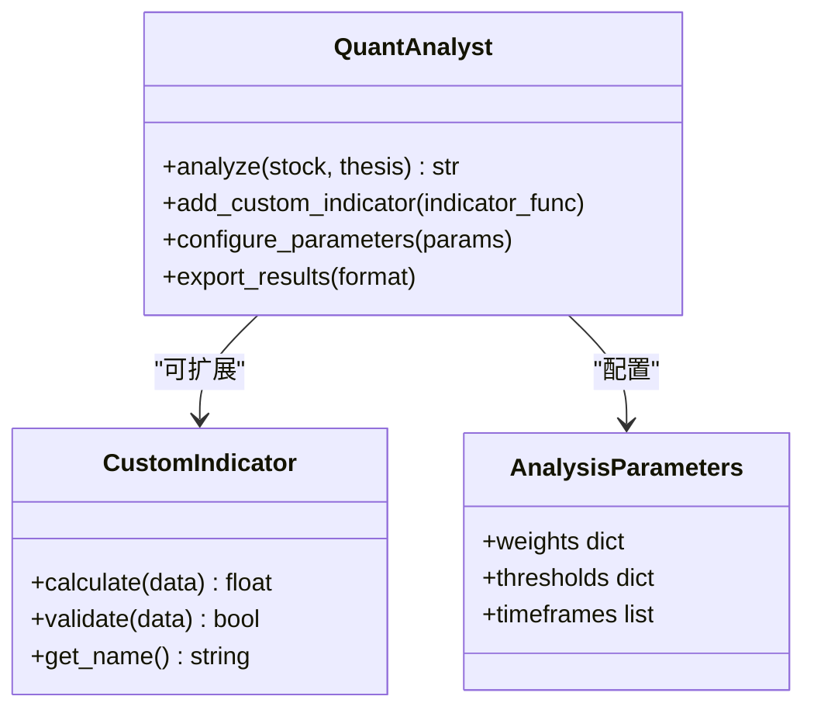
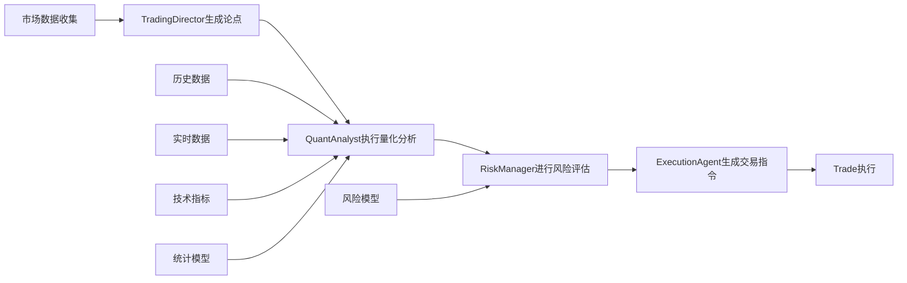

# 市场分析与量化信号生成

<cite>
**本文档中引用的文件**
- [autohedge/main.py](file://autohedge/main.py)
- [autohedge/__init__.py](file://autohedge/__init__.py)
- [example.py](file://example.py)
- [README.md](file://README.md)
- [experimental/crypto_agent_wrapper.py](file://experimental/crypto_agent_wrapper.py)
- [experimental/market_making.py](file://experimental/market_making.py)
- [api/api.py](file://api/api.py)
- [api/api_tests.py](file://api/api_tests.py)
</cite>

## 目录
1. [简介](#简介)
2. [系统架构概览](#系统架构概览)
3. [QuantAnalyst代理详解](#quantanalyst代理详解)
4. [技术指标分析](#技术指标分析)
5. [统计模式评估](#统计模式评估)
6. [风险度量计算](#风险度量计算)
7. [数据分析流程](#数据分析流程)
8. [输出格式与结构](#输出格式与结构)
9. [实际调用示例](#实际调用示例)
10. [参数定制与扩展](#参数定制与扩展)
11. [与整体交易流程的集成](#与整体交易流程的集成)
12. [故障排除指南](#故障排除指南)
13. [总结](#总结)

## 简介

AutoHedge是一个基于多智能体架构的自动化交易系统，其中QuantAnalyst代理是核心的量化分析组件。该代理专门负责基于TradingDirector提供的交易论点生成量化分析信号，通过深入的技术指标分析、统计模式评估和风险度量计算，为交易决策提供数据驱动的支持。

QuantAnalyst代理的核心职责包括：
- **技术指标分析**：评估移动平均线、相对强弱指数(RSI)、布林带等技术指标
- **统计模式评估**：应用统计方法识别历史数据中的模式
- **风险指标计算**：计算VaR、预期短缺等风险度量
- **交易成功概率评估**：基于历史数据分析和风险指标提供概率评分

## 系统架构概览

AutoHedge采用多智能体协作架构，各智能体专注于特定的交易环节：



**图表来源**
- [autohedge/main.py](file://autohedge/main.py#L422-L583)

**章节来源**
- [autohedge/main.py](file://autohedge/main.py#L12-L583)
- [README.md](file://README.md#L70-L215)

## QuantAnalyst代理详解

QuantAnalyst代理是AutoHedge系统中的量化分析核心，负责将TradingDirector生成的交易论点转化为具体的量化分析结果。

### 核心功能特性

QuantAnalyst代理具备以下核心功能：

1. **技术指标深度分析**：基于多种技术指标提供全面的市场分析
2. **统计模式识别**：运用统计学方法识别市场模式和趋势
3. **风险度量计算**：计算各种风险指标以量化潜在损失
4. **概率评估**：基于历史数据和当前市场条件评估交易成功的可能性

### 初始化配置

QuantAnalyst代理通过以下方式进行初始化：



**图表来源**
- [autohedge/main.py](file://autohedge/main.py#L356-L421)

**章节来源**
- [autohedge/main.py](file://autohedge/main.py#L356-L421)

## 技术指标分析

QuantAnalyst代理在分析过程中会深入评估多种技术指标，这些指标为交易决策提供了重要的技术基础。

### 移动平均线分析

移动平均线是技术分析中最常用的趋势指标之一：

- **简单移动平均(SMA)**：计算价格的算术平均值，反映价格趋势
- **指数移动平均(EMA)**：给予近期价格更高的权重，反应更灵敏
- **加权移动平均(WMA)**：根据时间间隔给予不同权重

### 相对强弱指数(RSI)

RSI是衡量市场超买超卖状况的重要指标：

- **计算公式**：RSI = 100 - (100 / (1 + RS))
- **数值范围**：0-100
- **买卖信号**：
  - RSI > 70：超买，可能下跌
  - RSI < 30：超卖，可能上涨

### 布林带分析

布林带由三条线组成，用于衡量价格波动性和趋势强度：

- **上轨线**：价格的上边界
- **中轨线**：通常为20日简单移动平均线
- **下轨线**：价格的下边界
- **宽度指标**：反映市场波动性

### 其他技术指标

系统还支持其他重要技术指标的分析：

- **MACD**：移动平均收敛发散指标
- **随机指标**：衡量价格相对于一定时期内最高价和最低价的位置
- **成交量指标**：分析成交量变化与价格变动的关系

**章节来源**
- [autohedge/main.py](file://autohedge/main.py#L35-L39)

## 统计模式评估

除了技术指标分析，QuantAnalyst代理还运用统计学方法识别市场中的潜在模式和规律。

### 趋势分析

系统通过多种方法识别和验证市场趋势：

- **趋势线分析**：识别上升、下降或横盘趋势
- **趋势强度评估**：量化趋势的强度和持续性
- **趋势反转识别**：检测潜在的趋势反转信号

### 波动性分析

波动性是风险管理的重要组成部分：

- **历史波动率**：基于历史价格计算的波动率
- **隐含波动率**：从期权价格推导出的未来波动率
- **波动率预测**：使用统计模型预测未来波动性

### 统计模式识别

系统能够识别以下统计模式：

- **均值回归**：价格向均值回归的倾向
- **动量效应**：价格延续现有趋势的可能性
- **季节性模式**：特定时间段内的价格模式
- **周期性波动**：价格的周期性变化

**章节来源**
- [autohedge/main.py](file://autohedge/main.py#L36-L37)

## 风险度量计算

QuantAnalyst代理在分析过程中会计算多种风险度量指标，为风险评估提供量化依据。

### Value-at-Risk (VaR)

VaR是最常用的风险度量指标之一：

- **定义**：在给定置信水平下，投资组合可能遭受的最大损失
- **计算方法**：
  - 历史模拟法
  - 方差-协方差法
  - 蒙特卡洛模拟法
- **应用场景**：资本要求计算、风险限额设定

### 预期短缺(Expected Shortfall)

Expected Shortfall是VaR的补充指标：

- **定义**：在超过VaR阈值时的平均损失
- **优势**：满足一致性风险度量的所有性质
- **计算公式**：ES = E[L | L > VaR]

### 其他风险指标

系统还计算其他重要的风险指标：

- **贝塔系数(Beta)**：衡量资产相对于市场的系统性风险
- **阿尔法系数(Alpha)**：衡量超额收益
- **夏普比率**：单位风险下的超额回报
- **索提诺比率**：仅考虑下行风险的回报指标

### 关键支撑/阻力位

系统自动识别和评估关键的技术水平：

- **支撑位**：价格下跌时可能遇到支撑的价格水平
- **阻力位**：价格上涨时可能遇到阻力的价格水平
- **突破确认**：验证关键水平的有效性

**章节来源**
- [autohedge/main.py](file://autohedge/main.py#L37-L38)

## 数据分析流程

QuantAnalyst代理遵循标准化的数据分析流程，确保分析结果的一致性和可靠性。

### 输入处理流程



**图表来源**
- [autohedge/main.py](file://autohedge/main.py#L380-L421)

### 分析步骤详解

1. **数据准备阶段**
   - 解析股票代码和交易论点
   - 收集相关市场数据
   - 准备分析所需的上下文信息

2. **技术分析阶段**
   - 应用各种技术指标
   - 识别关键支撑和阻力位
   - 计算趋势强度和方向

3. **统计分析阶段**
   - 应用统计模式识别算法
   - 计算概率评分
   - 评估市场行为模式

4. **风险评估阶段**
   - 计算VaR和其他风险指标
   - 评估潜在损失
   - 提供风险缓解建议

5. **结果整合阶段**
   - 将各项分析结果整合
   - 生成综合评分
   - 提供最终分析结论

**章节来源**
- [autohedge/main.py](file://autohedge/main.py#L380-L421)

## 输出格式与结构

QuantAnalyst代理的输出采用结构化的格式，便于后续处理和集成。

### 结构化输出格式

分析结果包含以下关键字段：

| 字段名 | 类型 | 描述 | 取值范围 |
|--------|------|------|----------|
| ticker | string | 股票代码 | - |
| technical_score | float | 技术得分 | 0-1 |
| volume_score | float | 成交量得分 | 0-1 |
| trend_strength | float | 趋势强度 | 0-1 |
| volatility | float | 波动率 | 正数 |
| probability_score | float | 概率评分 | 0-1 |
| key_levels | dict | 关键价位 | - |

### 关键价位结构



**图表来源**
- [autohedge/main.py](file://autohedge/main.py#L399-L409)

### 输出示例结构

典型的量化分析输出包含以下内容：

- **技术得分**：基于技术指标的综合评分
- **成交量得分**：反映市场参与度的指标
- **趋势强度**：量化当前趋势的强度
- **波动率**：市场波动性的数值表示
- **概率评分**：交易成功的可能性评估
- **关键价位**：支撑、阻力和关键点位

**章节来源**
- [autohedge/main.py](file://autohedge/main.py#L399-L409)

## 实际调用示例

以下是QuantAnalyst代理的实际使用示例，展示了如何进行量化分析。

### 基本使用示例

```python
# 初始化量化分析师
quant_analyst = QuantAnalyst()

# 定义股票和交易论点
stock = "NVDA"
thesis = """
基于当前市场环境，NVIDIA在GPU市场具有领先地位，
人工智能和数据中心需求持续增长，技术面显示买入信号。
"""

# 执行量化分析
analysis_result = quant_analyst.analyze(stock, thesis)
```

### 完整交易流程示例



**图表来源**
- [autohedge/main.py](file://autohedge/main.py#L477-L583)

### 批量分析示例

对于多个股票的批量分析：

```python
# 多股票分析
stocks = ["NVDA", "TSLA", "MSFT", "GOOG"]
results = {}

for stock in stocks:
    thesis = generate_thesis_for_stock(stock)
    analysis = quant_analyst.analyze(stock, thesis)
    results[stock] = analysis
```

**章节来源**
- [autohedge/main.py](file://autohedge/main.py#L477-L583)
- [example.py](file://example.py#L1-L21)

## 参数定制与扩展

QuantAnalyst代理支持灵活的参数定制和功能扩展，以适应不同的分析需求。

### 自定义分析参数

可以通过修改系统提示来定制分析参数：

```python
# 自定义技术指标权重
CUSTOM_QUANT_PROMPT = """
你是一个量化分析AI，负责提供深入的数值分析支持交易决策。

你的主要目标是：
1. 评估移动平均线、RSI、布林带等技术指标
2. 应用统计方法识别历史数据模式
3. 计算风险指标如VaR、ES和希腊字母
4. 基于历史数据分析、技术指标和风险指标提供交易成功概率

请特别关注以下方面：
- 技术指标权重：移动平均线(40%)，RSI(30%)，布林带(20%)，其他指标(10%)
- 统计模式识别：重点关注均值回归(50%)和动量效应(50%)
- 风险评估：VaR权重(60%)，ES权重(40%)

你的分析应该建立在交易论点的基础上，提供详细的数值洞察来支持或挑战总监的假设。
"""
```

### 新增分析模型

可以扩展QuantAnalyst代理以支持新的分析模型：

1. **机器学习模型集成**
   - 集成时间序列预测模型
   - 添加深度学习网络
   - 实现强化学习策略

2. **新指标添加**
   - 自定义技术指标
   - 行业特定指标
   - 宏观经济指标

3. **多维度分析**
   - 跨资产类别的分析
   - 事件驱动分析
   - 主题轮动分析

### 扩展接口设计



**图表来源**
- [autohedge/main.py](file://autohedge/main.py#L356-L421)

**章节来源**
- [autohedge/main.py](file://autohedge/main.py#L356-L421)

## 与整体交易流程的集成

QuantAnalyst代理作为AutoHedge系统的核心组件，与整个交易流程紧密集成。

### 交易流程集成



**图表来源**
- [autohedge/main.py](file://autohedge/main.py#L477-L583)

### 对后续风险评估的影响

QuantAnalyst代理的分析结果直接影响后续的风险评估过程：

1. **技术评分影响**：高技术评分可能降低风险评估的保守程度
2. **趋势强度影响**：强趋势可能改变风险敞口的计算方式
3. **波动率影响**：高波动率需要更严格的风险控制措施
4. **概率评分影响**：高概率评分可能允许更大的仓位规模

### 决策链影响

量化分析结果在决策链中的作用：

- **支持决策**：为TradingDirector提供数据支持
- **验证假设**：检验交易论点的合理性
- **风险预警**：识别潜在的风险因素
- **优化策略**：提供策略调整建议

**章节来源**
- [autohedge/main.py](file://autohedge/main.py#L477-L583)

## 故障排除指南

在使用QuantAnalyst代理过程中可能遇到的问题及解决方案。

### 常见问题及解决方案

1. **分析结果不准确**
   - 检查输入的交易论点是否充分
   - 验证市场数据的时效性
   - 确认技术指标参数设置

2. **性能问题**
   - 优化分析参数配置
   - 减少不必要的指标计算
   - 使用缓存机制提高效率

3. **输出格式错误**
   - 检查系统提示的格式要求
   - 验证输出解析逻辑
   - 确认数据类型转换

### 调试技巧

- **日志记录**：启用详细的日志记录
- **单元测试**：编写针对特定功能的测试
- **参数验证**：检查输入参数的有效性
- **结果验证**：对比历史分析结果

### 性能优化

- **并发处理**：支持多股票并行分析
- **缓存机制**：缓存常用计算结果
- **内存管理**：优化大数据处理
- **算法优化**：使用高效的计算算法

## 总结

QuantAnalyst代理是AutoHedge系统中不可或缺的量化分析组件，它通过深入的技术指标分析、统计模式评估和风险度量计算，为自动化交易系统提供了强大的数据分析能力。

### 核心优势

1. **全面的分析能力**：涵盖技术分析、统计分析和风险评估
2. **灵活的扩展性**：支持自定义指标和分析模型
3. **标准化的输出**：提供结构化的分析结果
4. **高效的集成**：与整个交易流程无缝衔接

### 应用价值

- **提高决策质量**：基于数据驱动的分析提供决策支持
- **降低交易风险**：通过风险度量帮助控制潜在损失
- **增强系统性能**：自动化分析提高交易效率
- **支持策略优化**：为策略改进提供量化依据

QuantAnalyst代理的设计体现了现代量化交易系统的核心理念，即通过先进的算法和数据分析技术，实现更加智能和高效的投资决策过程。随着人工智能技术的不断发展，该代理将继续演进，为投资者提供更加精准和可靠的投资建议。