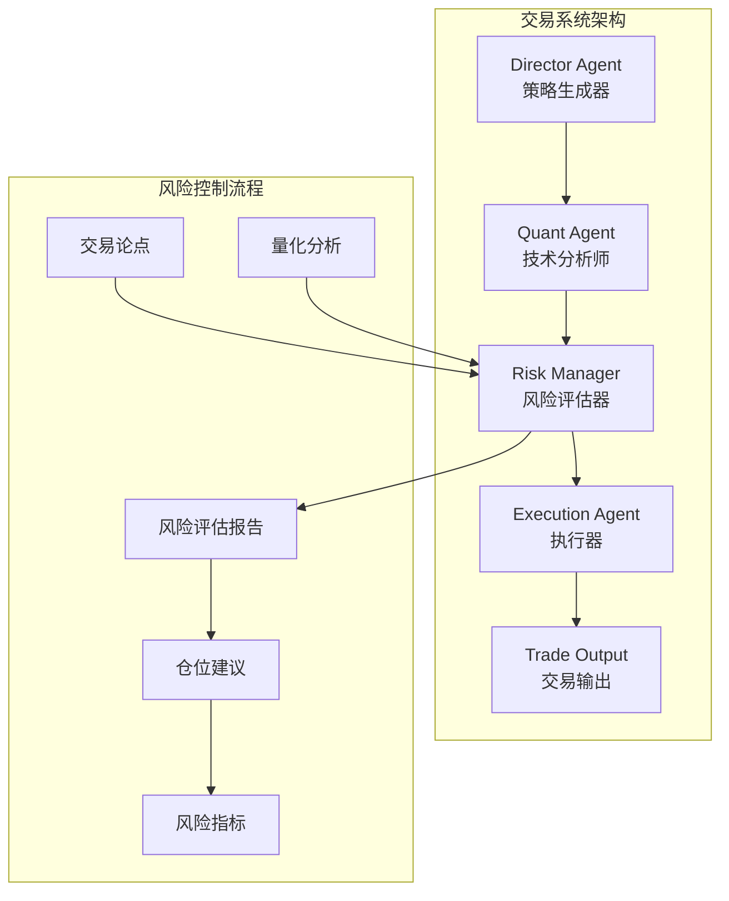
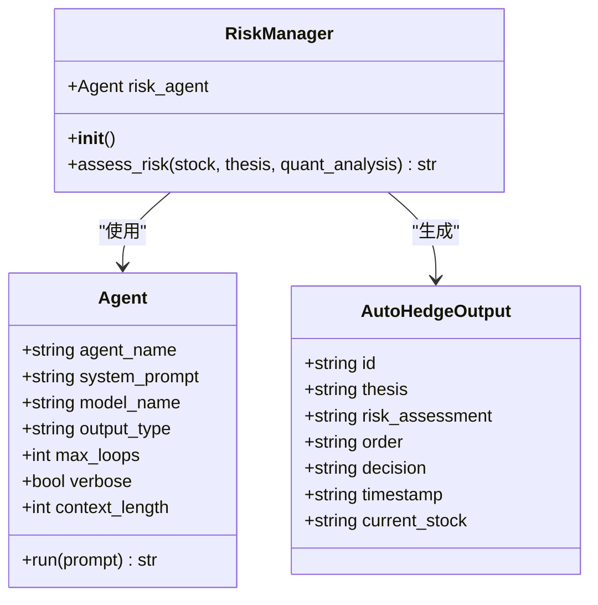
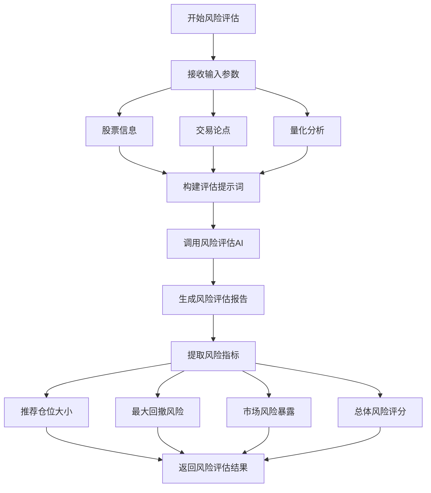
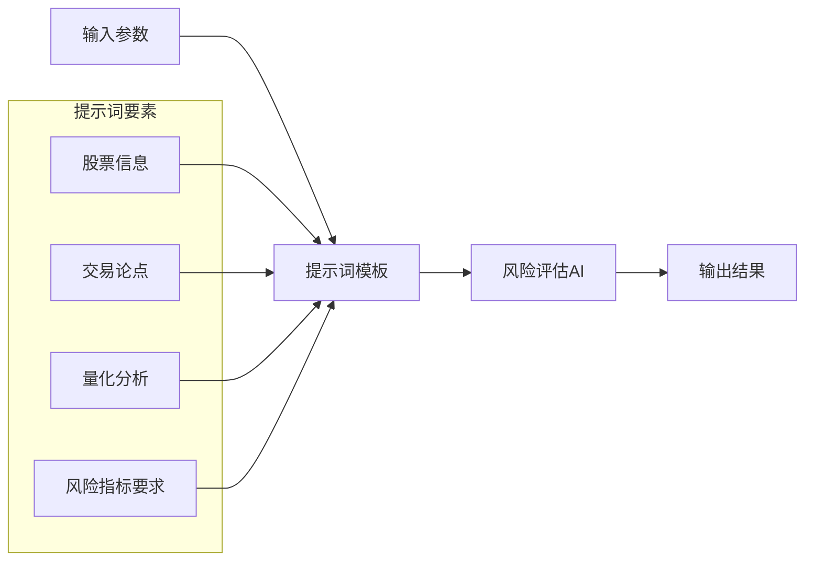
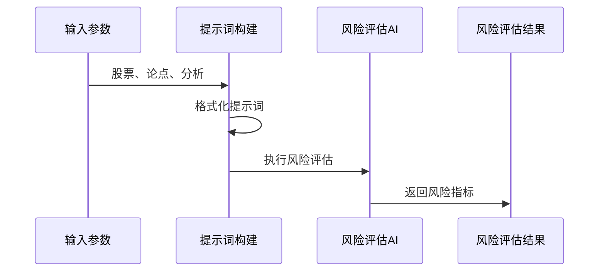
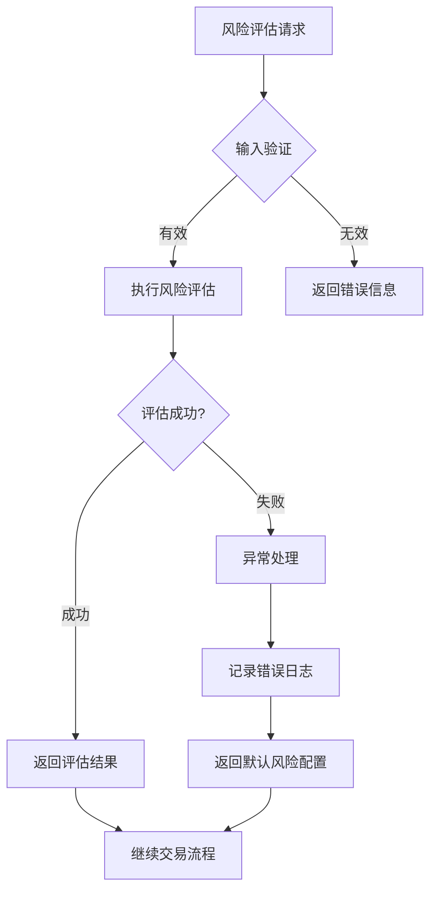

# 风险评估与仓位管理

<cite>
**本文档中引用的文件**
- [README.md](file://README.md)
- [autohedge/main.py](file://autohedge/main.py)
- [autohedge/__init__.py](file://autohedge/__init__.py)
- [api/api.py](file://api/api.py)
</cite>

## 目录
1. [简介](#简介)
2. [系统架构概览](#系统架构概览)
3. [RiskManager代理核心机制](#riskmanager代理核心机制)
4. [风险评估流程详解](#风险评估流程详解)
5. [风险指标输出分析](#风险指标输出分析)
6. [风险评估提示词设计](#风险评估提示词设计)
7. [输入参数转换机制](#输入参数转换机制)
8. [风险偏好配置方法](#风险偏好配置方法)
9. [异常处理与熔断机制](#异常处理与熔断机制)
10. [风险模型优化建议](#风险模型优化建议)
11. [总结](#总结)

## 简介

AutoHedge是一个基于多智能体架构的自动化交易系统，其中RiskManager代理作为风险控制的核心组件，负责接收交易论点和量化分析结果来评估单笔交易的潜在风险。该系统采用风险第一的方法论，在每个交易周期中都进行严格的风险评估，确保交易决策的安全性和可持续性。

## 系统架构概览

AutoHedge采用分层的多智能体架构，各智能体专门负责不同的交易环节：

**图表来源**
- [README.md](file://README.md#L75-L80)
- [autohedge/main.py](file://autohedge/main.py#L122-L187)

**章节来源**
- [README.md](file://README.md#L14-L27)
- [autohedge/main.py](file://autohedge/main.py#L122-L187)

## RiskManager代理核心机制

RiskManager代理是AutoHedge系统中的关键风险控制组件，其核心功能包括：

### 核心职责
1. **位置规模评估**：确定最优的资金分配比例
2. **潜在回撤计算**：预测可能的最大损失幅度
3. **市场风险因素评估**：分析波动性、流动性等市场特征
4. **相关性风险监控**：识别资产间的关联风险

### 架构设计

**图表来源**
- [autohedge/main.py](file://autohedge/main.py#L159-L187)

**章节来源**
- [autohedge/main.py](file://autohedge/main.py#L122-L187)

## 风险评估流程详解

RiskManager代理通过标准化的风险评估流程来处理每笔交易：

### 评估流程图

**图表来源**
- [autohedge/main.py](file://autohedge/main.py#L171-L187)

### 输入数据整合

RiskManager代理接收三个主要输入源：

1. **股票信息**：包含交易标的的基本信息
2. **交易论点**：Director Agent生成的市场观点和策略方向
3. **量化分析**：Quant Agent提供的技术指标和统计分析结果

**章节来源**
- [autohedge/main.py](file://autohedge/main.py#L171-L187)

## 风险指标输出分析

RiskManager代理生成四个核心风险指标，为交易决策提供量化依据：

### 指标体系表

| 风险指标 | 类型 | 描述 | 计算方式 |
|---------|------|------|----------|
| 推荐仓位大小 | 数值型 | 基于风险收益比的最优持仓量 | 基于风险预算和止损距离计算 |
| 最大回撤风险 | 百分比 | 预期的最大资金回撤幅度 | 基于历史波动率和时间周期估算 |
| 市场风险暴露 | 分类/数值 | 市场环境下的整体风险水平 | 综合波动性、流动性等因素 |
| 总体风险评分 | 0-10分制 | 综合风险程度的量化评分 | 加权平均各风险因子得分 |

### 输出格式化

风险评估结果以结构化文本形式返回，包含以下要素：
- 明确的仓位建议数量
- 具体的回撤风险百分比
- 市场环境风险描述
- 整体风险等级评定

**章节来源**
- [autohedge/main.py](file://autohedge/main.py#L179-L184)

## 风险评估提示词设计

RiskManager代理的提示词设计体现了其专业性和系统性：

### 提示词结构分析

**图表来源**
- [autohedge/main.py](file://autohedge/main.py#L174-L184)

### 设计逻辑

1. **明确目标导向**：直接要求生成具体的风险指标
2. **结构化输出**：指定需要包含的四个关键指标
3. **实用性优先**：确保输出结果可以直接用于交易决策
4. **灵活性保证**：允许AI根据具体情况调整建议

**章节来源**
- [autohedge/main.py](file://autohedge/main.py#L122-L156)

## 输入参数转换机制

RiskManager代理将原始输入参数转化为具体的风险建议：

### 参数转换流程

**图表来源**
- [autohedge/main.py](file://autohedge/main.py#L174-L184)

### 转换规则

1. **论点解析**：识别交易方向、信心级别、价格水平
2. **分析解读**：提取技术分数、成交量指标、趋势强度
3. **风险映射**：将技术指标映射到风险维度
4. **综合评估**：结合多个维度生成最终风险评分

**章节来源**
- [autohedge/main.py](file://autohedge/main.py#L132-L156)

## 风险偏好配置方法

系统提供了多种配置风险偏好的方式：

### 配置选项表

| 配置类型 | 方法 | 影响范围 | 示例 |
|---------|------|----------|------|
| 风险评分阈值 | 系统参数调整 | 整体风险接受度 | 设置最低风险评分标准 |
| 仓位计算公式 | 自定义函数 | 仓位大小计算 | 调整风险预算分配算法 |
| 时间框架设置 | 参数配置 | 回撤计算周期 | 修改回撤评估的时间窗口 |
| 市场条件过滤 | 条件参数 | 风险评估前提 | 设置流动性要求 |

### 实现方式

虽然当前版本的风险计算逻辑相对固定，但可以通过以下方式进行定制：

1. **提示词修改**：调整RISK_PROMPT内容
2. **参数传递**：在调用assess_risk时传入额外参数
3. **后处理逻辑**：对AI输出进行二次加工

**章节来源**
- [autohedge/main.py](file://autohedge/main.py#L160-L169)

## 异常处理与熔断机制

系统实现了多层次的异常处理和风险控制机制：

### 异常处理架构

**图表来源**
- [autohedge/main.py](file://autohedge/main.py#L171-L187)

### 熔断机制

1. **高风险信号检测**：当风险评分超过预设阈值时触发
2. **自动暂停机制**：高风险情况下暂停交易执行
3. **人工审核流程**：需要人工确认才能继续
4. **风险缓释措施**：降低仓位或完全退出市场

### 错误恢复策略

- **重试机制**：对临时性错误进行自动重试
- **降级服务**：在部分功能不可用时提供基础风险评估
- **安全模式**：在严重错误时进入保守的风险配置

**章节来源**
- [autohedge/main.py](file://autohedge/main.py#L171-L187)
- [api/api.py](file://api/api.py#L305-L310)

## 风险模型优化建议

基于现有架构，以下是优化风险模型的实践建议：

### 模型改进方向

1. **动态风险阈值**
   - 根据市场波动性调整风险接受度
   - 结合季节性因素调整风险配置
   - 实时监控市场情绪变化

2. **多维度风险评估**
   - 增加流动性风险指标
   - 引入宏观经济风险因子
   - 考虑跨资产相关性风险

3. **机器学习增强**
   - 使用历史数据训练风险预测模型
   - 实施在线学习适应市场变化
   - 构建风险情景模拟系统

### 性能优化策略

1. **计算效率提升**
   - 并行处理多个股票的风险评估
   - 缓存常用风险指标
   - 优化提示词长度和复杂度

2. **准确性改进**
   - 集成更多数据源
   - 实施交叉验证机制
   - 定期更新风险模型参数

3. **用户体验优化**
   - 提供风险可视化工具
   - 实现实时风险监控面板
   - 增强风险报告的可读性

### 监控和维护

1. **性能指标跟踪**
   - 风险评估准确率
   - 决策延迟时间
   - 系统可用性指标

2. **定期审计**
   - 风险模型效果评估
   - 参数合理性检查
   - 外部基准对比

**章节来源**
- [README.md](file://README.md#L170-L181)

## 总结

AutoHedge的RiskManager代理代表了现代量化交易系统中风险控制的最佳实践。通过将复杂的交易论点和量化分析转化为清晰的风险指标，该系统实现了科学的风险管理。其核心优势包括：

1. **系统化方法**：建立了完整的风险评估流程
2. **智能化决策**：利用AI技术提高风险判断准确性
3. **实时响应**：能够快速适应市场变化
4. **透明化操作**：提供清晰的风险评估依据

随着市场的不断发展和算法的持续优化，RiskManager代理将继续演进，为用户提供更加精准和可靠的风险管理服务。通过合理的配置和持续的优化，该系统能够在各种市场环境下保持稳健的交易表现。