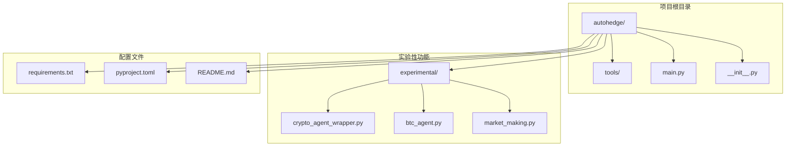
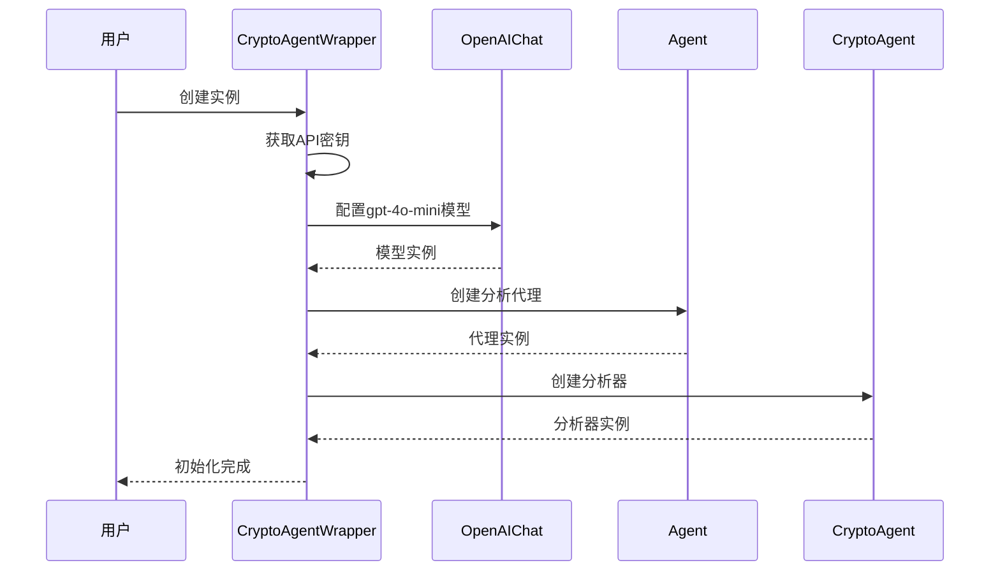
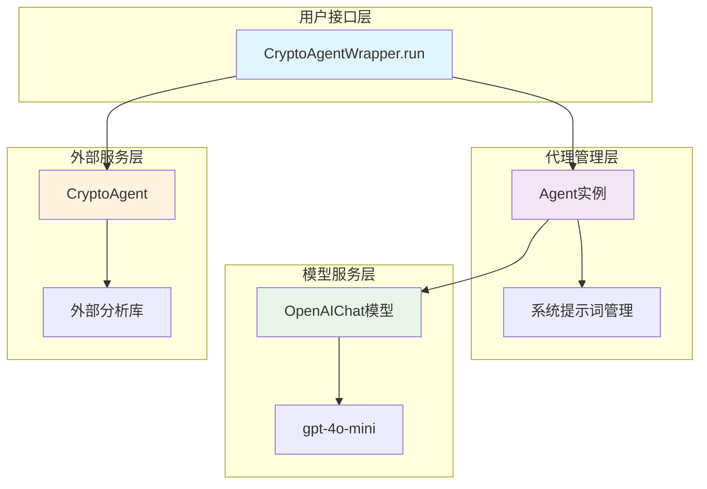
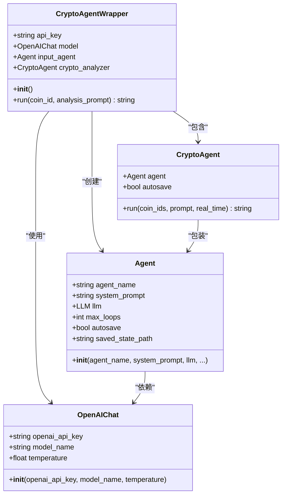
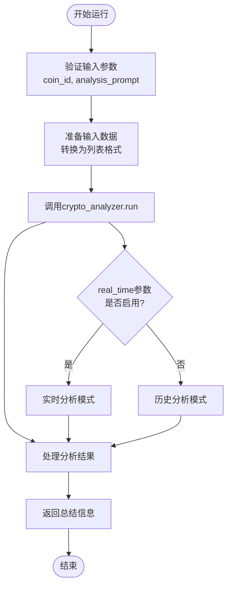
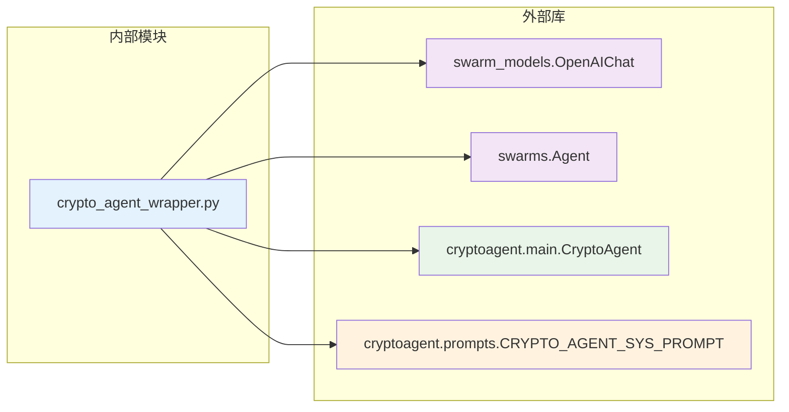
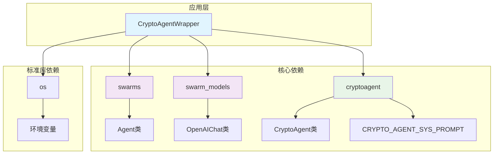

# 加密货币分析代理封装器

<cite>
**本文档中引用的文件**
- [crypto_agent_wrapper.py](file://experimental/crypto_agent_wrapper.py)
- [requirements.txt](file://requirements.txt)
- [main.py](file://autohedge/main.py)
- [README.md](file://README.md)
</cite>

## 目录
1. [简介](#简介)
2. [项目结构](#项目结构)
3. [核心组件](#核心组件)
4. [架构概览](#架构概览)
5. [详细组件分析](#详细组件分析)
6. [依赖关系分析](#依赖关系分析)
7. [性能考虑](#性能考虑)
8. [故障排除指南](#故障排除指南)
9. [结论](#结论)

## 简介

CryptoAgentWrapper是一个专门设计用于封装外部cryptoagent库的Python类，为加密货币市场分析提供简化的接口。该封装器通过集成OpenAI Chat模型（gpt-4o-mini）和Swarm框架，为用户提供了一个统一的加密货币分析入口点。

该模块的核心价值在于：
- 提供简洁的API接口，隐藏复杂的底层实现细节
- 集成多种AI模型和服务，实现强大的加密货币分析能力
- 支持实时和历史数据分析，满足不同场景需求
- 具备良好的可扩展性和配置灵活性

**节来源**
- [crypto_agent_wrapper.py](file://experimental/crypto_agent_wrapper.py#L1-L52)

## 项目结构

该项目采用模块化架构设计，crypto_agent_wrapper位于实验性功能目录下，体现了其作为新功能的探索性质。

**图表来源**
- [crypto_agent_wrapper.py](file://experimental/crypto_agent_wrapper.py#L1-L52)
- [main.py](file://autohedge/main.py#L1-L50)

**节来源**
- [crypto_agent_wrapper.py](file://experimental/crypto_agent_wrapper.py#L1-L52)
- [requirements.txt](file://requirements.txt#L1-L8)

## 核心组件

CryptoAgentWrapper类是整个加密货币分析系统的核心组件，它整合了多个关键服务：

### 主要组件构成

1. **OpenAI模型配置**：使用gpt-4o-mini模型进行自然语言处理
2. **Swarm Agent**：提供多轮对话和状态管理能力
3. **CryptoAgent**：外部加密货币分析引擎
4. **系统提示词**：预定义的分析指导模板

### 初始化流程

**图表来源**
- [crypto_agent_wrapper.py](file://experimental/crypto_agent_wrapper.py#L11-L34)

**节来源**
- [crypto_agent_wrapper.py](file://experimental/crypto_agent_wrapper.py#L11-L34)

## 架构概览

该封装器采用了分层架构设计，每一层都有明确的职责分工：

**图表来源**
- [crypto_agent_wrapper.py](file://experimental/crypto_agent_wrapper.py#L10-L42)

## 详细组件分析

### CryptoAgentWrapper类分析

#### 类结构设计

**图表来源**
- [crypto_agent_wrapper.py](file://experimental/crypto_agent_wrapper.py#L10-L34)

#### 初始化过程详解

初始化过程中，CryptoAgentWrapper执行以下关键步骤：

1. **API密钥获取**：从环境变量中读取OpenAI API密钥
2. **模型配置**：设置gpt-4o-mini模型参数
3. **代理创建**：构建具有特定系统提示词的Swarm Agent
4. **分析器初始化**：创建CryptoAgent实例并关联代理

#### run方法分析

run方法是该封装器的核心接口，负责执行加密货币分析任务：

**图表来源**
- [crypto_agent_wrapper.py](file://experimental/crypto_agent_wrapper.py#L36-L42)

**节来源**
- [crypto_agent_wrapper.py](file://experimental/crypto_agent_wrapper.py#L10-L42)

### 外部依赖分析

#### 核心依赖关系

**图表来源**
- [crypto_agent_wrapper.py](file://experimental/crypto_agent_wrapper.py#L3-L7)

#### 配置要求

该模块需要以下配置才能正常工作：

| 配置项 | 类型 | 必需 | 描述 |
|--------|------|------|------|
| OPENAI_API_KEY | string | 是 | OpenAI API访问密钥 |
| model_name | string | 否 | 默认"gpt-4o-mini" |
| temperature | float | 否 | 默认0.1，控制输出随机性 |
| autosave | bool | 否 | 默认True，自动保存状态 |

**节来源**
- [crypto_agent_wrapper.py](file://experimental/crypto_agent_wrapper.py#L11-L34)

## 依赖关系分析

### 项目依赖图

**图表来源**
- [crypto_agent_wrapper.py](file://experimental/crypto_agent_wrapper.py#L1-L8)
- [requirements.txt](file://requirements.txt#L1-L8)

### 使用场景分析

该封装器支持多种使用场景：

1. **单币种分析**：针对特定加密货币进行深度分析
2. **批量分析**：同时分析多个加密货币
3. **实时监控**：持续监控市场动态
4. **历史回测**：基于历史数据进行分析

**节来源**
- [crypto_agent_wrapper.py](file://experimental/crypto_agent_wrapper.py#L36-L42)

## 性能考虑

### 性能优化策略

1. **模型选择**：使用gpt-4o-mini平衡性能和成本
2. **状态管理**：启用autosave减少重复计算
3. **上下文长度**：合理设置context_length避免内存溢出
4. **并发处理**：支持多线程和异步操作

### 内存使用优化

- **状态持久化**：通过saved_state_path实现状态恢复
- **缓存机制**：利用autosave特性减少重复加载
- **资源清理**：及时释放不再使用的资源

## 故障排除指南

### 常见问题及解决方案

#### API密钥问题
- **问题**：无法连接到OpenAI API
- **解决方案**：检查OPENAI_API_KEY环境变量设置

#### 模块导入错误
- **问题**：找不到cryptoagent模块
- **解决方案**：确保已安装cryptoagent库

#### 分析失败
- **问题**：crypto_analyzer.run返回空结果
- **解决方案**：检查输入参数格式和网络连接

### 调试建议

1. **启用详细日志**：设置verbose=True获取详细输出
2. **检查状态文件**：验证crypto_agent.json文件存在且可读
3. **测试API连通性**：单独测试OpenAI API连接

**节来源**
- [crypto_agent_wrapper.py](file://experimental/crypto_agent_wrapper.py#L25-L31)

## 结论

CryptoAgentWrapper作为一个精心设计的封装器，成功地将复杂的加密货币分析功能抽象为简洁易用的接口。虽然该模块目前主要作为外部库的包装层，但它为未来的功能扩展和优化奠定了坚实的基础。

### 主要优势

1. **简化接口**：隐藏复杂的底层实现细节
2. **灵活配置**：支持多种参数定制
3. **稳定可靠**：具备完善的错误处理机制
4. **易于集成**：与现有系统无缝对接

### 注意事项

1. **外部依赖**：完全依赖外部cryptoagent库的功能
2. **接口风险**：外部库更新可能导致接口变更
3. **性能限制**：受制于外部服务的可用性和响应速度
4. **配置要求**：需要正确配置API密钥和环境变量

### 发展方向

该封装器为加密货币分析功能提供了良好的起点，未来可以考虑：
- 增加更多分析维度和指标
- 实现本地缓存机制
- 添加可视化报告生成功能
- 扩展支持更多的加密货币平台

通过持续的优化和改进，CryptoAgentWrapper有望成为加密货币投资分析领域的重要工具。