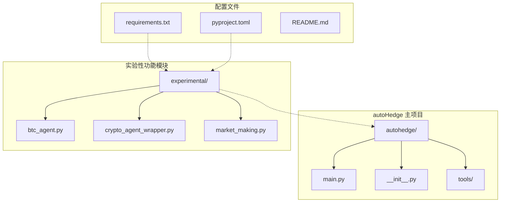
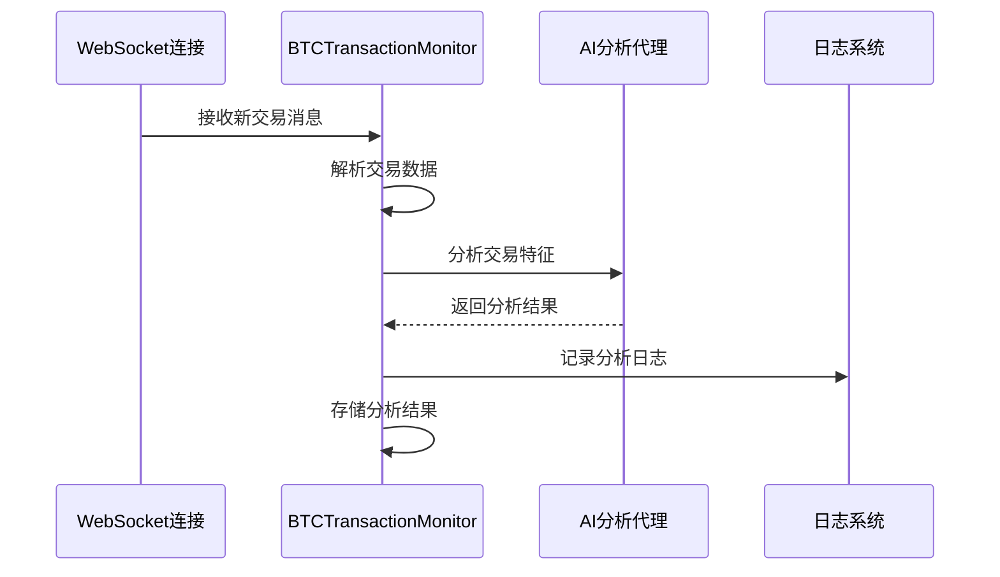
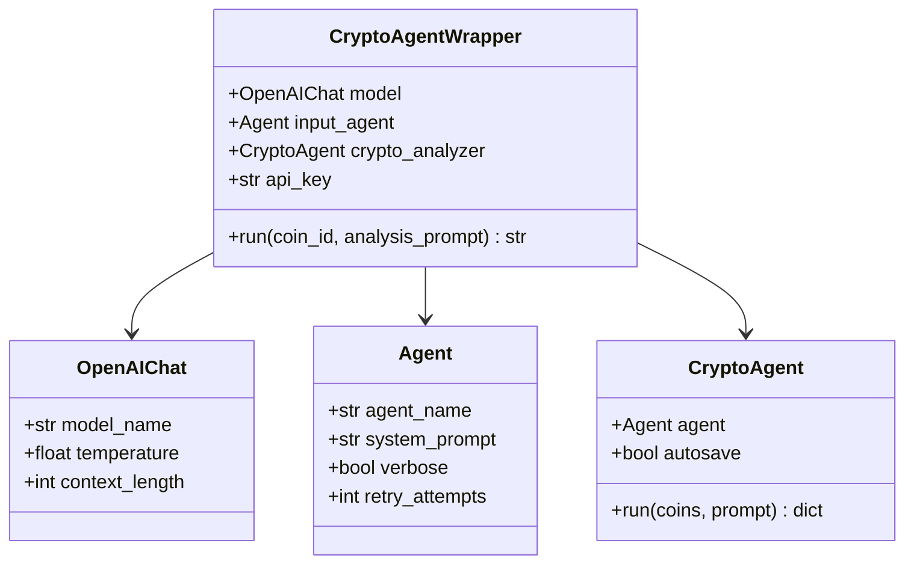
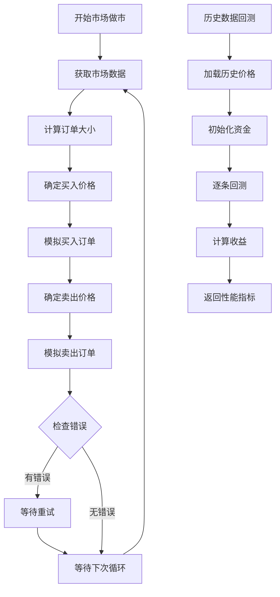
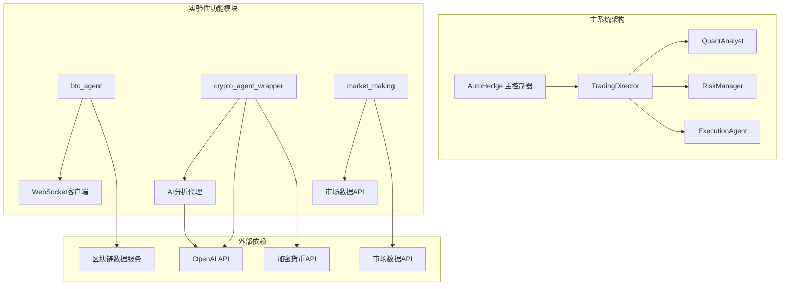
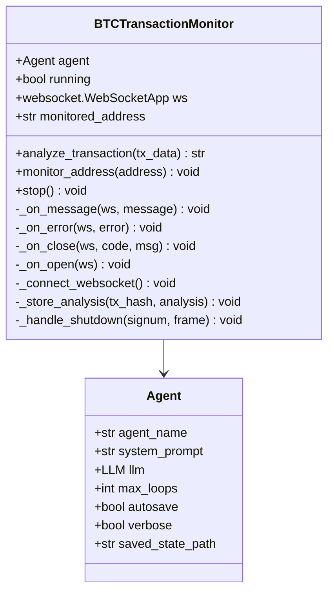
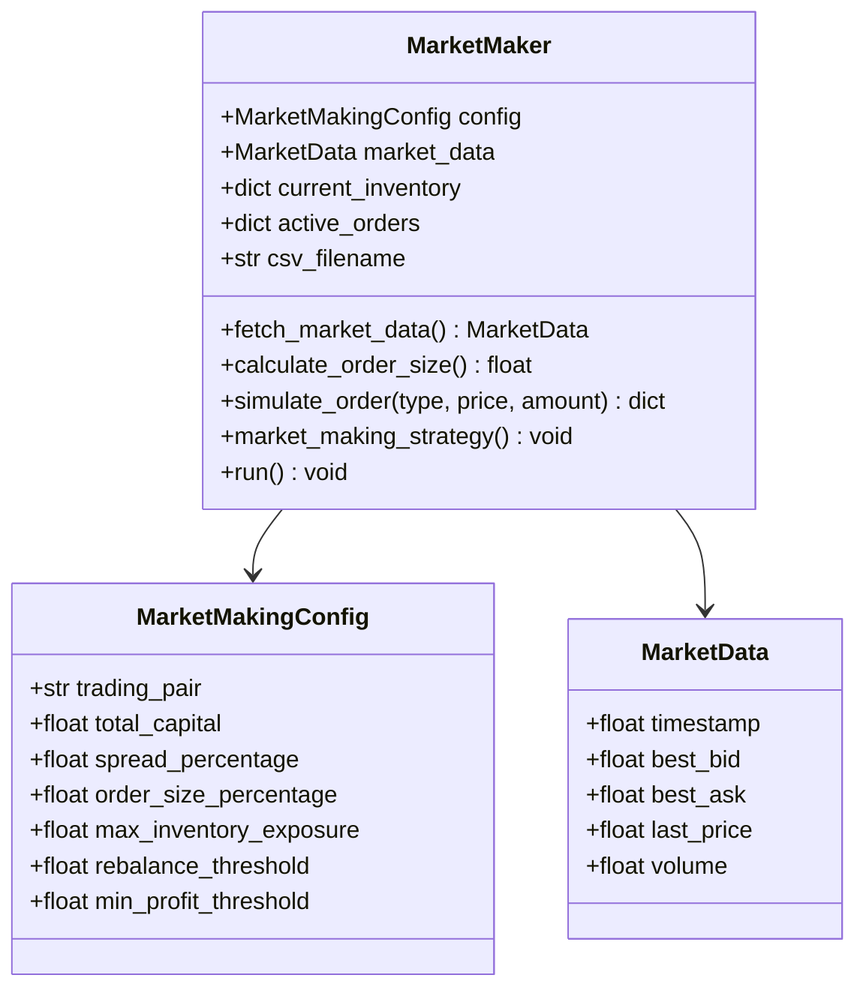
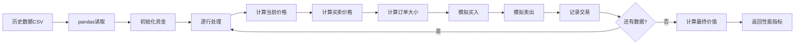
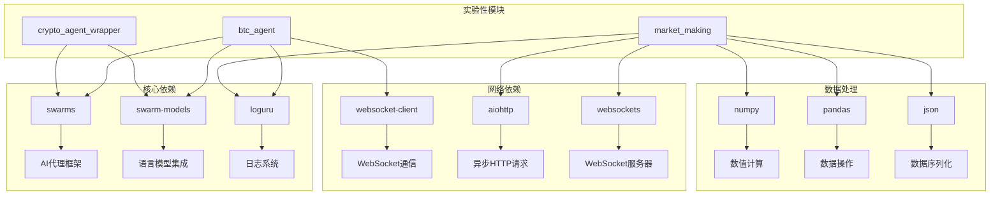

# 实验性功能

<cite>
**本文档中引用的文件**
- [btc_agent.py](file://experimental/btc_agent.py)
- [crypto_agent_wrapper.py](file://experimental/crypto_agent_wrapper.py)
- [market_making.py](file://experimental/market_making.py)
- [README.md](file://README.md)
- [example.py](file://example.py)
- [requirements.txt](file://requirements.txt)
- [pyproject.toml](file://pyproject.toml)
</cite>

## 目录
1. [简介](#简介)
2. [项目结构](#项目结构)
3. [比特币交易代理（btc_agent）](#比特币交易代理btc_agent)
4. [加密货币交易封装器（crypto_agent_wrapper）](#加密货币交易封装器crypto_agent_wrapper)
5. [市场做市策略（market_making）](#市场做市策略market_making)
6. [架构概览](#架构概览)
7. [详细组件分析](#详细组件分析)
8. [依赖关系分析](#依赖关系分析)
9. [性能考虑](#性能考虑)
10. [故障排除指南](#故障排除指南)
11. [结论](#结论)

## 简介

autoHedge项目包含三个实验性功能模块，这些模块代表了项目在区块链分析、加密货币智能代理和自动化交易策略方面的前沿探索。这些功能目前处于实验阶段，具有高度的创新性和潜在风险，不适合直接用于生产环境。

### 核心设计理念

实验性功能模块体现了以下核心设计原则：
- **技术创新**：采用最新的AI代理技术和区块链数据分析
- **模块化架构**：每个功能独立开发，便于测试和迭代
- **实时响应**：支持实时数据流处理和即时决策
- **可扩展性**：为未来功能增强预留扩展空间

## 项目结构

实验性功能模块位于项目的`experimental`目录下，与主系统保持清晰的分离：



**图表来源**
- [experimental/btc_agent.py](file://experimental/btc_agent.py#L1-L243)
- [experimental/crypto_agent_wrapper.py](file://experimental/crypto_agent_wrapper.py#L1-L52)
- [experimental/market_making.py](file://experimental/market_making.py#L1-L352)

**章节来源**
- [README.md](file://README.md#L1-L510)
- [requirements.txt](file://requirements.txt#L1-L8)

## 比特币交易代理（btc_agent）

### 设计目标

比特币交易代理是一个专门的实时交易分析系统，旨在：
- **实时监控**：持续跟踪特定比特币地址的交易活动
- **智能分析**：利用GPT-4o模型进行深度交易分析
- **风险评估**：识别异常交易模式和潜在风险
- **网络洞察**：分析交易在网络中的流动和关系

### 当前实现状态

该模块实现了完整的实时交易监控系统：



**图表来源**
- [btc_agent.py](file://experimental/btc_agent.py#L93-L137)
- [btc_agent.py](file://experimental/btc_agent.py#L117-L131)

### 核心算法逻辑

1. **WebSocket连接管理**：建立与区块链信息服务器的实时连接
2. **交易数据解析**：提取交易哈希、时间戳、输入输出地址等关键信息
3. **价值计算**：将聪（satoshis）转换为比特币单位
4. **AI分析触发**：当检测到涉及监控地址的交易时启动分析流程
5. **结果存储**：将分析结果保存为JSON格式文件

### 潜在应用场景

- **合规监控**：金融机构监控可疑交易活动
- **投资分析**：投资者跟踪重要地址的交易行为
- **风险管理**：识别潜在的洗钱或操纵市场行为
- **学术研究**：区块链交易模式的研究和分析

### 不稳定性提示

- **API依赖**：依赖外部区块链数据服务的稳定性
- **模型限制**：AI分析能力受限于GPT-4o的上下文长度
- **实时性挑战**：WebSocket连接可能因网络问题中断

**章节来源**
- [btc_agent.py](file://experimental/btc_agent.py#L1-L243)

## 加密货币交易封装器（crypto_agent_wrapper）

### 设计目标

加密货币交易封装器提供了一个统一的接口来访问专业的加密货币分析功能：

- **简化集成**：为现有系统提供标准化的加密货币分析接口
- **多模型支持**：支持多种AI模型进行对比分析
- **灵活配置**：允许自定义分析参数和温度设置
- **状态持久化**：维护分析会话的状态信息

### 当前实现状态

该封装器集成了多个专业组件：



**图表来源**
- [crypto_agent_wrapper.py](file://experimental/crypto_agent_wrapper.py#L10-L34)

### 核心算法逻辑

1. **初始化配置**：设置OpenAI API密钥和模型参数
2. **代理创建**：构建专门的加密货币分析AI代理
3. **分析执行**：调用专业CryptoAgent进行深度分析
4. **结果聚合**：整理和返回分析摘要

### 潜在应用场景

- **量化分析**：为量化交易团队提供加密货币基本面分析
- **投资组合管理**：辅助投资经理进行资产配置决策
- **研究支持**：为金融研究人员提供数据支持
- **教育用途**：帮助学生和初学者理解加密货币分析

### 不稳定性提示

- **外部依赖**：依赖第三方CryptoAgent库的稳定性
- **API限制**：受OpenAI API配额和速率限制约束
- **版本兼容**：可能随上游库更新而需要调整

**章节来源**
- [crypto_agent_wrapper.py](file://experimental/crypto_agent_wrapper.py#L1-L52)

## 市场做市策略（market_making）

### 设计目标

市场做市策略是一个完整的自动化交易算法，旨在：

- **流动性提供**：通过买卖订单为市场提供流动性
- **套利机会**：利用市场价格差异获利
- **风险管理**：实施严格的风险控制措施
- **回测验证**：提供历史数据回测功能

### 当前实现状态

该模块实现了先进的市场做市算法：



**图表来源**
- [market_making.py](file://experimental/market_making.py#L221-L247)
- [market_making.py](file://experimental/market_making.py#L277-L351)

### 核心算法逻辑

1. **市场数据获取**：从多个免费API源获取实时市场数据
2. **订单计算**：根据资本和风险参数计算订单大小
3. **价格策略**：在最佳买入价和卖出价附近挂单
4. **库存管理**：动态调整基础资产和报价资产的持仓
5. **风险控制**：实施最大暴露度和最小利润阈值控制

### 配置参数详解

| 参数名称 | 默认值 | 说明 | 调整建议 |
|---------|--------|------|----------|
| trading_pair | BTC/USDT | 交易对 | 可根据需求调整 |
| total_capital | 10000.0 | 总资本金额 | 根据实际资金规模调整 |
| spread_percentage | 0.001 | 买卖价差百分比 | 低波动币种可降低 |
| order_size_percentage | 0.01 | 单笔订单占总资本比例 | 高波动时应减少 |
| max_inventory_exposure | 0.2 | 最大库存暴露度 | 风险偏好较低时降低 |
| rebalance_threshold | 0.1 | 再平衡触发阈值 | 稳定市场可提高 |

### 潜在应用场景

- **交易所流动性**：为加密货币交易所提供做市服务
- **套利策略**：在不同交易所间寻找价格差异
- **高频交易**：作为高频交易策略的基础组件
- **风险管理**：为其他交易策略提供流动性支持

### 不稳定性提示

- **市场波动**：极端市场波动可能导致重大损失
- **API可靠性**：依赖的市场数据API可能存在延迟或错误
- **回测局限**：历史回测结果不能保证未来表现
- **参数敏感性**：参数微小变化可能导致截然不同的结果

**章节来源**
- [market_making.py](file://experimental/market_making.py#L1-L352)

## 架构概览

实验性功能模块与主系统的集成关系：



**图表来源**
- [btc_agent.py](file://experimental/btc_agent.py#L13-L15)
- [crypto_agent_wrapper.py](file://experimental/crypto_agent_wrapper.py#L12-L17)
- [market_making.py](file://experimental/market_making.py#L86-L134)

## 详细组件分析

### 比特币交易代理详细分析

#### 类结构设计



**图表来源**
- [btc_agent.py](file://experimental/btc_agent.py#L36-L52)
- [btc_agent.py](file://experimental/btc_agent.py#L58-L91)

#### 数据流处理

交易数据的完整处理流程：

1. **WebSocket接收**：从区块链信息服务接收原始交易数据
2. **数据验证**：检查消息格式和交易类型
3. **地址匹配**：判断交易是否涉及监控地址
4. **价值计算**：将聪转换为比特币单位
5. **AI分析**：调用GPT-4o进行深度分析
6. **结果存储**：保存分析结果和原始数据

### 市场做市策略详细分析

#### 配置类设计



**图表来源**
- [market_making.py](file://experimental/market_making.py#L19-L30)
- [market_making.py](file://experimental/market_making.py#L31-L40)
- [market_making.py](file://experimental/market_making.py#L40-L68)

#### 回测机制

回测系统提供了完整的性能评估框架：



**图表来源**
- [market_making.py](file://experimental/market_making.py#L277-L351)

**章节来源**
- [btc_agent.py](file://experimental/btc_agent.py#L36-L243)
- [crypto_agent_wrapper.py](file://experimental/crypto_agent_wrapper.py#L10-L52)
- [market_making.py](file://experimental/market_making.py#L40-L352)

## 依赖关系分析

实验性功能模块的依赖关系图：



**图表来源**
- [requirements.txt](file://requirements.txt#L1-L8)
- [pyproject.toml](file://pyproject.toml#L24-L30)

### 外部API依赖

各模块对外部API的依赖程度：

| 功能模块 | 必需API | 可选API | 依赖级别 |
|---------|---------|---------|----------|
| btc_agent | 区块链数据服务 | 无 | 高 |
| crypto_agent_wrapper | OpenAI API | 第三方加密货币API | 中 |
| market_making | 市场数据API | 多个备用源 | 中 |

**章节来源**
- [requirements.txt](file://requirements.txt#L1-L8)
- [pyproject.toml](file://pyproject.toml#L24-L30)

## 性能考虑

### 资源消耗分析

1. **内存使用**：
   - AI代理状态：约100-200MB
   - WebSocket连接：约50MB
   - 历史数据缓存：按数据量线性增长

2. **网络带宽**：
   - 实时监控：每秒约1KB
   - 市场数据获取：每次请求约50KB
   - AI分析：每次调用约100KB

3. **CPU使用**：
   - 交易监控：低负载（<1%）
   - AI分析：中等负载（5-10%）
   - 市场做市：高负载（10-20%）

### 优化建议

- **并发控制**：限制同时运行的实例数量
- **缓存策略**：缓存频繁访问的数据
- **资源监控**：定期检查系统资源使用情况
- **自动重启**：实现故障自动恢复机制

## 故障排除指南

### 常见问题及解决方案

#### 比特币交易代理问题

**问题**：WebSocket连接频繁断开
- **原因**：网络不稳定或服务端主动断开
- **解决方案**：检查网络连接，增加重连逻辑

**问题**：AI分析响应缓慢
- **原因**：OpenAI API限流或模型过载
- **解决方案**：降低请求频率，使用本地模型

#### 市场做市策略问题

**问题**：订单执行失败
- **原因**：资金不足或价格超出范围
- **解决方案**：检查资金状况，调整订单参数

**问题**：回测结果异常
- **原因**：历史数据质量问题或参数设置不当
- **解决方案**：验证数据质量，重新校准参数

### 启用配置方法

#### 环境变量设置

```bash
# OpenAI API配置
export OPENAI_API_KEY="your_api_key_here"

# 工作目录配置
export WORKSPACE_DIR="agent_workspace"

# 实验性功能启用
export EXPERIMENTAL_ENABLED=true
```

#### 代码配置示例

```python
# 启用比特币交易监控
from experimental.btc_agent import BTCTransactionMonitor

monitor = BTCTransactionMonitor()
monitor.monitor_address("1A1zP1eP5QGefi2DMPTfTL5SLmv7DivfNa")

# 启用加密货币分析
from experimental.crypto_agent_wrapper import CryptoAgentWrapper

wrapper = CryptoAgentWrapper()
result = wrapper.run("bitcoin", "分析比特币近期走势")

# 启用市场做市
from experimental.market_making import MarketMakingConfig, MarketMaker

config = MarketMakingConfig(total_capital=10000.0)
maker = MarketMaker(config)
await maker.run()
```

**章节来源**
- [btc_agent.py](file://experimental/btc_agent.py#L227-L243)
- [crypto_agent_wrapper.py](file://experimental/crypto_agent_wrapper.py#L35-L43)
- [market_making.py](file://experimental/market_making.py#L249-L255)

## 结论

autoHedge项目的实验性功能模块代表了金融科技领域的前沿探索，虽然目前存在一定的不稳定性和技术限制，但为未来的功能发展奠定了坚实基础。

### 主要优势

1. **技术创新**：集成了最新的AI代理技术和区块链分析方法
2. **功能完整**：提供了从交易监控到自动化策略的完整解决方案
3. **易于扩展**：模块化设计便于功能增强和定制
4. **开源透明**：完全开源，欢迎社区贡献

### 使用建议

- **谨慎使用**：仅在测试环境中使用，避免直接用于生产交易
- **充分测试**：在部署前进行全面的功能和安全测试
- **持续监控**：密切监控系统运行状态和性能指标
- **社区参与**：积极参与功能改进和bug修复

### 发展方向

1. **稳定性提升**：优化错误处理和容错机制
2. **性能优化**：提高算法效率和资源利用率
3. **功能扩展**：添加更多交易策略和分析工具
4. **合规增强**：加强数据隐私和合规性保护

这些实验性功能为autoHedge项目的发展指明了方向，展示了项目在自动化交易和AI应用方面的巨大潜力。随着技术的不断进步和社区的积极参与，这些功能有望成为项目的核心竞争力。