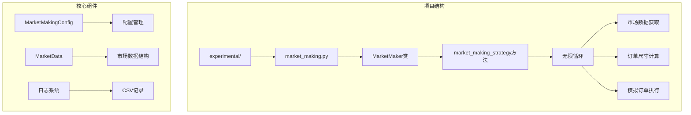
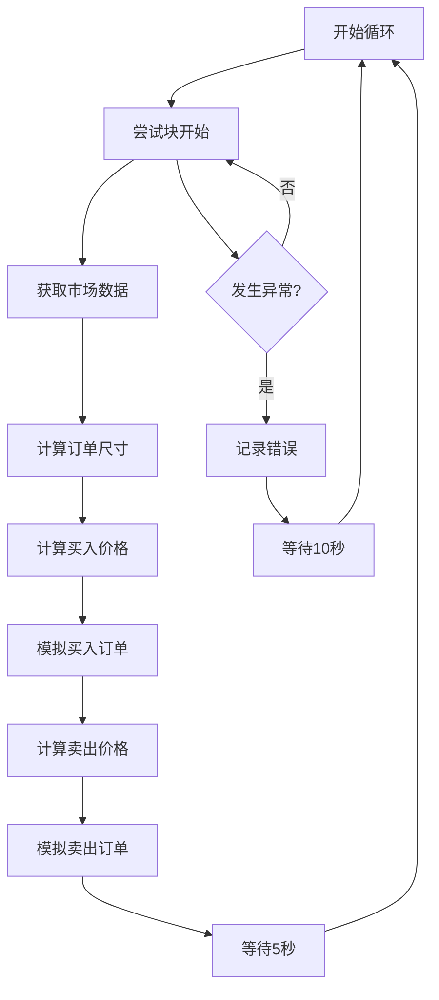
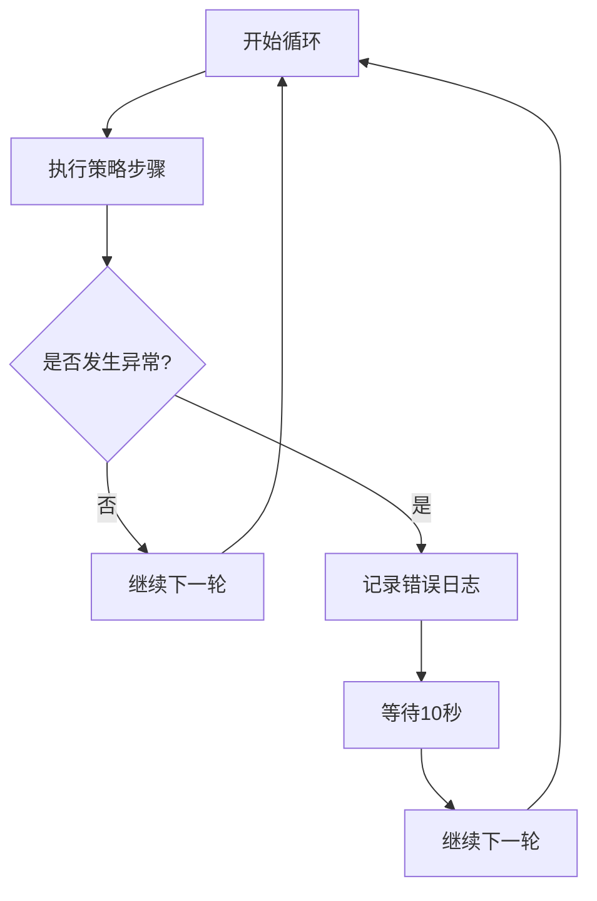
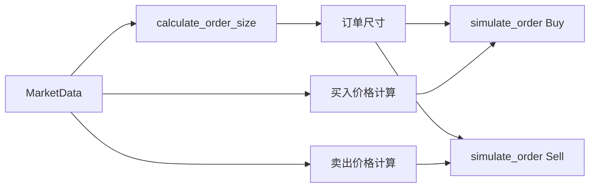
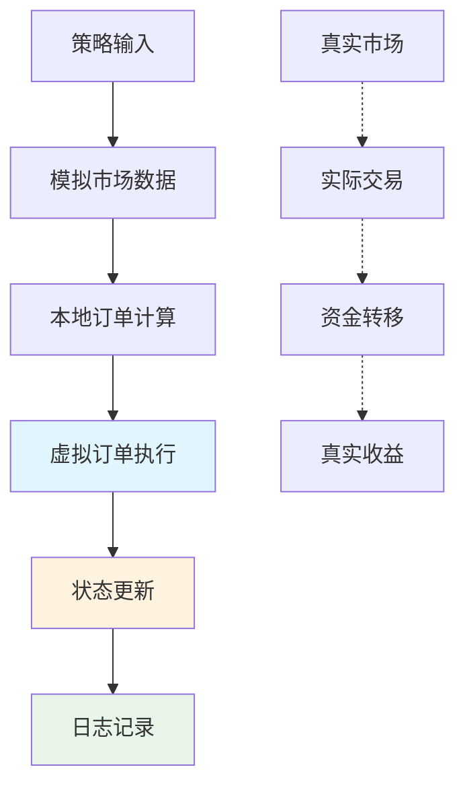

# 做市策略核心循环

<cite>
**本文档引用的文件**
- [experimental/market_making.py](file://experimental/market_making.py)
</cite>

## 目录
1. [简介](#简介)
2. [项目结构概览](#项目结构概览)
3. [核心循环架构](#核心循环架构)
4. [无限循环结构详解](#无限循环结构详解)
5. [异步休眠控制机制](#异步休眠控制机制)
6. [异常恢复逻辑](#异常恢复逻辑)
7. [关键步骤协调](#关键步骤协调)
8. [挂单价格计算方式](#挂单价格计算方式)
9. [策略频率调节参数](#策略频率调节参数)
10. [执行上下文分析](#执行上下文分析)
11. [模拟环境特性](#模拟环境特性)
12. [性能影响分析](#性能影响分析)
13. [总结](#总结)

## 简介

本文档深入分析AutoHedge项目中`market_making_strategy`方法的核心循环运行机制。该循环是做市策略的心脏，负责持续监控市场状态、计算交易参数并执行模拟交易。通过异步编程模式和精心设计的异常处理机制，确保策略在各种市场条件下都能稳定运行。

## 项目结构概览

AutoHedge项目采用模块化架构，其中做市策略位于实验性功能模块中：



**图表来源**
- [experimental/market_making.py](file://experimental/market_making.py#L19-L30)
- [experimental/market_making.py](file://experimental/market_making.py#L32-L40)

**章节来源**
- [experimental/market_making.py](file://experimental/market_making.py#L1-L50)

## 核心循环架构

`market_making_strategy`方法实现了一个典型的无限循环架构，该架构具有以下特征：



**图表来源**
- [experimental/market_making.py](file://experimental/market_making.py#L226-L247)

**章节来源**
- [experimental/market_making.py](file://experimental/market_making.py#L221-L247)

## 无限循环结构详解

核心循环采用`while True`结构，确保策略能够持续运行：

### 循环入口点
循环从[`market_making_strategy`](file://experimental/market_making.py#L221-L247)方法的第226行开始，这是一个典型的无限循环模式，适用于需要持续监控和响应的交易策略。

### 异步执行模式
整个循环采用异步编程模式，使用`async def`定义，允许与其他异步操作并发执行。这种设计使得策略能够在等待期间处理其他任务。

### 执行上下文
循环在[`run`](file://experimental/market_making.py#L249-L254)方法中被启动，该方法作为策略的主入口点，负责初始化日志系统并调用核心策略循环。

**章节来源**
- [experimental/market_making.py](file://experimental/market_making.py#L221-L254)

## 异步休眠控制机制

### 主循环间隔控制
策略使用[`asyncio.sleep(5)`](file://experimental/market_making.py#L243)实现5秒间隔控制：

```mermaid
sequenceDiagram
participant Loop as 主循环
participant Sleep as 异步休眠
participant Market as 市场数据源
Loop->>Market : 获取最新市场数据
Market-->>Loop : 返回市场快照
Loop->>Loop : 计算订单参数
Loop->>Loop : 模拟买卖订单
Loop->>Sleep : await asyncio.sleep(5)
Note over Sleep : 休眠5秒
Sleep-->>Loop : 继续下一轮
```

**图表来源**
- [experimental/market_making.py](file://experimental/market_making.py#L243)

### 休眠机制优势
- **资源效率**：避免CPU空转，降低系统负载
- **市场响应**：提供足够的时间窗口进行市场分析
- **网络友好**：减少API调用频率，避免触发限流

### 错误处理中的休眠
当发生异常时，策略会进入更长的休眠期：[`await asyncio.sleep(10)`](file://experimental/market_making.py#L247)，这有助于：
- 给系统恢复时间
- 避免频繁重试导致的额外负载
- 提供错误诊断和修复的机会

**章节来源**
- [experimental/market_making.py](file://experimental/market_making.py#L242-L247)

## 异常恢复逻辑

### 异常捕获机制
策略实现了完善的异常处理机制：



**图表来源**
- [experimental/market_making.py](file://experimental/market_making.py#L245-L247)

### 错误类型处理
主要处理以下类型的异常：
- **网络连接异常**：市场数据获取失败
- **API限制异常**：请求频率超出限制
- **数据格式异常**：返回的数据不符合预期格式
- **计算异常**：订单尺寸或价格计算错误

### 恢复策略
- **自动重试**：通过延长休眠时间实现
- **降级服务**：使用备用数据源
- **状态保持**：异常不影响当前持仓状态

**章节来源**
- [experimental/market_making.py](file://experimental/market_making.py#L245-L247)

## 关键步骤协调

### 步骤执行顺序
每次循环严格按照以下顺序执行：

1. **市场数据获取** [`fetch_market_data`](file://experimental/market_making.py#L79-L134)
2. **订单尺寸计算** [`calculate_order_size`](file://experimental/market_making.py#L136-L161)
3. **买入订单模拟** [`simulate_order`](file://experimental/market_making.py#L163-L219)
4. **卖出订单模拟** [`simulate_order`](file://experimental/market_making.py#L163-L219)
5. **休眠等待** [`asyncio.sleep`](file://experimental/market_making.py#L243)

### 数据流传递


**图表来源**
- [experimental/market_making.py](file://experimental/market_making.py#L229-L240)

### 同步与异步协调
- **同步函数**：`calculate_order_size`、`simulate_order`等本地计算函数
- **异步函数**：`fetch_market_data`、`asyncio.sleep`等I/O密集操作

**章节来源**
- [experimental/market_making.py](file://experimental/market_making.py#L229-L240)

## 挂单价格计算方式

### 对称价差原理
策略采用对称价差机制，确保买入和卖出订单之间的价差保持一致：

```mermaid
graph TB
subgraph "价格计算"
A[最佳买价] --> B[买入价格 = 最佳买价 × (1 - spread/2)]
C[最佳卖价] --> D[卖出价格 = 最佳卖价 × (1 + spread/2)]
end
subgraph "价差特性"
E[买入价格] --> F[低于市场价]
G[卖出价格] --> H[高于市场价]
F --> I[对称价差]
H --> I
end
```

**图表来源**
- [experimental/market_making.py](file://experimental/market_making.py#L235)
- [experimental/market_making.py](file://experimental/market_making.py#L239)

### 具体计算公式
- **买入价格**：`buy_price = self.market_data.best_bid * (1 - self.config.spread_percentage/2)`
- **卖出价格**：`sell_price = self.market_data.best_ask * (1 + self.config.spread_percentage/2)`

### 参数依赖关系
- **spread_percentage**：由[`MarketMakingConfig`](file://experimental/market_making.py#L25)配置决定，默认为0.1%
- **市场数据**：依赖于[`fetch_market_data`](file://experimental/market_making.py#L79-L134)提供的实时数据

### 价差效果
- **流动性提供**：通过设置有利可图的价差吸引交易对手
- **风险控制**：确保每笔交易都有正向收益预期
- **市场参与**：主动参与市场，提供买卖报价

**章节来源**
- [experimental/market_making.py](file://experimental/market_making.py#L235-L239)

## 策略频率调节参数

### 5秒间隔的重要性
策略采用5秒的固定间隔，这一参数经过精心设计：

| 参数维度 | 数值 | 说明 |
|---------|------|------|
| 时间间隔 | 5秒 | 单次循环执行周期 |
| 错误恢复 | 10秒 | 异常情况下的恢复时间 |
| 频率级别 | 12次/分钟 | 约等于每分钟执行12次策略 |
| 市场适应性 | 中等 | 平衡响应速度与资源消耗 |

### 性能影响分析
- **CPU使用率**：低至中等水平，适合长时间运行
- **内存占用**：稳定增长，主要来自日志和缓存
- **网络负载**：适中，避免触发API限制
- **市场响应**：及时但不过度频繁

### 可调参数
虽然当前实现固定为5秒，但可以通过修改[`asyncio.sleep(5)`](file://experimental/market_making.py#L243)轻松调整：

```python
# 调整到1秒间隔（高频率）
await asyncio.sleep(1)

# 调整到30秒间隔（低频率）
await asyncio.sleep(30)
```

### 频率选择原则
- **高频策略**：1-5秒，适合高流动性和快速变化的市场
- **中频策略**：5-30秒，平衡性能和响应能力
- **低频策略**：30秒以上，适合基本面分析或长期策略

**章节来源**
- [experimental/market_making.py](file://experimental/market_making.py#L243)

## 执行上下文分析

### 启动位置
策略循环在[`run`](file://experimental/market_making.py#L249-L254)方法中启动：

```mermaid
sequenceDiagram
participant Main as 主程序
participant Run as run方法
participant Strategy as market_making_strategy
participant Loop as 无限循环
Main->>Run : 调用run()
Run->>Strategy : await market_making_strategy()
Strategy->>Loop : 进入无限循环
Loop-->>Strategy : 持续执行
Strategy-->>Run : 不返回无限循环
Run-->>Main : 不返回无限循环
```

**图表来源**
- [experimental/market_making.py](file://experimental/market_making.py#L249-L254)

### 并发执行
策略支持多实例并发运行：

```python
# 多个交易对同时运行
configs = [
    MarketMakingConfig(trading_pair='BTC/USDT', total_capital=10000.0),
    MarketMakingConfig(trading_pair='ETH/USDT', total_capital=5000.0)
]

async def run_market_makers():
    market_makers = [MarketMaker(config) for config in configs]
    await asyncio.gather(*[mm.run() for mm in market_makers])
```

### 上下文隔离
每个MarketMaker实例维护独立的状态：
- **独立的市场数据**：[`self.market_data`](file://experimental/market_making.py#L51)
- **独立的库存状态**：[`self.current_inventory`](file://experimental/market_making.py#L57-L60)
- **独立的日志文件**：[`self.csv_filename`](file://experimental/market_making.py#L66)

**章节来源**
- [experimental/market_making.py](file://experimental/market_making.py#L249-L270)

## 模拟环境特性

### 完全模拟性质
该策略运行在完全模拟环境中，具有以下特点：



**图表来源**
- [experimental/market_making.py](file://experimental/market_making.py#L163-L219)

### 模拟订单特性
- **无实际资金转移**：仅更新内部状态变量
- **无真实成交**：订单不发送到交易所
- **完整生命周期**：包含下单、执行、状态更新
- **详细日志记录**：所有操作都被记录到CSV文件

### 状态管理
模拟环境维护以下状态：
- **基础资产数量**：[`self.current_inventory['base']`](file://experimental/market_making.py#L58)
- **计价资产数量**：[`self.current_inventory['quote']`](file://experimental/market_making.py#L59)
- **活跃订单列表**：[`self.active_orders`](file://experimental/market_making.py#L63)

### 测试验证
模拟环境支持：
- **回测功能**：[`backtest_market_maker`](file://experimental/market_making.py#L277-L351)
- **性能评估**：计算总回报和交易次数
- **状态追踪**：完整的历史状态记录

**章节来源**
- [experimental/market_making.py](file://experimental/market_making.py#L163-L219)
- [experimental/market_making.py](file://experimental/market_making.py#L277-L351)

## 性能影响分析

### 系统资源消耗
策略的性能特征如下：

| 资源类型 | 消耗特征 | 影响因素 |
|---------|---------|---------|
| CPU使用率 | 低至中等 | 数据解析和计算复杂度 |
| 内存使用 | 线性增长 | 日志文件大小和历史数据 |
| 网络带宽 | 低频使用 | API调用频率和数据量 |
| 存储空间 | 稳定增长 | CSV日志文件大小 |

### 市场响应能力
- **延迟**：约5秒的固定间隔
- **准确性**：基于实时市场数据的计算
- **稳定性**：完善的异常处理机制
- **扩展性**：支持多实例并发运行

### 性能优化建议
1. **硬件配置**：推荐使用多核CPU和充足内存
2. **网络优化**：使用稳定的网络连接
3. **存储优化**：定期清理旧的日志文件
4. **监控设置**：实施适当的性能监控

### 架构优势
- **异步设计**：避免阻塞操作
- **模块化结构**：便于测试和维护
- **配置灵活**：支持多种参数调整
- **日志完整**：提供详细的审计跟踪

## 总结

AutoHedge的做市策略核心循环展现了现代量化交易系统的典型特征：

### 技术亮点
- **异步编程**：充分利用异步I/O提高效率
- **无限循环**：确保策略的持续运行
- **异常处理**：完善的错误恢复机制
- **模拟环境**：安全可靠的测试框架

### 设计哲学
- **简单高效**：核心逻辑简洁明了
- **鲁棒性强**：多重保护机制
- **易于扩展**：模块化设计便于功能扩展
- **透明可控**：完整的日志和监控体系

### 应用价值
该策略为量化交易提供了：
- **学习平台**：理解做市策略的基本原理
- **测试工具**：验证交易逻辑和风险管理
- **开发基础**：作为更复杂策略的基础组件
- **研究工具**：分析市场行为和策略效果

通过深入理解这个核心循环，开发者可以更好地掌握量化交易系统的设计原理，并在此基础上构建更加复杂的交易策略。