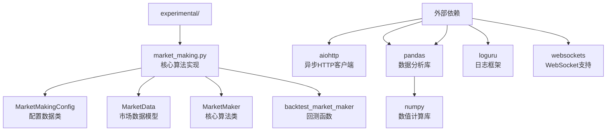
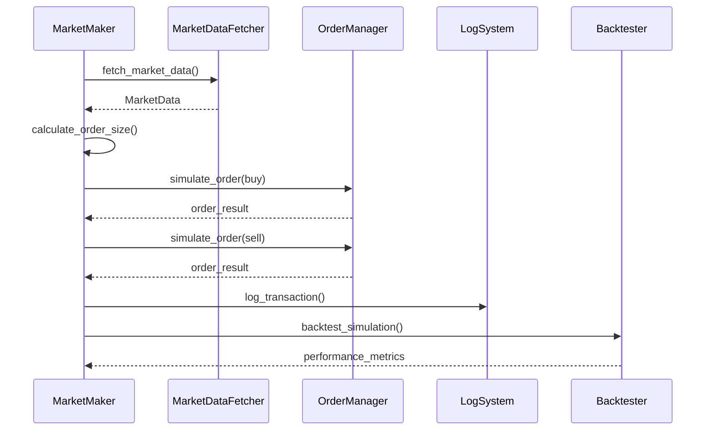
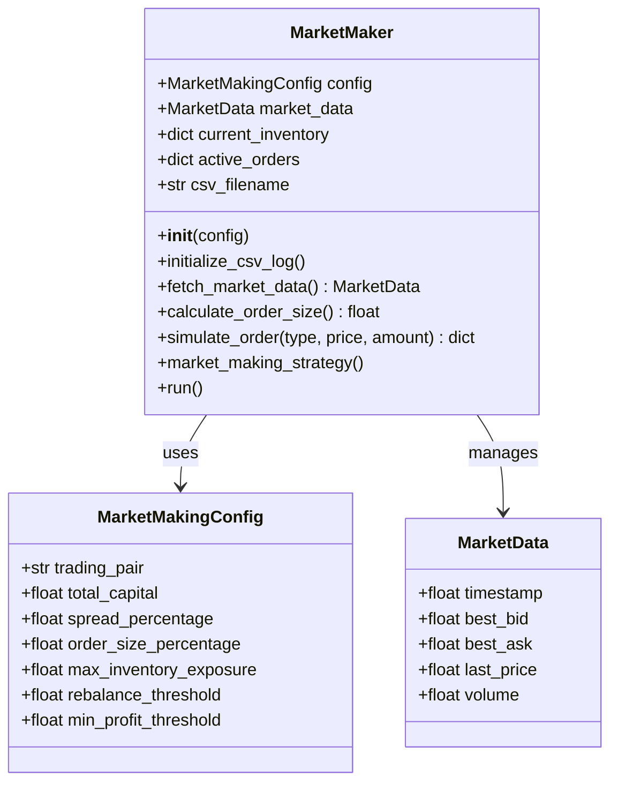
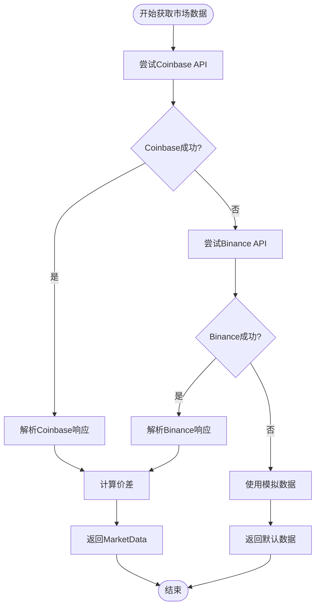
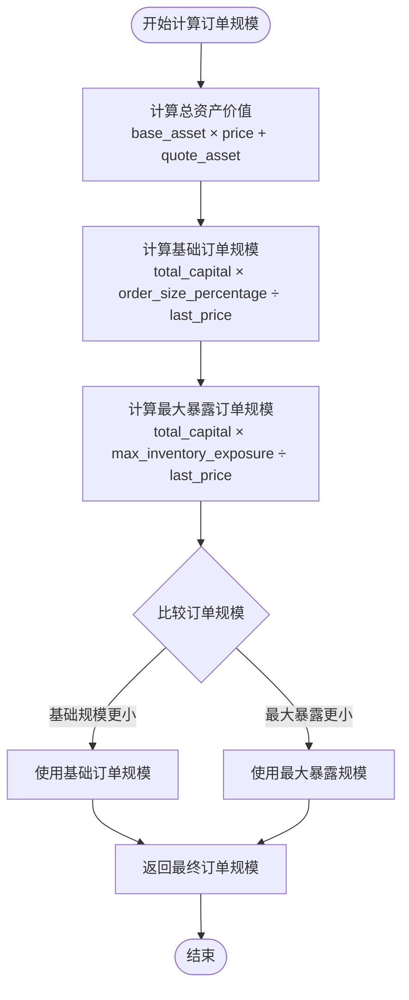
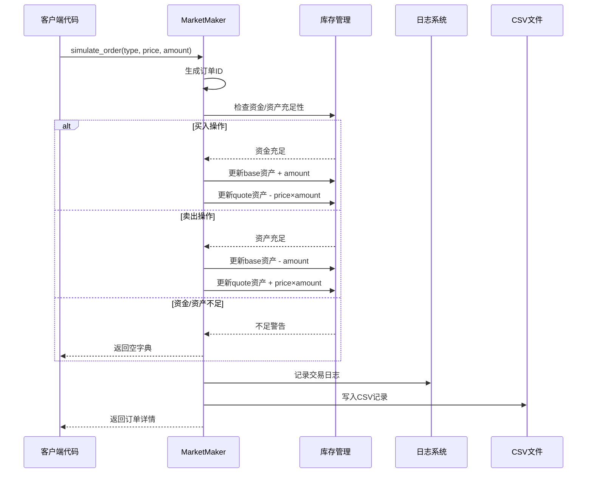
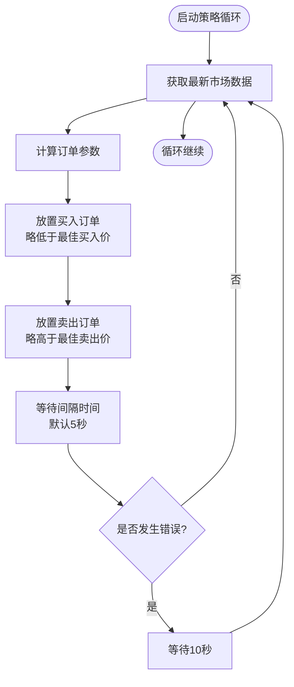
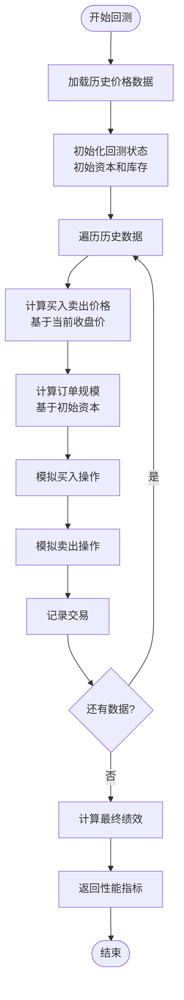
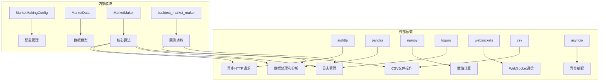

# 市场做市策略引擎

<cite>
**本文档引用的文件**
- [market_making.py](file://experimental/market_making.py)
- [README.md](file://README.md)
</cite>

## 目录
1. [简介](#简介)
2. [项目结构](#项目结构)
3. [核心组件](#核心组件)
4. [架构概览](#架构概览)
5. [详细组件分析](#详细组件分析)
6. [依赖关系分析](#依赖关系分析)
7. [性能考虑](#性能考虑)
8. [故障排除指南](#故障排除指南)
9. [结论](#结论)

## 简介

市场做市策略引擎是一个基于Python的高级自动化交易系统，专门设计用于加密货币市场的做市活动。该系统实现了完整的市场做市算法，包括实时市场数据获取、智能订单管理、风险控制和性能评估功能。作为一个模拟交易系统，它提供了真实的市场做市体验，但不直接连接到任何实际的交易平台。

该系统采用先进的异步编程模式，支持多交易对同时运作，并提供了强大的回测功能来评估策略表现。通过模块化的设计，用户可以轻松配置不同的交易参数，监控交易状态，并生成详细的性能报告。

## 项目结构

市场做市策略引擎位于项目的`experimental`目录下，包含以下关键文件：

**图表来源**
- [market_making.py](file://experimental/market_making.py#L1-L18)

**章节来源**
- [market_making.py](file://experimental/market_making.py#L1-L352)

## 核心组件

### MarketMakingConfig 数据类

MarketMakingConfig是整个系统的核心配置容器，定义了市场做市策略的所有关键参数：

| 参数名称 | 类型 | 默认值 | 描述 | 对策略行为的影响 |
|---------|------|--------|------|------------------|
| trading_pair | str | 'BTC/USDT' | 交易对标识符 | 决定交易的具体资产组合 |
| total_capital | float | 10000.0 | 总可用资本 | 影响订单规模和风险暴露 |
| spread_percentage | float | 0.001 (0.1%) | 价差百分比 | 直接影响做市利润空间 |
| order_size_percentage | float | 0.01 (1%) | 单笔订单占总资本比例 | 控制每笔交易的风险程度 |
| max_inventory_exposure | float | 0.2 (20%) | 最大库存暴露度 | 风险控制的关键参数 |
| rebalance_threshold | float | 0.1 (10%) | 重新平衡触发阈值 | 库存管理的重要指标 |
| min_profit_threshold | float | 0.002 (0.2%) | 最小利润目标 | 设定盈利要求 |

### MarketData 数据类

MarketData类封装了实时市场数据，为做市决策提供基础信息：

| 字段名称 | 类型 | 描述 | 用途 |
|---------|------|------|------|
| timestamp | float | 时间戳 | 记录数据获取时间 |
| best_bid | float | 最佳买入价 | 指导买入订单定价 |
| best_ask | float | 最佳卖出价 | 指导卖出订单定价 |
| last_price | float | 最新成交价 | 参考市场价格水平 |
| volume | float | 成交量 | 辅助流动性判断 |

**章节来源**
- [market_making.py](file://experimental/market_making.py#L20-L39)

## 架构概览

市场做市策略引擎采用事件驱动的异步架构，确保高效的数据处理和订单执行：

**图表来源**
- [market_making.py](file://experimental/market_making.py#L221-L248)
- [market_making.py](file://experimental/market_making.py#L79-L134)

系统的核心架构包含以下主要层次：

1. **数据层**: 负责从多个免费API源获取实时市场数据
2. **策略层**: 实现核心的市场做市算法逻辑
3. **执行层**: 处理订单模拟和资产状态更新
4. **监控层**: 提供CSV日志记录和性能跟踪
5. **回测层**: 支持历史数据回测和策略评估

## 详细组件分析

### MarketMaker 类核心机制

MarketMaker类是整个系统的核心，实现了完整的市场做市算法生命周期：

#### 初始化与状态管理

**图表来源**
- [market_making.py](file://experimental/market_making.py#L40-L68)
- [market_making.py](file://experimental/market_making.py#L20-L39)

#### 市场数据获取机制

系统采用多源数据获取策略，确保高可用性和数据准确性：

**图表来源**
- [market_making.py](file://experimental/market_making.py#L79-L134)

#### 订单规模计算算法

订单规模计算是风险控制的核心环节，采用动态调整策略：

**图表来源**
- [market_making.py](file://experimental/market_making.py#L136-L161)

#### 模拟订单执行机制

模拟订单系统提供了真实的交易体验，同时保持安全性：

**图表来源**
- [market_making.py](file://experimental/market_making.py#L163-L219)

#### 主循环逻辑与异步执行

市场做市策略的核心循环实现了持续的市场监控和订单管理：

**图表来源**
- [market_making.py](file://experimental/market_making.py#L221-L248)

**章节来源**
- [market_making.py](file://experimental/market_making.py#L40-L248)

### 回测功能与性能评估

系统内置了强大的回测功能，支持历史数据验证和策略优化：

#### 回测算法流程

**图表来源**
- [market_making.py](file://experimental/market_making.py#L277-L351)

#### 性能指标计算

回测系统提供全面的性能评估指标：

| 指标名称 | 计算方法 | 描述 |
|---------|----------|------|
| 初始资本 | config.total_capital | 回测开始时的总资金 |
| 最终价值 | base_asset × 最后价格 + quote_asset | 回测结束时的总资产价值 |
| 总回报率 | (最终价值 - 初始资本) / 初始资本 × 100% | 整体收益率 |
| 总交易次数 | 所有买入和卖出交易的总和 | 交易活跃度指标 |

**章节来源**
- [market_making.py](file://experimental/market_making.py#L277-L351)

## 依赖关系分析

系统依赖关系展现了清晰的分层架构：

**图表来源**
- [market_making.py](file://experimental/market_making.py#L1-L18)

**章节来源**
- [market_making.py](file://experimental/market_making.py#L1-L18)

## 性能考虑

### 异步编程优势

系统采用asyncio异步编程模型，具有以下优势：
- **非阻塞I/O**: 市场数据获取不会阻塞主线程
- **并发处理**: 支持多个交易对同时运行
- **资源效率**: 更少的线程开销和内存占用
- **响应速度**: 快速的网络请求和数据处理

### 内存管理策略

- **数据缓存**: 只保留必要的市场数据和订单信息
- **日志轮转**: 自动轮转CSV日志文件，防止磁盘空间耗尽
- **异常处理**: 完善的错误捕获和恢复机制

### 网络优化

- **多源备份**: Coinbase和Binance双重数据源
- **超时控制**: 合理的网络请求超时设置
- **重试机制**: 自动重试失败的网络请求

## 故障排除指南

### 常见问题及解决方案

#### 网络连接问题
- **症状**: 市场数据获取失败
- **原因**: 网络不稳定或API限制
- **解决方案**: 检查网络连接，系统自动切换到备用数据源

#### 资金不足警告
- **症状**: 模拟买入订单被拒绝
- **原因**: 当前quote资产不足以完成买入
- **解决方案**: 调整订单大小或增加总资本配置

#### 性能问题
- **症状**: 循环执行缓慢
- **原因**: 网络延迟或系统负载过高
- **解决方案**: 调整sleep间隔时间或检查系统资源

**章节来源**
- [market_making.py](file://experimental/market_making.py#L105-L126)
- [market_making.py](file://experimental/market_making.py#L183-L195)
- [market_making.py](file://experimental/market_making.py#L246-L247)

## 结论

市场做市策略引擎是一个功能完整、设计精良的自动化交易系统。它成功地将复杂的市场做市算法转化为可配置、可监控、可测试的模块化系统。通过异步编程模型和多源数据获取策略，系统实现了高性能和高可靠性。

该系统的主要优势包括：
- **模块化设计**: 清晰的职责分离和易于扩展的架构
- **风险控制**: 完善的订单规模计算和库存管理机制
- **监控能力**: 详细的CSV日志记录和性能跟踪
- **回测功能**: 强大的历史数据验证和策略评估能力
- **容错机制**: 多重备份和自动恢复策略

作为模拟交易系统，它为用户提供了一个安全可靠的平台来测试和优化市场做市策略，是学习和研究量化交易的理想工具。通过合理的参数配置和持续的性能监控，用户可以在这个平台上开发出高效的市场做市策略。