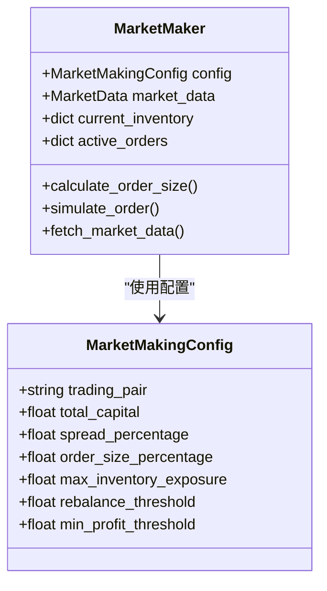
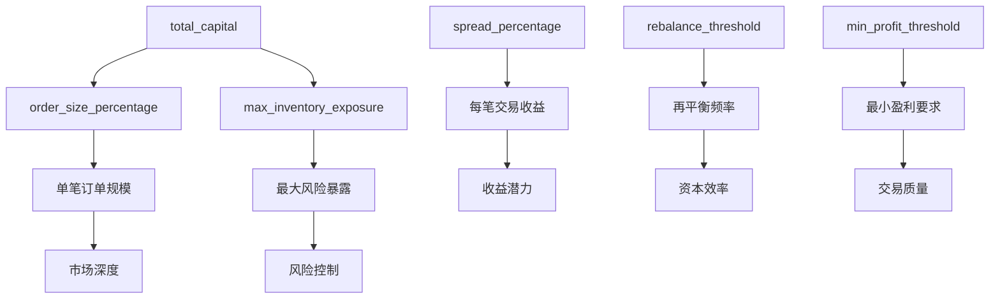
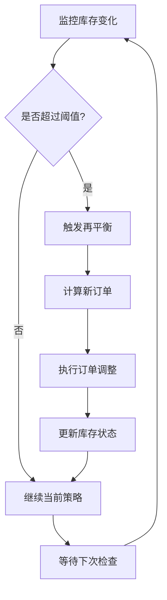
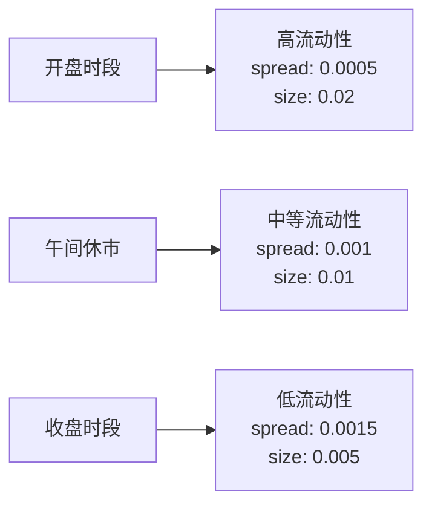
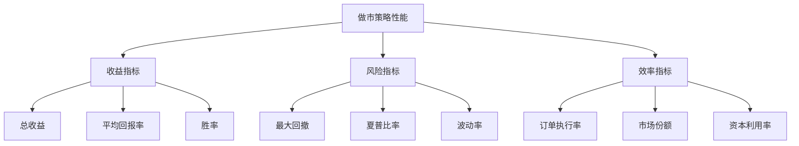
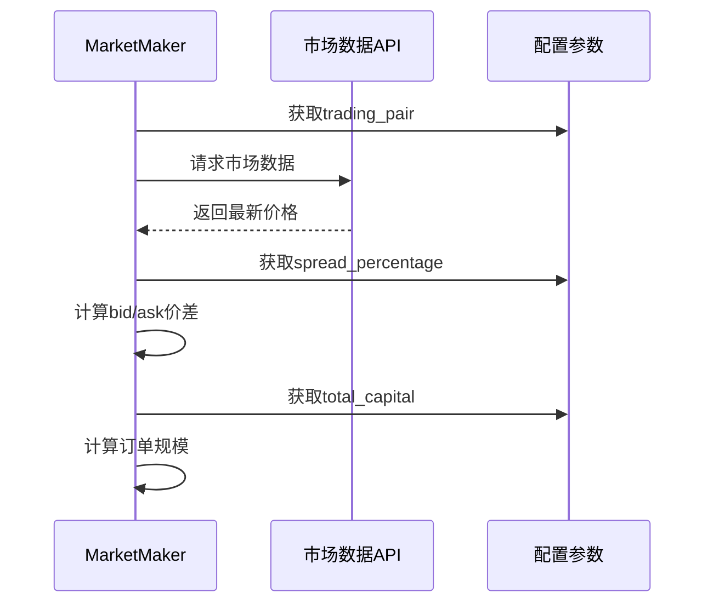
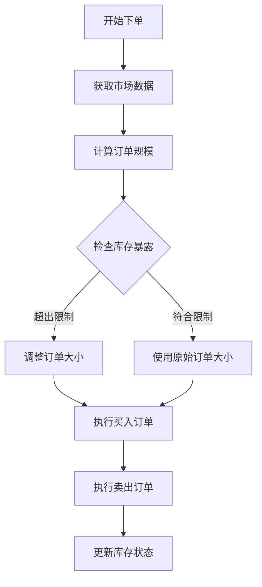

# 市场做市策略配置

<cite>
**本文档引用的文件**
- [experimental/market_making.py](file://experimental/market_making.py)
- [README.md](file://README.md)
</cite>

## 目录
1. [简介](#简介)
2. [MarketMakingConfig数据类详解](#marketmakingconfig数据类详解)
3. [核心参数深入分析](#核心参数深入分析)
4. [参数相互关系与影响](#参数相互关系与影响)
5. [配置实例与最佳实践](#配置实例与最佳实践)
6. [参数调优指南](#参数调优指南)
7. [代码实现细节](#代码实现细节)
8. [总结](#总结)

## 简介

市场做市策略是一种通过同时挂出买入和卖出订单来赚取买卖价差收益的交易策略。AutoHedge项目中的市场做市模块提供了灵活且可配置的策略框架，允许用户通过调整多个关键参数来优化做市行为。本文档将详细解析MarketMakingConfig数据类中定义的各项策略参数，帮助用户理解每个参数的作用及其对做市行为的影响。

## MarketMakingConfig数据类详解

MarketMakingConfig是一个使用Python数据类装饰器定义的配置类，专门用于市场做市策略的参数设置。该类包含了六个核心配置参数，每个参数都经过精心设计以控制不同的策略行为。



**图表来源**
- [experimental/market_making.py](file://experimental/market_making.py#L19-L30)
- [experimental/market_making.py](file://experimental/market_making.py#L40-L68)

**章节来源**
- [experimental/market_making.py](file://experimental/market_making.py#L19-L30)

## 核心参数深入分析

### trading_pair（交易对）

**默认值：** `'BTC/USDT'`

**作用机制：**
- 指定做市交易的具体交易对
- 影响市场数据获取和订单计算
- 决定基础资产和报价资产的识别

**技术实现：**
```python
# 在MarketMaker初始化时使用
self.csv_filename = f"market_making_{config.trading_pair}_{datetime.now().strftime('%Y%m%d_%H%M%S')}.csv"
```

**影响因素：**
- 不同交易对的流动性差异
- 资产价格波动性
- 市场深度特征

### total_capital（总资金量）

**默认值：** `10000.0`

**作用机制：**
- 定义可用于做市的总可用资金
- 影响单笔订单规模和整体仓位管理
- 是所有基于资本的计算的基础

**技术实现：**
```python
# 初始化库存状态
self.current_inventory = {
    'base': 0.0,  # e.g., BTC amount
    'quote': config.total_capital  # e.g., USDT amount
}
```

**风险考虑：**
- 过高的资金量可能导致流动性风险
- 需要与最大库存暴露参数协调使用

### spread_percentage（价差百分比）

**默认值：** `0.001`（即0.1%）

**作用机制：**
- 定义买入和卖出订单之间的价差比例
- 直接影响做市收益和竞争力
- 控制市场参与的价格优势

**技术实现：**
```python
# 计算买入和卖出价格
buy_price = self.market_data.best_bid * (1 - self.config.spread_percentage/2)
sell_price = self.market_data.best_ask * (1 + self.config.spread_percentage/2)
```

**市场影响：**
- 较小的价差提高竞争力但降低利润
- 较大的价差增加利润但可能失去流动性

### order_size_percentage（订单规模占比）

**默认值：** `0.01`（即1%）

**作用机制：**
- 规定每次下单占总资金的比例
- 平衡市场流动性和风险控制
- 影响做市深度和市场影响力

**技术实现：**
```python
# 计算订单大小
order_size = (
    self.config.total_capital * 
    self.config.order_size_percentage / 
    self.market_data.last_price
)
```

**风险管理：**
- 需要与最大库存暴露参数配合使用
- 避免因单一订单过大导致的风险

### max_inventory_exposure（最大库存暴露）

**默认值：** `0.2`（即20%）

**作用机制：**
- 设定单个资产的最大持仓比例
- 实施严格的风险控制措施
- 防止过度暴露于单一资产

**技术实现：**
```python
# 风险管理：确保订单大小不超过最大库存暴露
max_order_size = (
    self.config.total_capital * 
    self.config.max_inventory_exposure / 
    self.market_data.last_price
)
return min(order_size, max_order_size)
```

**风险控制原则：**
- 保护资本免受极端市场波动
- 维持合理的资产分散度
- 防止头寸过度集中

### rebalance_threshold（再平衡阈值）

**默认值：** `0.1`（即10%）

**作用机制：**
- 定义触发重新平衡的库存偏差阈值
- 自动调整库存以维持目标配置
- 平衡风险和收益

**应用场景：**
- 当库存偏离目标比例超过阈值时启动再平衡
- 减少长期持有的风险暴露
- 优化资本利用效率

**章节来源**
- [experimental/market_making.py](file://experimental/market_making.py#L19-L30)
- [experimental/market_making.py](file://experimental/market_making.py#L43-L68)

## 参数相互关系与影响

### 参数间的协同效应



**图表来源**
- [experimental/market_making.py](file://experimental/market_making.py#L136-L161)
- [experimental/market_making.py](file://experimental/market_making.py#L234-L240)

### 关键参数组合分析

| 参数组合 | 风险水平 | 收益潜力 | 流动性提供能力 | 适用场景 |
|---------|---------|---------|---------------|----------|
| 高spread + 低order_size | 低风险 | 中等收益 | 强 | 高波动市场 |
| 低spread + 高order_size | 高风险 | 高收益 | 弱 | 低波动市场 |
| 适中spread + 适中order_size | 中等风险 | 中等收益 | 中等 | 一般市场 |

### 动态调整机制

系统实现了智能的参数动态调整机制：



**图表来源**
- [experimental/market_making.py](file://experimental/market_making.py#L221-L248)

**章节来源**
- [experimental/market_making.py](file://experimental/market_making.py#L136-L161)
- [experimental/market_making.py](file://experimental/market_making.py#L221-L248)

## 配置实例与最佳实践

### 基础配置示例

以下是几种典型的配置场景：

#### 保守型配置（适合新手或低风险偏好）
```python
conservative_config = MarketMakingConfig(
    trading_pair='BTC/USDT',
    total_capital=5000.0,
    spread_percentage=0.0005,  # 0.05%
    order_size_percentage=0.005,  # 0.5%
    max_inventory_exposure=0.1,  # 10%
    rebalance_threshold=0.05  # 5%
)
```

#### 平衡型配置（适合中等经验用户）
```python
balanced_config = MarketMakingConfig(
    trading_pair='BTC/USDT',
    total_capital=10000.0,
    spread_percentage=0.001,  # 0.1%
    order_size_percentage=0.01,  # 1%
    max_inventory_exposure=0.2,  # 20%
    rebalance_threshold=0.1  # 10%
)
```

#### 积极型配置（适合有经验的交易者）
```python
aggressive_config = MarketMakingConfig(
    trading_pair='BTC/USDT',
    total_capital=20000.0,
    spread_percentage=0.002,  # 0.2%
    order_size_percentage=0.02,  # 2%
    max_inventory_exposure=0.3,  # 30%
    rebalance_threshold=0.15  # 15%
)
```

### 行业最佳实践

#### 不同市场条件下的参数调整

| 市场类型 | spread_percentage | order_size_percentage | max_inventory_exposure |
|---------|-------------------|----------------------|------------------------|
| 高波动市场 | 0.0008-0.0012 | 0.005-0.01 | 0.15-0.25 |
| 低波动市场 | 0.0005-0.0008 | 0.01-0.02 | 0.2-0.3 |
| 监管严格市场 | 0.0003-0.0005 | 0.003-0.008 | 0.1-0.2 |

#### 时间维度的参数优化



**章节来源**
- [experimental/market_making.py](file://experimental/market_making.py#L262-L265)
- [experimental/market_making.py](file://experimental/market_making.py#L256-L272)

## 参数调优指南

### 风险评估矩阵

| 风险等级 | spread_percentage | order_size_percentage | max_inventory_exposure | 推荐用途 |
|---------|-------------------|----------------------|------------------------|----------|
| 极低风险 | 0.0003-0.0005 | 0.001-0.003 | 0.05-0.1 | 教育用途 |
| 低风险 | 0.0005-0.0008 | 0.003-0.008 | 0.1-0.15 | 小额交易 |
| 中等风险 | 0.0008-0.0012 | 0.008-0.015 | 0.15-0.25 | 标准交易 |
| 高风险 | 0.0012-0.002 | 0.015-0.03 | 0.25-0.4 | 大额交易 |

### 性能指标监控

#### 关键性能指标（KPIs）



### 动态参数调整策略

#### 基于市场条件的自适应调整

```python
def adaptive_parameter_adjustment(market_volatility, liquidity_score):
    """
    根据市场条件动态调整参数
    """
    adjustment_factor = 1.0
    
    # 高波动性市场：降低风险参数
    if market_volatility > 0.15:
        adjustment_factor = 0.7
        
    # 低流动性市场：提高价差
    if liquidity_score < 0.3:
        adjustment_factor = 1.2
    
    return {
        'spread_percentage': base_spread * adjustment_factor,
        'order_size_percentage': base_size * adjustment_factor,
        'max_inventory_exposure': base_exposure * adjustment_factor
    }
```

### 回测与验证

#### 回测脚本使用示例

```python
# 使用历史数据验证配置效果
backtest_results = backtest_market_maker(
    historical_data_path='historical_prices.csv',
    config=MarketMakingConfig(
        trading_pair='BTC/USDT',
        total_capital=10000.0,
        spread_percentage=0.001,
        order_size_percentage=0.01
    )
)
```

**章节来源**
- [experimental/market_making.py](file://experimental/market_making.py#L277-L352)

## 代码实现细节

### MarketMaker类的配置读取机制

MarketMaker类通过构造函数接收MarketMakingConfig实例，并将其存储为内部属性：

```python
def __init__(self, config: MarketMakingConfig):
    self.config = config
    # 其他初始化逻辑...
```

### 参数在策略中的应用

#### 市场数据获取过程


**图表来源**
- [experimental/market_making.py](file://experimental/market_making.py#L79-L135)
- [experimental/market_making.py](file://experimental/market_making.py#L136-L161)

#### 订单计算流程


**图表来源**
- [experimental/market_making.py](file://experimental/market_making.py#L136-L161)
- [experimental/market_making.py](file://experimental/market_making.py#L232-L240)

### 错误处理与边界情况

#### 参数有效性检查
```python
# 在实际应用中，应该添加参数有效性检查
if config.spread_percentage <= 0 or config.spread_percentage > 0.1:
    raise ValueError("价差百分比应在0到10%之间")
    
if config.order_size_percentage <= 0 or config.order_size_percentage > 0.1:
    raise ValueError("订单规模占比应在0到10%之间")
```

#### 异常恢复机制
```python
try:
    # 主要业务逻辑
    pass
except Exception as e:
    logger.error(f"市场做市策略错误: {e}")
    await asyncio.sleep(10)  # 错误后暂停10秒
```

**章节来源**
- [experimental/market_making.py](file://experimental/market_making.py#L43-L68)
- [experimental/market_making.py](file://experimental/market_making.py#L79-L135)
- [experimental/market_making.py](file://experimental/market_making.py#L221-L248)

## 总结

MarketMakingConfig数据类为市场做市策略提供了全面而灵活的配置框架。通过合理设置trading_pair、total_capital、spread_percentage、order_size_percentage、max_inventory_exposure和rebalance_threshold等参数，用户可以：

1. **精确控制风险暴露**：通过max_inventory_exposure和rebalance_threshold参数实现精细化风险管理
2. **优化收益潜力**：通过spread_percentage和order_size_percentage参数平衡收益与风险
3. **适应不同市场环境**：通过trading_pair参数支持多种交易对的做市需求
4. **实现自动化管理**：通过total_capital参数实现自动化的资金管理和订单执行

### 最佳实践建议

1. **渐进式配置**：从保守配置开始，逐步调整参数以找到最适合的策略
2. **持续监控**：定期评估策略表现，根据市场变化调整参数
3. **风险隔离**：不要将全部资金投入单一策略，保持适当的分散投资
4. **回测验证**：在实盘前充分测试策略的有效性和稳定性

### 发展方向

随着市场的不断发展，市场做市策略也在持续演进。未来的改进方向可能包括：
- 更智能的参数自适应调整算法
- 更复杂的市场预测模型集成
- 更精细的风险管理系统
- 更多交易对和资产类别的支持

通过深入理解和正确使用MarketMakingConfig配置，用户可以构建出既稳健又高效的市场做市策略，在竞争激烈的金融市场中获得稳定的收益。