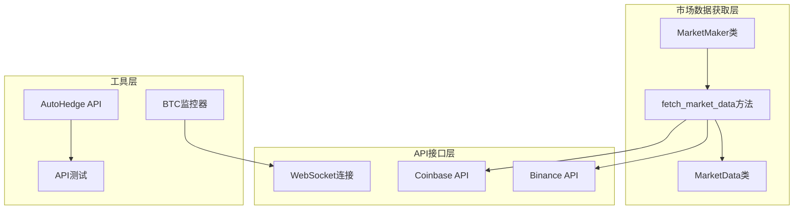
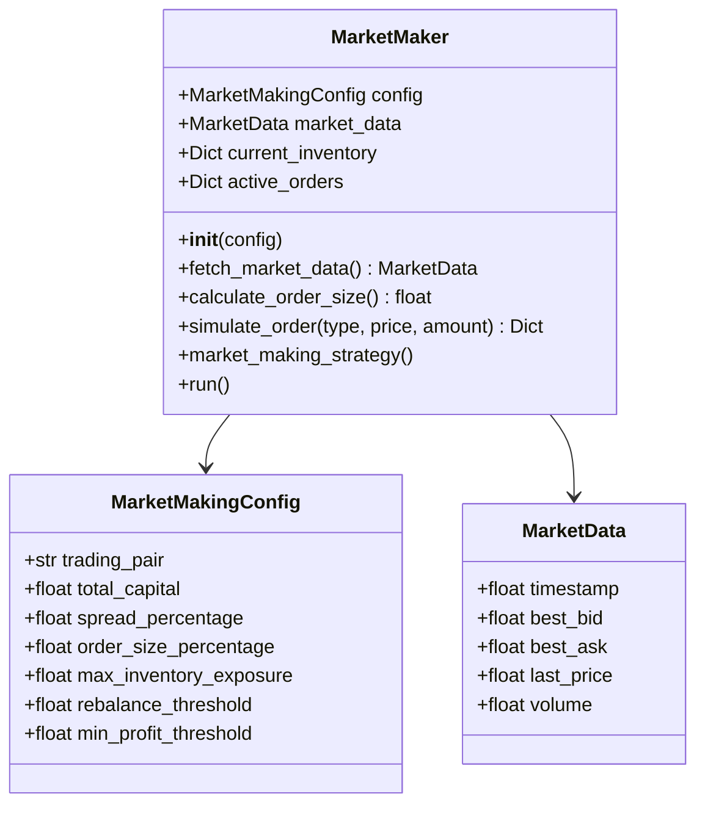
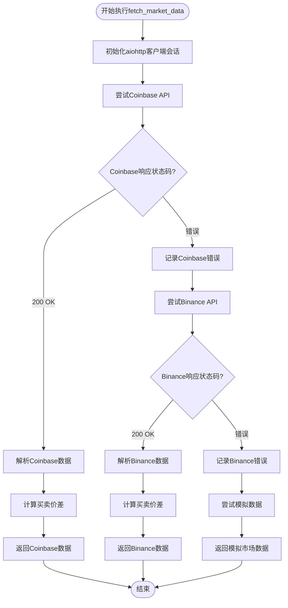
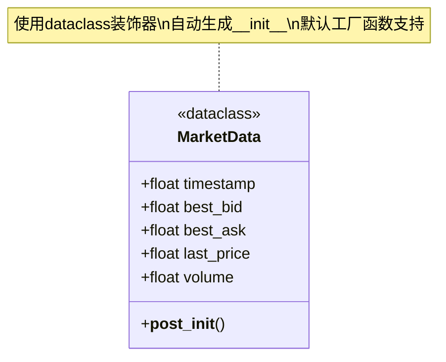
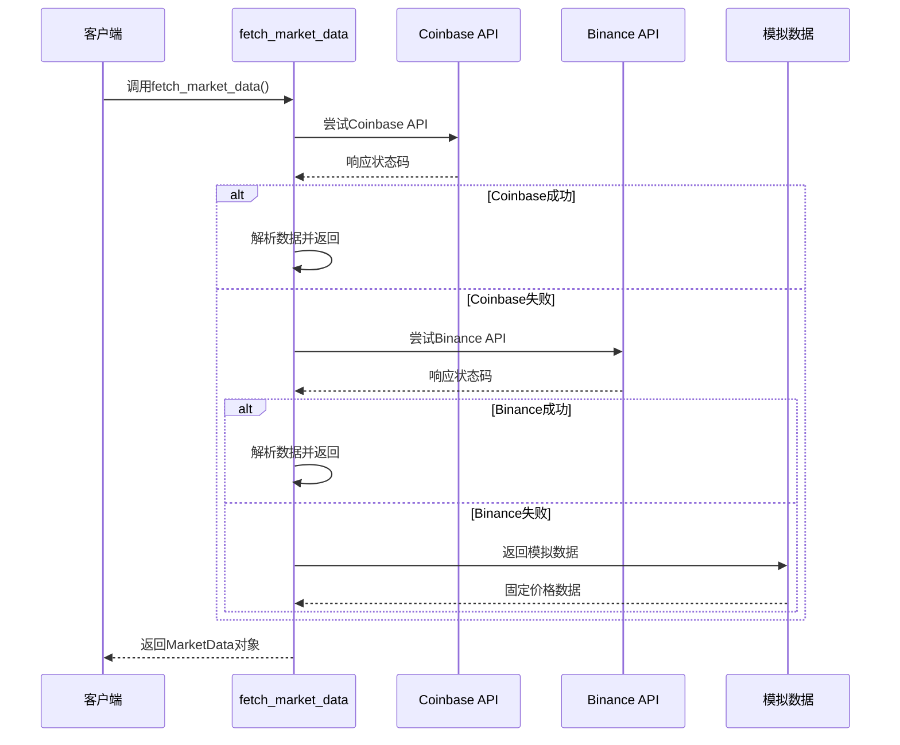
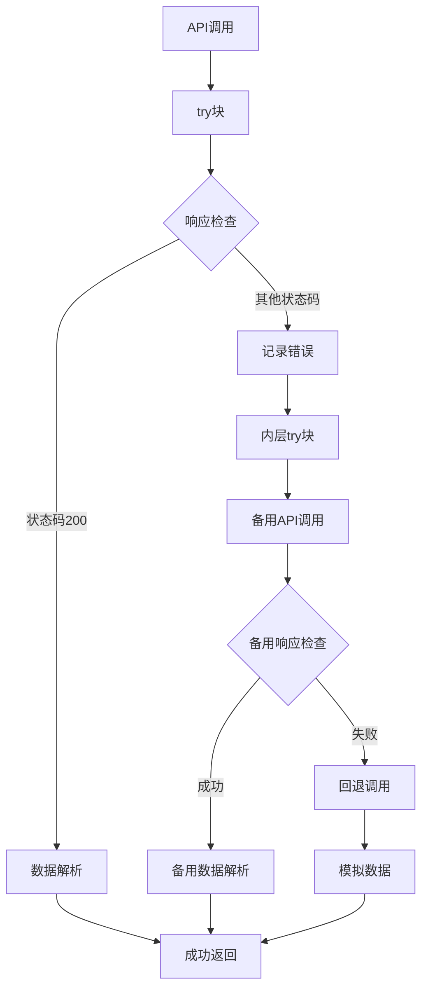
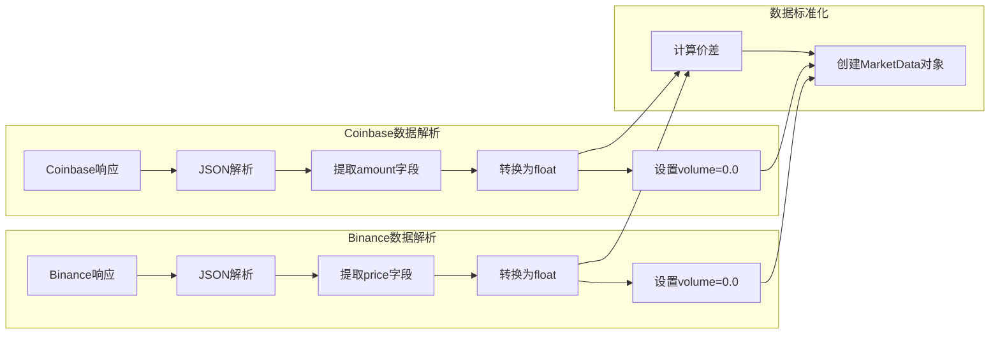
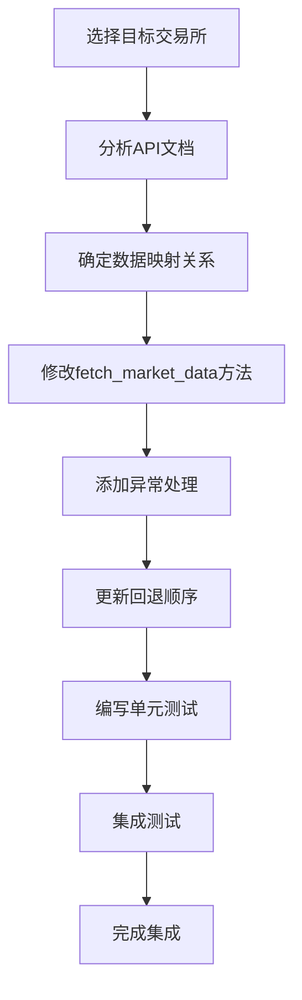
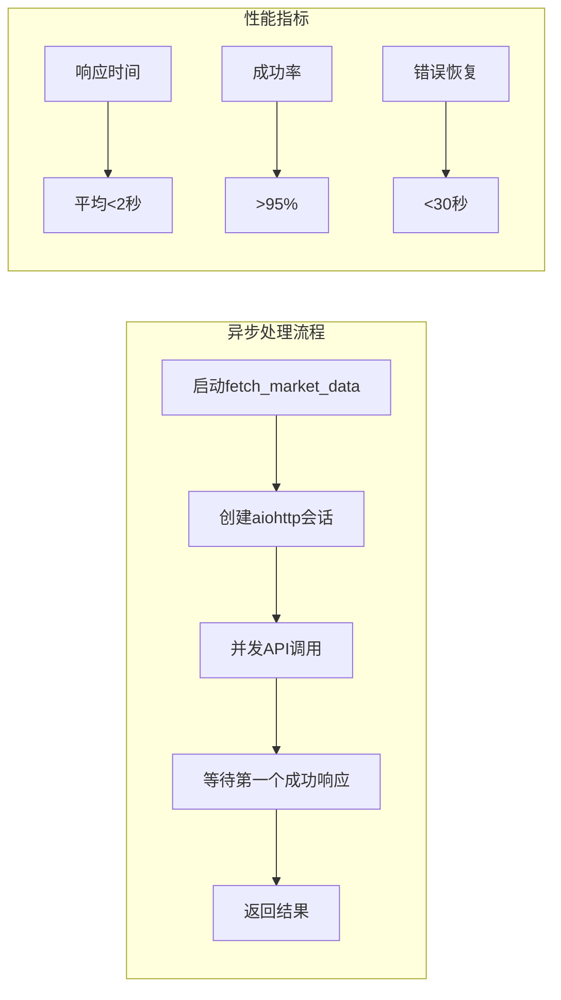
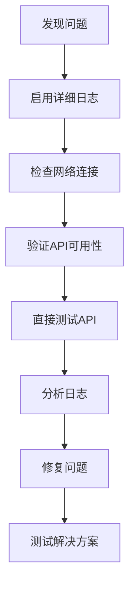

# 市场数据获取机制

<cite>
**本文档中引用的文件**
- [market_making.py](file://experimental/market_making.py)
- [btc_agent.py](file://experimental/btc_agent.py)
- [api.py](file://api/api.py)
- [api_tests.py](file://api/api_tests.py)
</cite>

## 目录
1. [简介](#简介)
2. [项目架构概览](#项目架构概览)
3. [核心组件分析](#核心组件分析)
4. [fetch_market_data异步方法实现](#fetch_market_data异步方法实现)
5. [MarketData类结构设计](#marketdata类结构设计)
6. [多级回退机制](#多级回退机制)
7. [网络异常处理](#网络异常处理)
8. [数据标准化与解析](#数据标准化与解析)
9. [扩展新交易所API指南](#扩展新交易所api指南)
10. [性能考虑与优化](#性能考虑与优化)
11. [故障排除指南](#故障排除指南)
12. [总结](#总结)

## 简介

本文档深入阐述了autoHedge项目中的市场数据获取机制，重点关注`fetch_market_data`异步方法的实现逻辑。该机制通过aiohttp库从Coinbase和Binance等公开API获取实时价格数据，并实现了完善的多级回退策略以确保系统稳定性。

当前实现采用只读模拟模式，不涉及真实资金操作，主要用于市场数据研究和算法验证。

## 项目架构概览

autoHedge项目采用模块化架构设计，主要包含以下核心模块：



**图表来源**
- [market_making.py](file://experimental/market_making.py#L40-L85)
- [btc_agent.py](file://experimental/btc_agent.py#L1-L50)

## 核心组件分析

### MarketMaker类

MarketMaker类是市场数据获取的核心控制器，负责协调整个市场数据获取流程：



**图表来源**
- [market_making.py](file://experimental/market_making.py#L20-L40)
- [market_making.py](file://experimental/market_making.py#L31-L38)

**章节来源**
- [market_making.py](file://experimental/market_making.py#L40-L85)

## fetch_market_data异步方法实现

### 方法签名与功能概述

`fetch_market_data`方法是市场数据获取的核心异步函数，采用三重回退策略确保数据获取的可靠性：



**图表来源**
- [market_making.py](file://experimental/market_making.py#L79-L134)

### Coinbase API集成

方法首先尝试从Coinbase公共API获取实时价格数据：

| API端点 | 请求方法 | 参数 | 响应格式 | 数据字段 |
|---------|----------|------|----------|----------|
| `/v2/prices/{pair}/spot` | GET | trading_pair | JSON | amount, currency |
| 示例URL | | BTC-USD | `{"data":{"amount":"50000.00","currency":"USD"}}` | last_price |

### Binance API集成

当Coinbase不可用时，自动切换到Binance API作为备用数据源：

| API端点 | 请求方法 | 参数 | 响应格式 | 数据字段 |
|---------|----------|------|----------|----------|
| `/api/v3/ticker/price` | GET | symbol | JSON | price, symbol |
| 示例URL | | BTCUSDT | `{"price":"50000.00","symbol":"BTCUSDT"}` | last_price |

**章节来源**
- [market_making.py](file://experimental/market_making.py#L79-L134)

## MarketData类结构设计

### 类定义与字段含义

MarketData类采用Python数据类设计，提供简洁高效的数据结构：

| 字段名 | 类型 | 默认值 | 含义 | 用途 |
|--------|------|--------|------|------|
| `timestamp` | float | `time.time()` | 时间戳 | 记录数据获取时间 |
| `best_bid` | float | 0.0 | 最佳买入价 | 市场买方报价 |
| `best_ask` | float | 0.0 | 最佳卖出价 | 市场卖方报价 |
| `last_price` | float | 0.0 | 最新成交价 | 当前市场价格 |
| `volume` | float | 0.0 | 成交量 | 24小时交易量 |

### 数据结构优势



**图表来源**
- [market_making.py](file://experimental/market_making.py#L31-L38)

**章节来源**
- [market_making.py](file://experimental/market_making.py#L31-L38)

## 多级回退机制

### 回退策略架构

系统实现了三层回退机制，确保在任何情况下都能提供可用的市场数据：



**图表来源**
- [market_making.py](file://experimental/market_making.py#L79-L134)

### 回退级别详解

| 级别 | 数据源 | 可靠性 | 延迟 | 数据质量 | 使用场景 |
|------|--------|--------|------|----------|----------|
| 第一级 | Coinbase API | 高 | 低 | 最高 | 主要数据源 |
| 第二级 | Binance API | 中 | 中 | 高 | 备用数据源 |
| 第三级 | 模拟数据 | 最高 | 最低 | 基础 | 系统保护 |

**章节来源**
- [market_making.py](file://experimental/market_making.py#L79-L134)

## 网络异常处理

### 异常处理策略

系统采用分层异常处理机制，确保网络问题不会影响整体系统运行：



**图表来源**
- [market_making.py](file://experimental/market_making.py#L79-L134)

### 错误日志记录

系统使用loguru库进行详细的错误日志记录：

| 日志级别 | 触发条件 | 日志内容 | 示例 |
|----------|----------|----------|------|
| ERROR | API调用失败 | 具体错误信息 | `"Market data fetch error: Timeout"` |
| INFO | 成功获取数据 | 数据摘要信息 | `"Successfully fetched market data"` |

**章节来源**
- [market_making.py](file://experimental/market_making.py#L105-L134)

## 数据标准化与解析

### 数据解析流程

系统对不同交易所的API响应进行统一的数据标准化处理：



**图表来源**
- [market_making.py](file://experimental/market_making.py#L88-L123)

### 价差计算机制

系统采用配置化的价差计算方式：

| 配置参数 | 默认值 | 计算公式 | 说明 |
|----------|--------|----------|------|
| spread_percentage | 0.001 (0.1%) | `last_price × spread_percentage` | 买卖价差比例 |
| best_bid | `last_price - spread/2` | 基于最新价格计算 | 买入委托价格 |
| best_ask | `last_price + spread/2` | 基于最新价格计算 | 卖出委托价格 |

**章节来源**
- [market_making.py](file://experimental/market_making.py#L88-L123)

## 扩展新交易所API指南

### 实现步骤

要扩展支持新的交易所API，需要遵循以下步骤：



### 新交易所集成模板

以下是添加新交易所的代码模板：

```python
# 在try块中添加新的交易所API调用
async with session.get(f"https://api.newexchange.com/v1/ticker?symbol={self.config.trading_pair}") as response:
    if response.status == 200:
        data = await response.json()
        last_price = float(data['last_price'])  # 根据实际API调整字段名
        
        spread = last_price * self.config.spread_percentage
        
        return MarketData(
            timestamp=time.time(),
            best_bid=last_price - spread/2,
            best_ask=last_price + spread/2,
            last_price=last_price,
            volume=float(data.get('volume', 0.0))  # 如果有volume字段
        )
```

### 集成注意事项

| 注意事项 | 说明 | 示例 |
|----------|------|------|
| URL格式 | 确保API URL正确 | `https://api.exchange.com/v1/ticker` |
| 字段映射 | 正确映射价格字段 | `data['last_price']` |
| 异常处理 | 添加适当的错误处理 | `except Exception as e:` |
| 数据验证 | 验证必需字段存在 | `if 'last_price' in data:` |
| 性能考虑 | 设置合理的超时时间 | `timeout=aiohttp.ClientTimeout(total=10)` |

## 性能考虑与优化

### 并发处理优化

系统采用异步编程模型，充分利用并发特性：



### 缓存策略建议

虽然当前实现没有缓存机制，但可以考虑以下优化方案：

| 优化方案 | 实现难度 | 性能提升 | 适用场景 |
|----------|----------|----------|----------|
| 内存缓存 | 低 | 显著 | 高频访问 |
| 分布式缓存 | 中 | 很大 | 多实例部署 |
| CDN加速 | 高 | 中等 | 全球用户 |

## 故障排除指南

### 常见问题诊断

| 问题类型 | 症状 | 可能原因 | 解决方案 |
|----------|------|----------|----------|
| API调用失败 | Timeout错误 | 网络连接问题 | 检查网络连接，增加超时时间 |
| 数据解析错误 | JSON解析失败 | API响应格式变化 | 更新数据解析逻辑 |
| 回退机制失效 | 始终使用模拟数据 | 所有API都不可用 | 检查网络和API状态 |
| 性能问题 | 响应时间过长 | 网络延迟或API限流 | 优化网络配置或使用更快的API |

### 调试技巧



**章节来源**
- [market_making.py](file://experimental/market_making.py#L105-L134)

## 总结

autoHedge项目的市场数据获取机制展现了现代金融应用的最佳实践：

### 核心优势

1. **高可靠性**：三重回退机制确保系统稳定运行
2. **高性能**：异步并发处理提供快速响应
3. **可扩展性**：模块化设计便于添加新数据源
4. **容错性**：完善的异常处理保证系统健壮性

### 技术特点

- 采用Python 3.7+的async/await语法
- 使用aiohttp实现高效的异步HTTP客户端
- 数据类提供简洁的数据结构
- 分层异常处理确保系统稳定性

### 应用价值

该机制为量化交易策略提供了可靠的数据基础，支持：
- 市场数据分析
- 策略回测
- 实时交易决策
- 风险管理

当前实现为只读模拟模式，专注于数据获取和处理能力，为后续实盘交易奠定了坚实基础。