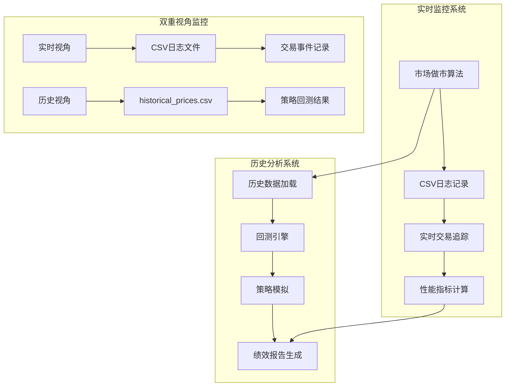
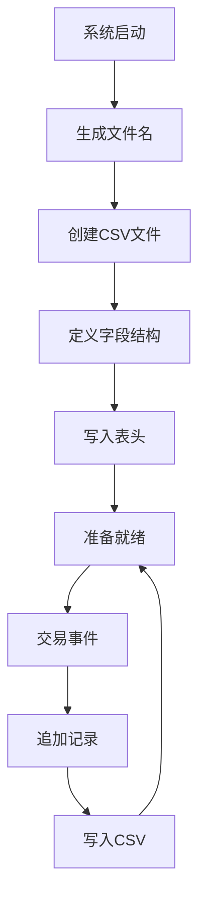
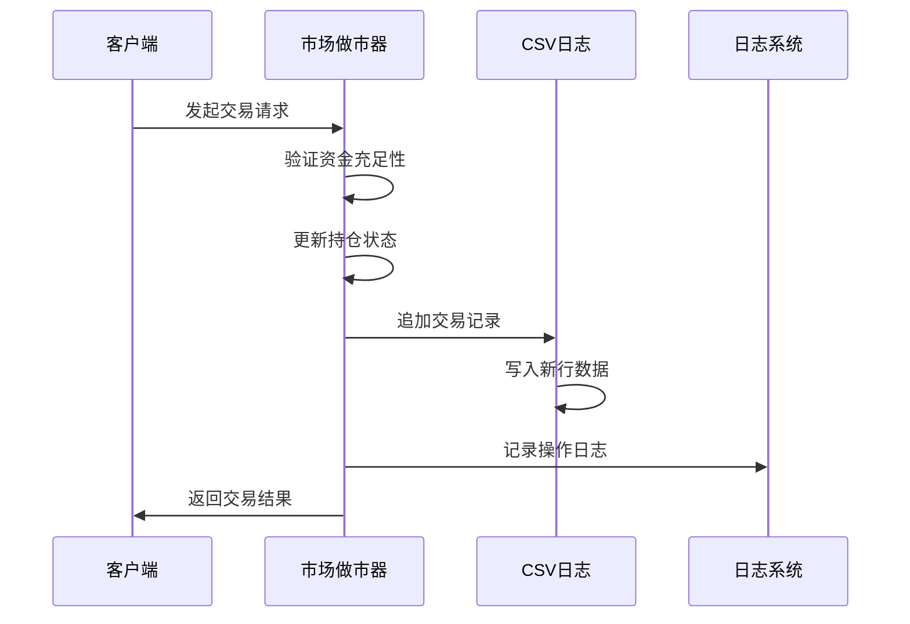
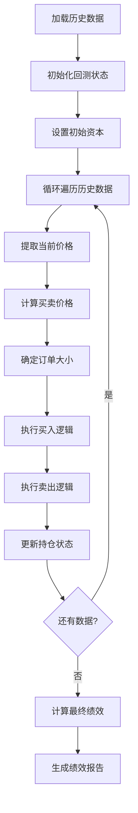
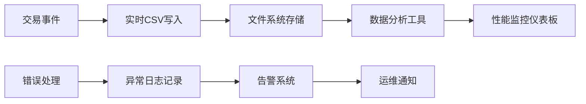
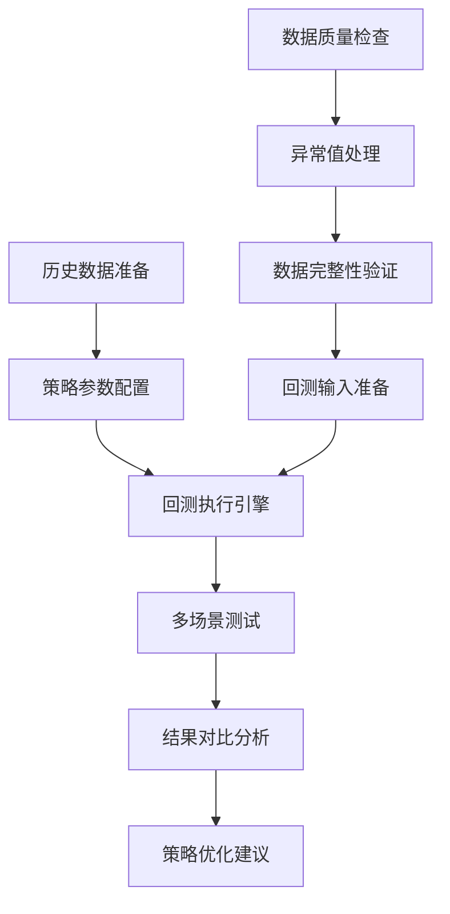
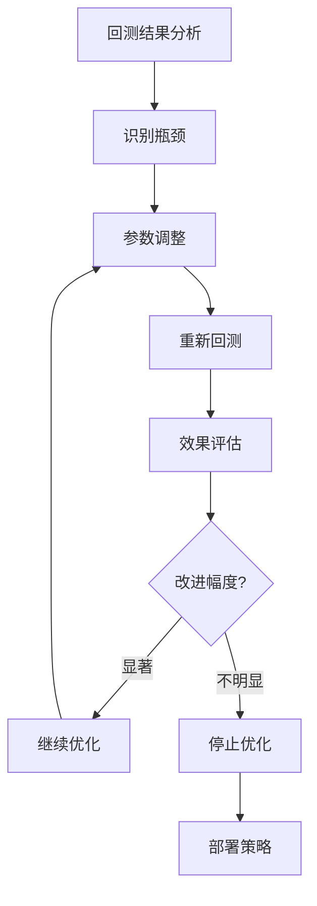

# 日志记录与回测评估

<cite>
**本文档中引用的文件**
- [experimental/market_making.py](file://experimental/market_making.py)
- [example.py](file://example.py)
- [README.md](file://README.md)
- [autohedge/main.py](file://autohedge/main.py)
- [logs/trades_20250305_193100.csv](file://logs/trades_20250305_193100.csv)
- [logs/trades_20250305_193129.csv](file://logs/trades_20250305_193129.csv)
</cite>

## 目录
1. [简介](#简介)
2. [系统架构概览](#系统架构概览)
3. [实时CSV日志记录机制](#实时csv日志记录机制)
4. [历史数据回测分析](#历史数据回测分析)
5. [双重视角监控体系](#双重视角监控体系)
6. [性能评估与优化](#性能评估与优化)
7. [使用指南与最佳实践](#使用指南与最佳实践)
8. [故障排除与调试](#故障排除与调试)
9. [总结](#总结)

## 简介

AutoHedge系统采用创新的双重视角监控机制，通过实时CSV日志记录与历史数据回测分析相结合的方式，为交易策略提供全面的风险管理和性能评估能力。该系统不仅能够实时跟踪交易活动，还能通过历史数据回测验证策略的有效性，为量化交易提供可靠的数据支撑。

## 系统架构概览

AutoHedge系统采用模块化设计，核心组件包括市场做市算法、日志记录系统和回测引擎。整个架构围绕实时数据处理和历史数据分析展开，确保交易策略能够在不同市场环境下得到充分验证。



**图表来源**
- [experimental/market_making.py](file://experimental/market_making.py#L40-L68)
- [experimental/market_making.py](file://experimental/market_making.py#L277-L352)

## 实时CSV日志记录机制

### initialize_csv_log函数详解

系统的核心日志记录功能由`initialize_csv_log`函数实现，该函数负责创建带有时间戳的CSV文件并初始化表头结构。



**图表来源**
- [experimental/market_making.py](file://experimental/market_making.py#L69-L78)

#### 文件命名规范

系统采用统一的文件命名模式：`market_making_{trading_pair}_{datetime}.csv`，其中：
- `trading_pair`：交易对标识符（如BTC/USDT）
- `datetime`：精确到秒的时间戳格式（YYYYMMDD_HHMMSS）

#### CSV表头结构

CSV文件包含以下核心字段：
- `timestamp`：事件发生的时间戳
- `event_type`：事件类型（BUY/SELL）
- `price`：交易价格
- `amount`：交易数量
- `base_inventory`：基础资产持仓量
- `quote_inventory`：计价资产持仓量
- `total_value`：总资产价值

**章节来源**
- [experimental/market_making.py](file://experimental/market_making.py#L69-L78)

### simulate_order函数实现

`simulate_order`函数负责模拟订单执行过程，并实时更新CSV日志文件。



**图表来源**
- [experimental/market_making.py](file://experimental/market_making.py#L163-L219)

#### 交易事件记录流程

每次交易事件都会触发以下处理步骤：
1. **订单验证**：检查资金或资产是否充足
2. **持仓更新**：实时调整基础资产和计价资产的持仓
3. **CSV追加**：将交易详情写入日志文件
4. **日志记录**：通过loguru框架记录操作信息

**章节来源**
- [experimental/market_making.py](file://experimental/market_making.py#L163-L219)

## 历史数据回测分析

### backtest_market_maker函数设计

回测引擎的核心是`backtest_market_maker`函数，它能够加载历史价格数据并模拟完整的做市策略执行过程。



**图表来源**
- [experimental/market_making.py](file://experimental/market_making.py#L277-L352)

#### 回测数据结构要求

回测系统期望输入的CSV文件包含以下列：
- `close`：收盘价（用于回测的主要价格指标）
- 其他可选的技术分析指标

#### 回测执行逻辑

回测过程遵循以下步骤：
1. **数据加载**：读取历史价格序列
2. **状态初始化**：设置初始资本和空持仓
3. **逐行模拟**：对每个历史价格点执行做市策略
4. **绩效计算**：评估最终的投资组合价值

**章节来源**
- [experimental/market_making.py](file://experimental/market_making.py#L277-L352)

### 绩效指标计算

回测完成后，系统生成详细的绩效报告，包含以下关键指标：

| 指标名称 | 计算方法 | 说明 |
|---------|---------|------|
| 初始资本 | config.total_capital | 回测开始时的总资金 |
| 最终价值 | base_asset × 最后价格 + quote_asset | 投资组合的当前市值 |
| 总收益率 | (最终价值 - 初始资本) / 初始资本 × 100% | 总回报率百分比 |
| 交易次数 | len(trades) | 执行的买卖交易总数 |

**章节来源**
- [experimental/market_making.py](file://experimental/market_making.py#L338-L343)

## 双重视角监控体系

### 实时视角：CSV日志记录

实时监控系统通过CSV日志记录提供即时的交易活动追踪：



**图表来源**
- [experimental/market_making.py](file://experimental/market_making.py#L197-L211)

#### 日志文件特性

- **自动轮转**：支持按大小或时间自动分割日志文件
- **结构化格式**：标准化的CSV格式便于后续分析
- **实时更新**：每次交易都立即写入日志
- **完整性保证**：确保所有交易事件都被完整记录

**章节来源**
- [experimental/market_making.py](file://experimental/market_making.py#L66-L68)

### 历史视角：回测分析

历史回测系统提供离线的策略验证能力：



**图表来源**
- [experimental/market_making.py](file://experimental/market_making.py#L288-L300)

#### 回测优势

- **无风险测试**：在历史数据上验证策略可行性
- **参数敏感性分析**：评估不同参数设置的影响
- **基准对比**：与简单持有策略进行对比
- **统计显著性检验**：评估结果的可靠性

**章节来源**
- [experimental/market_making.py](file://experimental/market_making.py#L277-L286)

## 性能评估与优化

### 回测结果解读指南

回测输出提供了全面的策略评估信息：

#### 基本绩效指标解读

- **总收益率**：反映策略的整体盈利能力
- **交易频率**：评估策略的活跃程度
- **资本利用率**：衡量资金使用的效率

#### 风险指标分析

虽然当前版本主要关注收益指标，但可以扩展添加：
- 夏普比率：风险调整后的收益
- 最大回撤：最严重的资产价值下降
- 胜率：盈利交易的比例

### 参数优化策略

基于回测结果，可以进行以下参数优化：



**图表来源**
- [experimental/market_making.py](file://experimental/market_making.py#L20-L29)

## 使用指南与最佳实践

### 运行回测的示例命令

以下是运行回测的具体示例：

```python
# 基本回测运行
backtest_results = backtest_market_maker(
    'historical_prices.csv', 
    MarketMakingConfig(trading_pair='BTC/USDT')
)

# 自定义参数回测
config = MarketMakingConfig(
    trading_pair='BTC/USDT',
    total_capital=5000.0,
    spread_percentage=0.002,
    order_size_percentage=0.02
)

results = backtest_market_maker('historical_prices.csv', config)
```

### 数据准备最佳实践

1. **数据质量**：确保历史数据的完整性和准确性
2. **时间范围**：选择足够长的时间窗口以获得可靠的统计结果
3. **市场条件**：考虑不同市场环境下的表现
4. **数据频率**：根据策略特点选择合适的数据频率

### 结果验证方法

- **样本外测试**：使用未参与训练的数据验证
- **滚动窗口测试**：分阶段验证策略稳定性
- **压力测试**：在极端市场条件下测试策略表现

**章节来源**
- [experimental/market_making.py](file://experimental/market_making.py#L347-L351)

## 故障排除与调试

### 常见问题及解决方案

#### CSV日志记录问题

**问题**：日志文件无法创建或写入失败
**解决方案**：
- 检查目标目录权限
- 验证磁盘空间充足
- 确认文件名不包含非法字符

**问题**：日志记录不及时
**解决方案**：
- 检查文件句柄是否正确关闭
- 验证写入缓冲区设置
- 确认系统资源充足

#### 回测执行问题

**问题**：历史数据格式不匹配
**解决方案**：
- 验证CSV文件包含必需的列
- 检查日期格式的一致性
- 确认价格数据的连续性

**问题**：回测结果异常
**解决方案**：
- 检查参数配置的合理性
- 验证数据预处理的正确性
- 确认策略逻辑的完整性

### 调试技巧

1. **日志级别调整**：使用更详细的日志级别进行调试
2. **断点设置**：在关键函数处设置断点
3. **单元测试**：为各个组件编写独立的测试用例
4. **可视化分析**：使用图表直观展示回测结果

**章节来源**
- [experimental/market_making.py](file://experimental/market_making.py#L53-L55)

## 总结

AutoHedge系统的双重视角监控机制为量化交易提供了强大的工具集。通过实时CSV日志记录，系统能够及时捕获交易活动并提供详细的执行轨迹；通过历史数据回测分析，系统能够在安全的环境中验证策略的有效性。

这种双重监控体系的优势在于：
- **实时性**：即时反馈交易执行情况
- **可追溯性**：完整的交易记录便于审计和分析
- **验证能力**：通过回测验证策略的潜在表现
- **风险管理**：早期发现策略问题和潜在风险

对于用户而言，合理利用这套监控系统能够显著提高交易策略的质量和成功率。建议用户在实际应用中结合具体的交易需求，灵活运用实时监控和历史回测两种手段，以达到最佳的交易效果。

需要注意的是，尽管回测结果提供了有价值的参考，但它并不能完全代表未来的实际表现。用户应当谨慎对待回测结果，将其作为策略开发的重要辅助工具，而不是唯一的决策依据。