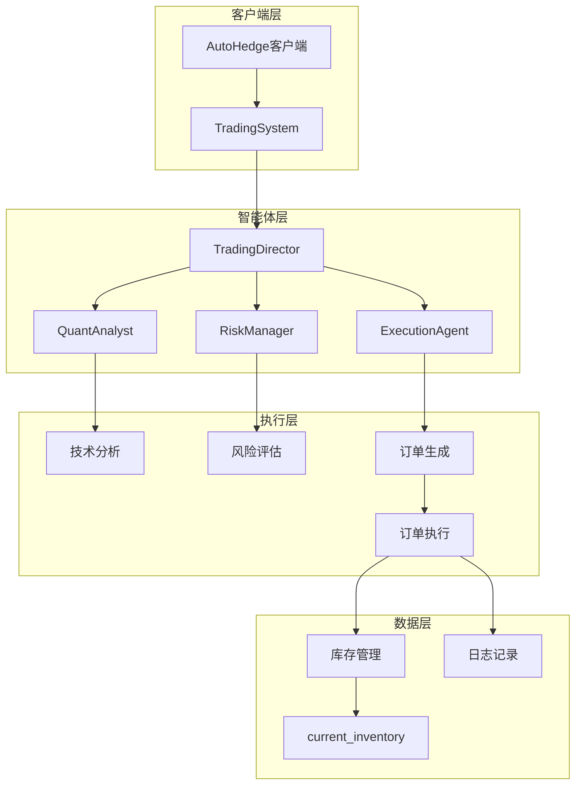
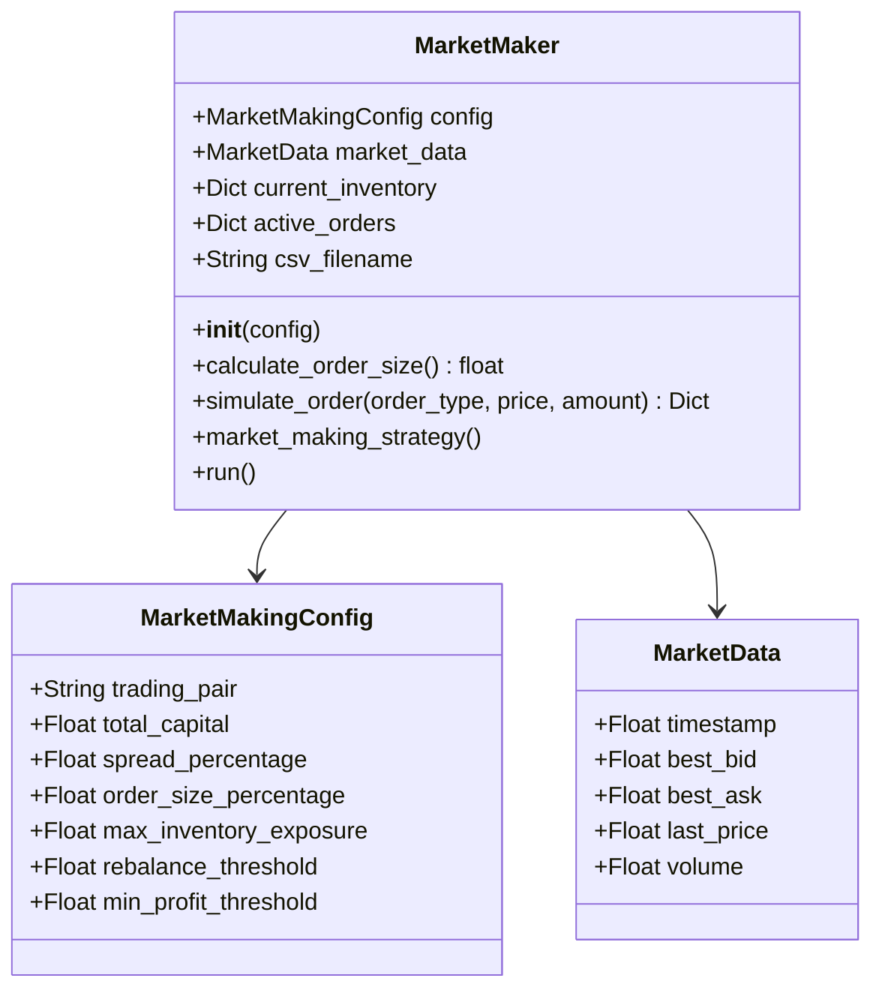
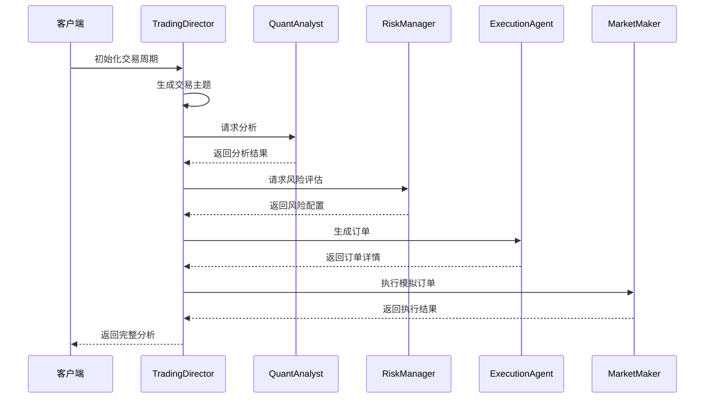
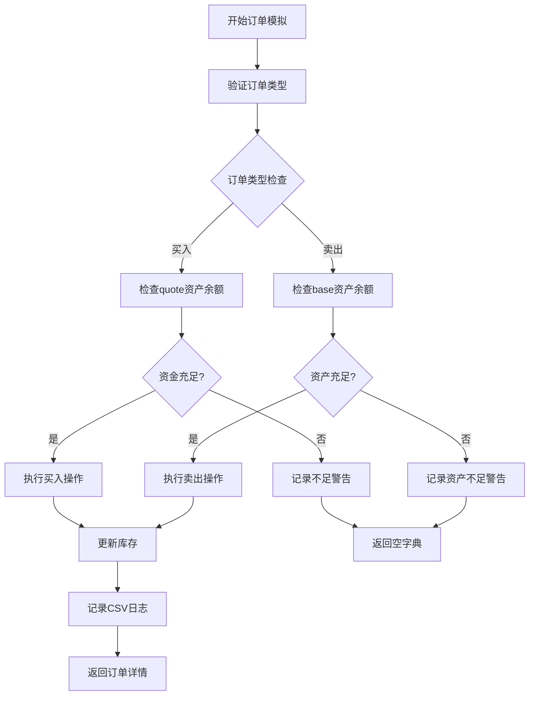
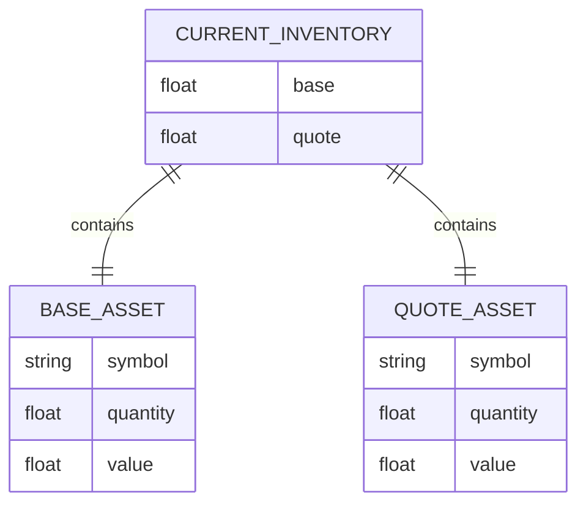
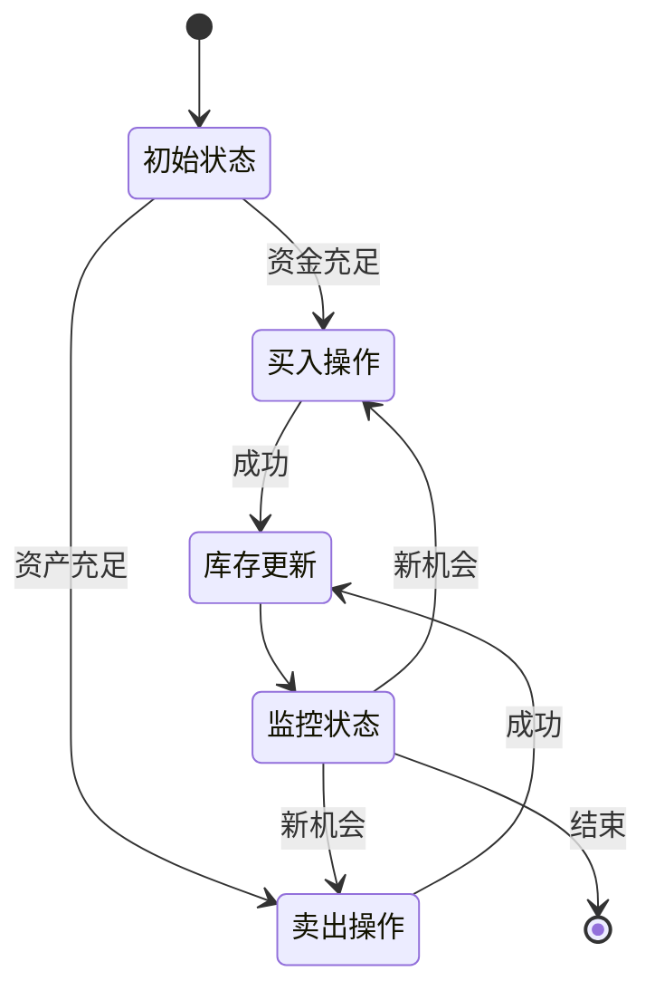

# 订单执行与库存管理

<cite>
**本文档中引用的文件**
- [experimental/market_making.py](file://experimental/market_making.py)
- [autohedge/main.py](file://autohedge/main.py)
- [api/api.py](file://api/api.py)
- [autohedge/tools/trade_station.py](file://autohedge/tools/trade_station.py)
- [README.md](file://README.md)
- [example.py](file://example.py)
</cite>

## 目录
1. [简介](#简介)
2. [项目架构概览](#项目架构概览)
3. [核心组件分析](#核心组件分析)
4. [订单执行机制](#订单执行机制)
5. [库存管理系统](#库存管理系统)
6. [风险控制与订单大小计算](#风险控制与订单大小计算)
7. [常见问题排查指南](#常见问题排查指南)
8. [最佳实践建议](#最佳实践建议)
9. [总结](#总结)

## 简介

AutoHedge是一个基于人工智能的自动化交易系统，采用多智能体架构来实现完整的交易生命周期管理。该系统通过专门设计的订单执行模块和库存管理系统，确保交易决策的有效实施和风险的可控性。

本文档深入探讨了系统中两个关键功能：`simulate_order`方法的订单执行模拟机制，以及`current_inventory`字典的库存管理逻辑。这些组件共同构成了系统的交易基础设施，为市场做市策略提供了可靠的执行框架。

## 项目架构概览

AutoHedge采用分层的多智能体架构，每个组件负责特定的交易职能：



**图表来源**
- [autohedge/main.py](file://autohedge/main.py#L422-L583)
- [README.md](file://README.md#L185-L215)

**章节来源**
- [autohedge/main.py](file://autohedge/main.py#L422-L583)
- [README.md](file://README.md#L185-L215)

## 核心组件分析

### 市场做市算法核心类

系统的核心是`MarketMaker`类，它实现了完整的市场做市策略：



**图表来源**
- [experimental/market_making.py](file://experimental/market_making.py#L40-L67)

### 多智能体协调流程

系统通过明确的智能体分工实现高效的交易决策：



**图表来源**
- [README.md](file://README.md#L216-L242)
- [autohedge/main.py](file://autohedge/main.py#L477-L583)

**章节来源**
- [experimental/market_making.py](file://experimental/market_making.py#L40-L67)
- [autohedge/main.py](file://autohedge/main.py#L477-L583)

## 订单执行机制

### simulate_order方法详解

`simulate_order`方法是系统的核心执行引擎，负责模拟买卖订单的完整生命周期：



**图表来源**
- [experimental/market_making.py](file://experimental/market_making.py#L163-L219)

#### 订单类型判断逻辑

系统支持两种基本订单类型，每种都有特定的验证和执行逻辑：

1. **买入订单处理**：
   - 验证quote资产（通常是法币）是否足够支付买入成本
   - 更新base资产数量（增加）
   - 减少quote资产数量（减少）

2. **卖出订单处理**：
   - 验证base资产（通常是标的资产）是否足够
   - 减少base资产数量（减少）
   - 增加quote资产数量（增加）

#### 资金/资产校验机制

订单执行前的严格校验确保了交易的可行性：

- **买入校验**：`self.current_inventory['quote'] >= price * amount`
- **卖出校验**：`self.current_inventory['base'] >= amount`

当校验失败时，系统会记录相应的警告信息并终止订单执行。

#### 日志记录系统

每次订单执行都会产生详细的日志记录：

| 字段名 | 类型 | 描述 |
|--------|------|------|
| timestamp | float | 时间戳 |
| event_type | string | 事件类型（BUY/SELL） |
| price | float | 订单价格 |
| amount | float | 订单数量 |
| base_inventory | float | base资产当前库存 |
| quote_inventory | float | quote资产当前库存 |
| total_value | float | 总资产价值 |

**章节来源**
- [experimental/market_making.py](file://experimental/market_making.py#L163-L219)

## 库存管理系统

### current_inventory字典结构

`current_inventory`字典是系统库存管理的核心数据结构，采用双资产模型：



**图表来源**
- [experimental/market_making.py](file://experimental/market_making.py#L57-L59)

#### 资产定义与初始值

- **base资产**：代表交易对中的基础资产（如BTC）
  - 初始值：`0.0`（空仓状态）
  - 单位：资产数量（如BTC）

- **quote资产**：代表交易对中的计价资产（如USDT）
  - 初始值：`config.total_capital`（全部资金）
  - 单位：货币单位（如USDT）

#### 交易生命周期中的库存变化



**图表来源**
- [experimental/market_making.py](file://experimental/market_making.py#L177-L195)

#### 库存状态更新逻辑

每次订单执行后，库存状态会相应调整：

1. **买入操作**：
   ```python
   self.current_inventory['base'] += amount
   self.current_inventory['quote'] -= price * amount
   ```

2. **卖出操作**：
   ```python
   self.current_inventory['base'] -= amount
   self.current_inventory['quote'] += price * amount
   ```

这种设计确保了资产价值的准确跟踪和风险管理。

**章节来源**
- [experimental/market_making.py](file://experimental/market_making.py#L57-L59)
- [experimental/market_making.py](file://experimental/market_making.py#L177-L195)

## 风险控制与订单大小计算

### calculate_order_size方法详解

`calculate_order_size`方法实现了基于多种风险约束的动态订单大小计算：

```mermaid
flowchart TD
A[开始计算订单大小] --> B[计算总资产价值]
B --> C[计算基础订单大小]
C --> D[计算最大暴露订单大小]
D --> E[应用风险约束]
E --> F[min(基础大小, 最大暴露大小)]
F --> G[返回最终订单大小]
B1[总资产价值 = base * last_price + quote] --> B
C1[基础大小 = total_capital × order_size_percentage ÷ last_price] --> C
D1[最大暴露大小 = total_capital × max_inventory_exposure ÷ last_price] --> D
```

**图表来源**
- [experimental/market_making.py](file://experimental/market_making.py#L136-L161)

#### 订单金额计算公式

系统采用以下公式动态计算订单大小：

1. **基础订单大小**：
   ```
   order_size = (total_capital × order_size_percentage) ÷ last_price
   ```

2. **最大暴露订单大小**（风险控制）：
   ```
   max_order_size = (total_capital × max_inventory_exposure) ÷ last_price
   ```

3. **最终订单大小**：
   ```
   final_order_size = min(order_size, max_order_size)
   ```

#### 风险控制边界条件

系统实现了多层次的风险控制机制：

| 参数 | 默认值 | 作用 |
|------|--------|------|
| order_size_percentage | 0.01 (1%) | 单笔订单占总资本的比例 |
| max_inventory_exposure | 0.2 (20%) | 单一资产的最大暴露比例 |
| total_capital | 10000.0 | 可用交易资本 |

#### 动态调整机制

订单大小会根据以下因素动态调整：

1. **市场价格波动**：订单大小与当前价格成反比
2. **资本规模变化**：随着总资本调整而变化
3. **风险参数更新**：可配置的最大暴露比例

**章节来源**
- [experimental/market_making.py](file://experimental/market_making.py#L136-L161)

## 常见问题排查指南

### 'Insufficient funds' 错误

#### 错误成因
当尝试执行买入订单时出现此错误，表明quote资产（法币）不足以支付买入成本。

#### 诊断步骤
1. 检查当前库存状态：
   ```python
   print(f"当前quote资产: {self.current_inventory['quote']}")
   print(f"买入成本: {price * amount}")
   ```

2. 验证订单参数：
   ```python
   print(f"订单价格: {price}")
   print(f"订单数量: {amount}")
   ```

#### 解决方案
1. **增加可用资金**：提高`total_capital`配置
2. **降低订单规模**：减少`order_size_percentage`
3. **等待资金回流**：允许现有头寸盈利

### 'Insufficient base asset' 错误

#### 错误成因
执行卖出订单时出现此错误，表明base资产（标的资产）数量不足。

#### 诊断步骤
1. 检查base资产库存：
   ```python
   print(f"当前base资产: {self.current_inventory['base']}")
   print(f"卖出数量: {amount}")
   ```

2. 分析交易历史：
   ```python
   # 检查最近的买入操作
   ```

#### 解决方案
1. **补充base资产**：执行买入操作或增加初始持仓
2. **调整卖出策略**：减少单次卖出数量
3. **重新平衡组合**：考虑部分平仓

### 库存失衡问题

#### 问题表现
库存状态长期偏离预期，可能导致无法执行预期的交易策略。

#### 排查方法
1. **监控总资产价值**：
   ```python
   total_value = self.current_inventory['base'] * self.market_data.last_price + self.current_inventory['quote']
   ```

2. **检查暴露度**：
   ```python
   base_exposure = (self.current_inventory['base'] * self.market_data.last_price) / self.config.total_capital
   ```

#### 解决策略
1. **定期再平衡**：当暴露度超过阈值时自动调整
2. **设置止损点**：防止过度暴露
3. **优化订单参数**：调整风险控制参数

**章节来源**
- [experimental/market_making.py](file://experimental/market_making.py#L179-L195)

## 最佳实践建议

### 配置优化建议

1. **资本分配策略**
   - 建议将`max_inventory_exposure`设置为总资本的15-25%
   - `order_size_percentage`保持在0.5-2%之间
   - `rebalance_threshold`设置为5-10%

2. **风险管理配置**
   - 设置合理的`min_profit_threshold`避免频繁交易
   - 监控`spread_percentage`对盈利能力的影响
   - 定期评估风险参数的有效性

3. **监控指标**
   - 实时跟踪库存变化
   - 监控订单执行成功率
   - 记录交易频率和成本

### 开发调试技巧

1. **日志分析**
   - 启用详细日志记录
   - 分析订单执行时间序列
   - 监控错误发生模式

2. **性能测试**
   - 使用历史数据进行回测
   - 模拟极端市场条件
   - 验证系统稳定性

3. **容错机制**
   - 实现重试逻辑
   - 添加异常处理
   - 设置超时保护

### 生产环境部署

1. **监控告警**
   - 设置库存水平告警
   - 监控订单执行延迟
   - 跟踪系统健康状态

2. **备份恢复**
   - 定期备份交易状态
   - 实现状态恢复机制
   - 测试灾难恢复流程

3. **安全措施**
   - 加强API访问控制
   - 加密敏感数据
   - 实施审计日志

## 总结

AutoHedge的订单执行与库存管理系统通过精心设计的架构和严格的风控机制，为自动化交易提供了可靠的基础。`simulate_order`方法的模拟执行机制确保了交易决策的安全性，而`current_inventory`字典的双资产模型则提供了灵活的库存管理能力。

系统的核心优势包括：

1. **完整的执行链路**：从订单生成到执行的全流程模拟
2. **严格的风险控制**：多层次的订单大小计算和库存监控
3. **灵活的配置选项**：支持不同交易策略的需求
4. **完善的日志系统**：便于调试和性能分析

通过理解和正确使用这些组件，开发者可以构建稳定可靠的自动化交易系统，实现高效的资金管理和风险控制。