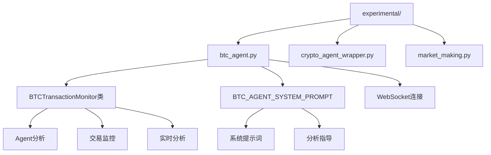
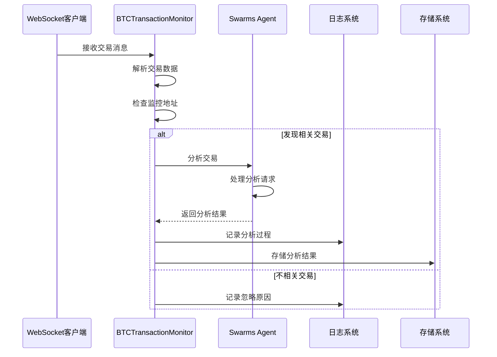
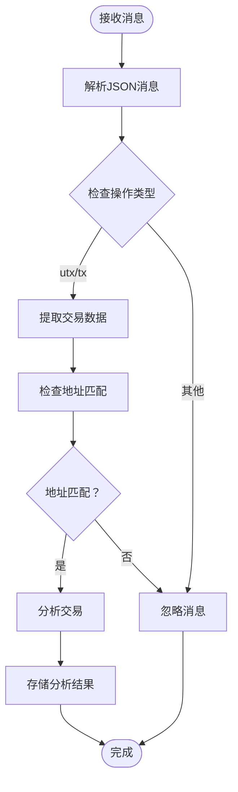
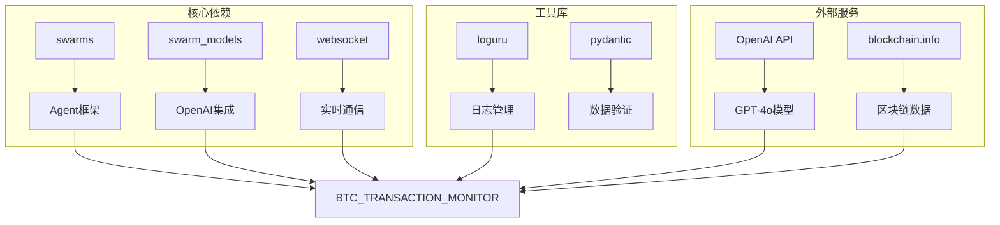

# 比特币交易分析代理

<cite>
**本文档中引用的文件**
- [btc_agent.py](file://experimental/btc_agent.py)
- [README.md](file://README.md)
- [requirements.txt](file://requirements.txt)
- [crypto_agent_wrapper.py](file://experimental/crypto_agent_wrapper.py)
</cite>

## 目录
1. [简介](#简介)
2. [项目结构](#项目结构)
3. [核心组件](#核心组件)
4. [架构概览](#架构概览)
5. [详细组件分析](#详细组件分析)
6. [依赖关系分析](#依赖关系分析)
7. [性能考虑](#性能考虑)
8. [故障排除指南](#故障排除指南)
9. [结论](#结论)

## 简介

BTC_AGENT_SYSTEM_PROMPT提示词设计逻辑及其对分析质量的影响。描述交易分析流程：从消息接收、解析、调用Agent分析到结果存储的完整链路。提供如何配置和启动监控的代码示例，并指出其依赖的环境变量（如OPENAI_API_KEY）。

BTC_TRANSACTION_MONITOR是一个基于AI代理的实时比特币交易监控系统，它通过WebSocket连接区块链数据源（blockchain.info），监听指定地址的交易，并利用swarms框架中的Agent进行智能分析。该系统处于实验阶段，主要用于研究和测试目的。

## 项目结构

BTC_AGENT_SYSTEM_PROMPT位于项目的`experimental`目录下，与其他实验性功能模块共同构成了AutoHedge项目的扩展功能集合。

**图表来源**
- [btc_agent.py](file://experimental/btc_agent.py#L1-L243)

**章节来源**
- [btc_agent.py](file://experimental/btc_agent.py#L1-L243)
- [README.md](file://README.md#L1-L510)

## 核心组件

### BTCTransactionMonitor类

BTCTransactionMonitor是系统的核心类，负责管理整个比特币交易监控流程。它集成了swarms框架的Agent系统，提供了完整的实时交易分析能力。

主要特性：
- 基于WebSocket的实时数据流处理
- 集成OpenAI GPT-4o模型进行智能分析
- 支持多线程并发处理
- 具备优雅的关闭机制
- 提供详细的日志记录

### BTC_AGENT_SYSTEM_PROMPT提示词

系统提示词是Agent分析能力的核心基础，定义了专门的比特币交易分析代理的角色和职责。

提示词设计逻辑：
1. **角色定位**：专门的比特币交易分析代理
2. **分析维度**：交易重要性、模式分析、风险评估、网络流动、经济影响
3. **评估要素**：交易价值、历史背景、异常模式、网络影响、风险指标
4. **输出要求**：提供清晰、结构化的可操作洞察

**章节来源**
- [btc_agent.py](file://experimental/btc_agent.py#L17-L33)
- [btc_agent.py](file://experimental/btc_agent.py#L36-L52)

## 架构概览

BTC_TRANSACTION_MONITOR采用多层架构设计，结合了实时数据处理、AI分析和持久化存储。

**图表来源**
- [btc_agent.py](file://experimental/btc_agent.py#L93-L136)
- [btc_agent.py](file://experimental/btc_agent.py#L169-L183)

## 详细组件分析

### WebSocket通信层

系统使用WebSocket与blockchain.info建立实时连接，支持订阅特定比特币地址的交易活动。

#### 连接管理
- 使用`websocket.WebSocketApp`建立持久连接
- 实现自动重连机制处理连接中断
- 支持优雅关闭和资源清理

#### 消息处理流程

**图表来源**
- [btc_agent.py](file://experimental/btc_agent.py#L93-L136)

### Agent分析引擎

集成swarms框架的Agent系统，提供强大的AI分析能力。

#### Agent配置参数
- **模型选择**：GPT-4o（高性能）
- **上下文长度**：4000 tokens
- **温度控制**：动态调整
- **重试机制**：最多3次
- **状态保存**：自动保存到`btc_agent_state.json`

#### 交易分析流程
1. **数据预处理**：计算交易价值、格式化时间戳
2. **提示词构建**：生成包含关键信息的分析请求
3. **AI推理**：调用OpenAI API进行深度分析
4. **结果后处理**：格式化返回结果

**章节来源**
- [btc_agent.py](file://experimental/btc_agent.py#L36-L52)
- [btc_agent.py](file://experimental/btc_agent.py#L58-L91)

### 数据存储层

提供交易分析结果的持久化存储功能。

#### 存储策略
- 文件命名：`analysis_{transaction_hash}.json`
- 存储内容：原始交易数据 + 分析结果 + 时间戳
- 错误处理：完善的异常捕获和日志记录

**章节来源**
- [btc_agent.py](file://experimental/btc_agent.py#L169-L183)

### 主程序入口

提供简单的命令行接口，支持快速启动和基本配置。

#### 启动流程
1. 初始化BTCTransactionMonitor实例
2. 设置监控地址（默认为比特币创始人地址）
3. 启动WebSocket连接
4. 运行主循环等待信号

**章节来源**
- [btc_agent.py](file://experimental/btc_agent.py#L227-L242)

## 依赖关系分析

系统依赖多个外部库和框架，形成了完整的AI交易分析生态系统。

**图表来源**
- [requirements.txt](file://requirements.txt#L1-L8)
- [btc_agent.py](file://experimental/btc_agent.py#L1-L15)

### 关键依赖说明

| 依赖项 | 版本要求 | 用途 | 重要性 |
|--------|----------|------|--------|
| swarms | 最新版本 | Agent框架核心 | 核心 |
| swarm_models | 最新版本 | OpenAI集成 | 核心 |
| websocket-client | 最新版本 | WebSocket通信 | 核心 |
| loguru | 最新版本 | 日志记录 | 重要 |
| pydantic | 最新版本 | 数据验证 | 重要 |

**章节来源**
- [requirements.txt](file://requirements.txt#L1-L8)
- [btc_agent.py](file://experimental/btc_agent.py#L1-L15)

## 性能考虑

### 并发处理
- 使用独立线程处理WebSocket连接
- Agent分析采用异步处理模式
- 支持多地址同时监控

### 资源管理
- 自动重连机制避免连接丢失
- 完善的错误处理防止内存泄漏
- 状态保存确保系统重启后可恢复

### 扩展性设计
- 模块化架构便于功能扩展
- 配置参数灵活可调
- 插件式Agent支持

## 故障排除指南

### 常见问题及解决方案

#### 1. OpenAI API密钥问题
**症状**：初始化时出现API密钥错误
**解决方案**：设置环境变量`OPENAI_API_KEY`

#### 2. WebSocket连接失败
**症状**：无法建立与blockchain.info的连接
**解决方案**：检查网络连接，确认防火墙设置

#### 3. 内存泄漏问题
**症状**：长时间运行后内存占用持续增长
**解决方案**：定期重启服务，检查Agent状态保存机制

#### 4. 分析结果不准确
**症状**：AI分析结果不符合预期
**解决方案**：调整提示词内容，优化Agent配置参数

### 调试技巧
- 启用详细日志记录
- 监控Agent状态文件变化
- 使用测试地址验证功能

**章节来源**
- [btc_agent.py](file://experimental/btc_agent.py#L13-L15)
- [btc_agent.py](file://experimental/btc_agent.py#L138-L147)

## 结论

BTC_TRANSACTION_MONITOR是一个功能完整的比特币交易实时分析系统，具有以下特点：

### 主要优势
- **实时性强**：基于WebSocket的即时消息推送
- **分析专业**：集成GPT-4o的专业级AI分析能力
- **易于使用**：简洁的API设计和配置方式
- **可扩展性好**：模块化架构支持功能扩展

### 应用场景
- **学术研究**：比特币交易模式分析
- **安全监控**：可疑交易行为检测
- **市场研究**：交易趋势和模式识别
- **教育演示**：AI在金融领域的应用展示

### 注意事项
- **实验性质**：当前版本仍处于实验阶段
- **性能限制**：单线程处理可能成为性能瓶颈
- **成本考虑**：OpenAI API调用会产生费用
- **稳定性**：需要完善的错误处理和监控机制

该系统为比特币交易分析提供了一个良好的起点，通过持续优化和功能扩展，可以发展成为一个专业的实时交易监控平台。