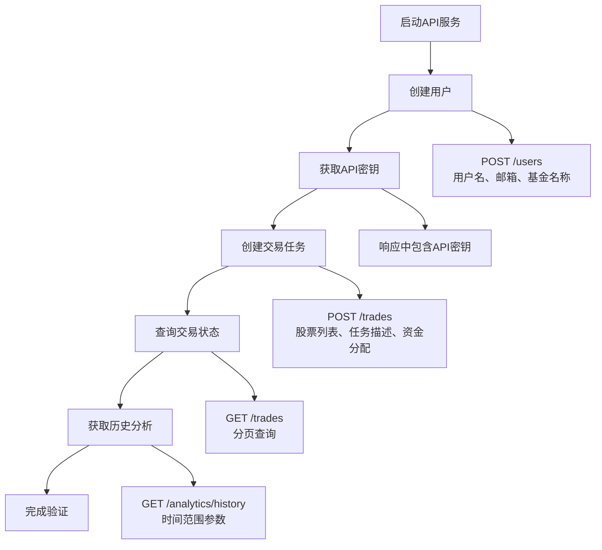

# 开发者环境配置

<cite>
**本文档中引用的文件**
- [README.md](file://README.md)
- [requirements.txt](file://requirements.txt)
- [pyproject.toml](file://pyproject.toml)
- [example.py](file://example.py)
- [autohedge/main.py](file://autohedge/main.py)
- [api/api.py](file://api/api.py)
- [api/api_tests.py](file://api/api_tests.py)
- [autohedge/tools/e_trade_wrapper.py](file://autohedge/tools/e_trade_wrapper.py)
- [autohedge/tools/td_ameritrade.py](file://autohedge/tools/td_ameritrade.py)
- [autohedge/tools/trade_station.py](file://autohedge/tools/trade_station.py)
</cite>

## 目录
1. [项目概述](#项目概述)
2. [系统要求](#系统要求)
3. [环境搭建步骤](#环境搭建步骤)
4. [依赖管理](#依赖管理)
5. [环境变量配置](#环境变量配置)
6. [本地开发流程](#本地开发流程)
7. [代码质量工具](#代码质量工具)
8. [常见问题解决](#常见问题解决)
9. [IDE配置建议](#ide配置建议)
10. [测试与验证](#测试与验证)

## 项目概述

AutoHedge是一个基于多智能体架构的自动化对冲基金系统，利用群体智能和AI代理自动执行市场分析、风险管理和交易操作。该项目采用Python开发，具有模块化设计和丰富的API接口。

### 核心特性
- **多智能体架构**：包含策略生成、量化分析、风险管理、执行等专门化的AI代理
- **实时市场分析**：集成市场数据提供商进行实时分析
- **风险优先方法**：内置的风险管理和仓位控制机制
- **结构化输出**：使用Pydantic模型生成JSON格式的交易推荐和分析
- **完整日志系统**：详细的日志记录用于交易跟踪和调试

**章节来源**
- [README.md](file://README.md#L12-L30)
- [autohedge/main.py](file://autohedge/main.py#L1-L50)

## 系统要求

### Python版本要求
- **最低版本**：Python 3.10+
- **推荐版本**：Python 3.10.x（与项目配置保持一致）

### 操作系统支持
- **Linux**：完全支持
- **macOS**：完全支持  
- **Windows**：完全支持（需注意路径分隔符差异）

### 硬件要求
- **内存**：至少4GB RAM（推荐8GB以上）
- **存储空间**：至少2GB可用空间
- **网络**：稳定的互联网连接（用于API调用和数据获取）

**章节来源**
- [pyproject.toml](file://pyproject.toml#L25)
- [README.md](file://README.md#L30)

## 环境搭建步骤

### 1. 克隆仓库

```bash
# 使用HTTPS克隆
git clone https://github.com/The-Swarm-Corporation/AutoHedge.git
cd AutoHedge

# 或使用SSH克隆
git clone git@github.com:The-Swarm-Corporation/AutoHedge.git
cd AutoHedge
```

### 2. 创建虚拟环境

```bash
# 使用venv（推荐）
python -m venv autohedge_env
source autohedge_env/bin/activate  # Linux/macOS
# 或
autohedge_env\Scripts\activate.bat  # Windows

# 或使用conda
conda create -n autohedge python=3.10
conda activate autohedge
```

### 3. 安装基础依赖

```bash
# 更新pip
python -m pip install --upgrade pip

# 安装项目依赖
pip install -r requirements.txt
```

### 4. 验证安装

```bash
# 检查Python版本
python --version

# 验证依赖安装
python -c "import swarms, tickr_agent, pydantic, loguru, fastapi, uvicorn"
```

**章节来源**
- [requirements.txt](file://requirements.txt#L1-L8)
- [pyproject.toml](file://pyproject.toml#L25)

## 依赖管理

### 主要依赖包

| 依赖包 | 版本要求 | 用途 |
|--------|----------|------|
| `swarms` | 最新版本 | AI代理框架 |
| `tickr-agent` | 最新版本 | 市场数据获取 |
| `pydantic` | 最新版本 | 数据验证和序列化 |
| `loguru` | 最新版本 | 日志记录 |
| `fastapi` | 最新版本 | Web API框架 |
| `uvicorn` | 最新版本 | ASGI服务器 |
| `requests` | 最新版本 | HTTP请求 |

### 可选开发依赖

| 工具 | 版本要求 | 功能 |
|------|----------|------|
| `ruff` | ^0.1.6 | 代码检查 |
| `black` | ^23.1.0 | 代码格式化 |
| `mypy` | 最新版本 | 类型检查 |
| `pytest` | 最新版本 | 单元测试 |

### 依赖安装方式

```bash
# 方法1：使用pip直接安装
pip install swarms tickr-agent pydantic loguru fastapi uvicorn requests

# 方法2：使用Poetry（如果项目支持）
poetry install

# 方法3：开发环境安装
pip install -r requirements.txt
```

**章节来源**
- [requirements.txt](file://requirements.txt#L1-L8)
- [pyproject.toml](file://pyproject.toml#L24-L31)

## 环境变量配置

### 必需的环境变量

#### OpenAI API配置
```bash
# OpenAI API密钥
export OPENAI_API_KEY="your_openai_api_key_here"

# 可选：工作空间目录
export WORKSPACE_DIR="agent_workspace"
```

#### 交易平台API配置

##### E*TRADE API配置
```bash
# E*TRADE消费者密钥
export ETRADE_CONSUMER_KEY="your_consumer_key"
export ETRADE_CONSUMER_SECRET="your_consumer_secret"
export ETRADE_OAUTH_TOKEN="your_oauth_token"
export ETRADE_OAUTH_TOKEN_SECRET="your_oauth_token_secret"
export ETRADE_ACCOUNT_ID="your_account_id"
```

##### TD Ameritrade API配置
```bash
# TD Ameritrade API密钥
export TD_API_KEY="your_td_api_key"
export TD_ACCESS_TOKEN="your_access_token"
```

##### TradeStation API配置
```bash
# TradeStation访问令牌
export TRADE_STATION_TOKEN="your_tradestation_token"
export TRADE_STATION_ACCOUNT_ID="your_account_id"
```

### 可选的环境变量

```bash
# 日志级别配置
export AUTOHEDGE_LOG_LEVEL="INFO"

# 运行模式
export AUTOHEDGE_ENV="development"

# 数据库配置（如果需要）
export DATABASE_URL="sqlite:///autohedge.db"
```

### 创建.env文件

```bash
# 创建.env文件
touch .env
echo "# AutoHedge Environment Variables" >> .env
echo "OPENAI_API_KEY=your_api_key" >> .env
echo "WORKSPACE_DIR=agent_workspace" >> .env
echo "ETRADE_CONSUMER_KEY=your_key" >> .env
echo "TD_API_KEY=your_td_key" >> .env
echo "TRADE_STATION_TOKEN=your_token" >> .env
```

**章节来源**
- [autohedge/tools/e_trade_wrapper.py](file://autohedge/tools/e_trade_wrapper.py#L24-L38)
- [autohedge/tools/td_ameritrade.py](file://autohedge/tools/td_ameritrade.py#L34-L43)
- [autohedge/tools/trade_station.py](file://autohedge/tools/trade_station.py#L7-L22)

## 本地开发流程

### 1. 运行示例脚本

```bash
# 加载环境变量
source .env  # 或使用python-dotenv加载

# 运行示例交易脚本
python example.py
```

示例输出将显示：
- 交易策略生成
- 技术分析结果
- 风险评估报告
- 交易订单详情

### 2. 启动API服务

```bash
# 方法1：直接运行
python api/api.py

# 方法2：使用uvicorn
uvicorn api.api:app --reload --port 8000

# 方法3：生产环境启动
uvicorn api.api:app --host 0.0.0.0 --port 8000 --workers 4
```

API服务将在 `http://localhost:8000` 启动，提供以下功能：
- 用户管理
- 交易创建和查询
- 历史数据分析
- 实时监控

### 3. 访问API文档

启动API服务后，可以通过以下地址访问交互式文档：
- **Swagger UI**: `http://localhost:8000/docs`
- **ReDoc**: `http://localhost:8000/redoc`

### 4. 功能验证流程



**图表来源**
- [api/api.py](file://api/api.py#L202-L444)
- [README.md](file://README.md#L342-L478)

**章节来源**
- [example.py](file://example.py#L1-L22)
- [api/api.py](file://api/api.py#L460-L476)

## 代码质量工具

### 代码格式化

#### Black格式化器
```bash
# 格式化所有Python文件
black .

# 检查格式但不修改
black --check .

# 设置行长度（项目配置：70字符）
black --line-length 70 .
```

#### Ruff代码检查
```bash
# 运行代码检查
ruff check .

# 自动修复可修复的问题
ruff check . --fix

# 检查特定文件
ruff check autohedge/main.py
```

### 类型检查

```bash
# 使用mypy进行类型检查
mypy autohedge/

# 包含测试文件
mypy --ignore-missing-imports .

# 生成类型检查报告
mypy autohedge/ --html-report type_report
```

### 静态分析

```bash
# 运行flake8检查
flake8 autohedge/ --max-line-length=70

# 运行pylint
pylint autohedge/
```

### Git钩子配置

```bash
# 创建pre-commit钩子
cat > .git/hooks/pre-commit << 'EOF'
#!/bin/sh
# Pre-commit hook for code quality checks
echo "Running code quality checks..."

# Black格式化
black .

# Ruff检查
ruff check .

# 类型检查
mypy autohedge/

echo "Code quality checks completed!"
EOF

chmod +x .git/hooks/pre-commit
```

**章节来源**
- [pyproject.toml](file://pyproject.toml#L51-L57)

## 常见问题解决

### 1. Python版本不匹配

**问题症状**：
```bash
ModuleNotFoundError: No module named 'swarms'
```

**解决方案**：
```bash
# 检查Python版本
python --version

# 如果版本过低，升级Python
# macOS: brew install python@3.10
# Ubuntu: sudo apt-get install python3.10

# 重新创建虚拟环境
rm -rf autohedge_env
python -m venv autohedge_env
source autohedge_env/bin/activate
pip install -r requirements.txt
```

### 2. 依赖冲突

**问题症状**：
```bash
ERROR: pip's dependency resolver does not currently consider all the packages that are installed
```

**解决方案**：
```bash
# 清理pip缓存
pip cache purge

# 强制重新安装
pip install --force-reinstall -r requirements.txt

# 使用隔离安装
pip install --no-cache-dir -r requirements.txt
```

### 3. API密钥配置错误

**问题症状**：
```bash
EnvironmentError: Missing E*TRADE credentials.
```

**解决方案**：
```bash
# 检查环境变量是否正确设置
printenv | grep -E "(OPENAI|ETRADE|TD_|TRADE_STATION)"

# 验证.env文件内容
cat .env

# 手动设置环境变量
export OPENAI_API_KEY="your_key"
export ETRADE_CONSUMER_KEY="your_key"
```

### 4. 端口占用问题

**问题症状**：
```bash
OSError: [Errno 48] Address already in use
```

**解决方案**：
```bash
# 查找占用端口的进程
lsof -i :8000  # macOS/Linux
netstat -ano | findstr :8000  # Windows

# 终止占用进程
kill -9 <PID>  # macOS/Linux
taskkill /PID <PID> /F  # Windows

# 使用其他端口启动
uvicorn api.api:app --port 8001
```

### 5. 权限问题

**问题症状**：
```bash
PermissionError: [Errno 13] Permission denied
```

**解决方案**：
```bash
# 修改文件权限
chmod +x api/api.py
chmod +x example.py

# 在Windows上可能需要管理员权限
# 右键点击终端选择"以管理员身份运行"
```

### 6. 网络连接问题

**问题症状**：
```bash
requests.exceptions.ConnectionError: HTTPSConnectionPool
```

**解决方案**：
```bash
# 检查网络连接
ping api.openai.com
ping api.etrade.com

# 配置代理（如果需要）
export HTTP_PROXY=http://proxy.example.com:8080
export HTTPS_PROXY=https://proxy.example.com:8080

# 检查防火墙设置
sudo ufw status  # Ubuntu防火墙
```

## IDE配置建议

### Visual Studio Code配置

#### 推荐扩展
```json
{
    "recommendations": [
        "ms-python.python",
        "ms-python.pylint",
        "ms-python.black-formatter",
        "charliermarsh.ruff",
        "ms-vscode.vscode-json",
        "ms-vscode.hexeditor",
        "ms-vscode-remote.remote-containers"
    ]
}
```

#### settings.json配置
```json
{
    "python.defaultInterpreterPath": "./autohedge_env/bin/python",
    "python.formatting.provider": "black",
    "python.linting.enabled": true,
    "python.linting.ruffEnabled": true,
    "python.typeChecking.mode": "basic",
    "editor.formatOnSave": true,
    "files.trimTrailingWhitespace": true,
    "files.insertFinalNewline": true,
    "terminal.integrated.defaultProfile.linux": "bash",
    "terminal.integrated.profiles.linux": {
        "bash": {
            "path": "bash",
            "args": ["-c", "source ./autohedge_env/bin/activate && exec bash"]
        }
    }
}
```

#### launch.json配置（调试）
```json
{
    "version": "0.2.0",
    "configurations": [
        {
            "name": "Python: AutoHedge Main",
            "type": "python",
            "request": "launch",
            "program": "${workspaceFolder}/example.py",
            "console": "integratedTerminal",
            "env": {
                "PYTHONPATH": "${workspaceFolder}",
                "OPENAI_API_KEY": "${env:OPENAI_API_KEY}",
                "WORKSPACE_DIR": "${workspaceFolder}/agent_workspace"
            }
        },
        {
            "name": "Python: API Server",
            "type": "python",
            "request": "launch",
            "program": "${workspaceFolder}/api/api.py",
            "console": "integratedTerminal",
            "env": {
                "PYTHONPATH": "${workspaceFolder}",
                "OPENAI_API_KEY": "${env:OPENAI_API_KEY}"
            }
        }
    ]
}
```

### PyCharm配置

#### 项目设置
1. **Python解释器**：选择已创建的虚拟环境
2. **编码设置**：UTF-8编码
3. **文件模板**：配置Python文件模板

#### 代码风格配置
1. **Black格式化器**：在External Tools中添加Black
2. **Ruff检查器**：配置Ruff作为外部工具
3. **类型检查**：启用mypy集成

### Vim/Neovim配置

#### coc.nvim配置
```vim
" Python插件配置
Plug 'neoclide/coc.nvim', {'branch': 'release'}

" Python语言服务器
:CocInstall coc-python

" 格式化工具
:CocInstall coc-black
:CocInstall coc-ruff

" 类型检查
:CocInstall coc-mypy
```

#### .vimrc配置
```vim
" Python开发配置
autocmd FileType python setlocal expandtab shiftwidth=4 tabstop=4
autocmd FileType python setlocal softtabstop=4
autocmd FileType python setlocal foldmethod=indent
autocmd FileType python setlocal foldlevel=1

" 自动格式化
autocmd BufWritePre *.py :CocCommand python.sortImports
```

## 测试与验证

### 1. 功能测试

#### 运行示例脚本测试
```bash
# 基础功能测试
python example.py

# 验证输出格式
python -c "
from autohedge.main import AutoHedge
import json

trading_system = AutoHedge(['NVDA'])
result = trading_system.run('Test analysis')
print('✓ 基础功能正常')
print('✓ 输出格式正确:', isinstance(result, str))
"
```

#### API功能测试
```bash
# 使用提供的测试脚本
python api/api_tests.py

# 或手动测试
curl -X POST "http://localhost:8000/users" \
  -H "Content-Type: application/json" \
  -d '{
    "username": "test_user",
    "email": "test@example.com",
    "fund_name": "Test Fund",
    "fund_description": "Test Description"
  }'

# 获取API密钥并测试交易
curl -X POST "http://localhost:8000/trades" \
  -H "Content-Type: application/json" \
  -H "X-API-Key: YOUR_API_KEY" \
  -d '{
    "stocks": ["NVDA"],
    "task": "Test trade",
    "allocation": 1000000.0
  }'
```

### 2. 性能测试

```bash
# 性能基准测试
python -m cProfile -o profile.stats example.py
python -c "
import pstats
stats = pstats.Stats('profile.stats')
stats.sort_stats('cumulative').print_stats(10)
"

# 内存使用监控
python -c "
import psutil
import os

process = psutil.Process(os.getpid())
print(f'内存使用: {process.memory_info().rss / 1024 / 1024:.2f} MB')
"
```

### 3. 集成测试

```bash
# 完整的端到端测试流程
python -c "
import requests
import time
import json

BASE_URL = 'http://localhost:8000'

# 1. 创建用户
print('创建用户...')
response = requests.post(
    f'{BASE_URL}/users',
    json={
        'username': 'e2e_test',
        'email': 'e2e@test.com',
        'fund_name': 'E2E Test Fund',
        'fund_description': 'End-to-end testing'
    }
)
api_key = response.json()['api_key']

# 2. 获取用户信息
print('获取用户信息...')
headers = {'X-API-Key': api_key}
response = requests.get(f'{BASE_URL}/users/me', headers=headers)
print('用户信息:', response.json())

# 3. 创建交易
print('创建交易...')
trade_response = requests.post(
    f'{BASE_URL}/trades',
    headers=headers,
    json={
        'stocks': ['NVDA'],
        'task': 'E2E test analysis',
        'allocation': 100000.0
    }
)
trade_id = trade_response.json()['id']
print('交易ID:', trade_id)

# 4. 查询交易
print('查询交易...')
response = requests.get(f'{BASE_URL}/trades/{trade_id}', headers=headers)
print('交易详情:', response.json())

# 5. 列出交易
print('列出交易...')
response = requests.get(f'{BASE_URL}/trades?limit=10', headers=headers)
print('交易列表:', len(response.json()), '项')

print('✓ 端到端测试完成!')
"
```

### 4. 错误处理测试

```bash
# 测试各种错误情况
python -c "
import requests

BASE_URL = 'http://localhost:8000'

# 1. 无效API密钥
print('测试无效API密钥...')
response = requests.get(f'{BASE_URL}/users/me', headers={'X-API-Key': 'invalid'})
print('状态码:', response.status_code)
print('错误信息:', response.json())

# 2. 缺少必需字段
print('测试缺少字段...')
response = requests.post(f'{BASE_URL}/users', json={'username': 'test'})
print('状态码:', response.status_code)

# 3. 超出限制
print('测试超出限制...')
response = requests.get(f'{BASE_URL}/trades?limit=1000', headers=headers)
print('状态码:', response.status_code)
"
```

**章节来源**
- [api/api_tests.py](file://api/api_tests.py#L1-L84)
- [README.md](file://README.md#L411-L447)

## 总结

通过本指南，您应该能够成功搭建AutoHedge项目的本地开发环境，包括：

1. **环境准备**：正确安装Python和必要的开发工具
2. **依赖管理**：完整安装所有必需的Python包
3. **配置设置**：正确配置API密钥和环境变量
4. **功能验证**：通过示例脚本和API测试验证系统功能
5. **质量保证**：使用代码格式化和静态分析工具维护代码质量

### 下一步建议

1. **深入学习**：阅读项目源码，理解多智能体架构设计
2. **扩展开发**：尝试添加新的交易策略或优化现有算法
3. **社区贡献**：参与开源社区，提交改进或bug修复
4. **生产部署**：研究如何将系统部署到生产环境

### 支持资源

- **官方文档**：[https://autohedge.readthedocs.io](https://autohedge.readthedocs.io)
- **GitHub Issues**：[https://github.com/The-Swarm-Corporation/AutoHedge/issues](https://github.com/The-Swarm-Corporation/AutoHedge/issues)
- **Discord社区**：[https://swarms.ai](https://swarms.ai)

祝您在AutoHedge项目开发中取得成功！