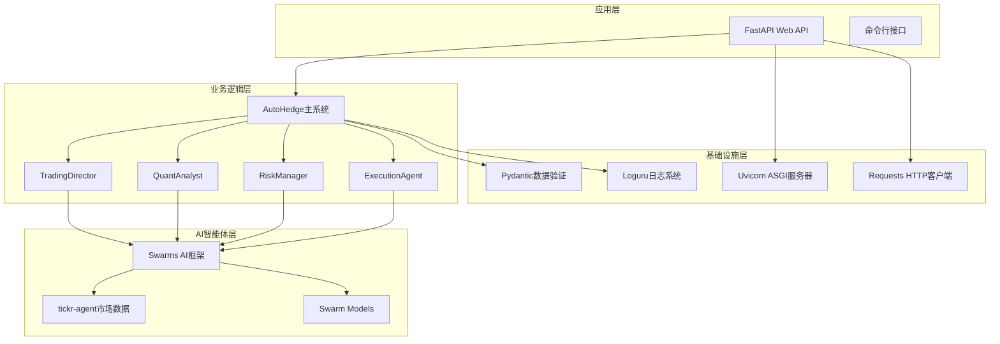
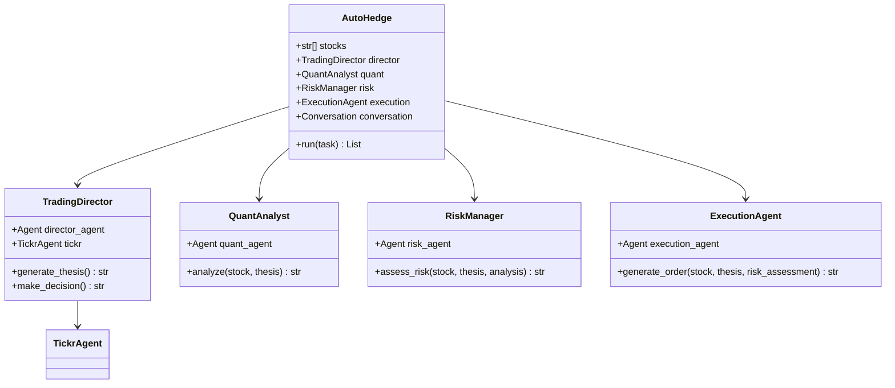
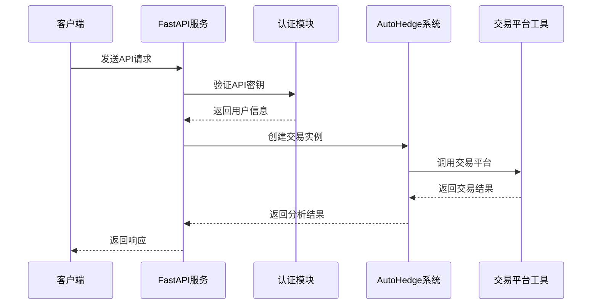
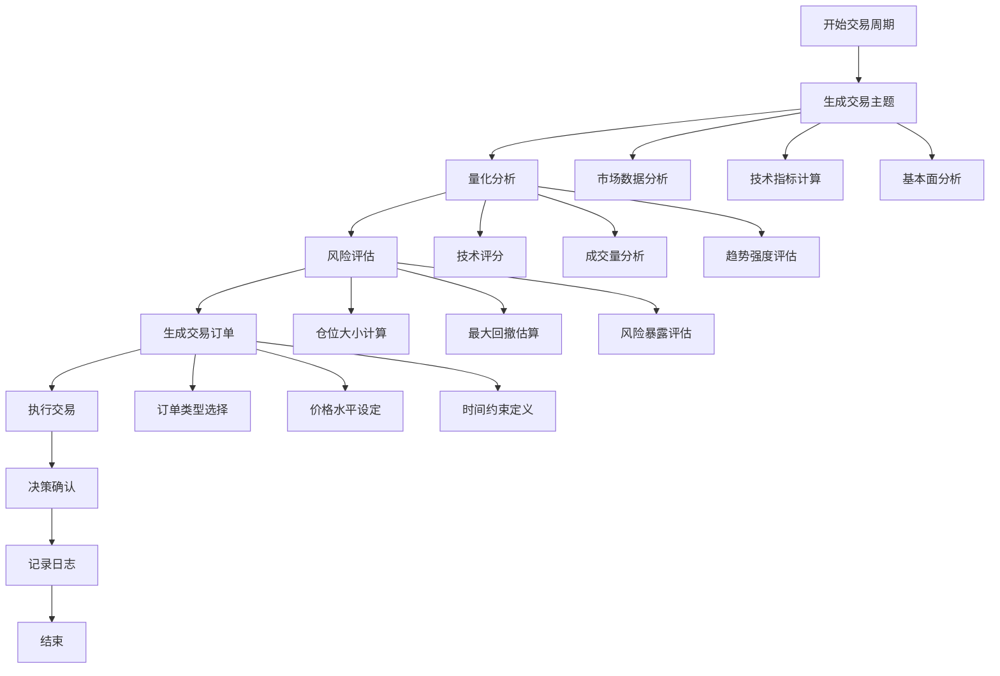
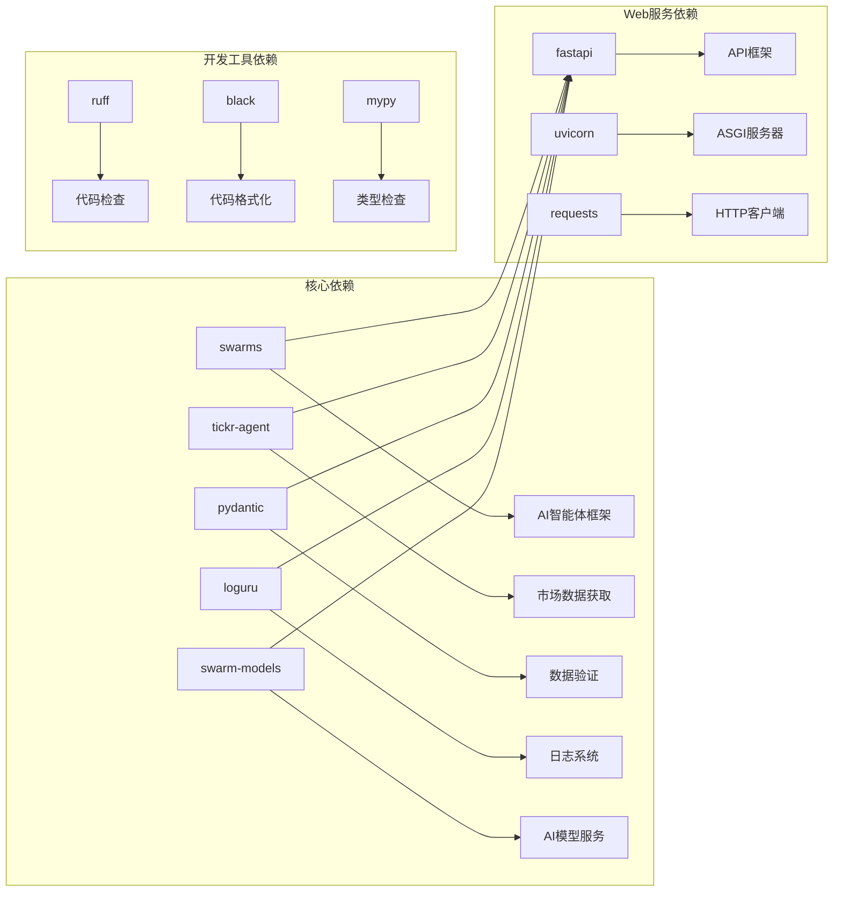
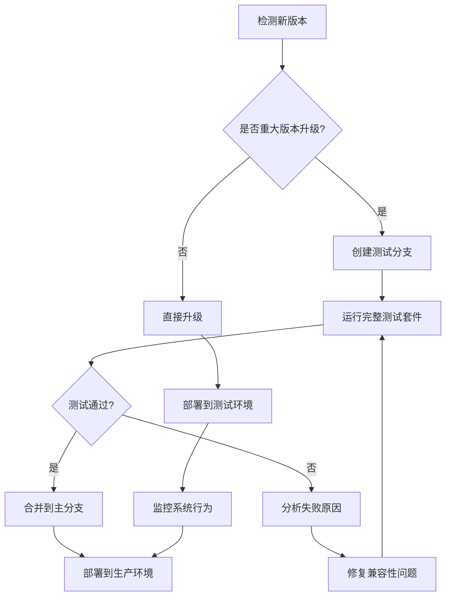

# 技术栈与依赖

<cite>
**本文档中引用的文件**
- [pyproject.toml](file://pyproject.toml)
- [requirements.txt](file://requirements.txt)
- [README.md](file://README.md)
- [autohedge/main.py](file://autohedge/main.py)
- [api/api.py](file://api/api.py)
- [autohedge/tools/e_trade_wrapper.py](file://autohedge/tools/e_trade_wrapper.py)
- [autohedge/tools/td_ameritrade.py](file://autohedge/tools/td_ameritrade.py)
- [experimental/crypto_agent_wrapper.py](file://experimental/crypto_agent_wrapper.py)
- [example.py](file://example.py)
</cite>

## 目录
1. [项目概述](#项目概述)
2. [核心技术栈](#核心技术栈)
3. [依赖库详解](#依赖库详解)
4. [内部模块架构](#内部模块架构)
5. [外部依赖关系](#外部依赖关系)
6. [环境配置](#环境配置)
7. [最佳实践建议](#最佳实践建议)
8. [兼容性问题与解决方案](#兼容性问题与解决方案)

## 项目概述

AutoHedge是一个基于多智能体架构的自动化对冲基金系统，采用Python作为主要开发语言，构建了一个完整的AI驱动交易生态系统。该项目集成了多个先进的AI框架和工具，实现了从市场分析到交易执行的全流程自动化。

**章节来源**
- [README.md](file://README.md#L1-L50)
- [pyproject.toml](file://pyproject.toml#L1-L20)

## 核心技术栈

### 主要框架与组件

AutoHedge采用了现代化的Python技术栈，包含以下核心组件：



**图表来源**
- [autohedge/main.py](file://autohedge/main.py#L422-L583)
- [api/api.py](file://api/api.py#L130-L476)

### 技术栈概览表

| 组件类别 | 技术名称 | 版本要求 | 功能定位 | 兼容性要求 |
|---------|---------|---------|---------|-----------|
| Web框架 | FastAPI | 最新稳定版 | RESTful API服务 | Python 3.8+ |
| ASGI服务器 | Uvicorn | 最新版本 | 生产级WSGI服务器 | 支持异步请求 |
| AI框架 | Swarms | 最新版本 | 多智能体AI系统 | Python 3.10+ |
| 市场数据 | tickr-agent | 最新版本 | 实时市场数据获取 | 支持多种数据源 |
| 数据验证 | Pydantic | 最新版本 | 类型安全与验证 | Python 3.7+ |
| 日志系统 | Loguru | 最新版本 | 结构化日志记录 | 跨平台支持 |
| HTTP客户端 | Requests | 最新版本 | 网络通信 | Python 3.6+ |
| 模型服务 | Swarm Models | 最新版本 | AI模型集成 | OpenAI/Groq支持 |

**章节来源**
- [pyproject.toml](file://pyproject.toml#L24-L30)
- [requirements.txt](file://requirements.txt#L1-L8)

## 依赖库详解

### FastAPI - 现代Web框架

FastAPI是项目的核心API框架，提供了高性能的RESTful API服务。

**主要特性：**
- 自动生成交互式API文档（Swagger UI）
- 自动数据验证和序列化
- 异步请求处理支持
- 生产就绪的性能表现

**版本兼容性：**
- Python 3.8+
- 推荐使用最新稳定版本
- 与Uvicorn完美集成

**章节来源**
- [api/api.py](file://api/api.py#L132-L140)

### Swarms - AI智能体框架

Swarms是项目的核心AI框架，负责管理多个专门化的智能体。

**核心功能：**
- 多智能体协调与通信
- 分布式任务执行
- 智能体生命周期管理
- 上下文长度优化

**智能体类型：**
- **TradingDirector**: 策略生成与协调
- **QuantAnalyst**: 技术分析与统计评估
- **RiskManager**: 风险评估与仓位管理
- **ExecutionAgent**: 交易执行与订单管理

**章节来源**
- [autohedge/main.py](file://autohedge/main.py#L12-L583)

### Pydantic - 数据验证与序列化

Pydantic提供了强大的数据验证和序列化功能，确保系统的数据完整性。

**应用场景：**
- API请求参数验证
- 配置文件结构化
- 数据对象类型安全
- 自动生成JSON Schema

**章节来源**
- [autohedge/main.py](file://autohedge/main.py#L102-L119)
- [api/api.py](file://api/api.py#L63-L107)

### Loguru - 结构化日志系统

Loguru提供了现代化的日志记录解决方案，支持结构化输出和灵活配置。

**日志特性：**
- 自动格式化和颜色显示
- 多级别日志支持
- 文件轮转和保留策略
- 异步日志写入

**配置示例：**
```python
logger.add(
    "logs/autohedge_{time}.log",
    rotation="500 MB",
    retention="10 days",
    level="INFO",
    format="{time:YYYY-MM-DD at HH:mm:ss} | {level} | {module}:{function}:{line} | {message}"
)
```

**章节来源**
- [api/api.py](file://api/api.py#L118-L127)
- [autohedge/main.py](file://autohedge/main.py#L6-L7)

### tickr-agent - 市场数据获取

tickr-agent负责从各种金融数据源获取实时和历史市场数据。

**数据源支持：**
- 股票市场数据
- 期权数据
- 经济指标
- 新闻和社交媒体数据

**章节来源**
- [autohedge/main.py](file://autohedge/main.py#L293-L304)

### Uvicorn - ASGI服务器

Uvicorn是FastAPI推荐的生产级ASGI服务器，提供高性能的异步Web服务。

**部署配置：**
```bash
uvicorn main:app --host 0.0.0.0 --port 8000 --workers 4
```

**章节来源**
- [api/api.py](file://api/api.py#L464-L469)

### Requests - HTTP通信

Requests库提供了简洁易用的HTTP客户端功能，用于与外部API和服务通信。

**主要用途：**
- 第三方API调用
- 数据同步
- 外部服务集成

**章节来源**
- [api/api.py](file://api/api.py#L8-L9)

## 内部模块架构

### AutoHedge主系统架构



**图表来源**
- [autohedge/main.py](file://autohedge/main.py#L422-L583)

### API服务架构



**图表来源**
- [api/api.py](file://api/api.py#L248-L304)

### 交易流程架构



**图表来源**
- [autohedge/main.py](file://autohedge/main.py#L477-L583)

**章节来源**
- [autohedge/main.py](file://autohedge/main.py#L422-L583)

## 外部依赖关系

### 关键外部依赖



**图表来源**
- [pyproject.toml](file://pyproject.toml#L24-L58)
- [requirements.txt](file://requirements.txt#L1-L8)

### 依赖版本兼容性矩阵

| 依赖包 | 当前版本 | 最低版本 | 推荐版本 | 兼容性状态 |
|--------|---------|---------|---------|-----------|
| Python | ^3.10 | 3.8+ | 3.10+ | ✅ 完全兼容 |
| Swarms | * | 1.0+ | 最新版本 | ✅ 稳定 |
| tickr-agent | * | 1.0+ | 最新版本 | ✅ 稳定 |
| Pydantic | * | 1.8+ | 2.x | ⚠️ 可能需要迁移 |
| Loguru | * | 0.5+ | 最新版本 | ✅ 稳定 |
| FastAPI | * | 0.90+ | 最新版本 | ✅ 稳定 |
| Uvicorn | * | 0.20+ | 最新版本 | ✅ 稳定 |
| Requests | * | 2.25+ | 最新版本 | ✅ 稳定 |

**章节来源**
- [pyproject.toml](file://pyproject.toml#L25-L26)
- [requirements.txt](file://requirements.txt#L1-L8)

## 环境配置

### 必需的环境变量

项目运行需要配置以下环境变量：

```bash
# OpenAI API配置
OPENAI_API_KEY=your_openai_api_key_here

# E*TRADE API配置
ETRADE_CONSUMER_KEY=your_consumer_key
ETRADE_CONSUMER_SECRET=your_consumer_secret
ETRADE_OAUTH_TOKEN=your_oauth_token
ETRADE_OAUTH_TOKEN_SECRET=your_token_secret
ETRADE_ACCOUNT_ID=your_account_id

# TD Ameritrade API配置
TD_API_KEY=your_td_api_key
TD_ACCESS_TOKEN=your_access_token

# 工作空间配置
WORKSPACE_DIR=agent_workspace
```

### 开发环境设置

```bash
# 克隆项目
git clone https://github.com/The-Swarm-Corporation/AutoHedge.git
cd AutoHedge

# 创建虚拟环境
python -m venv venv
source venv/bin/activate  # Linux/MacOS
venv\Scripts\activate  # Windows

# 安装依赖
pip install -r requirements.txt
pip install -e .

# 设置环境变量
cp .env.example .env
# 编辑 .env 文件，添加必要的API密钥

# 运行示例
python example.py
```

### 生产环境部署

```bash
# 使用Poetry管理依赖
poetry install --no-dev

# 启动API服务器
uvicorn api.api:AutoHedgeAPI.run --host 0.0.0.0 --port 8000 --workers 4

# 或使用Gunicorn（推荐）
gunicorn api.api:AutoHedgeAPI.app --bind 0.0.0.0:8000 --workers 4
```

**章节来源**
- [example.py](file://example.py#L1-L22)
- [autohedge/tools/e_trade_wrapper.py](file://autohedge/tools/e_trade_wrapper.py#L23-L43)
- [autohedge/tools/td_ameritrade.py](file://autohedge/tools/td_ameritrade.py#L33-L44)

## 最佳实践建议

### 依赖管理最佳实践

1. **使用Poetry进行依赖管理**
   ```bash
   # 添加新依赖
   poetry add package-name
   
   # 更新依赖
   poetry update
   
   # 导出requirements.txt
   poetry export -f requirements.txt --output requirements.txt
   ```

2. **版本锁定策略**
   - 使用语义化版本控制
   - 定期更新到次要版本
   - 避免直接使用最新版本（除非必要）

3. **开发与生产环境分离**
   ```toml
   # pyproject.toml
   [tool.poetry.group.dev.dependencies]
   pytest = "^7.0"
   black = "^23.0"
   ruff = "^0.1.0"
   
   [tool.poetry.group.production.dependencies]
   # 生产环境专用依赖
   ```

### 性能优化建议

1. **异步处理优化**
   - 利用FastAPI的异步特性
   - 实现非阻塞的API调用
   - 使用连接池管理数据库连接

2. **内存管理**
   - 及时释放不需要的对象
   - 使用生成器处理大数据集
   - 监控内存使用情况

3. **并发处理**
   ```python
   # 并发执行多个交易任务
   import asyncio
   
   async def concurrent_trades(stocks, task):
       tasks = [
           asyncio.create_task(autohedge.run(task, stock))
           for stock in stocks
       ]
       results = await asyncio.gather(*tasks)
       return results
   ```

### 安全配置建议

1. **API密钥管理**
   - 使用环境变量存储敏感信息
   - 实施密钥轮换机制
   - 限制API密钥权限范围

2. **输入验证**
   - 使用Pydantic进行严格的数据验证
   - 实施速率限制
   - 防止SQL注入和其他攻击

3. **日志安全**
   - 不要在日志中记录敏感信息
   - 使用结构化日志格式
   - 实施日志审计机制

**章节来源**
- [api/api.py](file://api/api.py#L130-L140)
- [autohedge/main.py](file://autohedge/main.py#L6-L7)

## 兼容性问题与解决方案

### 常见兼容性问题

1. **Python版本兼容性**
   - **问题**: Pydantic 2.x与旧版本不兼容
   - **解决方案**: 升级所有相关代码到Pydantic 2.x语法
   - **预防措施**: 在pyproject.toml中明确指定版本范围

2. **第三方API变更**
   - **问题**: OpenAI API接口变更导致功能失效
   - **解决方案**: 实施API版本检测和降级机制
   - **预防措施**: 使用稳定的API版本号

3. **依赖冲突**
   - **问题**: 不同依赖包对同一库的不同版本需求
   - **解决方案**: 使用Poetry的依赖解析功能
   - **预防措施**: 定期审查依赖树

### 升级策略



### 故障排除指南

1. **启动失败**
   ```bash
   # 检查依赖安装
   pip list | grep -E "(fastapi|uvicorn|swarms)"
   
   # 检查环境变量
   python -c "import os; print(os.environ.get('OPENAI_API_KEY', 'Not set'))"
   
   # 查看详细错误日志
   uvicorn api.api:AutoHedgeAPI.run --log-level debug
   ```

2. **API响应异常**
   ```python
   # 检查网络连接
   import requests
   try:
       response = requests.get("https://api.openai.com/v1/models", 
                             headers={"Authorization": "Bearer YOUR_KEY"})
       print(response.status_code)
   except Exception as e:
       print(f"Network error: {e}")
   ```

3. **内存泄漏检测**
   ```python
   import psutil
   import os
   
   def check_memory_usage():
       process = psutil.Process(os.getpid())
       memory_mb = process.memory_info().rss / 1024 / 1024
       print(f"Memory usage: {memory_mb:.2f} MB")
   ```

**章节来源**
- [api/api.py](file://api/api.py#L464-L469)
- [autohedge/main.py](file://autohedge/main.py#L6-L7)

## 总结

AutoHedge项目构建了一个完整的AI驱动交易生态系统，通过精心设计的技术栈实现了从概念到生产的全流程自动化。项目的核心优势在于：

1. **模块化架构**: 清晰的职责分离和可扩展的设计
2. **现代技术栈**: 采用FastAPI、Swarms等前沿技术
3. **类型安全**: 通过Pydantic确保数据完整性
4. **生产就绪**: 完善的部署和监控方案
5. **社区生态**: 基于成熟的开源项目构建

对于开发者而言，理解这些技术栈和依赖关系有助于：
- 正确配置开发环境
- 有效维护和扩展系统
- 解决常见问题和兼容性挑战
- 实施最佳实践和安全措施

随着AI技术和金融市场的发展，AutoHedge的技术栈将继续演进，为用户提供更强大、更智能的自动化交易解决方案。