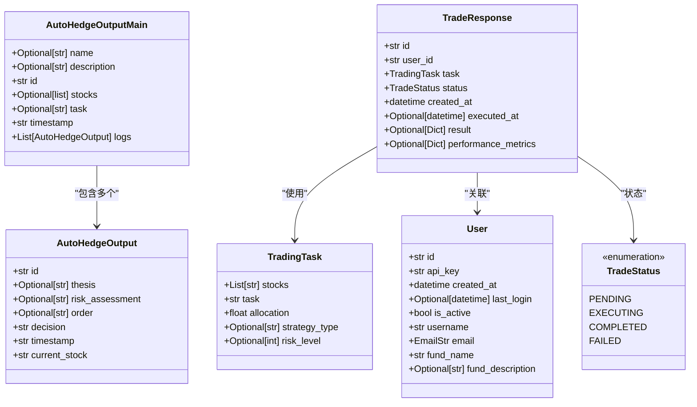
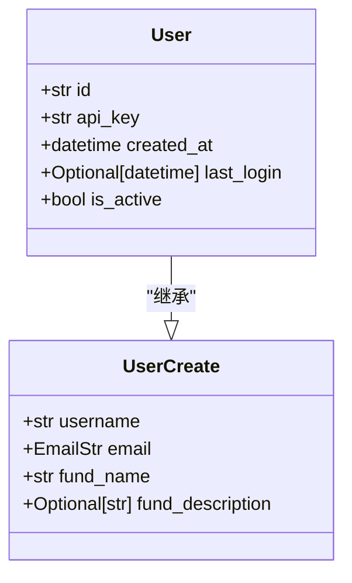
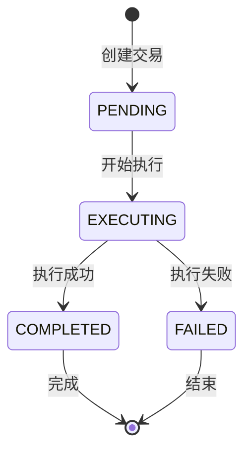
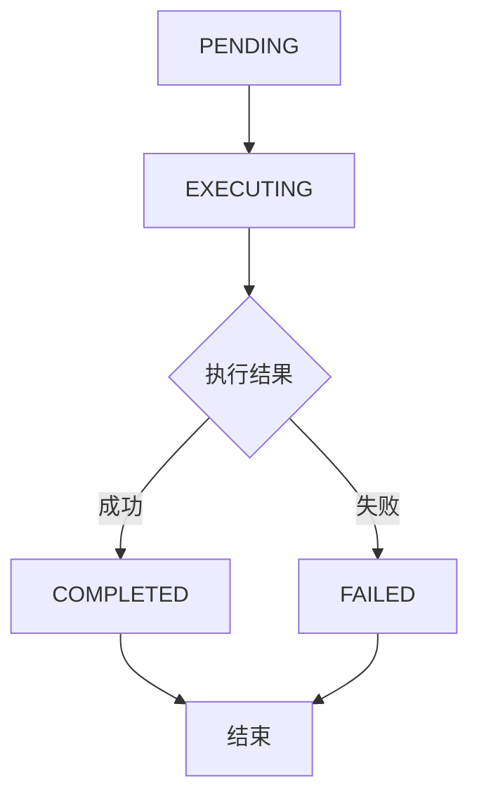
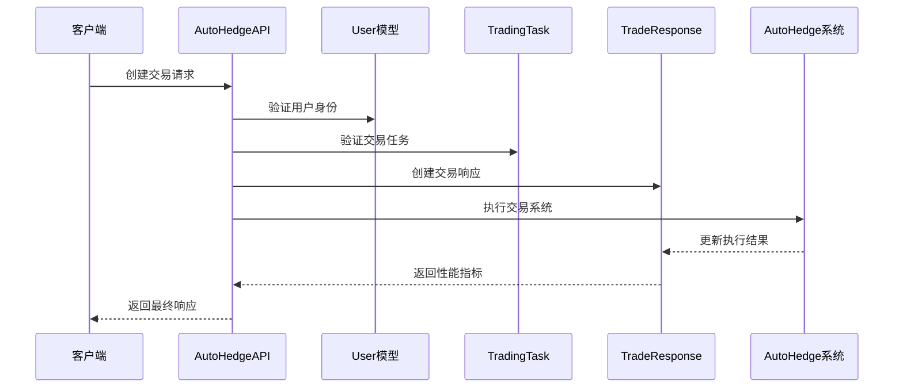
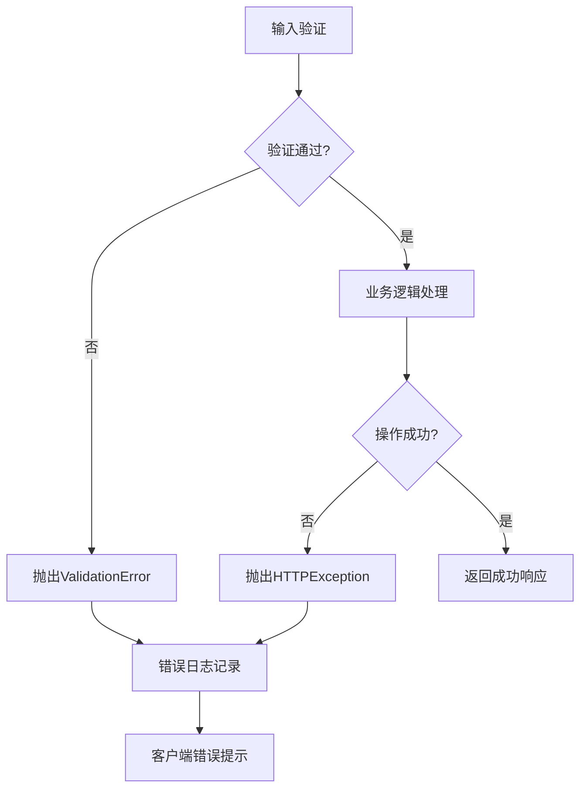

# 数据模型与输出结构

<cite>
**本文档中引用的文件**
- [autohedge/main.py](file://autohedge/main.py)
- [api/api.py](file://api/api.py)
- [README.md](file://README.md)
</cite>

## 目录
1. [简介](#简介)
2. [核心数据模型概览](#核心数据模型概览)
3. [AutoHedgeOutput模型详解](#autohedgeoutput模型详解)
4. [AutoHedgeOutputMain模型详解](#autohedgeoutputmain模型详解)
5. [User用户模型详解](#user用户模型详解)
6. [TradeResponse交易响应模型详解](#traderesponse交易响应模型详解)
7. [TradingTask交易任务模型详解](#tradingsubject交易任务模型详解)
8. [TradeStatus状态枚举](#tradestatus状态枚举)
9. [模型间关系与数据流转](#模型间关系与数据流转)
10. [JSON示例与序列化](#json示例与序列化)
11. [验证规则与错误处理](#验证规则与错误处理)
12. [扩展与自定义](#扩展与自定义)

## 简介

autoHedge系统采用基于Pydantic的数据模型架构，通过严格的类型定义和验证机制确保数据的一致性和可靠性。系统的核心数据模型包括AutoHedgeOutput、AutoHedgeOutputMain、User和TradeResponse等关键组件，它们共同构成了完整的交易数据契约体系。

## 核心数据模型概览

autoHedge系统的核心数据模型遵循分层设计原则，从底层的原子数据到高层的复合结构，形成了完整的数据层次体系：



**图表来源**
- [autohedge/main.py](file://autohedge/main.py#L101-L118)
- [api/api.py](file://api/api.py#L62-L107)

## AutoHedgeOutput模型详解

AutoHedgeOutput是系统中最基础的输出模型，代表单个股票分析的完整结果。

### 字段定义

| 字段名 | 数据类型 | 约束条件 | 默认值 | 业务含义 |
|--------|----------|----------|--------|----------|
| id | str | 自动生成UUID | uuid.uuid4().hex | 唯一标识符，用于追踪单次分析 |
| thesis | Optional[str] | 可选 | None | 交易观点和市场判断 |
| risk_assessment | Optional[str] | 可选 | None | 风险评估报告 |
| order | Optional[str] | 可选 | None | 生成的交易订单详情 |
| decision | str | 必填 | None | 最终决策结果 |
| timestamp | str | ISO格式时间戳 | datetime.now().isoformat() | 记录生成时间 |
| current_stock | str | 必填 | - | 当前分析的股票代码 |

### 模型特性

- **唯一性保证**：每个实例都有独立的UUID标识
- **时间戳自动管理**：创建时自动生成ISO格式时间戳
- **可选字段设计**：支持部分字段缺失的情况
- **强类型约束**：确保数据类型的正确性

**章节来源**
- [autohedge/main.py](file://autohedge/main.py#L101-L108)

## AutoHedgeOutputMain模型详解

AutoHedgeOutputMain是更高层次的聚合模型，包含整个交易周期的所有日志记录。

### 字段定义

| 字段名 | 数据类型 | 约束条件 | 默认值 | 业务含义 |
|--------|----------|----------|--------|----------|
| name | Optional[str] | 可选，最大100字符 | None | 策略名称 |
| description | Optional[str] | 可选，最大500字符 | None | 策略描述 |
| id | str | 自动生成UUID | uuid.uuid4().hex | 整个交易周期的唯一标识 |
| stocks | Optional[list] | 可选，列表形式 | None | 分析的股票列表 |
| task | Optional[str] | 可选，最小10字符 | None | 交易任务描述 |
| timestamp | str | ISO格式时间戳 | datetime.now().isoformat() | 交易周期开始时间 |
| logs | List[AutoHedgeOutput] | 必填，至少一个 | None | 包含所有子分析的日志 |

### 聚合特性

- **策略级管理**：记录整个交易策略的执行过程
- **多股票支持**：可以同时分析多个股票
- **完整生命周期**：从初始化到完成的全过程记录
- **层级结构**：支持嵌套的AutoHedgeOutput对象

**章节来源**
- [autohedge/main.py](file://autohedge/main.py#L111-L118)

## User用户模型详解

User模型扩展了UserCreate基类，增加了系统管理所需的核心字段。

### 字段定义

| 字段名 | 数据类型 | 约束条件 | 默认值 | 业务含义 |
|--------|----------|----------|--------|----------|
| id | str | 自动生成UUID | - | 用户唯一标识符 |
| api_key | str | 自动生成UUID | - | API访问密钥 |
| created_at | datetime | 自动设置 | datetime.now() | 用户创建时间 |
| last_login | Optional[datetime] | 可选 | None | 最后登录时间 |
| is_active | bool | 固定为True | True | 用户账户状态 |

### 继承关系



**图表来源**
- [api/api.py](file://api/api.py#L62-L83)

### 验证规则

- **用户名**：长度3-50字符，必填
- **邮箱**：必须符合EmailStr格式
- **基金名称**：长度3-100字符，必填
- **基金描述**：最大500字符，可选

**章节来源**
- [api/api.py](file://api/api.py#L62-L83)

## TradeResponse交易响应模型详解

TradeResponse是API接口返回的核心响应模型，封装了完整的交易执行信息。

### 字段定义

| 字段名 | 数据类型 | 约束条件 | 默认值 | 业务含义 |
|--------|----------|----------|--------|----------|
| id | str | 自动生成UUID | - | 交易唯一标识符 |
| user_id | str | 外键关联 | - | 关联的用户ID |
| task | TradingTask | 必填 | - | 交易任务详情 |
| status | TradeStatus | 枚举类型 | - | 交易当前状态 |
| created_at | datetime | 自动设置 | datetime.now() | 交易创建时间 |
| executed_at | Optional[datetime] | 可选 | None | 交易执行时间 |
| result | Optional[Dict[str, Any]] | 可选 | None | 交易执行结果 |
| performance_metrics | Optional[Dict[str, float]] | 可选 | None | 性能指标数据 |

### 状态流转



**图表来源**
- [api/api.py](file://api/api.py#L56-L61)

**章节来源**
- [api/api.py](file://api/api.py#L97-L106)

## TradingTask交易任务模型详解

TradingTask定义了交易任务的具体参数和配置选项。

### 字段定义

| 字段名 | 数据类型 | 约束条件 | 默认值 | 业务含义 |
|--------|----------|----------|--------|----------|
| stocks | List[str] | 至少1个元素 | - | 要交易的股票列表 |
| task | str | 最小10字符 | - | 交易任务描述 |
| allocation | float | 大于0 | - | 投资金额分配 |
| strategy_type | Optional[str] | 描述性字符串 | None | 策略类型 |
| risk_level | Optional[int] | 1-10范围 | None | 风险等级评分 |

### 参数验证

- **股票列表**：至少包含一个股票代码
- **任务描述**：至少10个字符，提供充分的上下文信息
- **投资金额**：必须为正数，确保合理的资金分配
- **风险等级**：1-10的整数值，便于风险评估和管理

**章节来源**
- [api/api.py](file://api/api.py#L86-L95)

## TradeStatus状态枚举

TradeStatus定义了交易的完整生命周期状态。

### 状态定义

| 状态值 | 含义 | 使用场景 |
|--------|------|----------|
| PENDING | 待执行 | 交易已创建但尚未开始执行 |
| EXECUTING | 执行中 | 交易正在执行过程中 |
| COMPLETED | 已完成 | 交易成功执行并完成 |
| FAILED | 执行失败 | 交易执行过程中出现错误 |

### 状态转换规则



**图表来源**
- [api/api.py](file://api/api.py#L56-L61)

**章节来源**
- [api/api.py](file://api/api.py#L56-L61)

## 模型间关系与数据流转

autoHedge系统中的模型通过清晰的关系链连接，形成完整的数据流转路径。

### 数据流架构



**图表来源**
- [api/api.py](file://api/api.py#L248-L310)

### 关系映射

1. **用户管理**：User模型管理用户身份和权限
2. **任务定义**：TradingTask模型定义交易参数
3. **执行跟踪**：TradeResponse模型跟踪交易执行过程
4. **结果聚合**：AutoHedgeOutputMain模型汇总分析结果

**章节来源**
- [api/api.py](file://api/api.py#L130-L144)

## JSON示例与序列化

### User模型JSON示例

```json
{
  "id": "550e8400-e29b-41d4-a716-446655440000",
  "username": "trader1",
  "email": "trader@example.com",
  "fund_name": "Alpha Fund",
  "fund_description": "AI驱动的量化交易策略",
  "api_key": "a1b2c3d4-e5f6-7890-abcd-ef1234567890",
  "created_at": "2024-01-15T10:30:00+08:00",
  "last_login": "2024-01-15T14:20:00+08:00",
  "is_active": true
}
```

### TradingTask模型JSON示例

```json
{
  "stocks": ["NVDA", "AAPL", "MSFT"],
  "task": "分析半导体行业趋势并生成交易建议",
  "allocation": 1000000.0,
  "strategy_type": "趋势跟踪",
  "risk_level": 7
}
```

### TradeResponse模型JSON示例

```json
{
  "id": "trade-20240115-001",
  "user_id": "550e8400-e29b-41d4-a716-446655440000",
  "task": {
    "stocks": ["NVDA"],
    "task": "测试交易",
    "allocation": 1000000.0,
    "strategy_type": null,
    "risk_level": null
  },
  "status": "completed",
  "created_at": "2024-01-15T10:30:00+08:00",
  "executed_at": "2024-01-15T10:35:00+08:00",
  "result": {
    "thesis": "NVDA在半导体行业中表现强劲",
    "risk_assessment": "中等风险，建议止损点10%",
    "order": "买入1000股，止损价400美元"
  },
  "performance_metrics": {
    "return_percentage": 2.5,
    "sharpe_ratio": 1.8,
    "max_drawdown": 1.2,
    "volatility": 0.03
  }
}
```

### 序列化机制

autoHedge系统利用Pydantic的内置序列化功能：

1. **自动序列化**：模型实例可直接调用`.dict()`或`.json()`方法
2. **类型安全**：序列化过程会自动验证数据类型
3. **嵌套支持**：支持复杂嵌套对象的递归序列化
4. **自定义格式**：可通过重写`model_dump()`方法实现自定义格式

**章节来源**
- [api/api.py](file://api/api.py#L202-L310)

## 验证规则与错误处理

### 字段级验证

autoHedge系统实现了多层次的验证机制：

#### 用户模型验证
- **用户名长度**：3-50字符限制
- **邮箱格式**：严格EmailStr格式验证
- **基金名称**：3-100字符范围
- **描述长度**：最大500字符

#### 交易任务验证
- **股票数量**：至少1个股票
- **任务描述**：最小10字符要求
- **投资金额**：必须大于0
- **风险等级**：1-10范围内

#### 状态验证
- **枚举限制**：只能使用预定义的状态值
- **状态转换**：逻辑上合理的时间顺序

### 错误处理机制



**图表来源**
- [api/api.py](file://api/api.py#L167-L180)

### 异常类型

1. **ValidationError**：字段级别验证失败
2. **HTTPException**：业务逻辑异常（如401、403、404）
3. **RuntimeError**：运行时错误处理
4. **ValueError**：参数值无效

**章节来源**
- [api/api.py](file://api/api.py#L167-L180)

## 扩展与自定义

### 添加自定义字段

开发者可以通过继承现有模型来添加自定义字段：

```python
class ExtendedTradeResponse(TradeResponse):
    custom_field: Optional[str] = None
    metadata: Dict[str, Any] = {}
    
    class Config:
        extra = "allow"  # 允许额外字段
```

### 自定义验证器

```python
from pydantic import validator

class CustomTradingTask(TradingTask):
    @validator('allocation')
    def validate_allocation(cls, v):
        if v > 10000000:
            raise ValueError('投资金额不能超过1000万美元')
        return v
```

### 扩展现有模型

```python
class EnhancedUser(User):
    additional_info: Dict[str, Any] = {}
    
    @property
    def full_name(self) -> str:
        return f"{self.username} ({self.fund_name})"
```

### 性能优化

1. **延迟加载**：对于大型数据集，使用懒加载模式
2. **缓存机制**：对频繁访问的数据实施缓存
3. **批量操作**：支持批量创建和更新操作
4. **索引优化**：为常用查询字段建立索引

### 扩展点

- **插件系统**：支持第三方插件集成
- **钩子函数**：提供生命周期钩子
- **中间件**：支持请求/响应中间件
- **事件系统**：基于事件的异步处理

**章节来源**
- [api/api.py](file://api/api.py#L130-L144)

## 总结

autoHedge系统的数据模型架构体现了现代软件工程的最佳实践：

1. **类型安全**：基于Pydantic的强类型验证
2. **数据一致性**：严格的字段约束和验证规则
3. **可扩展性**：良好的继承和组合机制
4. **API友好**：原生支持JSON序列化
5. **错误处理**：完善的异常处理和日志记录

这套数据模型不仅确保了系统内部数据的准确性和一致性，还为外部API提供了清晰、规范的数据契约，是构建可靠自动化交易系统的重要基础设施。