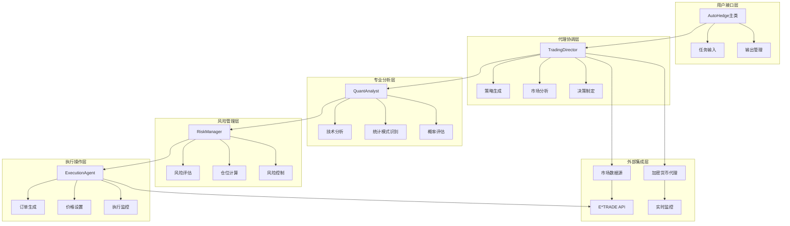
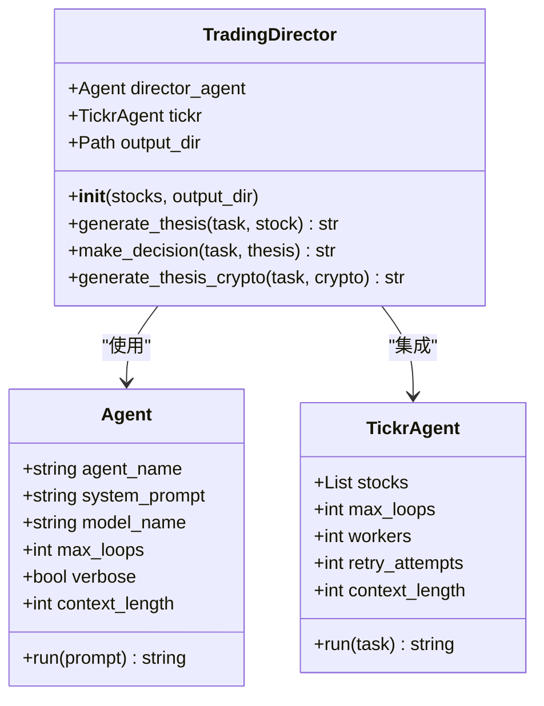
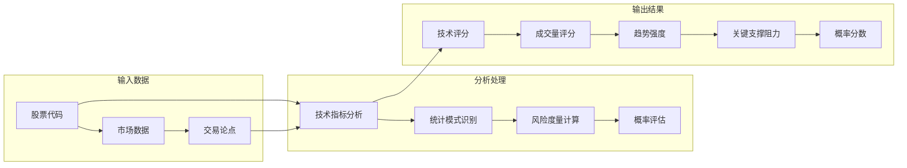
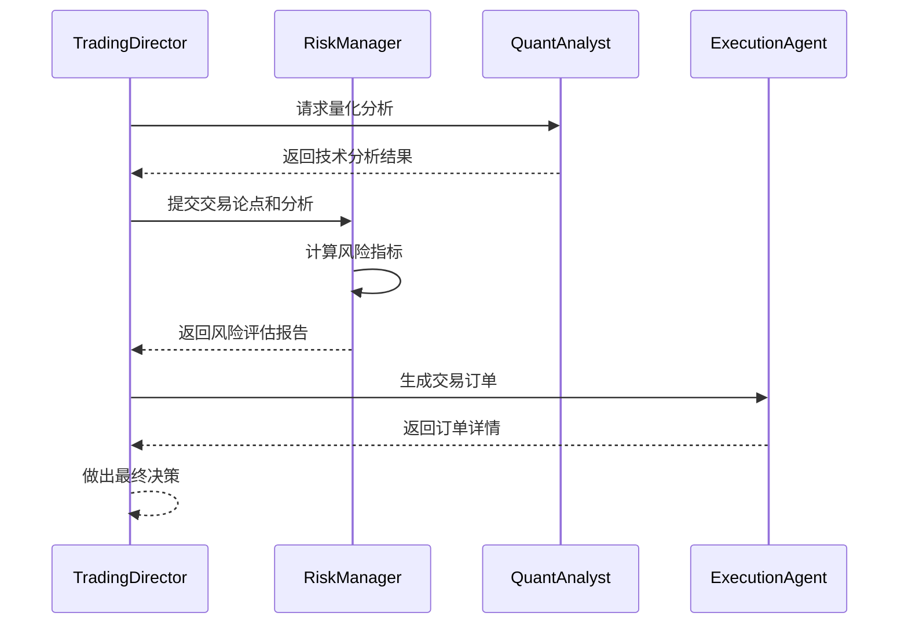
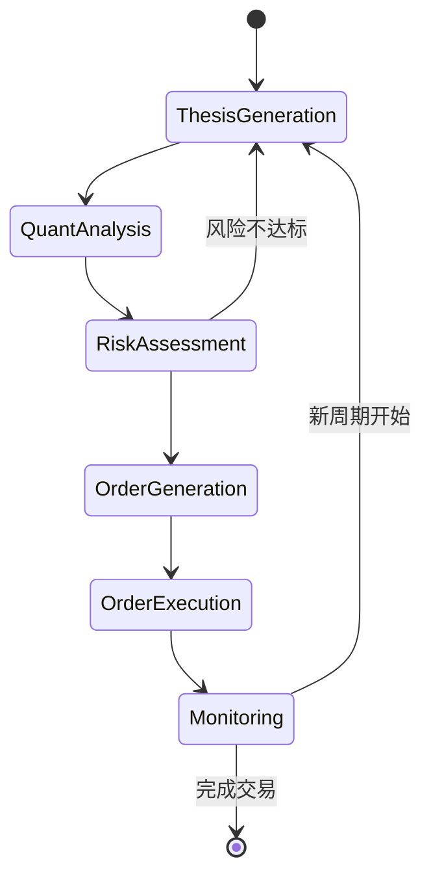
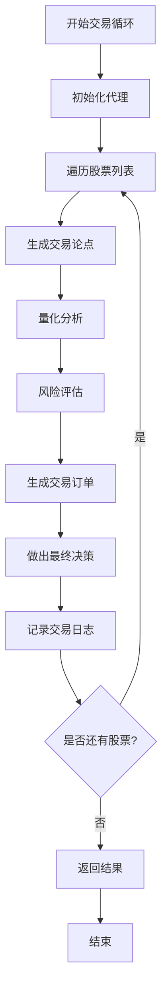

# 多代理架构设计

<cite>
**本文档中引用的文件**
- [main.py](file://autohedge/main.py)
- [README.md](file://README.md)
- [pyproject.toml](file://pyproject.toml)
- [example.py](file://example.py)
- [api.py](file://api/api.py)
- [e_trade_wrapper.py](file://autohedge/tools/e_trade_wrapper.py)
- [crypto_agent_wrapper.py](file://experimental/crypto_agent_wrapper.py)
- [btc_agent.py](file://experimental/btc_agent.py)
</cite>

## 目录
1. [引言](#引言)
2. [系统架构概览](#系统架构概览)
3. [核心代理组件](#核心代理组件)
4. [代理职责划分与协同机制](#代理职责划分与协同机制)
5. [AutoHedge主类设计](#autohedge主类设计)
6. [代理间通信机制](#代理间通信机制)
7. [Swarm框架优势分析](#swarm框架优势分析)
8. [大语言模型选择策略](#大语言模型选择策略)
9. [实际应用示例](#实际应用示例)
10. [扩展与定制指南](#扩展与定制指南)
11. [总结](#总结)

## 引言

AutoHedge是一个基于多代理架构的自动化交易系统，采用Swarm智能体框架构建。该系统通过四个核心AI代理——TradingDirector（交易总监）、QuantAnalyst（量化分析师）、RiskManager（风险经理）和ExecutionAgent（执行代理）——实现端到端的自动化交易决策链。每个代理都承担特定的专业职责，通过精心设计的提示词和模型配置，在复杂的金融市场环境中做出数据驱动的投资决策。

## 系统架构概览

AutoHedge采用分层代理架构，每个层级负责不同的交易职能。系统的核心设计理念是专业化分工与协作统一，通过明确的职责边界和标准化的通信协议实现高效的自动化交易流程。

**图表来源**
- [main.py](file://autohedge/main.py#L422-L583)
- [README.md](file://README.md#L70-L103)

**章节来源**
- [main.py](file://autohedge/main.py#L422-L583)
- [README.md](file://README.md#L70-L103)

## 核心代理组件

### TradingDirector（交易总监）

TradingDirector是整个系统的核心协调者，负责生成交易论点、制定整体策略并确保各专业代理之间的有效协作。该代理采用深度市场分析能力，能够综合技术面和基本面因素，为后续分析提供全面的市场视角。

#### 初始化过程与系统提示词设计

TradingDirector的初始化过程体现了其作为系统协调者的角色定位。通过精心设计的系统提示词，TradingDirector被赋予了市场分析、策略制定和决策支持的核心能力。

**图表来源**
- [main.py](file://autohedge/main.py#L242-L354)

#### 模型配置与性能特点

TradingDirector采用groq/deepseek-r1-distill-llama-70b模型，这一选择体现了对推理能力和上下文处理能力的重视。该模型能够在复杂的市场环境中保持稳定的推理质量，为交易决策提供可靠的支持。

**章节来源**
- [main.py](file://autohedge/main.py#L242-L354)

### QuantAnalyst（量化分析师）

QuantAnalyst专注于技术分析和统计模式识别，为交易决策提供量化的技术支持。该代理通过深入的技术指标分析和统计方法应用，为市场判断提供客观的数值依据。

#### 分析能力与输出格式

QuantAnalyst的分析能力涵盖多个维度：技术指标评分、成交量分析、趋势强度评估、波动率计算和概率评分等。这种结构化的输出格式确保了分析结果的可读性和实用性。

**图表来源**
- [main.py](file://autohedge/main.py#L356-L421)

**章节来源**
- [main.py](file://autohedge/main.py#L356-L421)

### RiskManager（风险经理）

RiskManager负责风险评估和仓位管理，是系统风险控制的核心组件。该代理通过综合考虑市场风险、位置风险和组合风险，为每笔交易提供科学的风险管理建议。

#### 风险评估框架

RiskManager采用多层次的风险评估框架，包括位置规模确定、最大回撤预测、市场风险暴露评估和总体风险评分等关键指标。这种全面的风险评估体系确保了交易的安全性和收益的稳定性。

**图表来源**
- [main.py](file://autohedge/main.py#L159-L188)

**章节来源**
- [main.py](file://autohedge/main.py#L159-L188)

### ExecutionAgent（执行代理）

ExecutionAgent专注于交易执行的具体操作，负责生成精确的交易订单并设置相应的执行参数。该代理确保交易指令能够准确无误地传达给交易平台。

#### 执行参数优化

ExecutionAgent通过精确的参数设置实现最优的交易执行效果。包括股票符号、数量、入场出场价格、订单类型和时间约束等关键要素的优化配置。

**章节来源**
- [main.py](file://autohedge/main.py#L190-L241)

## 代理职责划分与协同机制

### 职责边界设计

AutoHedge的多代理架构采用了清晰的职责边界设计，每个代理都有明确的功能定位和工作范围。这种设计避免了功能重叠和责任不清的问题，提高了系统的稳定性和可维护性。

| 代理名称 | 主要职责 | 核心能力 | 输出内容 |
|---------|---------|---------|---------|
| TradingDirector | 策略协调与决策 | 市场分析、论点生成 | 交易论点、市场洞察 |
| QuantAnalyst | 技术分析与统计 | 技术指标、概率评估 | 技术评分、统计分析 |
| RiskManager | 风险评估与控制 | 风险度量、仓位管理 | 风险评估、控制建议 |
| ExecutionAgent | 交易执行与监控 | 订单生成、参数优化 | 交易订单、执行计划 |

### 协同工作机制

代理间的协同通过标准化的数据流和通信协议实现。每个代理在完成自己的专业任务后，将结果传递给下一个环节，形成完整的决策链条。

**图表来源**
- [README.md](file://README.md#L244-L261)

**章节来源**
- [main.py](file://autohedge/main.py#L477-L583)

## AutoHedge主类设计

AutoHedge主类作为整个系统的协调中心，负责初始化所有子代理、管理交易循环并处理输出结果。该设计体现了面向对象编程的最佳实践，提供了清晰的接口和灵活的配置选项。

### 初始化策略

AutoHedge主类采用依赖注入的方式初始化各个代理组件，确保了系统的模块化和可测试性。通过构造函数参数，用户可以自定义系统的行为和输出格式。

### 交易循环管理

主类实现了完整的交易循环管理机制，包括市场数据收集、代理协调、结果汇总和日志记录等功能。这种设计使得系统能够持续运行并适应不断变化的市场环境。

**图表来源**
- [main.py](file://autohedge/main.py#L477-L583)

**章节来源**
- [main.py](file://autohedge/main.py#L422-L583)

## 代理间通信机制

### 数据流转设计

AutoHedge系统采用事件驱动的通信机制，代理间通过标准化的消息格式进行信息交换。这种设计确保了系统的松耦合和高可靠性。

### 对话管理系统

系统集成了Conversation类来管理代理间的对话历史，这不仅有助于调试和审计，还为后续的分析和优化提供了宝贵的数据基础。

**章节来源**
- [main.py](file://autohedge/main.py#L475-L583)

## Swarm框架优势分析

### 智能体管理能力

Swarm框架提供了强大的智能体生命周期管理功能，包括状态保存、动态加载和并发控制等特性。这些功能大大简化了复杂AI系统的开发和部署过程。

### 模型集成灵活性

Swarm框架支持多种大语言模型的无缝集成，AutoHedge系统充分利用了这一特性，根据不同代理的需求选择最适合的模型。这种灵活性使得系统能够根据具体场景优化性能和成本。

### 社区生态系统

AutoHedge基于活跃的Swarm社区生态系统构建，获得了持续的更新和支持。这种社区驱动的发展模式确保了系统的先进性和可靠性。

**章节来源**
- [pyproject.toml](file://pyproject.toml#L24-L30)

## 大语言模型选择策略

### 性能与成本平衡

AutoHedge选择了groq/deepseek-r1-distill-llama-70b作为主要模型，这一选择体现了性能与成本的平衡考量。该模型在保持较高推理质量的同时，具有较好的响应速度和较低的计算成本。

### 专业领域适配

不同代理根据其专业需求选择了合适的模型配置。例如，TradingDirector和QuantAnalyst使用相同的高性能模型，而RiskManager和ExecutionAgent则采用了专门优化的模型版本。

### 可扩展性考虑

模型选择时充分考虑了系统的可扩展性需求。通过Swarm框架的模块化设计，未来可以轻松替换或添加新的模型，满足不断演进的业务需求。

**章节来源**
- [main.py](file://autohedge/main.py#L267-L272)
- [main.py](file://autohedge/main.py#L373-L378)
- [main.py](file://autohedge/main.py#L164-L169)
- [main.py](file://autohedge/main.py#L215-L220)

## 实际应用示例

### 基本使用模式

AutoHedge提供了简洁易用的API接口，用户可以通过简单的几行代码启动完整的交易分析流程。这种设计降低了AI交易系统的使用门槛，使更多的投资者能够享受到智能化的投资服务。

### 高级配置选项

系统支持丰富的配置选项，包括自定义代理名称、描述信息、输出目录和输出格式等。这些选项使得系统能够适应不同的应用场景和需求。

### API集成能力

AutoHedge不仅提供了本地Python接口，还支持RESTful API服务，便于与其他系统和服务进行集成。这种双重接口设计确保了系统的灵活性和可访问性。

**章节来源**
- [example.py](file://example.py#L1-L22)
- [api.py](file://api/api.py#L1-L458)

## 扩展与定制指南

### 代理扩展方法

AutoHedge系统设计了良好的扩展接口，开发者可以通过继承现有类或实现特定接口来添加新的代理类型。这种设计保证了系统的向后兼容性和可维护性。

### 自定义提示词

系统允许用户自定义代理的系统提示词，以适应特定的业务需求或市场环境。这种灵活性使得系统能够快速适应不同的投资策略和市场条件。

### 工具集成

AutoHedge提供了丰富的工具集成接口，支持与各种第三方服务和数据源的连接。这种开放的设计理念为系统的功能扩展提供了无限可能。

**章节来源**
- [e_trade_wrapper.py](file://autohedge/tools/e_trade_wrapper.py#L1-L174)
- [crypto_agent_wrapper.py](file://experimental/crypto_agent_wrapper.py#L1-L52)

## 总结

AutoHedge的多代理架构设计代表了自动化交易系统发展的重要方向。通过专业化分工、标准化接口和智能化协调，该系统成功地将复杂的金融交易过程分解为可管理的模块，每个模块都能发挥其专业优势。

系统的核心优势体现在以下几个方面：

1. **架构清晰性**：明确的职责划分和协作机制确保了系统的稳定性和可维护性
2. **专业深度**：每个代理都专注于特定的分析领域，提供了专业的解决方案
3. **技术先进性**：采用最新的AI技术和Swarm框架，保证了系统的前沿性
4. **实用价值**：简洁的接口设计和丰富的配置选项使其易于使用和扩展

随着人工智能技术的不断发展，AutoHedge的多代理架构为未来的智能交易系统提供了有价值的参考和借鉴。这种设计不仅适用于股票交易，也可以扩展到其他金融产品和市场环境，具有广阔的应用前景和发展潜力。