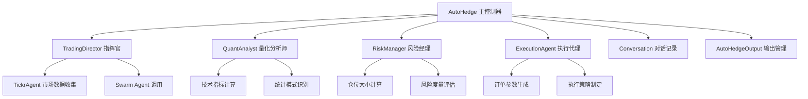
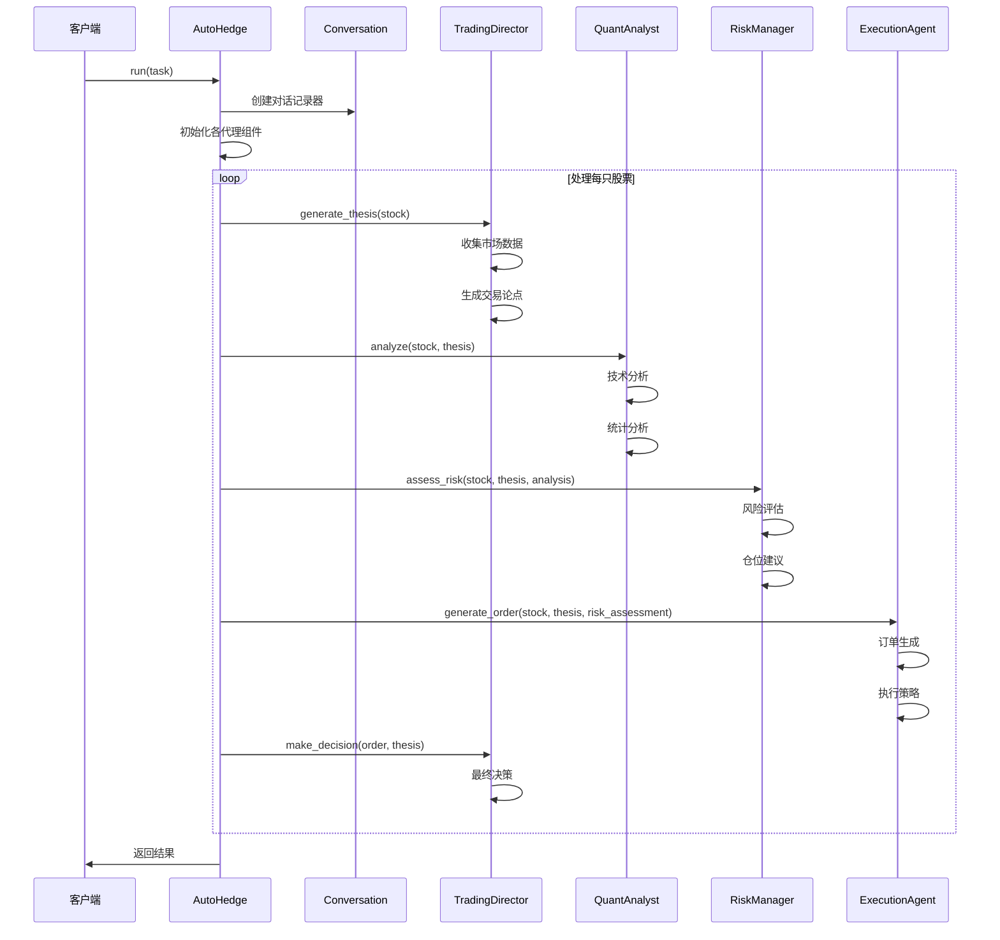
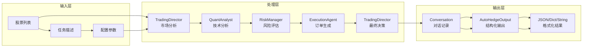
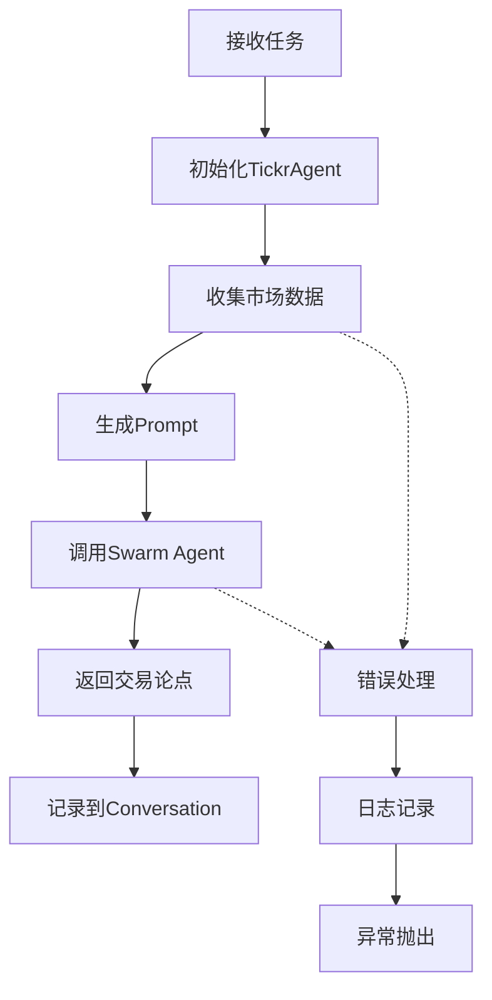
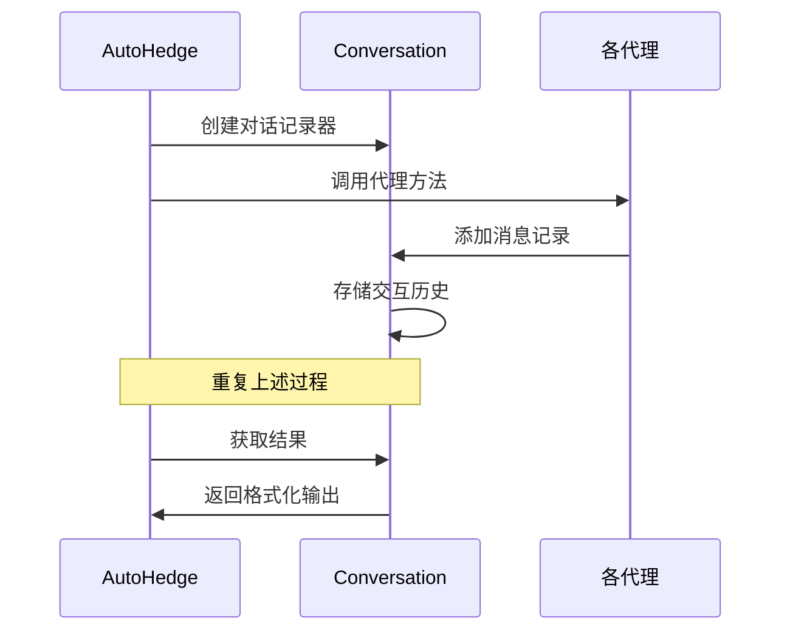
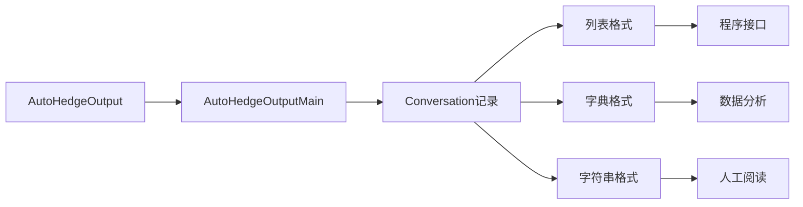
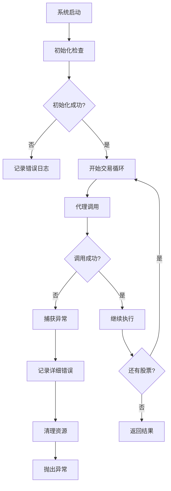
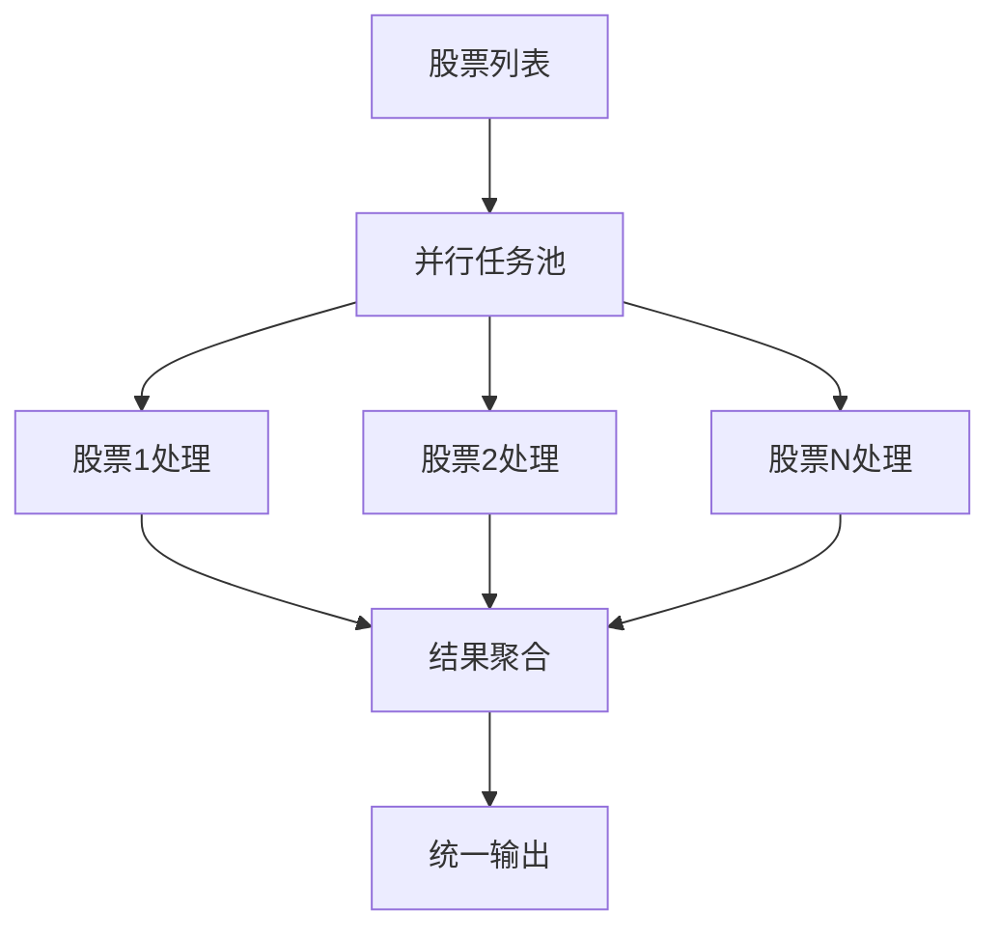

# 数据流与执行流程

<cite>
**本文档中引用的文件**
- [autohedge/main.py](file://autohedge/main.py)
- [autohedge/__init__.py](file://autohedge/__init__.py)
- [example.py](file://example.py)
- [README.md](file://README.md)
</cite>

## 目录
1. [系统概述](#系统概述)
2. [核心架构](#核心架构)
3. [run()方法详解](#run方法详解)
4. [数据流分析](#数据流分析)
5. [代理组件详细分析](#代理组件详细分析)
6. [Conversation对象机制](#conversation对象机制)
7. [输出类型与格式化](#输出类型与格式化)
8. [异常处理与错误管理](#异常处理与错误管理)
9. [性能优化策略](#性能优化策略)
10. [总结](#总结)

## 系统概述

AutoHedge是一个基于多智能体架构的自动化交易系统，采用Swarm智能体框架构建。该系统通过协调多个专门化的AI代理来完成完整的交易周期，从市场分析到最终执行，形成一个高度自动化的交易生态系统。

### 核心特性

- **多智能体协作**：Director Agent负责策略制定，Quant Agent进行技术分析，Risk Manager评估风险，Execution Agent执行交易
- **实时市场分析**：集成市场数据提供商，支持实时行情分析
- **风险优先**：内置风险管理和仓位控制机制
- **结构化输出**：基于Pydantic模型的标准化输出格式
- **全面日志记录**：详细的交易跟踪和调试功能

## 核心架构

AutoHedge采用分层的多智能体架构，每个组件都有明确的职责分工：

**图表来源**
- [autohedge/main.py](file://autohedge/main.py#L422-L474)

**章节来源**
- [autohedge/main.py](file://autohedge/main.py#L1-L50)
- [README.md](file://README.md#L70-L120)

## run()方法详解

`run()`方法是AutoHedge系统的核心入口点，它协调整个交易周期的执行。该方法按照严格的顺序调用各个代理组件，确保数据在系统中的正确流动。

### 方法签名与初始化

**图表来源**
- [autohedge/main.py](file://autohedge/main.py#L477-L582)

### 关键执行步骤

1. **初始化阶段**：创建Conversation对象用于记录交互历史
2. **循环处理**：对每只股票执行完整的交易周期
3. **数据收集**：TradingDirector收集市场数据
4. **分析处理**：QuantAnalyst进行技术分析
5. **风险评估**：RiskManager评估潜在风险
6. **订单生成**：ExecutionAgent生成交易订单
7. **决策制定**：TradingDirector做出最终决策
8. **结果输出**：根据output_type返回不同格式的结果

**章节来源**
- [autohedge/main.py](file://autohedge/main.py#L477-L582)

## 数据流分析

AutoHedge系统中的数据流遵循严格的单向传递原则，每个阶段都依赖于前一阶段的输出作为输入。

### 数据流向图

**图表来源**
- [autohedge/main.py](file://autohedge/main.py#L492-L578)

### 数据转换过程

| 阶段 | 输入类型 | 处理方式 | 输出类型 | 描述 |
|------|----------|----------|----------|------|
| 市场数据收集 | 字符串 | TickrAgent API调用 | 字符串 | 实时市场数据 |
| 交易论点生成 | 字符串+市场数据 | Swarm Agent推理 | 字符串 | 综合分析结论 |
| 技术分析 | 字符串+论点 | 数值计算与统计 | 字符串 | 技术指标分数 |
| 风险评估 | 字符串+分析结果 | 风险模型计算 | 字符串 | 风险度量报告 |
| 订单生成 | 字符串+风险评估 | 订单参数计算 | 字符串 | 交易指令 |
| 最终决策 | 字符串+决策依据 | 综合判断 | 字符串 | 执行建议 |

**章节来源**
- [autohedge/main.py](file://autohedge/main.py#L496-L550)

## 代理组件详细分析

### TradingDirector - 指挥官代理

TradingDirector是系统的核心协调者，负责生成交易论点并协调其他代理的工作。

#### 核心功能

- **市场数据分析**：使用TickrAgent收集实时市场数据
- **综合论点生成**：结合技术面和基本面因素生成交易论点
- **策略协调**：确保各代理之间的有效协作
- **最终决策**：基于所有分析结果做出交易决策

#### 工作流程

**图表来源**
- [autohedge/main.py](file://autohedge/main.py#L276-L320)

**章节来源**
- [autohedge/main.py](file://autohedge/main.py#L242-L354)

### QuantAnalyst - 量化分析师

QuantAnalyst专注于技术分析和统计模式识别，为交易决策提供数值支持。

#### 分析维度

- **技术指标分析**：移动平均线、相对强弱指数(RSI)、布林带等
- **统计模式识别**：均值回归、动量分析、波动率分析
- **风险度量计算**：VaR、预期损失、希腊字母等
- **交易成功概率**：基于历史数据的概率评分

#### 输出结构

系统期望量化分析输出包含以下结构：
- 技术分数 (0-1)
- 成交量分数 (0-1)
- 趋势强度 (0-1)
- 波动率
- 交易成功概率 (0-1)
- 关键价位 (支撑、阻力、关键点)

**章节来源**
- [autohedge/main.py](file://autohedge/main.py#L356-L420)

### RiskManager - 风险经理

RiskManager负责评估交易风险并确定合适的仓位大小。

#### 风险评估维度

- **仓位大小计算**：基于风险承受能力和交易信号强度
- **最大回撤预测**：预估潜在的最大损失
- **市场风险暴露**：评估市场波动性影响
- **相关性风险**：监控资产间的相关关系

#### 决策支持

风险经理提供的关键信息包括：
- 推荐仓位大小
- 最大回撤风险
- 市场风险暴露评估
- 整体风险评分

**章节来源**
- [autohedge/main.py](file://autohedge/main.py#L159-L187)

### ExecutionAgent - 执行代理

ExecutionAgent负责生成具体的交易订单和执行策略。

#### 订单要素

- **股票符号和数量**：明确交易标的和规模
- **入场和出场价格**：精确的交易点位
- **订单类型**：市价单、限价单、止损单等
- **时间约束**：交易的时间窗口和有效期
- **特殊要求**：额外的执行条件

#### 执行策略

系统考虑的因素包括：
- 市场流动性
- 交易成本
- 时间价值
- 风险控制

**章节来源**
- [autohedge/main.py](file://autohedge/main.py#L190-L239)

## Conversation对象机制

Conversation对象是AutoHedge系统中用于记录和管理所有代理交互历史的核心组件。

### 设计理念

- **时间序列记录**：按时间顺序保存所有交互内容
- **角色标识**：明确区分不同代理的身份
- **结构化存储**：支持多种输出格式的转换
- **可追溯性**：完整的决策过程记录

### 使用方式

**图表来源**
- [autohedge/main.py](file://autohedge/main.py#L474-L578)

### 输出格式转换

Conversation对象支持三种主要的输出格式：

| 格式类型 | 方法调用 | 输出结构 | 适用场景 |
|----------|----------|----------|----------|
| 列表格式 | `return_messages_as_list()` | 包含时间戳的消息列表 | 程序化处理 |
| 字典格式 | `return_messages_as_dictionary()` | 结构化字典形式 | 数据分析 |
| 字符串格式 | `return_history_as_string()` | 连续文本形式 | 日志查看 |

**章节来源**
- [autohedge/main.py](file://autohedge/main.py#L571-L578)

## 输出类型与格式化

AutoHedge系统提供了灵活的输出格式选项，以满足不同应用场景的需求。

### 输出类型对比

**图表来源**
- [autohedge/main.py](file://autohedge/main.py#L101-L118)

### AutoHedgeOutput模型

系统使用Pydantic模型确保输出的一致性和可靠性：

| 字段名 | 类型 | 描述 | 必需性 |
|--------|------|------|--------|
| id | str | 唯一标识符 | 自动生成 |
| thesis | Optional[str] | 交易论点 | 可选 |
| risk_assessment | Optional[str] | 风险评估 | 可选 |
| order | Optional[str] | 交易订单 | 可选 |
| decision | str | 最终决策 | 必需 |
| timestamp | str | 时间戳 | 自动生成 |
| current_stock | str | 当前股票 | 必需 |

### 输出格式选择

系统根据`output_type`参数动态选择输出格式：

- **"list"**：返回消息列表，适合程序化处理
- **"dict"**：返回结构化字典，便于数据分析
- **"str"**：返回连续文本，适合人工阅读

**章节来源**
- [autohedge/main.py](file://autohedge/main.py#L101-L118)
- [autohedge/main.py](file://autohedge/main.py#L571-L578)

## 异常处理与错误管理

AutoHedge系统实现了完善的异常处理机制，确保系统的稳定性和可靠性。

### 错误处理层次

**图表来源**
- [autohedge/main.py](file://autohedge/main.py#L580-L582)

### 异常类型与处理

| 异常类型 | 触发条件 | 处理方式 | 影响范围 |
|----------|----------|----------|----------|
| 市场数据获取失败 | TickrAgent调用超时 | 记录错误，跳过当前股票 | 单只股票 |
| 量化分析异常 | 技术指标计算错误 | 记录警告，使用默认值 | 单次分析 |
| 风险评估失败 | 风险模型计算异常 | 使用保守估计 | 单次评估 |
| 订单生成错误 | 执行策略制定失败 | 记录错误，不生成订单 | 单次执行 |
| 决策异常 | 最终判断逻辑错误 | 记录异常，返回默认决策 | 单次决策 |

### 日志记录策略

系统使用loguru库实现分级日志记录：

- **ERROR级别**：记录严重错误和异常
- **WARNING级别**：记录潜在问题和警告
- **INFO级别**：记录正常操作和状态
- **DEBUG级别**：记录详细调试信息

**章节来源**
- [autohedge/main.py](file://autohedge/main.py#L316-L320)
- [autohedge/main.py](file://autohedge/main.py#L415-L418)
- [autohedge/main.py](file://autohedge/main.py#L580-L582)

## 性能优化策略

AutoHedge系统在设计时充分考虑了性能优化，特别是在处理多只股票时的效率提升。

### 并行处理可能性

虽然当前实现是顺序处理每只股票，但系统架构支持并行化改进：

### 优化策略

#### 1. 缓存机制

- **市场数据缓存**：避免重复获取相同数据
- **分析结果缓存**：重用之前的分析结果
- **模型响应缓存**：减少重复的AI推理

#### 2. 异步处理

- **非阻塞I/O**：异步获取市场数据
- **并发代理调用**：并行执行独立的分析任务
- **流水线处理**：部分重叠的处理阶段

#### 3. 资源管理

- **连接池管理**：复用网络连接
- **内存优化**：及时释放不需要的数据
- **CPU调度**：合理分配计算资源

### 性能瓶颈识别

| 组件 | 瓶颈类型 | 影响程度 | 优化建议 |
|------|----------|----------|----------|
| TickrAgent | 网络延迟 | 高 | 连接池+缓存 |
| Swarm Agent | 推理时间 | 中 | 模型优化+批处理 |
| 风险计算 | 数值计算 | 中 | 向量化运算 |
| 订单生成 | 逻辑复杂度 | 低 | 算法优化 |

### 扩展性考虑

- **水平扩展**：支持分布式部署
- **垂直扩展**：利用GPU加速计算
- **弹性伸缩**：根据负载动态调整资源

**章节来源**
- [autohedge/main.py](file://autohedge/main.py#L293-L300)
- [autohedge/main.py](file://autohedge/main.py#L493-L550)

## 总结

AutoHedge系统通过精心设计的多智能体架构，实现了从市场分析到交易执行的完整自动化流程。其核心优势包括：

### 架构优势

- **模块化设计**：清晰的职责分离和接口定义
- **数据流控制**：严格的数据传递和转换机制
- **错误处理**：完善的异常捕获和恢复机制
- **输出灵活性**：多种格式支持不同应用场景

### 技术特色

- **Swarm智能体**：利用先进的AI推理能力
- **实时数据集成**：支持实时市场分析
- **风险优先**：内置完善的风险管理体系
- **可扩展性**：良好的架构设计支持功能扩展

### 应用价值

AutoHedge系统为量化交易提供了一个完整的解决方案，特别适用于：
- 机构投资者的自动化交易需求
- 研究机构的策略验证平台
- 个人投资者的交易辅助工具
- 金融产品的风险管理应用

该系统展示了多智能体协作在金融领域的强大潜力，为未来的智能交易系统发展提供了有价值的参考。