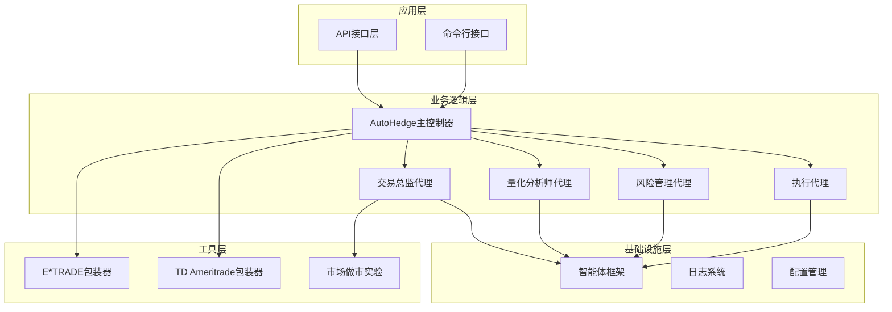
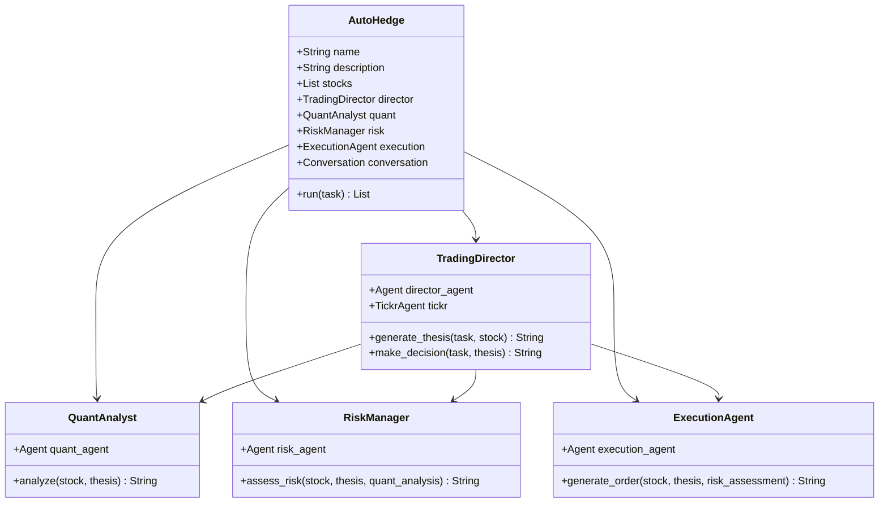
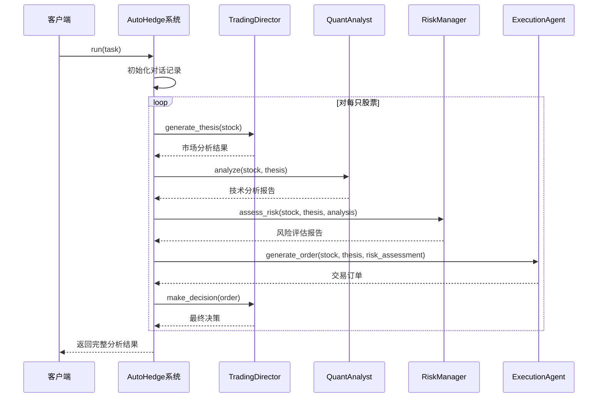
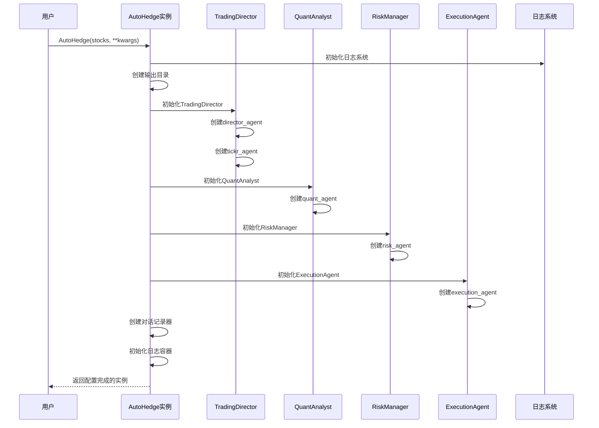
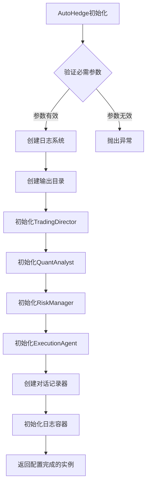
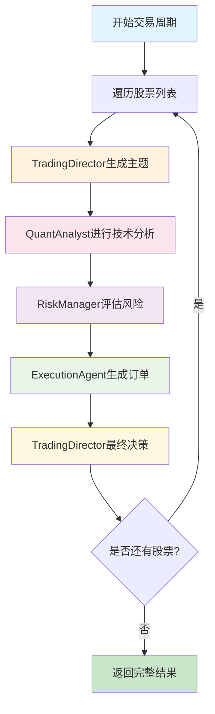
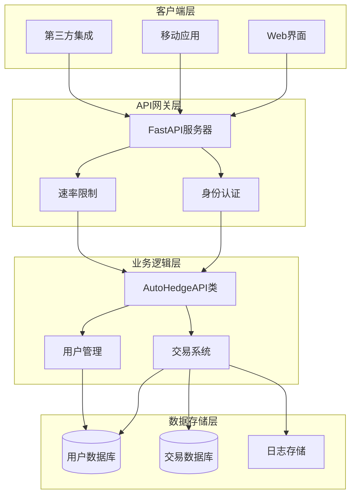
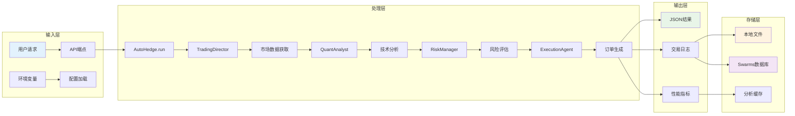

# 核心架构设计

<cite>
**本文档中引用的文件**
- [main.py](file://autohedge/main.py)
- [api.py](file://api/api.py)
- [__init__.py](file://autohedge/__init__.py)
- [README.md](file://README.md)
- [example.py](file://example.py)
- [pyproject.toml](file://pyproject.toml)
- [e_trade_wrapper.py](file://autohedge/tools/e_trade_wrapper.py)
- [td_ameritrade.py](file://autohedge/tools/td_ameritrade.py)
- [market_making.py](file://experimental/market_making.py)
</cite>

## 目录
1. [引言](#引言)
2. [项目结构概览](#项目结构概览)
3. [多代理架构核心](#多代理架构核心)
4. [AutoHedge类设计](#autohedge类设计)
5. [代理角色与职责](#代理角色与职责)
6. [系统初始化流程](#系统初始化流程)
7. [任务调度与协作机制](#任务调度与协作机制)
8. [API层集成](#api层集成)
9. [数据流与消息传递](#数据流与消息传递)
10. [设计决策分析](#设计决策分析)
11. [性能考虑](#性能考虑)
12. [总结](#总结)

## 引言

AutoHedge是一个基于多代理架构的自动化交易系统，采用智能体协作模式实现端到端的交易流程。该系统通过四个核心代理——TradingDirector、QuantAnalyst、RiskManager和ExecutionAgent——协同工作，构建了一个完整的AI驱动交易生态系统。

系统的核心设计理念是模块化和专业化，每个代理都专注于特定的交易环节，通过标准化的消息传递机制实现无缝协作。这种架构不仅提高了系统的可维护性和扩展性，还确保了交易决策的全面性和准确性。

## 项目结构概览

AutoHedge项目采用清晰的分层架构设计，主要包含以下核心模块：



**图表来源**
- [main.py](file://autohedge/main.py#L422-L476)
- [api.py](file://api/api.py#L130-L149)

**章节来源**
- [main.py](file://autohedge/main.py#L1-L50)
- [api.py](file://api/api.py#L1-L50)

## 多代理架构核心

AutoHedge的多代理架构是其核心技术特征，体现了现代分布式智能系统的设计理念。该架构基于以下核心原则：

### 架构设计原则

1. **专业化分工**：每个代理负责特定的交易职能，避免功能重叠
2. **松耦合设计**：代理之间通过标准化接口通信，降低依赖性
3. **容错性**：单个代理故障不影响整体系统运行
4. **可扩展性**：支持新代理类型和功能模块的动态添加

### 智能体框架集成

系统基于swarms框架构建，利用其强大的智能体管理和通信能力：



**图表来源**
- [main.py](file://autohedge/main.py#L422-L583)

**章节来源**
- [main.py](file://autohedge/main.py#L242-L583)

## AutoHedge类设计

AutoHedge类作为整个系统的核心控制器，负责协调所有代理的工作。其设计体现了面向对象编程的最佳实践和系统架构的完整性。

### 类结构与属性

AutoHedge类包含了完整的交易系统状态和配置信息：

| 属性名称 | 类型 | 描述 | 默认值 |
|---------|------|------|--------|
| name | String | 系统名称标识 | "autohedge" |
| description | String | 系统功能描述 | "fully autonomous hedgefund" |
| stocks | List[str] | 待交易股票列表 | 必需参数 |
| output_dir | Path | 输出目录路径 | "outputs" |
| strategy | String | 交易策略类型 | None |
| output_type | String | 输出格式类型 | "list" |
| director | TradingDirector | 交易总监代理实例 | 自动创建 |
| quant | QuantAnalyst | 量化分析师代理实例 | 自动创建 |
| risk | RiskManager | 风险管理代理实例 | 自动创建 |
| execution | ExecutionAgent | 执行代理实例 | 自动创建 |
| logs | AutoHedgeOutputMain | 交易日志容器 | 初始化空列表 |

### 核心方法设计

AutoHedge类提供了简洁而强大的接口：



**图表来源**
- [main.py](file://autohedge/main.py#L477-L583)

**章节来源**
- [main.py](file://autohedge/main.py#L422-L583)

## 代理角色与职责

AutoHedge系统中的四个核心代理各自承担独特的职责，形成了完整的交易决策链。

### TradingDirector - 交易总监代理

TradingDirector是系统的核心协调者，负责生成交易主题和制定总体策略：

#### 主要职责
- **市场分析**：综合技术指标和基本面因素进行市场状况评估
- **主题生成**：为每只股票生成详细的交易主题和投资逻辑
- **策略协调**：整合各专业代理的分析结果，形成统一的交易建议
- **决策制定**：基于所有输入信息做出最终的交易决策

#### 关键特性
- 使用GPT-4o-mini模型进行高级推理和分析
- 集成TickrAgent获取实时市场数据
- 支持复杂的多维度分析和判断
- 具备风险意识和市场洞察力

### QuantAnalyst - 量化分析师代理

QuantAnalyst专注于技术分析和统计建模，为交易决策提供数据支撑：

#### 分析维度
- **技术指标分析**：移动平均线、相对强弱指数、布林带等
- **统计模式识别**：均值回归、动量分析、波动率计算
- **概率评估**：基于历史数据的交易成功概率预测
- **关键价位识别**：支撑位、阻力位和关键转折点

#### 输出格式
```json
{
    "ticker": "股票代码",
    "technical_score": 0.85,
    "volume_score": 0.72,
    "trend_strength": 0.91,
    "volatility": 0.15,
    "probability_score": 0.88,
    "key_levels": {
        "support": 150.25,
        "resistance": 165.75,
        "pivot": 158.00
    }
}
```

### RiskManager - 风险管理代理

RiskManager专门负责风险评估和仓位管理，确保交易的安全性：

#### 风险评估维度
- **仓位规模确定**：基于资金管理和风险承受能力计算最优仓位
- **最大回撤估算**：预测潜在的最大损失幅度
- **市场风险监控**：评估流动性风险和市场波动影响
- **相关性分析**：识别资产间的关联关系和分散化效果

#### 决策支持
- 提供精确的风险度量指标
- 建议合适的止损和止盈水平
- 计算风险调整后的收益指标
- 生成风险报告和监控建议

### ExecutionAgent - 执行代理

ExecutionAgent负责将交易决策转化为具体的订单指令：

#### 执行功能
- **订单参数生成**：定义精确的交易数量、价格和时间限制
- **入场出场设置**：确定最佳的买入和卖出时机
- **订单类型选择**：根据市场条件选择市价单、限价单或止损单
- **执行策略优化**：最小化滑点和提高执行效率

#### 订单格式
```json
{
    "order_type": "limit",
    "quantity": 100,
    "entry_price": 155.25,
    "stop_loss": 152.00,
    "take_profit": 165.00,
    "time_in_force": "day"
}
```

**章节来源**
- [main.py](file://autohedge/main.py#L12-L241)

## 系统初始化流程

AutoHedge系统的初始化过程体现了优雅的设计模式和依赖注入原则。初始化流程确保所有组件正确配置并准备就绪。

### 初始化序列图



**图表来源**
- [main.py](file://autohedge/main.py#L435-L476)

### 配置参数详解

系统支持丰富的配置选项，允许用户根据需求定制：

| 参数名称 | 类型 | 必需性 | 描述 |
|---------|------|--------|------|
| stocks | List[str] | 必需 | 要交易的股票代码列表 |
| name | str | 可选 | 系统名称，默认为"autohedge" |
| description | str | 可选 | 系统功能描述 |
| output_dir | str | 可选 | 输出文件存储目录，默认"outputs" |
| output_file_path | str | 可选 | 特定输出文件路径 |
| strategy | str | 可选 | 交易策略类型 |
| output_type | str | 可选 | 输出格式："list"、"dict"或"str" |

### 依赖注入与模块化

初始化过程中采用了依赖注入模式，确保各组件的独立性和可测试性：



**图表来源**
- [main.py](file://autohedge/main.py#L435-L476)

**章节来源**
- [main.py](file://autohedge/main.py#L435-L476)

## 任务调度与协作机制

AutoHedge系统采用流水线式的任务调度机制，确保各代理按照既定顺序和规则协作完成交易周期。

### 交易周期流程



**图表来源**
- [main.py](file://autohedge/main.py#L477-L583)

### 消息传递机制

系统采用基于Conversation类的消息传递机制，实现了代理间的有序通信：

#### 消息格式规范
- **角色标识**：明确消息来源（TradingDirector、QuantAnalyst等）
- **内容结构**：标准化的数据格式和字段定义
- **时间戳**：自动添加的时间标记用于审计和调试
- **上下文保持**：维护完整的交易决策历史

#### 协作模式
1. **顺序执行**：代理按预定义顺序依次处理任务
2. **状态共享**：通过Conversation对象共享中间结果
3. **错误传播**：异常情况下的优雅降级和错误报告
4. **结果聚合**：将各代理的输出整合为完整的交易方案

### 同步与异步策略

系统在不同层面采用了不同的并发策略：

#### 同步策略
- **代理间通信**：采用同步调用确保数据一致性
- **交易决策**：所有代理必须完成当前步骤才能进入下一步
- **结果验证**：在继续之前验证前一阶段的输出质量

#### 异步策略
- **市场数据获取**：使用异步API调用提高效率
- **日志记录**：后台异步写入避免阻塞主线程
- **性能监控**：独立的异步任务收集系统指标

**章节来源**
- [main.py](file://autohedge/main.py#L477-L583)

## API层集成

AutoHedge提供了完整的RESTful API接口，支持企业级部署和集成需求。API层采用FastAPI框架构建，具备高性能和易用性的特点。

### API架构设计



**图表来源**
- [api.py](file://api/api.py#L130-L149)

### 核心API端点

#### 用户管理端点
- **POST /users**：创建新用户账户
- **GET /users/me**：获取当前用户信息
- **PUT /users/me**：更新用户资料

#### 交易操作端点
- **POST /trades**：创建新的交易任务
- **GET /trades**：列出用户的交易记录
- **GET /trades/{trade_id}**：获取特定交易详情
- **DELETE /trades/{trade_id}**：删除交易记录

#### 分析统计端点
- **GET /analytics/history**：获取历史交易分析

### 请求响应模式

API采用标准化的请求响应模式，确保一致性和可预测性：

#### 交易创建请求格式
```json
{
    "stocks": ["NVDA", "TSLA", "MSFT"],
    "task": "分析科技股，$1000万资金分配",
    "allocation": 10000000.0,
    "strategy_type": "momentum",
    "risk_level": 7
}
```

#### 交易响应格式
```json
{
    "id": "trade_12345",
    "user_id": "user_67890",
    "task": {...},
    "status": "completed",
    "created_at": "2024-01-15T10:30:00Z",
    "executed_at": "2024-01-15T10:30:05Z",
    "result": {...},
    "performance_metrics": {
        "return_percentage": 2.45,
        "sharpe_ratio": 1.8,
        "max_drawdown": -1.2
    }
}
```

### 安全与认证

API实现了多层次的安全机制：

#### 身份验证
- **API密钥认证**：基于X-API-Key头部的令牌验证
- **会话管理**：自动更新最后登录时间和令牌刷新
- **权限控制**：确保用户只能访问自己的资源

#### 数据保护
- **传输加密**：HTTPS协议保证数据传输安全
- **敏感信息过滤**：日志中不记录API密钥等敏感信息
- **访问审计**：记录所有API调用和操作历史

**章节来源**
- [api.py](file://api/api.py#L130-L476)

## 数据流与消息传递

AutoHedge系统中的数据流设计体现了现代软件架构的最佳实践，确保了数据的一致性、可追溯性和高效处理。

### 数据流向图



**图表来源**
- [main.py](file://autohedge/main.py#L477-L583)
- [api.py](file://api/api.py#L259-L298)

### 消息格式与标准

系统采用标准化的消息格式确保各组件间的无缝协作：

#### AutoHedgeOutput模型
```python
class AutoHedgeOutput(BaseModel):
    id: str = uuid.uuid4().hex
    thesis: Optional[str] = None
    risk_assessment: Optional[str] = None
    order: Optional[str] = None
    decision: str = None
    timestamp: str = datetime.now().isoformat()
    current_stock: str
```

#### Conversation消息结构
- **role**：消息发送者的角色标识
- **content**：具体的消息内容
- **timestamp**：消息创建时间
- **metadata**：附加的元数据信息

### 上下文管理

系统通过Conversation类实现了完整的上下文管理：

#### 上下文特性
- **时间序列**：按时间顺序记录所有交互
- **角色分离**：明确区分不同代理的消息来源
- **内容压缩**：自动处理长文本和复杂数据结构
- **历史查询**：支持按角色或时间范围检索历史记录

#### 上下文持久化
- **内存存储**：快速访问最近的交互记录
- **文件备份**：定期将重要上下文保存到磁盘
- **云端同步**：可选的远程备份和恢复功能

### 错误处理与恢复

数据流中的错误处理机制确保系统的健壮性：

#### 错误分类
- **网络错误**：API调用失败时的重试机制
- **数据验证错误**：输入数据格式不正确时的处理
- **业务逻辑错误**：交易决策冲突时的解决方案
- **系统错误**：底层服务不可用时的降级策略

#### 恢复策略
- **自动重试**：对临时性错误实施指数退避重试
- **手动干预**：严重错误时的通知和人工介入
- **状态回滚**：部分失败时的状态恢复机制
- **数据修复**：长期运行后的一致性检查和修复

**章节来源**
- [main.py](file://autohedge/main.py#L102-L119)
- [main.py](file://autohedge/main.py#L475-L583)

## 设计决策分析

AutoHedge系统的设计决策体现了对现代AI交易系统需求的深刻理解和权衡考量。这些决策在功能、性能、可维护性和扩展性之间找到了平衡点。

### 框架选择：为什么选择swarms？

#### 优势分析
- **智能体管理**：swarms框架提供了成熟的智能体生命周期管理
- **通信机制**：内置的消息传递和状态同步功能
- **扩展性**：易于添加新的代理类型和功能模块
- **社区支持**：活跃的开源社区和持续的开发维护

#### 替代方案对比
- **自定义框架**：需要投入大量开发资源，但灵活性更高
- **其他AI框架**：如LangChain、LlamaIndex，各有专长但缺乏swarms的智能体专注性
- **传统微服务**：虽然成熟但缺乏AI原生的智能体概念

### 代理架构：专业化vs通用化

#### 专业化设计的优势
- **深度优化**：每个代理可以针对特定任务进行深度优化
- **性能提升**：减少不必要的通用功能开销
- **质量保证**：专业化的代理更容易达到高质量标准
- **易于调试**：单一职责使得问题定位更加容易

#### 通用化设计的考虑
- **开发成本**：需要开发一个能够胜任多种任务的通用代理
- **性能开销**：通用代理可能在某些特定任务上表现不佳
- **维护复杂度**：复杂的逻辑分支增加了维护难度
- **学习曲线**：通用代理的学习和适应过程更加复杂

### 同步vs异步通信策略

#### 同步通信的选择理由
- **数据一致性**：确保代理间的数据同步和一致性
- **简化设计**：避免异步编程带来的复杂性
- **实时反馈**：提供即时的错误检测和处理
- **调试便利**：线性执行流程便于问题诊断

#### 异步通信的应用场景
- **外部API调用**：市场数据获取和交易执行
- **日志记录**：后台异步写入避免阻塞主线程
- **性能监控**：独立的任务收集系统指标
- **批量处理**：大规模数据处理的并行化

### 模块化vs紧耦合

#### 模块化设计的好处
- **独立开发**：各代理可以独立开发和测试
- **版本管理**：不同代理可以有不同的发布节奏
- **故障隔离**：单个组件故障不会影响整体系统
- **功能扩展**：轻松添加新的代理类型

#### 紧耦合设计的权衡
- **性能优化**：组件间可以直接访问内部状态
- **资源共享**：减少重复的资源分配和管理
- **简化通信**：减少消息传递的开销
- **统一接口**：提供一致的编程模型

### 数据持久化策略

#### 内存vs磁盘存储
- **内存存储**：快速访问，适合短期状态和临时数据
- **磁盘存储**：持久化保存，适合长期记录和备份
- **混合策略**：根据数据特性和访问模式选择合适方案

#### 实时vs批量处理
- **实时处理**：立即响应用户请求，提供即时反馈
- **批量处理**：集中处理大量数据，提高效率
- **流式处理**：介于两者之间，平衡实时性和效率

**章节来源**
- [main.py](file://autohedge/main.py#L1-L50)
- [pyproject.toml](file://pyproject.toml#L24-L31)

## 性能考虑

AutoHedge系统在设计时充分考虑了性能优化，采用了多种技术和策略来确保系统的高效运行。

### 并发处理优化

#### 异步API调用
系统在市场数据获取和外部API调用中广泛使用异步编程：
- **非阻塞IO**：避免等待网络请求导致的性能瓶颈
- **连接池管理**：复用HTTP连接减少建立连接的开销
- **超时控制**：防止长时间等待影响系统响应性

#### 并行处理策略
- **股票并行**：多个股票的分析可以并行执行
- **代理并行**：同一股票的不同分析任务可以同时进行
- **资源调度**：智能的CPU和内存资源分配

### 缓存机制

#### 多层缓存架构
- **内存缓存**：热点数据的快速访问
- **磁盘缓存**：大容量数据的持久化存储
- **分布式缓存**：跨节点的数据共享和同步

#### 缓存策略
- **LRU淘汰**：最近最少使用的数据优先淘汰
- **TTL过期**：基于时间的自动清理机制
- **预热策略**：系统启动时预先加载常用数据

### 内存管理

#### 对象池化
- **智能体复用**：避免频繁创建和销毁智能体实例
- **连接池**：数据库和API连接的复用
- **缓冲区管理**：减少内存分配和垃圾回收压力

#### 内存监控
- **实时监控**：跟踪内存使用情况
- **预警机制**：内存使用超过阈值时的告警
- **自动清理**：定期清理无用的临时对象

### 网络优化

#### 连接管理
- **长连接**：维持与外部服务的持久连接
- **连接池**：复用HTTP连接减少握手开销
- **负载均衡**：分散请求到多个服务实例

#### 数据传输优化
- **压缩传输**：减少网络带宽使用
- **批量传输**：合并小请求减少网络往返
- **CDN加速**：静态资源的全球分发

### 性能监控

#### 关键指标
- **响应时间**：从请求到响应的总时间
- **吞吐量**：单位时间内处理的请求数量
- **错误率**：失败请求的比例
- **资源利用率**：CPU、内存、网络的使用情况

#### 监控策略
- **实时监控**：持续跟踪系统状态
- **历史分析**：趋势分析和容量规划
- **告警机制**：异常情况的及时通知
- **性能基准**：定期的性能测试和优化

## 总结

AutoHedge系统代表了现代AI驱动交易系统的发展方向，通过精心设计的多代理架构实现了智能化、自动化和专业化的交易流程。

### 核心优势

1. **架构先进性**：基于swarms框架的智能体架构提供了强大的扩展性和灵活性
2. **功能完整性**：覆盖了从市场分析到交易执行的完整交易周期
3. **专业分工**：四个核心代理各司其职，确保了决策的质量和效率
4. **API友好**：完整的RESTful API支持企业级部署和集成
5. **可维护性**：模块化设计使得系统易于维护和升级

### 技术创新

- **智能体协作**：创新的多代理协作模式
- **标准化接口**：统一的消息传递和状态管理
- **实时分析**：结合实时市场数据的动态分析
- **风险控制**：内置的风险管理和仓位控制机制

### 应用前景

AutoHedge系统为机构投资者和个人交易者提供了强大的AI交易工具，具有广阔的应用前景：
- **机构投资**：为对冲基金和资产管理公司提供自动化交易解决方案
- **个人交易**：帮助个人投资者实现专业级别的交易决策
- **研究分析**：为金融研究人员提供强大的数据分析平台
- **教育培训**：作为金融工程和AI应用的教学工具

### 发展方向

未来的发展重点包括：
- **算法优化**：持续改进各代理的分析算法和决策模型
- **功能扩展**：支持更多资产类别和交易策略
- **性能提升**：进一步优化系统性能和响应速度
- **生态建设**：构建更丰富的插件和扩展生态系统

AutoHedge系统展现了AI技术在金融领域的巨大潜力，为未来的智能交易系统发展奠定了坚实的基础。