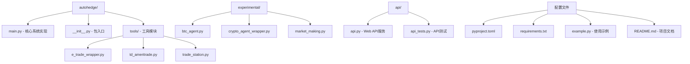
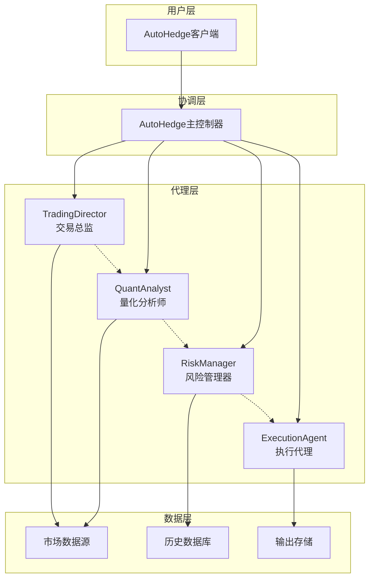
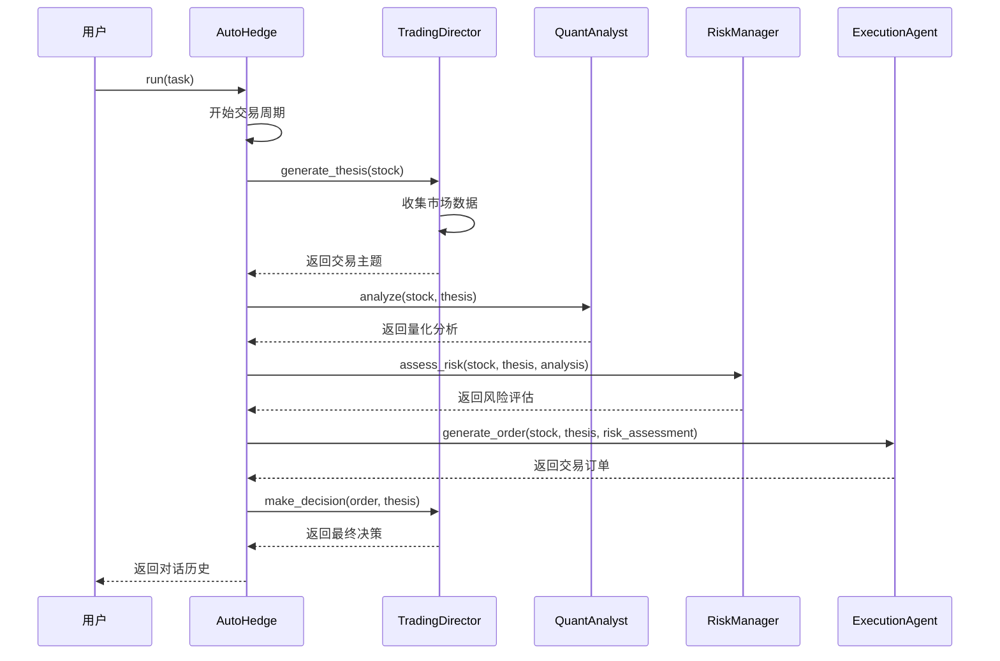
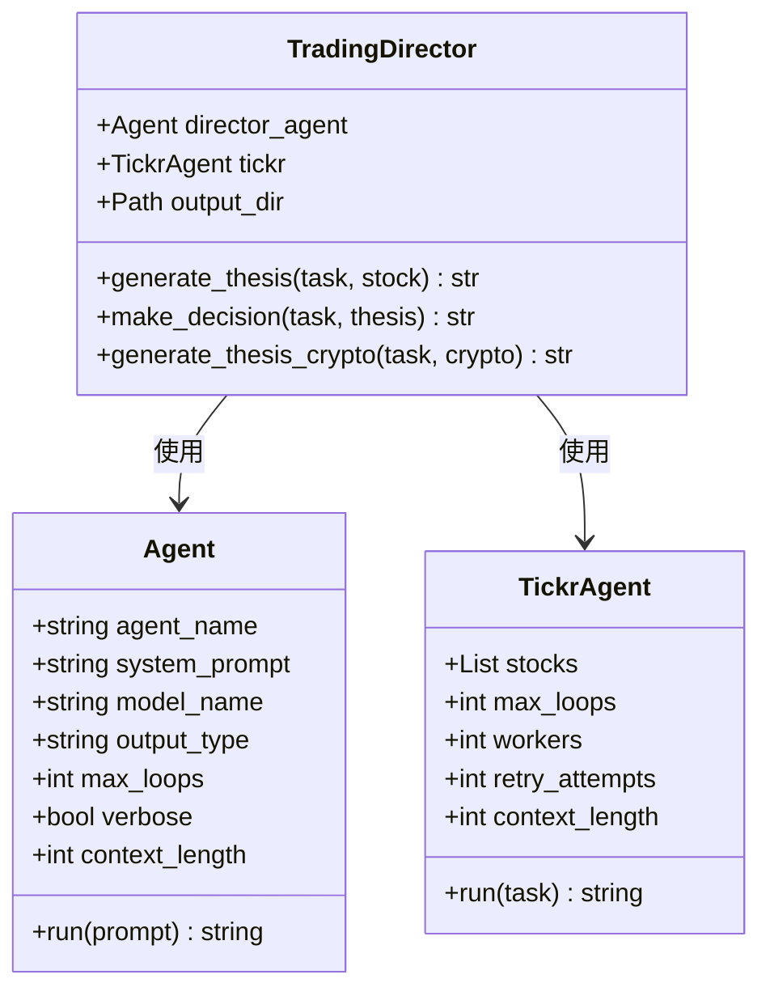
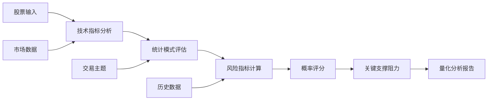
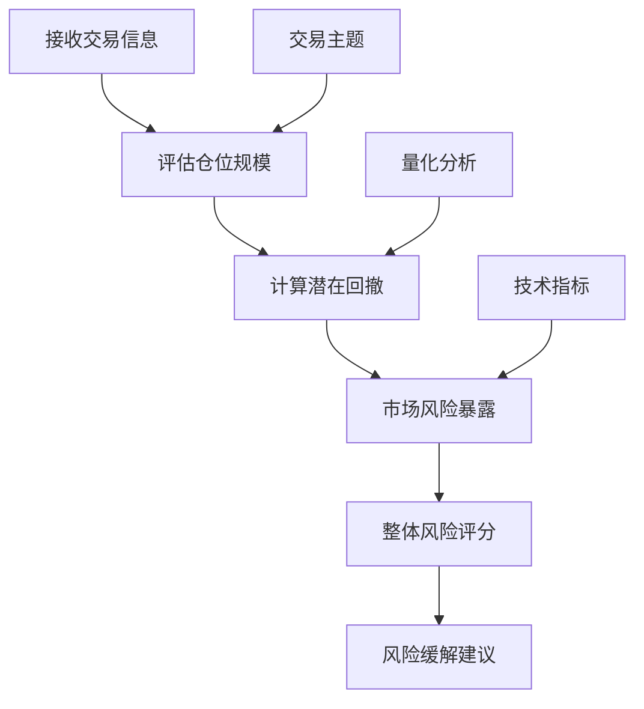
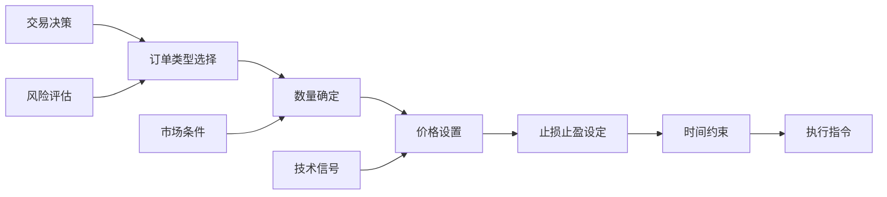
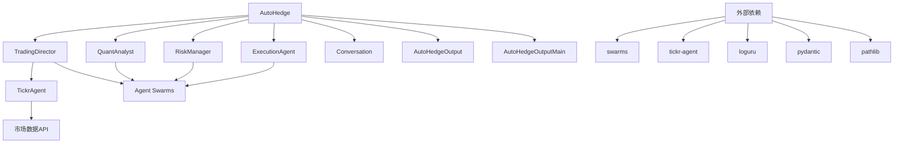

# AutoHedge核心系统

<cite>
**本文档中引用的文件**
- [autohedge/main.py](file://autohedge/main.py)
- [autohedge/__init__.py](file://autohedge/__init__.py)
- [README.md](file://README.md)
- [example.py](file://example.py)
</cite>

## 目录
1. [简介](#简介)
2. [项目结构](#项目结构)
3. [核心组件](#核心组件)
4. [架构概览](#架构概览)
5. [详细组件分析](#详细组件分析)
6. [依赖关系分析](#依赖关系分析)
7. [性能考虑](#性能考虑)
8. [故障排除指南](#故障排除指南)
9. [结论](#结论)

## 简介

AutoHedge是一个基于多代理架构的自动化对冲基金系统，利用人工智能代理协同工作来实现市场分析、风险管理和交易执行的全流程自动化。该系统的核心是AutoHedge类，它作为中央协调器，整合了TradingDirector（交易总监）、QuantAnalyst（量化分析师）、RiskManager（风险管理器）和ExecutionAgent（执行代理）四大核心组件，构建了一个完整的自动化交易生态系统。

## 项目结构

AutoHedge项目采用模块化设计，主要包含以下核心文件：



**图表来源**
- [autohedge/main.py](file://autohedge/main.py#L1-L50)
- [autohedge/__init__.py](file://autohedge/__init__.py#L1-L4)

**章节来源**
- [README.md](file://README.md#L1-L50)
- [autohedge/__init__.py](file://autohedge/__init__.py#L1-L4)

## 核心组件

AutoHedge系统由四个主要组件构成，每个组件都有特定的专业职责：

### AutoHedge主控制器
作为系统的中央协调器，负责管理整个交易周期的执行流程，协调各个子代理的工作。

### TradingDirector（交易总监）
负责生成交易主题和策略协调，分析市场条件，为投资决策提供指导。

### QuantAnalyst（量化分析师）
专注于技术分析和统计模式评估，计算概率分数，提供数据驱动的投资建议。

### RiskManager（风险管理器）
评估交易风险，确定仓位规模，设置风险参数，确保交易符合风险承受能力。

### ExecutionAgent（执行代理）
生成交易订单，设置入场/出场点位，管理订单执行，确保交易指令的准确执行。

**章节来源**
- [autohedge/main.py](file://autohedge/main.py#L422-L476)

## 架构概览

AutoHedge采用分层多代理架构，各组件之间通过明确的接口进行通信：



**图表来源**
- [autohedge/main.py](file://autohedge/main.py#L422-L476)
- [README.md](file://README.md#L70-L82)

## 详细组件分析

### AutoHedge类核心实现

AutoHedge类作为系统的核心控制器，其初始化过程体现了精心设计的架构理念：

#### __init__方法深度分析

AutoHedge的初始化过程包含了多个关键步骤，每个步骤都对应着系统的重要功能：

```mermaid
flowchart TD
A[开始初始化] --> B[设置基础属性]
B --> C[创建输出目录]
C --> D[初始化TradingDirector]
D --> E[初始化QuantAnalyst]
E --> F[初始化RiskManager]
F --> G[初始化ExecutionAgent]
G --> H[创建日志容器]
H --> I[初始化对话记录器]
I --> J[完成初始化]
B1[name, description, stocks] --> B
C1[output_dir] --> C
D1[stocks, output_dir] --> D
E1[] --> E
F1[] --> F
G1[] --> G
H1[name, description, stocks] --> H
I1[time_enabled=True] --> I
```

**图表来源**
- [autohedge/main.py](file://autohedge/main.py#L444-L476)

#### 关键字段详解

**output_dir字段**：
- 类型：`Path`
- 用途：指定输出文件的存储目录
- 功能：自动创建目录结构，确保输出文件的有序管理
- 默认值："outputs"

**conversation字段**：
- 类型：`Conversation`
- 用途：记录整个交易决策链路的历史
- 功能：支持多种输出格式转换，便于调试和审计
- 特性：启用时间戳记录，支持消息历史查询

**logs字段**：
- 类型：`AutoHedgeOutputMain`
- 用途：结构化存储交易日志
- 功能：提供统一的日志格式，支持序列化和持久化
- 组件：包含AutoHedgeOutput列表，每个元素代表单次交易的完整记录

**章节来源**
- [autohedge/main.py](file://autohedge/main.py#L444-L476)

### run()方法执行流程

AutoHedge的run方法实现了完整的交易循环，展现了系统的核心价值：



**图表来源**
- [autohedge/main.py](file://autohedge/main.py#L477-L581)

#### 输出类型灵活切换机制

AutoHedge提供了三种不同的输出格式，满足不同使用场景的需求：

| 输出类型 | 数据结构 | 用途 | 特点 |
|---------|---------|------|------|
| list | List[Dict] | 列表格式 | 每条消息作为独立字典，便于程序处理 |
| dict | Dict | 字典格式 | 完整的消息历史，包含角色和内容信息 |
| str | String | 字符串格式 | 连续的对话文本，适合阅读和分析 |

**章节来源**
- [autohedge/main.py](file://autohedge/main.py#L570-L579)

### TradingDirector组件分析

TradingDirector作为策略制定和协调中心，承担着系统最重要的决策职责：



**图表来源**
- [autohedge/main.py](file://autohedge/main.py#L242-L352)

**章节来源**
- [autohedge/main.py](file://autohedge/main.py#L242-L352)

### QuantAnalyst组件分析

QuantAnalyst专注于技术分析和统计评估，为交易决策提供数据支持：



**图表来源**
- [autohedge/main.py](file://autohedge/main.py#L355-L418)

**章节来源**
- [autohedge/main.py](file://autohedge/main.py#L355-L418)

### RiskManager组件分析

RiskManager负责风险评估和仓位管理，确保交易的安全性：



**图表来源**
- [autohedge/main.py](file://autohedge/main.py#L158-L186)

**章节来源**
- [autohedge/main.py](file://autohedge/main.py#L158-L186)

### ExecutionAgent组件分析

ExecutionAgent专注于交易执行，确保订单的准确性和及时性：



**图表来源**
- [autohedge/main.py](file://autohedge/main.py#L209-L238)

**章节来源**
- [autohedge/main.py](file://autohedge/main.py#L209-L238)

## 依赖关系分析

AutoHedge系统的依赖关系体现了清晰的分层架构：



**图表来源**
- [autohedge/main.py](file://autohedge/main.py#L1-L10)
- [autohedge/__init__.py](file://autohedge/__init__.py#L1-L4)

**章节来源**
- [autohedge/main.py](file://autohedge/main.py#L1-L10)
- [autohedge/__init__.py](file://autohedge/__init__.py#L1-L4)

## 性能考虑

AutoHedge系统在设计时充分考虑了性能优化：

### 并发处理
- 多线程任务处理
- 异步API调用
- 批量数据处理

### 缓存机制
- 市场数据缓存
- 分析结果缓存
- 配置信息缓存

### 资源管理
- 内存使用优化
- 文件句柄管理
- 网络连接池

## 故障排除指南

### 常见问题及解决方案

**初始化失败**
- 检查环境变量配置
- 验证API密钥有效性
- 确认网络连接状态

**交易执行错误**
- 检查账户权限
- 验证资金充足性
- 确认市场可交易状态

**数据分析异常**
- 检查数据源可用性
- 验证输入参数格式
- 查看详细错误日志

**章节来源**
- [autohedge/main.py](file://autohedge/main.py#L580-L581)

### 日志记录最佳实践

AutoHedge使用loguru库实现全面的日志记录：

```python
# 日志配置示例
logger.add(
    "trading_system_{time}.log",
    rotation="500 MB",
    retention="10 days",
    level="INFO",
    format="{time:YYYY-MM-DD at HH:mm:ss} | {level} | {message}"
)
```

**章节来源**
- [README.md](file://README.md#L136-L148)

## 结论

AutoHedge作为一个先进的自动化对冲基金系统，通过精心设计的多代理架构实现了交易流程的完全自动化。其核心优势包括：

1. **模块化设计**：清晰的职责分离，便于维护和扩展
2. **智能决策**：基于AI的多维度分析，提高决策质量
3. **风险控制**：内置的风险管理机制，保障交易安全
4. **灵活输出**：支持多种输出格式，适应不同使用场景
5. **完整记录**：详细的决策链路记录，便于审计和分析

该系统为现代金融科技的发展提供了有价值的参考，展示了AI技术在金融领域的巨大潜力。随着技术的不断进步，AutoHedge有望在更广泛的金融市场中发挥重要作用。