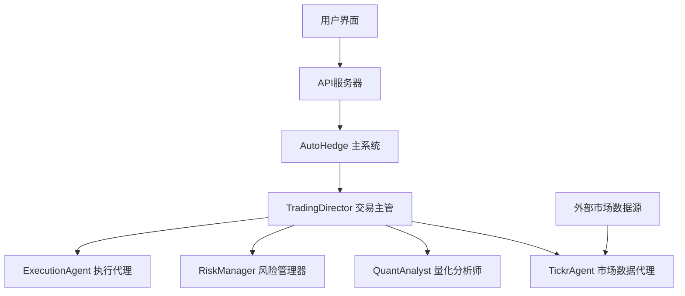
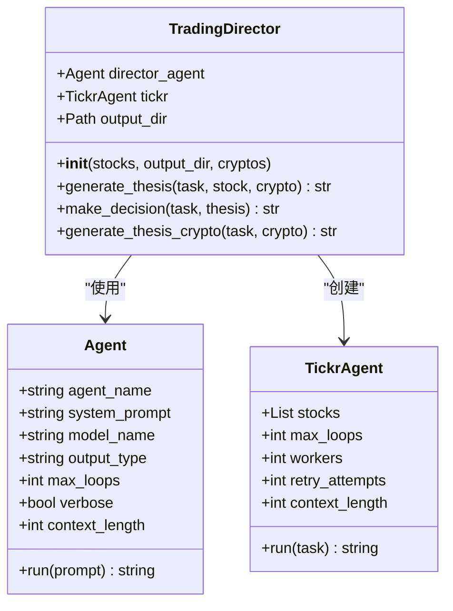
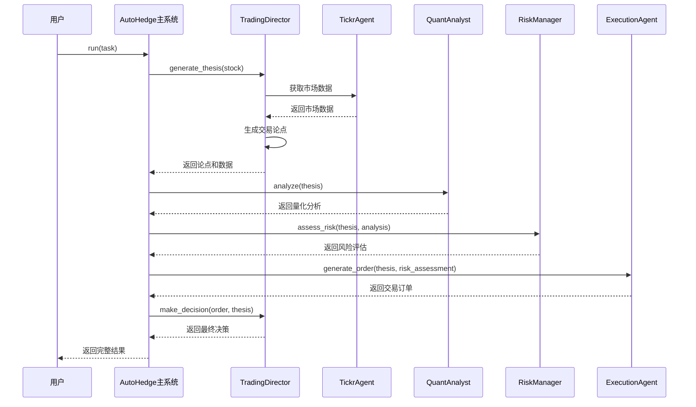
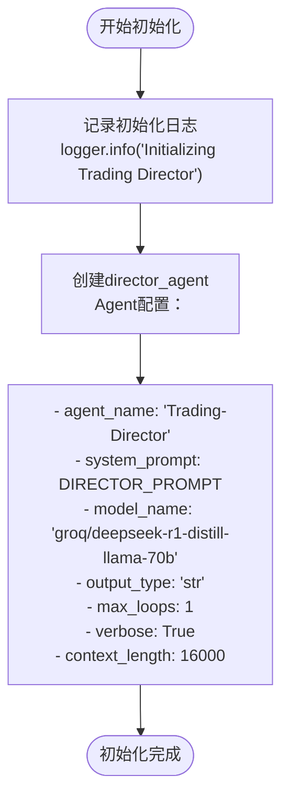
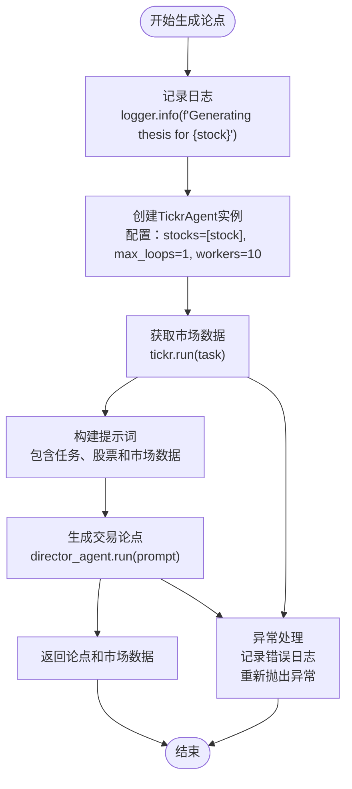
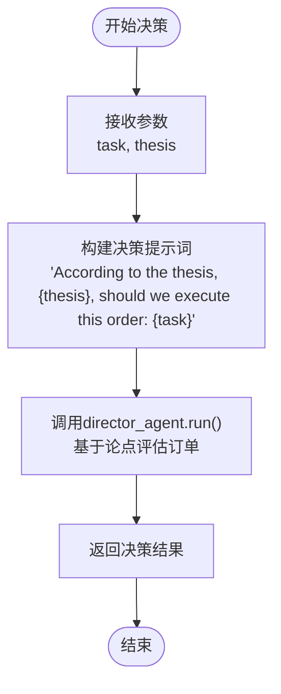
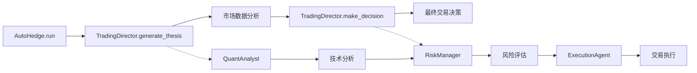
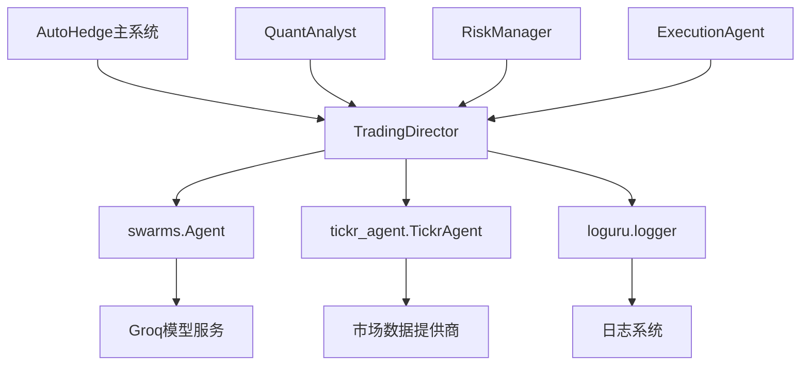
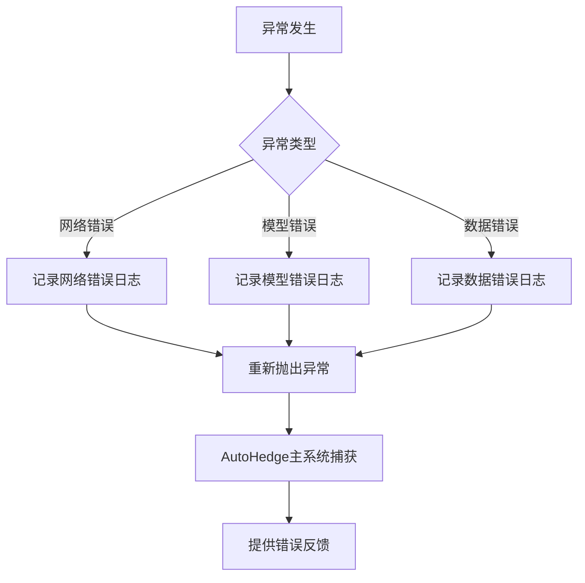

# 交易主管代理（TradingDirector）

<cite>
**本文档中引用的文件**
- [autohedge/main.py](file://autohedge/main.py)
- [example.py](file://example.py)
- [README.md](file://README.md)
- [api/api.py](file://api/api.py)
- [api/api_tests.py](file://api/api_tests.py)
</cite>

## 目录
1. [简介](#简介)
2. [项目结构](#项目结构)
3. [核心组件](#核心组件)
4. [架构概览](#架构概览)
5. [详细组件分析](#详细组件分析)
6. [依赖关系分析](#依赖关系分析)
7. [性能考虑](#性能考虑)
8. [故障排除指南](#故障排除指南)
9. [结论](#结论)

## 简介

TradingDirector是AutoHedge自动交易系统中的核心策略制定者，负责生成交易论点并协调整体交易策略。该类作为多智能体系统中的首席分析师，使用先进的语言模型（groq/deepseek-r1-distill-llama-70b）进行深度市场分析，结合实时市场数据生成全面的交易建议。

TradingDirector的主要职责包括：
- 进行深入的市场分析以识别机会和挑战
- 开发涵盖技术和基本面因素的综合交易论点
- 与其他专业代理协作确保策略的一致性
- 基于数据分析做出明智的交易决策

## 项目结构

AutoHedge项目采用模块化设计，TradingDirector类位于核心位置，通过清晰的接口与其他组件交互：



**图表来源**
- [autohedge/main.py](file://autohedge/main.py#L422-L583)
- [autohedge/main.py](file://autohedge/main.py#L241-L352)

**章节来源**
- [autohedge/main.py](file://autohedge/main.py#L1-L583)
- [README.md](file://README.md#L16-L510)

## 核心组件

### TradingDirector 类设计

TradingDirector类采用简洁而功能强大的设计模式，专注于策略生成和决策协调：



**图表来源**
- [autohedge/main.py](file://autohedge/main.py#L241-L352)

**章节来源**
- [autohedge/main.py](file://autohedge/main.py#L241-L352)

## 架构概览

TradingDirector在AutoHedge生态系统中扮演着中央协调者的角色，通过精心设计的流程确保高质量的交易决策：



**图表来源**
- [autohedge/main.py](file://autohedge/main.py#L477-L581)

## 详细组件分析

### __init__ 方法初始化过程

TradingDirector的初始化过程体现了其作为策略制定者的定位：



**图表来源**
- [autohedge/main.py](file://autohedge/main.py#L255-L273)

#### 模型选择分析

TradingDirector选择了groq/deepseek-r1-distill-llama-70b作为其核心语言模型，这一选择体现了以下考量：

- **模型规模**：70B参数量提供了强大的推理能力
- **推理速度**：groq平台优化了推理性能
- **成本效益**：在保证质量的前提下控制成本
- **上下文长度**：16000字符上下文支持复杂分析

#### 系统提示词结构

DIRECTOR_PROMPT定义了TradingDirector的核心职责和输出要求：

| 组件 | 描述 | 输出格式 |
|------|------|----------|
| 市场分析 | 深入分析市场机会和挑战 | 结构化报告 |
| 交易论点 | 技术和基本面因素分析 | 综合评估 |
| 风险评估 | 潜在风险和缓解策略 | 详细清单 |
| 交易参数 | 入场/出场点和头寸规模 | 具体数值 |

**章节来源**
- [autohedge/main.py](file://autohedge/main.py#L12-L27)
- [autohedge/main.py](file://autohedge/main.py#L255-L273)

### generate_thesis 方法详解

generate_thesis方法是TradingDirector的核心功能，展示了其作为策略制定者的能力：



**图表来源**
- [autohedge/main.py](file://autohedge/main.py#L276-L320)

#### 实时市场数据集成

generate_thesis方法通过TickrAgent获取实时市场数据，体现了TradingDirector对最新市场信息的重视：

- **并发处理**：10个工作进程同时获取数据
- **重试机制**：1次重试尝试确保数据可靠性
- **上下文长度**：16000字符支持复杂数据处理

#### 提示词工程

生成的提示词结构体现了TradingDirector的分析深度：

```
Task: {task}
Stock: {stock}
Market Data: {market_data}
```

这种结构确保了：
- 明确的任务导向
- 具体的股票目标
- 完整的市场背景

**章节来源**
- [autohedge/main.py](file://autohedge/main.py#L276-L320)

### make_decision 方法

make_decision方法展示了TradingDirector的最终决策能力：



**图表来源**
- [autohedge/main.py](file://autohedge/main.py#L322-L325)

#### 决策逻辑分析

make_decision方法体现了TradingDirector的判断能力：

- **论点驱动**：基于已有的交易论点进行评估
- **订单验证**：检查特定订单是否符合整体策略
- **风险考量**：隐含的风险评估过程

**章节来源**
- [autohedge/main.py](file://autohedge/main.py#L322-L325)

### 与AutoHedge主系统的协作

TradingDirector与AutoHedge主系统的协作关系体现了其作为策略制定者的地位：



**图表来源**
- [autohedge/main.py](file://autohedge/main.py#L477-L581)

#### 信息流转机制

AutoHedge主系统通过以下机制与TradingDirector协作：

| 步骤 | TradingDirector角色 | 输入 | 输出 |
|------|-------------------|------|------|
| 1 | 生成交易论点 | 任务描述、股票代码 | 论点、市场数据 |
| 2 | 协调分析 | 论点、量化分析 | 风险评估 |
| 3 | 最终决策 | 风险评估、交易订单 | 执行决策 |

**章节来源**
- [autohedge/main.py](file://autohedge/main.py#L477-L581)

## 依赖关系分析

TradingDirector的依赖关系展现了其在AutoHedge生态系统中的核心地位：



**图表来源**
- [autohedge/main.py](file://autohedge/main.py#L1-L10)
- [autohedge/main.py](file://autohedge/main.py#L255-L273)

### 外部依赖

TradingDirector依赖以下外部组件：

- **Swarms框架**：提供Agent基础设施
- **Groq模型**：高性能语言模型服务
- **TickrAgent**：市场数据获取工具
- **Loguru库**：结构化日志记录

**章节来源**
- [autohedge/main.py](file://autohedge/main.py#L1-L10)

## 性能考虑

### 并发处理能力

TradingDirector设计考虑了以下性能优化：

- **单轮执行**：max_loops=1确保快速响应
- **上下文优化**：16000字符上下文平衡性能和功能
- **异步数据获取**：TickrAgent支持并发市场数据收集

### 资源管理

- **内存效率**：每次只保持必要的状态
- **计算优化**：使用高效的提示词工程
- **网络优化**：最小化外部API调用次数

## 故障排除指南

### 常见错误类型

TradingDirector实现了完善的错误处理机制：



**图表来源**
- [autohedge/main.py](file://autohedge/main.py#L316-L320)

### 日志记录机制

TradingDirector使用多层次的日志记录：

| 日志级别 | 使用场景 | 示例 |
|----------|----------|------|
| INFO | 关键操作 | 初始化、论点生成 |
| ERROR | 异常情况 | API调用失败、数据获取错误 |
| DEBUG | 详细信息 | 请求参数、中间结果 |

### 调试技巧

1. **启用详细日志**：设置verbose=True获得详细输出
2. **监控上下文**：关注16000字符上下文限制
3. **检查模型响应**：验证Groq模型的服务状态

**章节来源**
- [autohedge/main.py](file://autohedge/main.py#L290-L320)

## 结论

TradingDirector作为AutoHedge系统的核心策略制定者，展现了现代AI驱动交易系统的设计精髓：

### 主要优势

1. **专业化设计**：专注于策略生成和决策协调
2. **高效执行**：单轮执行确保快速响应
3. **全面分析**：结合技术、基本面和风险管理
4. **可扩展性**：清晰的接口支持系统扩展

### 应用场景

- **机构投资**：为大型基金提供策略支持
- **算法交易**：作为自动化交易系统的核心
- **研究分析**：为投资决策提供深度分析
- **教育培训**：展示AI在金融领域的应用

### 发展方向

TradingDirector的设计为未来的改进提供了明确路径：
- 集成更多市场数据源
- 支持更复杂的交易策略
- 增强实时分析能力
- 扩展到加密货币交易

通过深入理解TradingDirector的设计原理和实现细节，开发者可以更好地利用AutoHedge系统，构建更加智能和高效的交易解决方案。