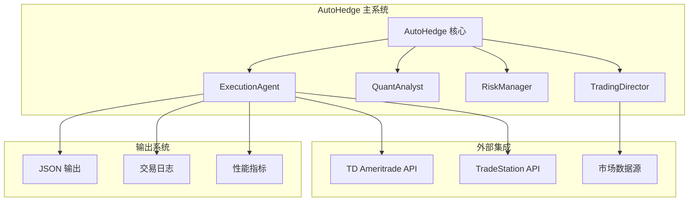
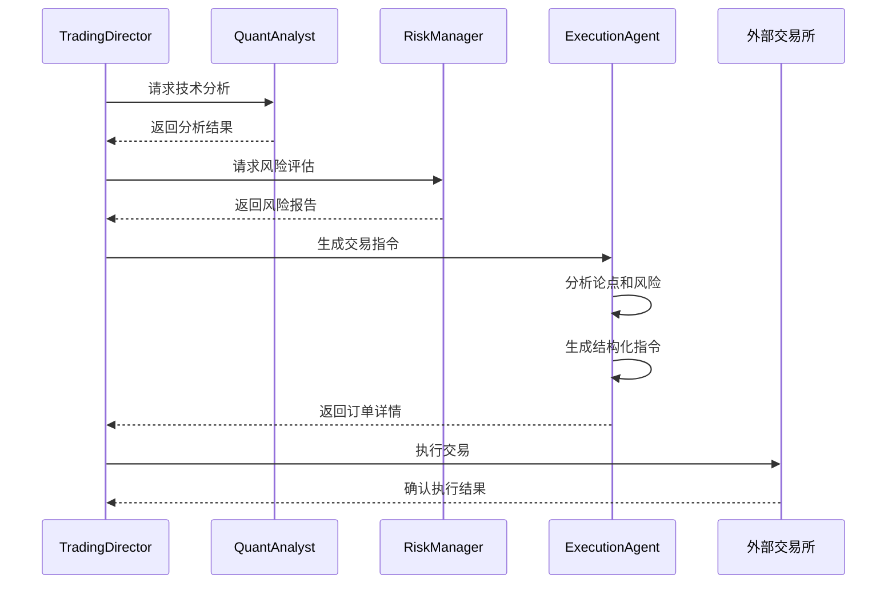
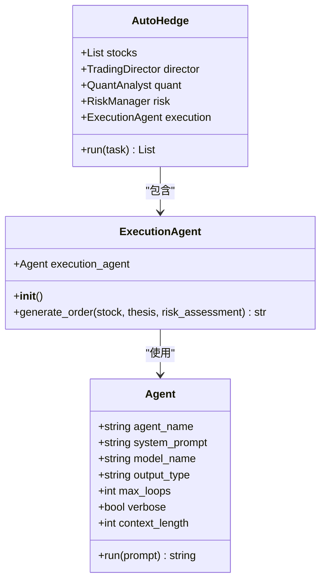
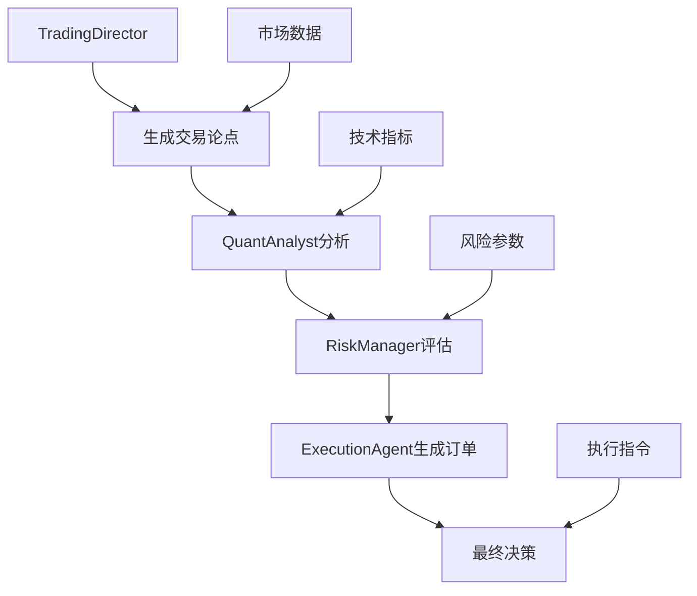
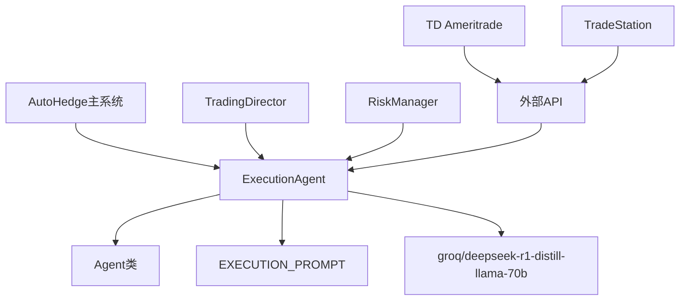

# 执行代理（ExecutionAgent）

<cite>
**本文档中引用的文件**
- [main.py](file://autohedge/main.py)
- [example.py](file://example.py)
- [README.md](file://README.md)
- [td_ameritrade.py](file://autohedge/tools/td_ameritrade.py)
- [trade_station.py](file://autohedge/tools/trade_station.py)
</cite>

## 目录
1. [简介](#简介)
2. [项目结构](#项目结构)
3. [核心组件](#核心组件)
4. [架构概览](#架构概览)
5. [详细组件分析](#详细组件分析)
6. [依赖关系分析](#依赖关系分析)
7. [性能考虑](#性能考虑)
8. [故障排除指南](#故障排除指南)
9. [结论](#结论)

## 简介

ExecutionAgent是AutoHedge自动交易系统中的关键组件，负责将交易论点和风险评估结果转化为具体的交易指令。作为多智能体交易系统中的执行层，它承担着将高级策略转化为精确可执行订单的重要职责。该组件通过结构化的提示词（EXECUTION_PROMPT）指导AI模型生成包含订单类型、数量、价格水平和时间约束的完整交易指令。

ExecutionAgent的设计体现了现代量化交易系统的核心理念：将复杂的市场分析和风险管理转化为标准化的执行流程。它不仅确保了交易指令的精确性和一致性，还为整个交易系统的自动化提供了坚实的基础。

## 项目结构

AutoHedge项目采用模块化架构设计，ExecutionAgent作为其中的关键模块，与其他智能体协同工作形成完整的交易生态系统。



**图表来源**
- [main.py](file://autohedge/main.py#L422-L446)
- [main.py](file://autohedge/main.py#L209-L239)

**章节来源**
- [main.py](file://autohedge/main.py#L1-L50)
- [README.md](file://README.md#L70-L103)

## 核心组件

ExecutionAgent类的核心功能围绕两个主要方法展开：`__init__`构造函数和`generate_order`方法。这两个方法共同构成了一个完整的交易指令生成系统。

### 构造函数分析

`__init__`方法初始化ExecutionAgent实例，配置底层的AI代理设置。该方法采用了精心设计的参数组合，确保执行代理能够在复杂的交易环境中做出准确的决策。

### 订单生成方法

`generate_order`方法是ExecutionAgent的核心业务逻辑，它接收三个关键输入参数：股票代码、交易论点和风险评估结果，然后通过AI驱动的提示词系统生成结构化的交易指令。

**章节来源**
- [main.py](file://autohedge/main.py#L210-L239)

## 架构概览

ExecutionAgent在AutoHedge系统中扮演着执行层的角色，与上层的TradingDirector紧密协作，形成完整的交易决策链。



**图表来源**
- [main.py](file://autohedge/main.py#L477-L549)
- [main.py](file://autohedge/main.py#L242-L249)

## 详细组件分析

### ExecutionAgent类结构

ExecutionAgent类采用了简洁而高效的实现方式，通过继承和组合模式构建了完整的执行能力。



**图表来源**
- [main.py](file://autohedge/main.py#L209-L239)
- [main.py](file://autohedge/main.py#L422-L446)

### __init__方法深度分析

ExecutionAgent的初始化过程体现了对执行精度和效率的追求。构造函数中配置的参数反映了该组件在交易系统中的关键地位。

#### 模型选择分析

系统选择了"groq/deepseek-r1-distill-llama-70b"作为基础模型，这一选择基于以下考量：
- **计算效率**：70B参数规模在保证性能的同时控制了计算成本
- **推理速度**：Groq平台提供的快速推理能力
- **准确性**：DeepSeek模型在金融领域的专业训练

#### 系统提示词设计

EXECUTION_PROMPT包含了四个核心职责：
1. **结构化订单参数生成**：定义交易的基本要素
2. **精确的入场/出场水平设定**：确保最优的利润潜力和风险管理
3. **订单类型确定**：根据市场条件选择最适合的订单类型
4. **时间约束指定**：确保及时执行并最小化市场波动暴露

#### 配置参数详解

- **max_loops=1**：限制推理循环次数，确保响应速度
- **verbose=True**：启用详细日志记录，便于调试和监控
- **context_length=16000**：提供充足的上下文空间处理复杂交易场景

**章节来源**
- [main.py](file://autohedge/main.py#L210-L220)

### generate_order方法详细分析

generate_order方法是ExecutionAgent的核心业务逻辑，它将来自上层智能体的信息转化为具体的交易指令。

#### 输入参数结构

该方法接收三个关键参数，每个参数都承载着特定的信息：

1. **stock (str)**：目标股票的代码标识符
2. **thesis (Dict)**：包含交易观点、技术分析和市场预期的综合信息
3. **risk_assessment (Dict)**：涵盖风险评估、仓位大小和风险参数的详细分析

#### 提示词构建策略

方法内部构建了一个结构化的提示词，该提示词遵循以下格式：

```
Stock: {stock}
Thesis: {thesis}
Risk Assessment: {risk_assessment}

Generate trade order including:
1. Order type (market/limit)
2. Quantity
3. Entry price
4. Stop loss
5. Take profit
6. Time in force
```

这种结构化的方法确保了AI模型能够准确理解需要生成的信息类型。

#### 输出格式规范

生成的订单指令遵循严格的格式要求，包含以下关键要素：

| 元素 | 描述 | 示例 |
|------|------|------|
| 订单类型 | 市场单或限价单 | "market" 或 "limit" |
| 数量 | 交易股数 | "100" |
| 入场价 | 进入交易的价格 | "150.25" |
| 止损价 | 风险控制价格 | "145.00" |
| 止盈价 | 盈利目标价格 | "160.00" |
| 时间约束 | 订单有效期 | "DAY" |

**章节来源**
- [main.py](file://autohedge/main.py#L222-L239)

### 与TradingDirector的协作机制

ExecutionAgent与TradingDirector之间存在密切的协作关系，这种关系体现在以下几个方面：

#### 指令传递流程



**图表来源**
- [main.py](file://autohedge/main.py#L477-L549)

#### 决策验证机制

TradingDirector通过make_decision方法对ExecutionAgent生成的订单进行最终验证。这一过程确保了：
- 订单符合整体交易策略
- 风险参数得到有效控制
- 市场条件得到适当考虑

**章节来源**
- [main.py](file://autohedge/main.py#L242-L249)
- [main.py](file://autohedge/main.py#L477-L549)

### 实际应用示例

在实际应用中，ExecutionAgent的输出会被TradingDirector用于最终决策判断。以下是一个典型的使用场景：

#### 交易指令生成流程

1. **数据收集阶段**：TradingDirector收集市场数据和技术分析结果
2. **风险评估阶段**：RiskManager提供仓位大小和风险参数建议
3. **指令生成阶段**：ExecutionAgent基于所有输入生成具体订单
4. **决策验证阶段**：TradingDirector确认订单的有效性

#### 输出质量影响因素

ExecutionAgent的输出质量受到多个因素的影响：
- **提示词设计的清晰度**：直接影响AI的理解和响应准确性
- **输入数据的质量**：高质量的输入数据产生更可靠的输出
- **模型能力**：所选模型的性能和专业领域适配性

**章节来源**
- [main.py](file://autohedge/main.py#L532-L546)

## 依赖关系分析

ExecutionAgent的依赖关系相对简洁，主要依赖于Swarm框架提供的Agent类和相关的AI模型服务。



**图表来源**
- [main.py](file://autohedge/main.py#L210-L239)
- [main.py](file://autohedge/main.py#L422-L446)

### 外部依赖

ExecutionAgent依赖于以下外部服务：
- **Groq平台**：提供高性能的AI推理服务
- **外部交易所API**：如TD Ameritrade和TradeStation，用于实际交易执行

### 内部依赖

在系统内部，ExecutionAgent与以下组件存在依赖关系：
- **AutoHedge主系统**：作为系统的核心组件之一
- **TradingDirector**：提供交易论点和市场信息
- **RiskManager**：提供风险评估和仓位建议

**章节来源**
- [main.py](file://autohedge/main.py#L422-L446)

## 性能考虑

ExecutionAgent在设计时充分考虑了性能优化，采用了多种策略来确保高效运行。

### 推理效率优化

- **单次循环限制**：max_loops=1确保快速响应
- **上下文长度优化**：16000字符的上下文长度平衡了信息量和处理速度
- **模型选择**：70B参数模型在性能和效率间取得平衡

### 并发处理能力

虽然当前实现是同步的，但架构设计支持未来的并发扩展，可以同时处理多个股票的订单生成任务。

### 资源使用优化

- **内存使用**：简洁的类结构减少内存占用
- **网络延迟**：本地化部署减少对外部API的依赖

## 故障排除指南

### 常见问题及解决方案

#### 订单生成失败

**症状**：generate_order方法返回空值或错误信息
**可能原因**：
- 输入参数格式不正确
- AI模型响应超时
- 提示词理解错误

**解决方案**：
- 验证输入参数的格式和内容
- 检查网络连接状态
- 调整提示词的清晰度

#### 订单格式不正确

**症状**：生成的订单不符合预期格式
**可能原因**：
- EXECUTION_PROMPT不够明确
- 输入数据结构不一致
- 模型理解偏差

**解决方案**：
- 优化提示词的结构化程度
- 统一输入数据的格式标准
- 调整模型参数

#### 性能问题

**症状**：订单生成响应时间过长
**可能原因**：
- 上下文长度过大
- 模型推理复杂度过高
- 网络延迟影响

**解决方案**：
- 优化提示词长度
- 考虑使用更高效的模型
- 实施缓存机制

**章节来源**
- [main.py](file://autohedge/main.py#L210-L239)

## 结论

ExecutionAgent作为AutoHedge自动交易系统的核心执行组件，展现了现代AI驱动交易系统的设计精髓。它通过精心设计的提示词系统、结构化的输入输出格式和高效的AI模型集成，实现了从抽象交易策略到具体执行指令的无缝转换。

该组件的主要优势包括：
- **精确性**：通过结构化提示词确保订单参数的准确性
- **一致性**：统一的输出格式便于后续处理和验证
- **可扩展性**：模块化设计支持功能扩展和定制
- **可靠性**：多重验证机制确保交易指令的正确性

未来的发展方向可能包括：
- 支持更多类型的订单类型
- 集成实时市场数据反馈
- 实现更复杂的交易策略
- 增强风险控制能力

ExecutionAgent的设计和实现为构建完全自动化的交易系统奠定了坚实的基础，展示了AI技术在金融领域的巨大潜力。