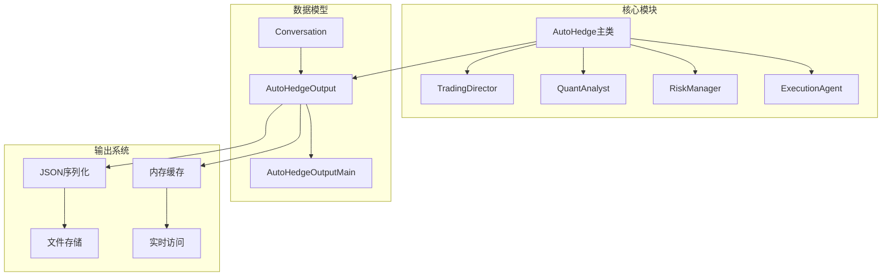
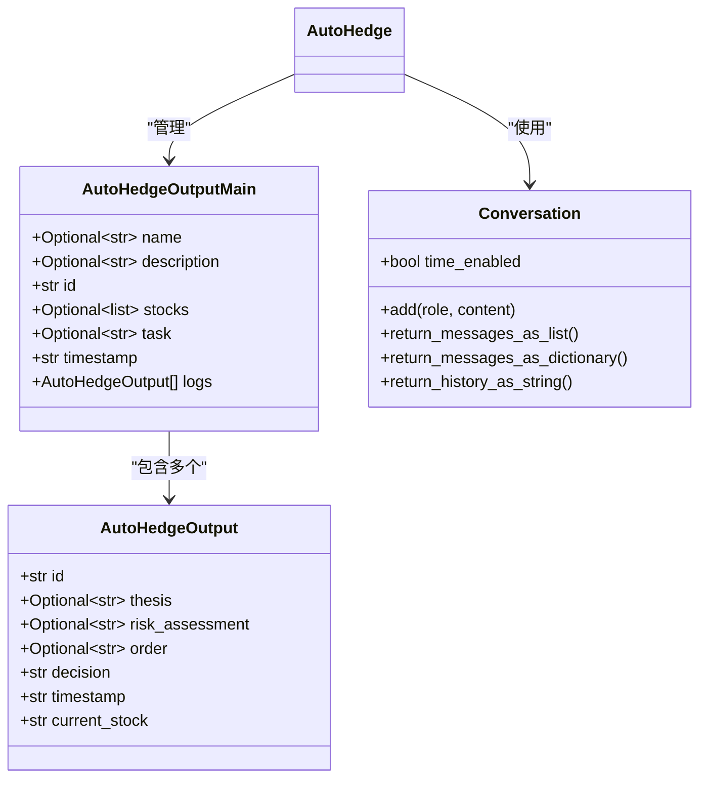
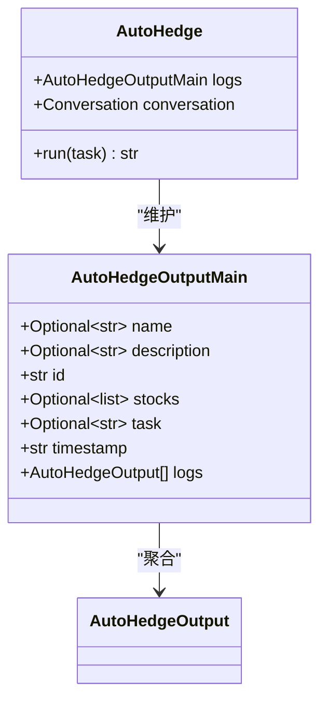
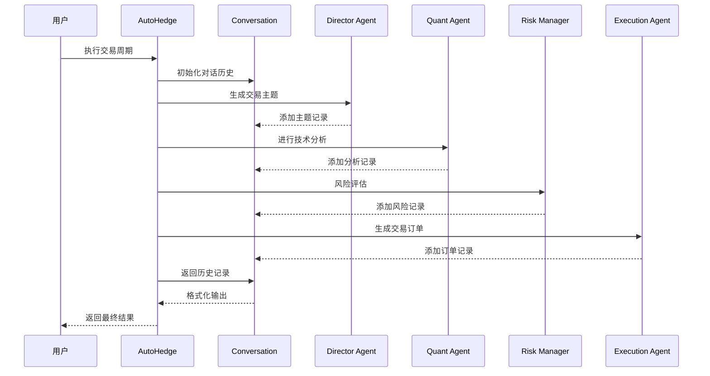
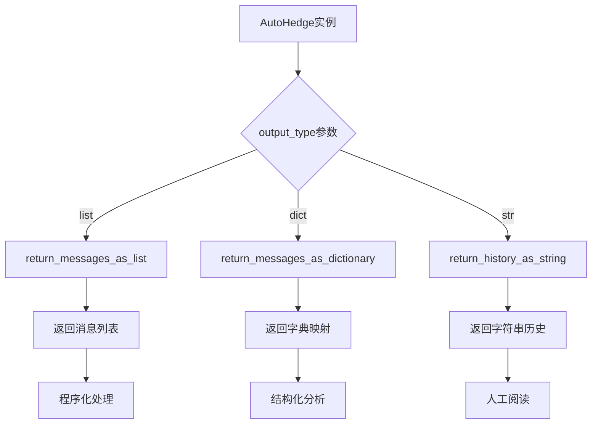
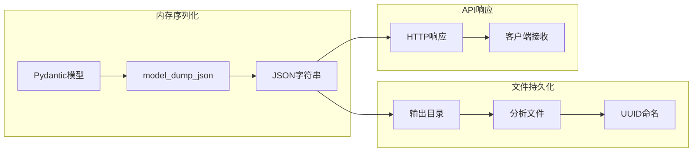

# 数据模型与输出结构

<cite>
**本文档中引用的文件**
- [autohedge/main.py](file://autohedge/main.py)
- [example.py](file://example.py)
- [README.md](file://README.md)
- [api/api.py](file://api/api.py)
- [api/api_tests.py](file://api/api_tests.py)
</cite>

## 目录
1. [简介](#简介)
2. [项目结构概览](#项目结构概览)
3. [核心数据模型](#核心数据模型)
4. [AutoHedgeOutput详细分析](#autohedgeoutput详细分析)
5. [AutoHedgeOutputMain主容器分析](#autohedgeoutputmain主容器分析)
6. [Conversation类与对话历史管理](#conversation类与对话历史管理)
7. [输出格式转换机制](#输出格式转换机制)
8. [数据序列化与持久化](#数据序列化与持久化)
9. [实际应用示例](#实际应用示例)
10. [最佳实践建议](#最佳实践建议)

## 简介

AutoHedge系统采用先进的多代理架构，通过精心设计的数据模型来管理和记录复杂的交易决策过程。该系统的核心在于其双层数据结构：`AutoHedgeOutput`用于单次交易的详细记录，而`AutoHedgeOutputMain`作为主容器组织完整的交易日志。这种设计不仅确保了数据的完整性，还提供了灵活的输出格式支持，满足不同应用场景的需求。

## 项目结构概览

AutoHedge系统采用模块化设计，主要组件包括：



**图表来源**
- [autohedge/main.py](file://autohedge/main.py#L422-L475)

## 核心数据模型

AutoHedge系统基于Pydantic框架构建了两个核心数据模型，它们共同构成了完整的交易记录体系：



**图表来源**
- [autohedge/main.py](file://autohedge/main.py#L101-L118)

**章节来源**
- [autohedge/main.py](file://autohedge/main.py#L101-L118)

## AutoHedgeOutput详细分析

### 字段定义与业务含义

`AutoHedgeOutput`是系统中最基础的数据单元，记录单次交易的完整信息：

| 字段名 | 类型 | 默认值 | 业务含义 |
|--------|------|--------|----------|
| `id` | `str` | 自动生成UUID | 唯一标识符，确保每条记录的唯一性 |
| `thesis` | `Optional[str]` | `None` | 交易主题，包含市场观点和策略方向 |
| `risk_assessment` | `Optional[str]` | `None` | 风险评估报告，涵盖潜在风险和缓解措施 |
| `order` | `Optional[str]` | `None` | 交易订单详情，包含具体执行指令 |
| `decision` | `str` | `None` | 最终决策结果，明确是否执行交易 |
| `timestamp` | `str` | 当前时间戳 | ISO格式的时间标记，用于排序和审计 |
| `current_stock` | `str` | 必需字段 | 正在分析的股票代码 |

### 设计原理

每个字段都经过精心设计以满足特定的业务需求：

- **唯一标识**：使用UUID确保每条记录的唯一性，便于追踪和审计
- **可选字段**：部分字段设置为可选，适应不同阶段的输出需求
- **时间戳**：自动记录生成时间，支持实时监控和历史回溯
- **股票标识**：明确记录当前分析的标的，支持多股票并行处理

**章节来源**
- [autohedge/main.py](file://autohedge/main.py#L101-L109)

## AutoHedgeOutputMain主容器分析

### 结构设计

`AutoHedgeOutputMain`作为主输出容器，负责组织和管理完整的交易周期记录：



**图表来源**
- [autohedge/main.py](file://autohedge/main.py#L111-L118)

### 字段详解

| 字段名 | 类型 | 默认值 | 组织意义 |
|--------|------|--------|----------|
| `name` | `Optional[str]` | `None` | 策略名称，便于识别和分类 |
| `description` | `Optional[str]` | `None` | 策略描述，提供背景信息 |
| `id` | `str` | 自动生成UUID | 主容器唯一标识 |
| `stocks` | `Optional[list]` | `None` | 分析的股票列表，支持批量操作 |
| `task` | `Optional[str]` | `None` | 分析任务描述，明确目标 |
| `timestamp` | `str` | 当前时间戳 | 记录整个分析周期的开始时间 |
| `logs` | `List[AutoHedgeOutput]` | `None` | 包含所有子记录的列表 |

### 组织原则

主容器的设计遵循以下原则：

1. **层次化结构**：将单次交易记录组织成完整的分析周期
2. **元数据管理**：保存策略相关信息，便于后续分析
3. **时间一致性**：统一的时间戳确保事件顺序的准确性
4. **扩展性**：支持动态添加新的交易记录

**章节来源**
- [autohedge/main.py](file://autohedge/main.py#L111-L118)

## Conversation类与对话历史管理

### 核心功能

`Conversation`类是AutoHedge系统中负责管理多代理交互历史的关键组件。它提供了灵活的对话记录和检索机制：



**图表来源**
- [autohedge/main.py](file://autohedge/main.py#L475-L476)

### 对话记录机制

系统通过以下方式记录代理间的交互：

1. **角色标识**：每个消息都有明确的角色归属
2. **内容记录**：完整保存代理的输出内容
3. **时间戳**：自动添加消息生成时间
4. **上下文保持**：维护完整的对话上下文

### 多格式输出支持

`Conversation`类提供了三种不同的输出格式：

| 输出类型 | 方法名 | 格式特点 | 使用场景 |
|----------|--------|----------|----------|
| 列表格式 | `return_messages_as_list()` | 按时间顺序的列表 | 程序化处理，易于遍历 |
| 字典格式 | `return_messages_as_dictionary()` | 键值对映射 | 结构化数据分析 |
| 字符串格式 | `return_history_as_string()` | 自然语言形式 | 人工阅读和调试 |

**章节来源**
- [autohedge/main.py](file://autohedge/main.py#L475-L476)

## 输出格式转换机制

### 格式转换实现

AutoHedge系统根据`output_type`参数提供灵活的输出格式选择：



**图表来源**
- [autohedge/main.py](file://autohedge/main.py#L571-L578)

### 转换逻辑详解

系统在`run`方法中实现了智能的格式转换：

1. **条件判断**：根据配置的`output_type`选择对应的方法
2. **方法调用**：直接调用`Conversation`类的相应方法
3. **结果返回**：返回格式化后的对话历史

### 应用场景分析

不同输出格式适用于不同的使用场景：

- **列表格式**：适合程序化处理，如自动化脚本、数据分析
- **字典格式**：便于结构化查询和统计分析
- **字符串格式**：适合人工审查和调试，提供自然语言体验

**章节来源**
- [autohedge/main.py](file://autohedge/main.py#L571-L578)

## 数据序列化与持久化

### 序列化机制

AutoHedge系统采用多种方式实现数据的序列化和持久化：



**图表来源**
- [autohedge/main.py](file://autohedge/main.py#L564-L568)

### 持久化策略

系统提供了多层次的持久化方案：

1. **临时存储**：在内存中维护完整的分析历史
2. **文件存储**：自动将重要分析结果保存到磁盘
3. **API导出**：通过REST API提供数据访问接口

### 文件命名规范

系统采用UUID命名策略确保文件的唯一性和可追溯性：

- **文件名模式**：`analysis-{uuid}.json`
- **命名时机**：在完成重要分析后立即生成
- **存储位置**：指定的输出目录下
- **格式标准**：使用缩进格式提高可读性

### 性能优化考虑

为了确保系统的高性能运行，序列化过程采用了以下优化策略：

- **延迟序列化**：仅在需要时才进行完整的JSON序列化
- **增量更新**：只更新变化的部分，减少I/O开销
- **缓存机制**：在内存中维护最近的序列化结果

**章节来源**
- [autohedge/main.py](file://autohedge/main.py#L564-L568)

## 实际应用示例

### 基础使用示例

以下是AutoHedge系统的典型使用方式：

```python
# 基础初始化
from autohedge import AutoHedge

# 定义分析目标
stocks = ["NVDA", "TSLA", "MSFT", "GOOG"]
trading_system = AutoHedge(
    name="swarms-fund",
    description="Private Hedge Fund for Swarms Corp",
    stocks=stocks,
)

# 执行分析任务
task = "As BlackRock, evaluate AI companies for portfolio allocation"
result = trading_system.run(task=task)
```

### 不同输出格式的应用

系统支持多种输出格式，适应不同的使用场景：

```python
# 列表格式 - 适合程序化处理
trading_system.output_type = "list"
results_list = trading_system.run(task)

# 字典格式 - 适合结构化分析
trading_system.output_type = "dict"
results_dict = trading_system.run(task)

# 字符串格式 - 适合人工阅读
trading_system.output_type = "str"
results_str = trading_system.run(task)
```

### API集成示例

在生产环境中，AutoHedge可以通过API接口提供服务：

```python
# API服务器启动
from api import AutoHedgeAPI
api = AutoHedgeAPI()
api.run(host="0.0.0.0", port=8000)

# 客户端调用
import requests
response = requests.post(
    "http://localhost:8000/trades",
    json={"stocks": ["NVDA"], "task": "分析"},
    headers={"X-API-Key": "your_api_key"}
)
```

**章节来源**
- [example.py](file://example.py#L1-L21)
- [api/api.py](file://api/api.py#L258-L291)

## 最佳实践建议

### 数据模型使用建议

1. **字段完整性**：确保关键字段（如`current_stock`）始终正确设置
2. **时间同步**：使用统一的时间源保证时间戳的一致性
3. **错误处理**：妥善处理可选字段的缺失情况
4. **版本兼容**：在升级时注意数据模型的向后兼容性

### 输出格式选择指南

根据不同场景选择合适的输出格式：

- **开发调试**：使用字符串格式获得清晰的文本输出
- **数据分析**：使用字典格式便于结构化处理
- **生产部署**：使用列表格式支持高效的程序化访问

### 性能优化策略

1. **批量处理**：对于大量股票分析，考虑分批处理策略
2. **缓存利用**：合理利用内存缓存减少重复计算
3. **异步处理**：在高并发场景下采用异步处理模式
4. **资源监控**：定期监控内存和磁盘使用情况

### 安全性考虑

1. **敏感信息保护**：避免在输出中泄露敏感的API密钥或交易信息
2. **访问控制**：在API层面实施适当的认证和授权机制
3. **数据加密**：对敏感数据进行必要的加密存储
4. **审计日志**：建立完整的操作审计跟踪机制

### 扩展性设计

1. **插件架构**：设计可扩展的代理插件系统
2. **配置管理**：提供灵活的配置管理系统
3. **监控集成**：集成第三方监控和告警系统
4. **文档维护**：保持API文档和使用指南的及时更新

通过遵循这些最佳实践，可以充分发挥AutoHedge系统的强大功能，同时确保系统的稳定性、安全性和可维护性。