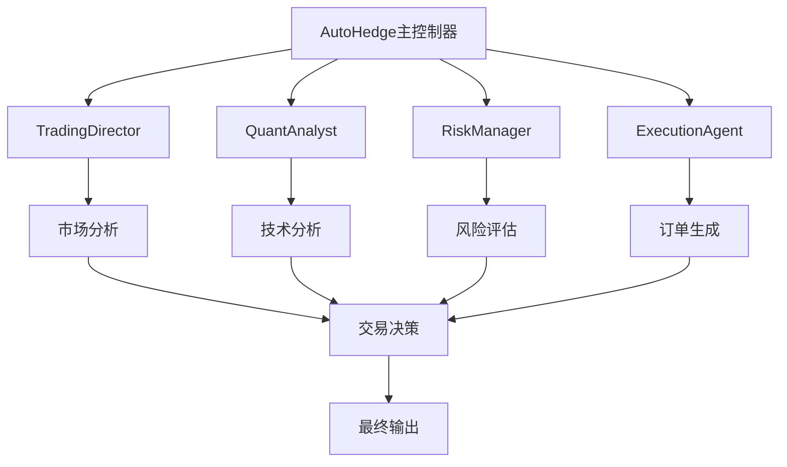
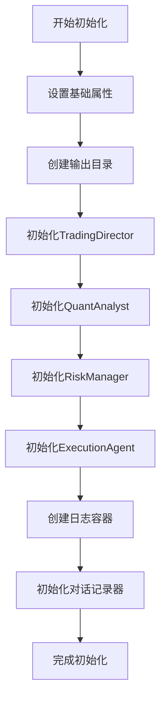
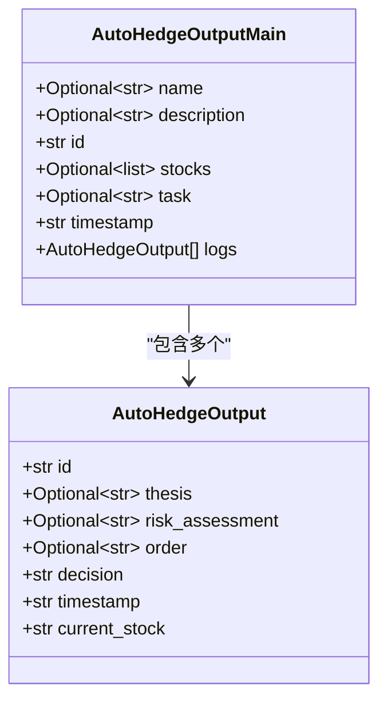
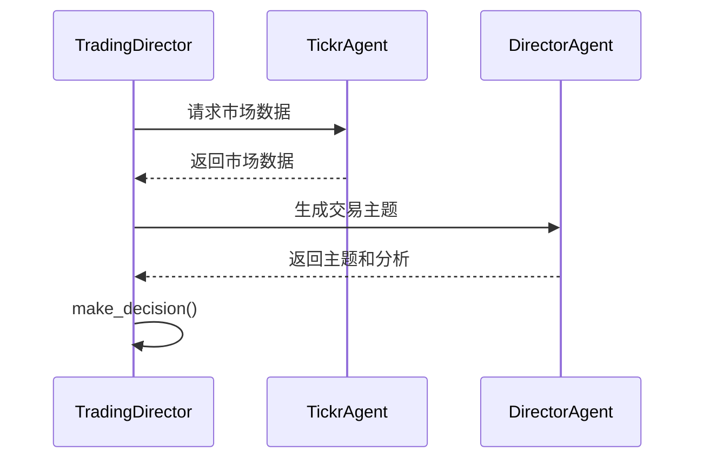
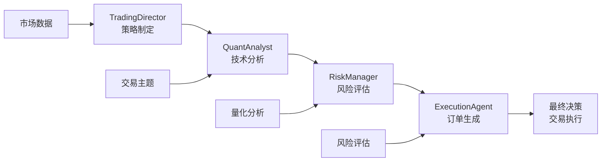
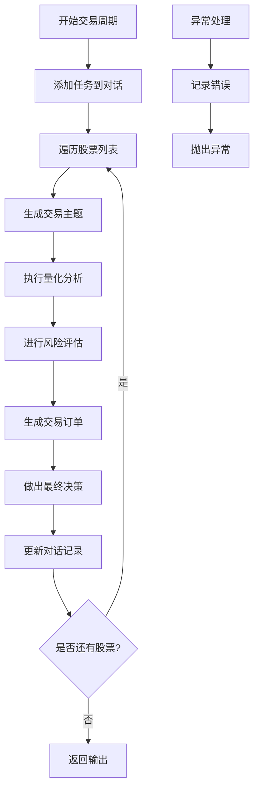
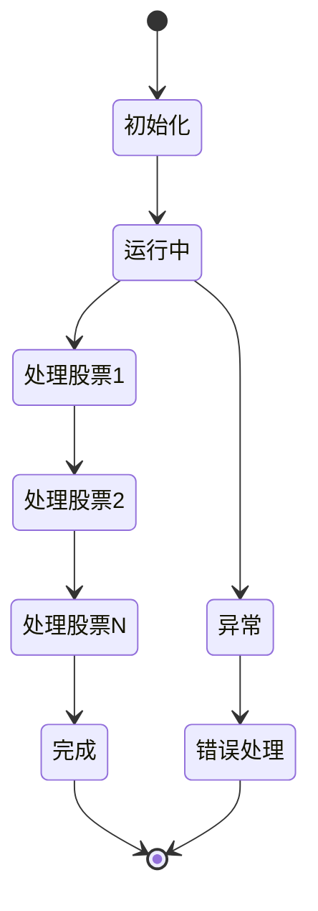

# 核心组件详解

<cite>
**本文档引用的文件**
- [autohedge/main.py](file://autohedge/main.py)
- [autohedge/__init__.py](file://autohedge/__init__.py)
- [example.py](file://example.py)
- [README.md](file://README.md)
- [api/api.py](file://api/api.py)
- [autohedge/tools/e_trade_wrapper.py](file://autohedge/tools/e_trade_wrapper.py)
- [autohedge/tools/td_ameritrade.py](file://autohedge/tools/td_ameritrade.py)
- [autohedge/tools/trade_station.py](file://autohedge/tools/trade_station.py)
</cite>

## 目录
1. [系统概述](#系统概述)
2. [AutoHedge类详解](#autohedge类详解)
3. [数据模型架构](#数据模型架构)
4. [核心组件分析](#核心组件分析)
5. [组件交互关系](#组件交互关系)
6. [运行流程详解](#运行流程详解)
7. [生命周期管理](#生命周期管理)
8. [最佳实践与配置](#最佳实践与配置)

## 系统概述

AutoHedge是一个基于多智能体架构的自动化交易系统，采用Swarm智能体框架构建。该系统通过专门化的AI代理协同工作，实现从市场分析到交易执行的完整自动化流程。

### 系统特点

- **多智能体协作**：Director、Quant、Risk Manager、Execution四个专业代理协同工作
- **风险优先**：内置风险管理和位置尺寸控制机制
- **实时分析**：集成市场数据提供商进行实时分析
- **结构化输出**：使用Pydantic模型生成JSON格式的交易建议
- **全面日志**：详细的日志系统用于交易跟踪和调试



**图表来源**
- [autohedge/main.py](file://autohedge/main.py#L422-L476)

## AutoHedge类详解

### 类定义与职责

AutoHedge是整个交易系统的核心协调器，负责初始化和管理所有子组件，协调完整的交易循环。

### 初始化方法分析

AutoHedge的`__init__`方法实现了复杂的组件初始化逻辑：



**图表来源**
- [autohedge/main.py](file://autohedge/main.py#L434-L476)

#### 关键初始化步骤

1. **基础属性设置**：名称、描述、股票列表、输出目录等
2. **组件实例化**：
   - TradingDirector：负责策略制定和整体协调
   - QuantAnalyst：执行量化技术分析
   - RiskManager：进行风险评估和仓位管理
   - ExecutionAgent：生成交易订单
3. **日志系统初始化**：创建AutoHedgeOutputMain容器存储交易历史
4. **对话记录器**：启用时间戳的Conversation对象用于记录决策过程

**节来源**
- [autohedge/main.py](file://autohedge/main.py#L434-L476)

### 字段初始化详解

AutoHedge类包含以下核心字段：

| 字段名 | 类型 | 描述 | 默认值 |
|--------|------|------|--------|
| `name` | str | 交易系统名称 | "autohedge" |
| `description` | str | 系统描述 | "fully autonomous hedgefund" |
| `stocks` | List[str] | 待交易股票列表 | 必需参数 |
| `output_dir` | Path | 输出目录路径 | "outputs" |
| `strategy` | str | 策略类型 | None |
| `output_type` | str | 输出格式类型 | "list" |
| `director` | TradingDirector | 交易总监代理 | 自动初始化 |
| `quant` | QuantAnalyst | 量化分析师代理 | 自动初始化 |
| `risk` | RiskManager | 风险管理代理 | 自动初始化 |
| `execution` | ExecutionAgent | 执行代理 | 自动初始化 |
| `logs` | AutoHedgeOutputMain | 日志容器 | 自动初始化 |
| `conversation` | Conversation | 对话记录器 | 时间戳启用 |

**节来源**
- [autohedge/main.py](file://autohedge/main.py#L434-L476)

## 数据模型架构

### AutoHedgeOutput数据模型

AutoHedgeOutput是单次交易的详细记录模型，包含完整的交易信息：



**图表来源**
- [autohedge/main.py](file://autohedge/main.py#L102-L119)

#### 字段详细说明

| 字段名 | 类型 | 是否必需 | 描述 |
|--------|------|----------|------|
| `id` | str | 是 | 唯一标识符（UUID.hex） |
| `thesis` | Optional[str] | 否 | 交易主题和市场观点 |
| `risk_assessment` | Optional[str] | 否 | 风险评估报告 |
| `order` | Optional[str] | 否 | 交易订单详情 |
| `decision` | str | 是 | 最终决策结果 |
| `timestamp` | str | 是 | ISO格式的时间戳 |
| `current_stock` | str | 是 | 当前分析的股票 |

**节来源**
- [autohedge/main.py](file://autohedge/main.py#L102-L119)

### AutoHedgeOutputMain数据模型

AutoHedgeOutputMain作为主容器，聚合所有交易活动：

| 字段名 | 类型 | 是否必需 | 描述 |
|--------|------|----------|------|
| `name` | Optional[str] | 否 | 策略名称 |
| `description` | Optional[str] | 否 | 策略描述 |
| `id` | str | 是 | 唯一标识符 |
| `stocks` | Optional[list] | 否 | 分析的股票列表 |
| `task` | Optional[str] | 否 | 分析任务描述 |
| `timestamp` | str | 是 | 创建时间戳 |
| `logs` | List[AutoHedgeOutput] | 是 | 交易日志列表 |

**节来源**
- [autohedge/main.py](file://autohedge/main.py#L112-L119)

## 核心组件分析

### TradingDirector - 交易总监

TradingDirector是系统的核心协调者，负责生成交易主题和协调整体策略。

#### 主要功能

1. **市场分析**：使用TickrAgent收集市场数据
2. **主题生成**：基于市场条件生成交易主题
3. **决策支持**：根据分析结果做出最终决策

#### 实现细节



**图表来源**
- [autohedge/main.py](file://autohedge/main.py#L242-L354)

**节来源**
- [autohedge/main.py](file://autohedge/main.py#L242-L354)

### QuantAnalyst - 量化分析师

QuantAnalyst专注于技术分析和统计模式识别。

#### 分析维度

1. **技术指标评分**：0-1范围的技术强度评分
2. **成交量评分**：市场参与度评估
3. **趋势强度**：市场趋势的强度和方向
4. **波动性分析**：价格波动程度评估
5. **概率评分**：交易成功的概率预测
6. **关键价位**：支撑位、阻力位、关键点位

**节来源**
- [autohedge/main.py](file://autohedge/main.py#L356-L421)

### RiskManager - 风险管理器

RiskManager负责风险评估和仓位管理。

#### 风险评估要素

1. **推荐仓位大小**：基于风险收益比的仓位建议
2. **最大回撤风险**：潜在的最大损失评估
3. **市场风险暴露**：整体市场风险敞口
4. **综合风险评分**：总体风险水平评估

**节来源**
- [autohedge/main.py](file://autohedge/main.py#L159-L188)

### ExecutionAgent - 执行代理

ExecutionAgent生成具体的交易订单。

#### 订单要素

1. **订单类型**：市价单、限价单、止损单等
2. **数量**：交易数量
3. **入场价格**：买入价格
4. **止损价格**：风险控制价格
5. **止盈价格**：盈利目标价格
6. **时效限制**：订单有效期

**节来源**
- [autohedge/main.py](file://autohedge/main.py#L210-L239)

## 组件交互关系

### 多智能体协作架构

AutoHedge采用流水线式的多智能体协作模式：



**图表来源**
- [autohedge/main.py](file://autohedge/main.py#L422-L476)

### 数据流向

1. **输入阶段**：市场数据 → TradingDirector
2. **分析阶段**：交易主题 → QuantAnalyst → 风险评估
3. **决策阶段**：风险评估 → ExecutionAgent → 最终决策
4. **输出阶段**：完整交易方案 → AutoHedgeOutput

**节来源**
- [autohedge/main.py](file://autohedge/main.py#L477-L583)

## 运行流程详解

### run()方法实现

AutoHedge的`run()`方法实现了完整的交易循环：



**图表来源**
- [autohedge/main.py](file://autohedge/main.py#L477-L583)

### 完整分析-评估-执行-决策循环

每个股票都经历以下完整流程：

1. **主题生成**：TradingDirector基于市场数据生成交易主题
2. **量化分析**：QuantAnalyst执行技术指标和统计分析
3. **风险评估**：RiskManager评估交易风险和仓位大小
4. **订单生成**：ExecutionAgent生成具体交易订单
5. **最终决策**：TradingDirector综合所有信息做出最终决策

**节来源**
- [autohedge/main.py](file://autohedge/main.py#L493-L550)

### Conversation类的作用

Conversation类在记录交易决策历史中发挥关键作用：

#### 功能特性

1. **时间戳记录**：启用时间戳的时间序列记录
2. **角色区分**：区分不同代理的角色和贡献
3. **格式化输出**：支持多种输出格式
4. **历史追踪**：完整的决策过程历史

#### 输出格式支持

| output_type | 返回格式 | 用途 |
|-------------|----------|------|
| "list" | List[Message] | 列表格式，便于程序处理 |
| "dict" | Dict | 字典格式，便于结构化访问 |
| "str" | str | 字符串格式，便于阅读和调试 |

**节来源**
- [autohedge/main.py](file://autohedge/main.py#L571-L579)

## 生命周期管理

### 组件生命周期



### 资源管理

1. **输出目录管理**：自动创建和维护输出目录
2. **日志文件管理**：按时间分割的日志文件
3. **内存管理**：及时清理临时数据
4. **异常处理**：完善的错误捕获和恢复机制

**节来源**
- [autohedge/main.py](file://autohedge/main.py#L458-L460)
- [autohedge/main.py](file://autohedge/main.py#L580-L583)

## 最佳实践与配置

### 日志记录最佳实践

AutoHedge使用loguru库实现全面的日志记录：

#### 配置特性

1. **轮转策略**：500MB自动轮转
2. **保留期限**：10天自动清理
3. **详细格式**：包含模块、函数、行号信息
4. **错误诊断**：启用backtrace和diagnose

#### 日志级别

- **INFO**：主要操作和状态变化
- **ERROR**：异常和错误情况
- **WARNING**：潜在问题和警告

**节来源**
- [autohedge/main.py](file://autohedge/main.py#L6-L7)
- [api/api.py](file://api/api.py#L118-L127)

### 错误处理策略

1. **异常捕获**：在关键操作点捕获异常
2. **错误传播**：适当的错误信息传递
3. **资源清理**：确保异常情况下的资源释放
4. **重试机制**：对于可重试的操作实施重试

### 性能优化建议

1. **并发处理**：考虑并行处理多个股票
2. **缓存策略**：缓存频繁访问的数据
3. **内存优化**：及时清理不需要的对象
4. **网络优化**：优化API调用频率

### 配置示例

```python
# 基础配置
trading_system = AutoHedge(
    name="my_strategy",
    description="自定义交易策略",
    stocks=["NVDA", "TSLA", "MSFT"],
    output_dir="my_outputs",
    output_type="dict"
)

# 高级配置
task = "分析科技股，评估投资机会"
result = trading_system.run(task=task)
```

**节来源**
- [example.py](file://example.py#L11-L21)

## 结论

AutoHedge系统通过精心设计的多智能体架构，实现了从市场分析到交易执行的完整自动化流程。AutoHedge类作为中央协调器，不仅负责组件的初始化和管理，还协调各个专业代理的工作，确保整个系统的高效运行。

系统的核心优势在于：

1. **专业化分工**：每个代理专注于特定领域
2. **风险优先**：内置完善的风险管理体系
3. **可扩展性**：模块化设计便于功能扩展
4. **可观测性**：完整的日志和监控体系
5. **可靠性**：完善的错误处理和恢复机制

这种设计模式为构建复杂的自动化交易系统提供了优秀的参考范例，展示了如何通过智能体协作实现复杂业务流程的自动化。