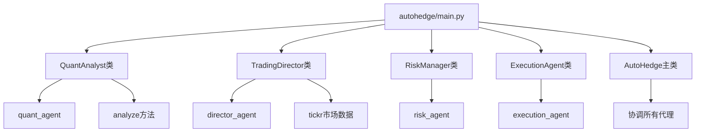
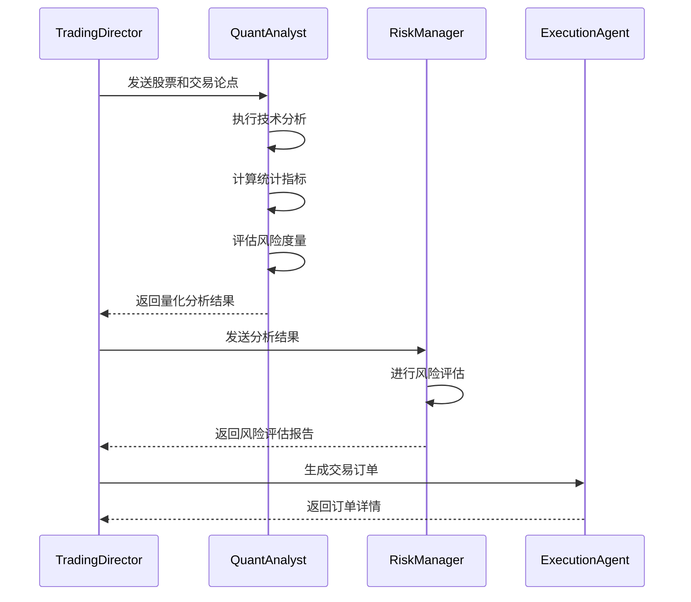
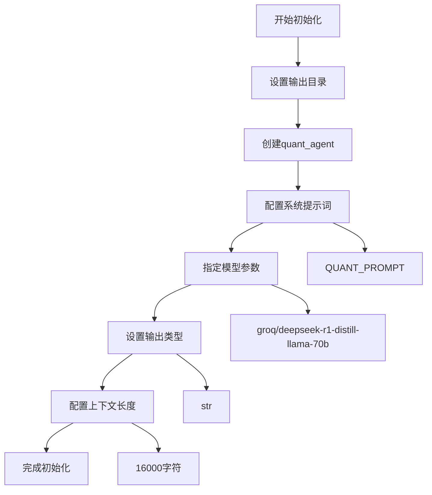
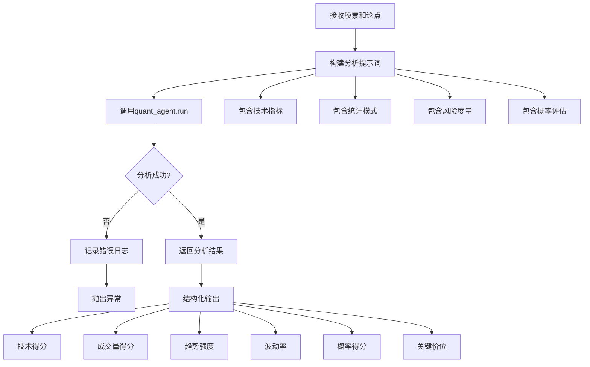
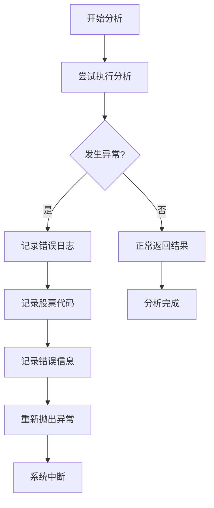
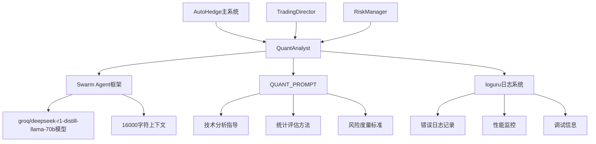

# 量化分析代理（QuantAnalyst）

<cite>
**本文档中引用的文件**
- [autohedge/main.py](file://autohedge/main.py)
- [README.md](file://README.md)
</cite>

## 目录
1. [简介](#简介)
2. [项目结构](#项目结构)
3. [核心组件](#核心组件)
4. [架构概览](#架构概览)
5. [详细组件分析](#详细组件分析)
6. [依赖关系分析](#依赖关系分析)
7. [性能考虑](#性能考虑)
8. [故障排除指南](#故障排除指南)
9. [结论](#结论)

## 简介

QuantAnalyst是AutoHedge自动化交易系统中的核心量化分析引擎，负责执行技术分析和统计模式评估。作为多智能体架构中的第二层，它接收来自TradingDirector的交易论点，并提供详细的数值分析结果，为后续的风险评估和交易决策提供数据支持。

该类采用Swarm框架构建，使用大型语言模型进行复杂的量化分析任务，包括技术指标评估、统计模式识别、风险度量计算和交易成功概率评估。

## 项目结构

AutoHedge项目采用模块化设计，主要包含以下核心文件：

**图表来源**
- [autohedge/main.py](file://autohedge/main.py#L355-L420)

**章节来源**
- [autohedge/main.py](file://autohedge/main.py#L1-L583)
- [README.md](file://README.md#L70-L135)

## 核心组件

### QuantAnalyst类概述

QuantAnalyst类是一个专门负责技术分析和统计评估的量化分析代理，其核心功能包括：

- **技术指标分析**：评估移动平均线、相对强弱指数（RSI）、布林带等技术指标
- **统计模式评估**：应用统计方法识别历史数据中的模式，包括均值回归、动量和波动率分析
- **风险度量计算**：计算风险指标如VaR（风险价值）、预期损失（ES）和希腊字母
- **交易成功概率**：基于历史数据分析、技术指标和风险指标提供交易成功的概率评分

### 主要属性

| 属性名 | 类型 | 描述 | 默认值 |
|--------|------|------|--------|
| `quant_agent` | Agent | Swarms框架中的量化分析智能体 | 动态创建 |
| `output_dir` | Path | 存储分析输出的目录路径 | "outputs" |

**章节来源**
- [autohedge/main.py](file://autohedge/main.py#L357-L363)

## 架构概览

QuantAnalyst在AutoHedge的多智能体架构中扮演着关键的技术分析角色：

**图表来源**
- [autohedge/main.py](file://autohedge/main.py#L496-L546)

**章节来源**
- [autohedge/main.py](file://autohedge/main.py#L496-L546)

## 详细组件分析

### __init__方法分析

QuantAnalyst的初始化过程体现了其作为专业量化分析工具的设计理念：

**图表来源**
- [autohedge/main.py](file://autohedge/main.py#L365-L378)

#### 模型选择策略

QuantAnalyst选择了"groq/deepseek-r1-distill-llama-70b"作为基础模型，这一选择体现了以下考虑：

- **模型规模**：70B参数的大语言模型提供了强大的推理能力
- **推理效率**：DeepSeek系列模型在保持性能的同时优化了推理速度
- **成本效益**：在保证分析质量的前提下控制计算资源消耗

#### 系统提示词设计逻辑

QUANT_PROMPT的设计遵循了以下核心原则：

1. **明确目标定位**：清晰定义量化分析AI的职责范围
2. **任务分解**：将复杂分析任务分解为四个主要方面
3. **方法论指导**：提供具体的技术分析方法和统计评估手段
4. **输出格式要求**：确保分析结果的结构化和可操作性

**章节来源**
- [autohedge/main.py](file://autohedge/main.py#L365-L378)

### analyze方法深度解析

analyze方法是QuantAnalyst的核心功能，负责将输入的股票信息和交易论点转化为详细的量化分析结果：

**图表来源**
- [autohedge/main.py](file://autohedge/main.py#L380-L419)

#### 输入参数处理

analyze方法接受两个核心参数：

- **stock**：股票代码字符串，用于标识分析对象
- **thesis**：来自TradingDirector的交易论点，提供分析的上下文和方向

#### 输出结构设计

量化分析结果采用标准化的JSON格式，包含以下关键字段：

| 字段名 | 数据类型 | 取值范围 | 描述 |
|--------|----------|----------|------|
| `ticker` | str | - | 股票代码标识符 |
| `technical_score` | float | 0-1 | 技术分析得分 |
| `volume_score` | float | 0-1 | 成交量分析得分 |
| `trend_strength` | float | 0-1 | 趋势强度评分 |
| `volatility` | float | >0 | 波动率指标 |
| `probability_score` | float | 0-1 | 交易成功概率 |
| `key_levels.support` | float | >0 | 支撑位价格 |
| `key_levels.resistance` | float | >0 | 阻力位价格 |
| `key_levels.pivot` | float | >0 | 枢轴点价格 |

#### 分析流程详解

1. **数据准备阶段**：
   - 接收股票代码和交易论点
   - 构建包含完整上下文的分析提示词
   - 设置分析的具体要求和输出格式

2. **智能分析阶段**：
   - 利用预训练的语言模型进行深度分析
   - 应用技术指标评估方法
   - 执行统计模式识别算法
   - 计算风险度量指标

3. **结果生成阶段**：
   - 将非结构化的分析结果转换为结构化格式
   - 确保输出符合预定的数据类型和范围要求
   - 提供清晰的数值评分和关键价位信息

**章节来源**
- [autohedge/main.py](file://autohedge/main.py#L380-L419)

### 异常处理机制

QuantAnalyst实现了完善的异常处理机制，确保系统的稳定性和可靠性：

**图表来源**
- [autohedge/main.py](file://autohedge/main.py#L415-L419)

异常处理的关键特性：

- **日志记录**：详细记录异常发生的股票代码和错误信息
- **错误传播**：通过重新抛出异常确保上层系统能够正确处理错误
- **调试支持**：为开发者提供足够的上下文信息用于问题诊断

**章节来源**
- [autohedge/main.py](file://autohedge/main.py#L415-L419)

## 依赖关系分析

QuantAnalyst的依赖关系体现了其在AutoHedge生态系统中的核心地位：

**图表来源**
- [autohedge/main.py](file://autohedge/main.py#L355-L420)

### 外部依赖

- **Swarm框架**：提供AI代理的基础架构和模型集成能力
- **Groq模型**：高性能的语言模型推理引擎
- **Loguru库**：专业的日志记录和管理系统

### 内部协作

QuantAnalyst与系统其他组件形成紧密的协作关系：

- **与TradingDirector的协作**：接收交易论点并提供技术支持
- **与RiskManager的协作**：提供量化分析结果用于风险评估
- **与ExecutionAgent的协作**：为交易执行提供数据依据

**章节来源**
- [autohedge/main.py](file://autohedge/main.py#L355-L420)

## 性能考虑

### 计算资源优化

QuantAnalyst在设计时充分考虑了性能优化：

- **模型选择**：平衡性能与成本的70B参数模型
- **上下文长度**：16000字符的上下文窗口支持复杂分析
- **单次循环**：max_loops=1确保快速响应

### 并发处理能力

虽然当前实现为单次分析，但架构支持并发扩展：

- **独立实例**：每个QuantAnalyst实例独立运行
- **无状态设计**：分析过程不依赖外部状态
- **可扩展性**：支持多实例并行处理多个股票

### 内存管理

- **临时对象**：分析过程中创建的中间对象及时释放
- **输出缓存**：分析结果存储在指定目录便于后续访问
- **资源清理**：异常情况下确保资源正确释放

## 故障排除指南

### 常见问题及解决方案

#### 模型调用失败

**症状**：分析过程中出现模型调用异常
**原因**：网络连接问题或模型服务不可用
**解决方案**：
1. 检查网络连接状态
2. 验证API密钥有效性
3. 查看模型服务可用性

#### 分析结果异常

**症状**：返回的分析结果格式不正确或数值异常
**原因**：输入数据格式错误或模型理解偏差
**解决方案**：
1. 验证输入参数格式
2. 检查系统提示词配置
3. 查看详细错误日志

#### 性能问题

**症状**：分析响应时间过长
**原因**：上下文长度过大或模型负载过高
**解决方案**：
1. 优化输入数据大小
2. 调整并发处理策略
3. 监控系统资源使用情况

**章节来源**
- [autohedge/main.py](file://autohedge/main.py#L415-L419)

## 结论

QuantAnalyst作为AutoHedge自动化交易系统的核心量化分析引擎，展现了现代AI驱动交易系统的设计精髓。其通过精心设计的系统提示词、专业的技术分析能力和完善的异常处理机制，为整个交易流程提供了可靠的技术支持。

### 关键优势

1. **专业化程度高**：专注于量化分析领域，提供深度的技术评估
2. **结构化输出**：标准化的数据格式便于后续处理和集成
3. **可扩展性强**：模块化设计支持功能扩展和定制
4. **稳定性好**：完善的异常处理确保系统可靠性

### 应用价值

QuantAnalyst不仅为TradingDirector提供了重要的技术分析支持，还为RiskManager的决策提供了关键的数据依据。其输出结果形成了完整的量化分析链条，与TradingDirector的论点形成互补，共同构成了AutoHedge系统的核心竞争力。

通过持续的优化和改进，QuantAnalyst将继续在自动化交易领域发挥重要作用，为投资者提供更加精准和可靠的量化分析服务。