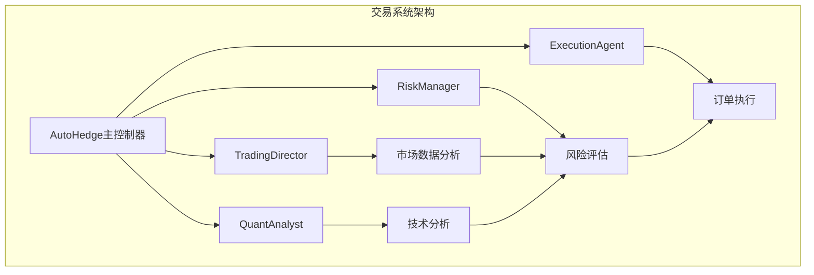
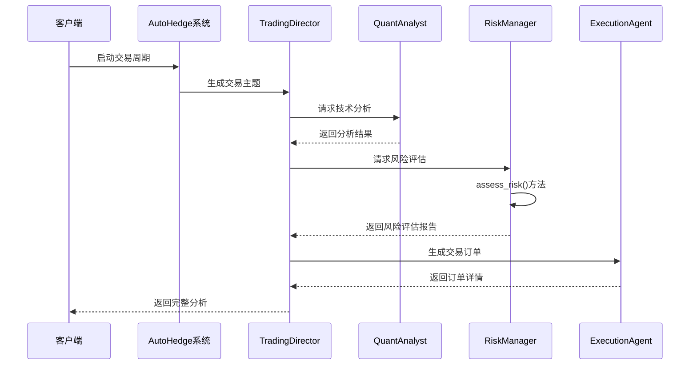
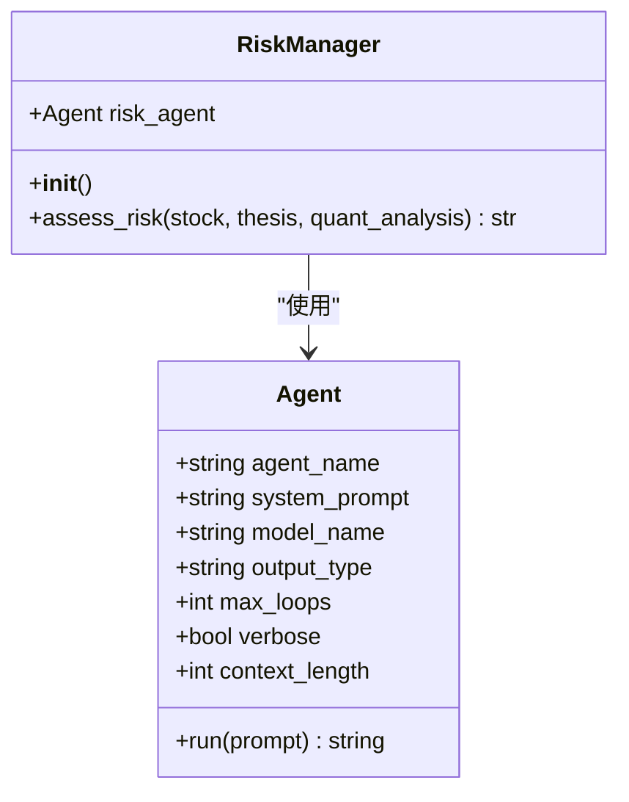
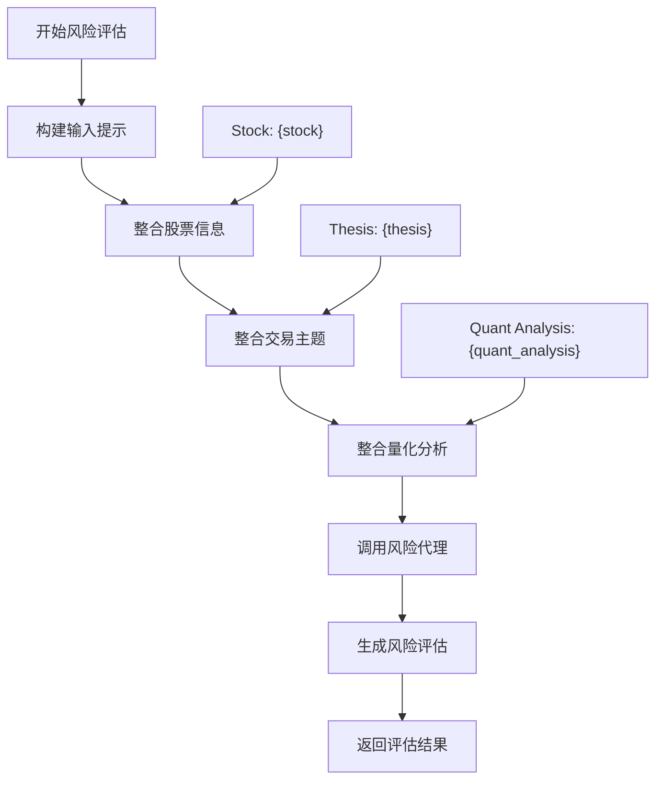
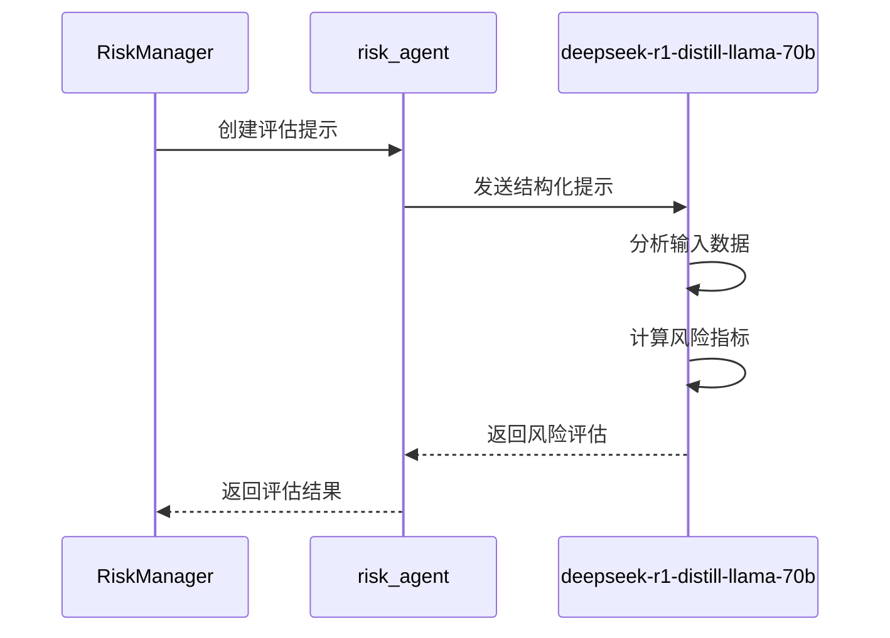
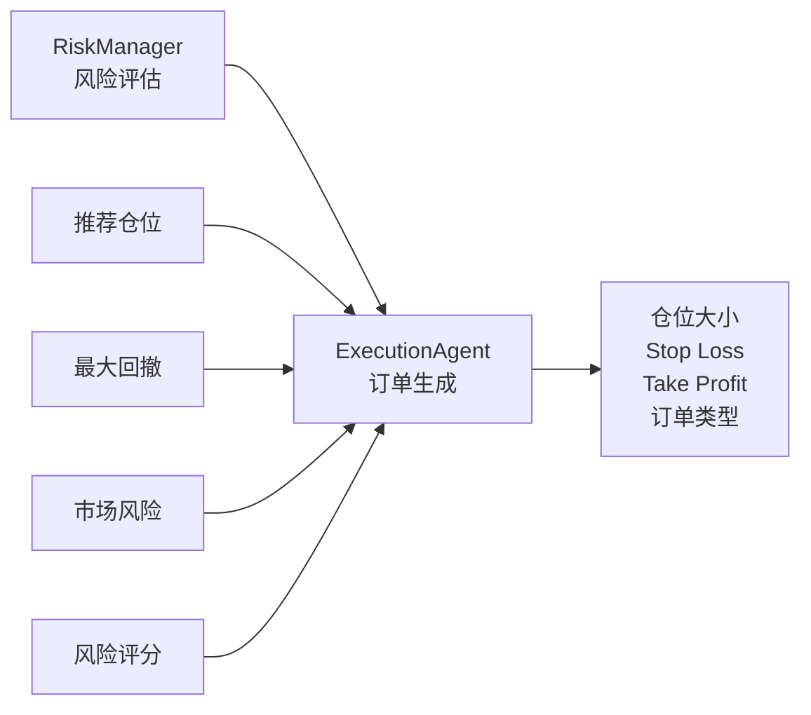
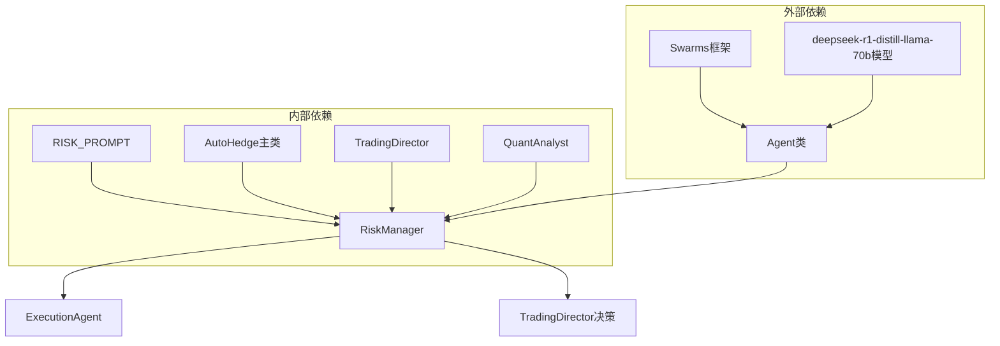

# 风险管理代理（RiskManager）

<cite>
**本文档中引用的文件**
- [autohedge/main.py](file://autohedge/main.py)
- [example.py](file://example.py)
- [README.md](file://README.md)
</cite>

## 目录
1. [简介](#简介)
2. [项目结构](#项目结构)
3. [核心组件](#核心组件)
4. [架构概览](#架构概览)
5. [详细组件分析](#详细组件分析)
6. [依赖关系分析](#依赖关系分析)
7. [性能考虑](#性能考虑)
8. [故障排除指南](#故障排除指南)
9. [结论](#结论)

## 简介

RiskManager类是autoHedge自动交易系统中的核心风险控制组件，负责评估交易风险并生成风险度量指标。该类通过集成大型语言模型（LLM）来实现智能化的风险评估，为交易决策提供关键的风险控制支持。

RiskManager在交易系统中扮演着至关重要的角色，它接收来自TradingDirector的交易主题、QuantAnalyst的技术分析结果，以及市场数据，然后生成包含推荐仓位大小、最大回撤风险、市场风险敞口和综合风险评分等关键指标的风险评估报告。这些评估结果直接影响ExecutionAgent的订单生成过程，成为最终交易决策的重要依据。

## 项目结构

autoHedge项目采用模块化设计，RiskManager作为其中的核心组件之一，与其他智能代理协同工作：

**图表来源**
- [autohedge/main.py](file://autohedge/main.py#L422-L474)
- [autohedge/main.py](file://autohedge/main.py#L159-L186)

**章节来源**
- [autohedge/main.py](file://autohedge/main.py#L1-L50)

## 核心组件

### RiskManager类概述

RiskManager类是一个专门的风险评估代理，其主要职责包括：

1. **风险评估**：基于输入的股票信息、交易主题和技术分析结果进行综合风险评估
2. **仓位管理**：计算推荐的仓位大小以平衡风险和回报
3. **风险指标生成**：生成最大回撤风险、市场风险暴露和整体风险评分
4. **决策支持**：为交易决策提供量化风险指标

### 主要属性和方法

RiskManager类的核心结构包含以下关键元素：

- **risk_agent**：基于Swarms框架的智能代理，使用deepseek-r1-distill-llama-70b模型
- **__init__()**：初始化风险代理，配置系统提示词和模型参数
- **assess_risk()**：执行风险评估的主要方法

**章节来源**
- [autohedge/main.py](file://autohedge/main.py#L159-L186)

## 架构概览

RiskManager在autoHedge交易系统中的架构位置体现了其作为风险控制中枢的重要性：

**图表来源**
- [autohedge/main.py](file://autohedge/main.py#L477-L550)
- [README.md](file://README.md#L216-L241)

## 详细组件分析

### __init__方法深度分析

RiskManager的初始化过程体现了其作为专业化风险评估工具的设计理念：

**图表来源**
- [autohedge/main.py](file://autohedge/main.py#L159-L168)
- [autohedge/main.py](file://autohedge/main.py#L161-L168)

#### 风险代理初始化配置

RiskManager使用以下关键配置参数：

| 参数 | 值 | 说明 |
|------|-----|------|
| agent_name | "Risk-Manager" | 代理名称标识符 |
| system_prompt | RISK_PROMPT | 风险评估系统提示词 |
| model_name | "groq/deepseek-r1-distill-llama-70b" | 使用的大型语言模型 |
| output_type | "str" | 输出格式类型 |
| max_loops | 1 | 最大执行循环次数 |
| verbose | True | 启用详细日志记录 |
| context_length | 16000 | 上下文窗口长度 |

#### RISK_PROMPT系统提示词分析

RISK_PROMPT定义了RiskManager的核心职责和评估维度：

**风险评估维度**：
1. **仓位规模评估**：确定最优资本分配数量
2. **潜在回撤计算**：预测可能的损失幅度
3. **市场风险因素**：评估波动性、流动性等市场特征
4. **相关性风险监控**：识别不同资产间的潜在关联

**评估要素**：
- 明确的交易方向（做多或做空）
- 信号强度的置信水平
- 入场价格和止损水平
- 目标盈利水平
- 交易时间框架
- 关键影响因素
- 潜在风险识别

**章节来源**
- [autohedge/main.py](file://autohedge/main.py#L123-L156)
- [autohedge/main.py](file://autohedge/main.py#L161-L168)

### assess_risk方法详细分析

assess_risk方法是RiskManager的核心功能实现，展示了风险评估的完整流程：

**图表来源**
- [autohedge/main.py](file://autohedge/main.py#L171-L186)

#### 输入参数处理

assess_risk方法接收三个关键输入参数：

1. **stock**：股票基本信息和市场数据
2. **thesis**：TradingDirector生成的交易主题
3. **quant_analysis**：QuantAnalyst提供的技术分析结果

#### 输出指标详解

风险评估输出包含四个关键指标：

| 指标 | 描述 | 用途 |
|------|------|------|
| 推荐仓位大小 | 基于风险回报比的最优持仓量 | 控制单笔交易风险敞口 |
| 最大回撤风险 | 预期的最大潜在损失幅度 | 风险预算和资金管理 |
| 市场风险暴露 | 当前头寸对市场波动的敏感度 | 资产组合风险监控 |
| 综合风险评分 | 整体交易风险的量化评分 | 决策优先级排序 |

#### 执行流程分析

**图表来源**
- [autohedge/main.py](file://autohedge/main.py#L174-L186)

**章节来源**
- [autohedge/main.py](file://autohedge/main.py#L171-L186)

### 与ExecutionAgent的交互

RiskManager的评估结果直接影响ExecutionAgent的订单生成过程：

**图表来源**
- [autohedge/main.py](file://autohedge/main.py#L222-L239)
- [autohedge/main.py](file://autohedge/main.py#L524-L535)

**章节来源**
- [autohedge/main.py](file://autohedge/main.py#L524-L535)

## 依赖关系分析

RiskManager的依赖关系体现了其在autoHedge生态系统中的核心地位：

**图表来源**
- [autohedge/main.py](file://autohedge/main.py#L161-L168)
- [autohedge/main.py](file://autohedge/main.py#L466-L466)

### 关键依赖项

1. **Swarms框架**：提供Agent基础架构和LLM集成能力
2. **deepseek-r1-distill-llama-70b模型**：高性能推理引擎
3. **RISK_PROMPT**：预定义的风险评估指导原则
4. **AutoHedge主类**：系统协调器，管理所有代理实例

**章节来源**
- [autohedge/main.py](file://autohedge/main.py#L1-L10)
- [autohedge/main.py](file://autohedge/main.py#L466-L466)

## 性能考虑

### 模型选择优化

RiskManager选择deepseek-r1-distill-llama-70b模型的原因：

- **推理速度**：相比完整版模型，推理速度提升显著
- **成本效益**：在保持质量的前提下降低计算成本
- **上下文处理**：16000字符上下文长度满足复杂风险评估需求
- **稳定性**：经过优化的推理输出更加稳定可靠

### 并发处理能力

由于max_loops设置为1，RiskManager具有良好的并发处理能力，能够快速响应多个并行的交易请求。

### 内存使用优化

- **上下文限制**：16000字符上下文避免内存溢出
- **单次执行**：max_loops=1确保资源使用效率
- **状态无记忆**：每次评估独立执行，不保留中间状态

## 故障排除指南

### 常见问题及解决方案

#### 1. 风险评估准确性问题

**症状**：风险评估结果与预期不符
**原因**：输入数据质量或模型理解偏差
**解决方案**：
- 检查输入数据的完整性和准确性
- 验证RISK_PROMPT的适用性
- 考虑调整模型参数或使用更高级模型

#### 2. 模型响应延迟

**症状**：风险评估耗时过长
**原因**：上下文长度过大或模型负载过高
**解决方案**：
- 减少输入数据的复杂度
- 优化prompt结构
- 考虑使用本地部署模型

#### 3. 输出格式不一致

**症状**：风险评估输出格式不稳定
**原因**：模型输出的随机性或prompt设计问题
**解决方案**：
- 加强prompt的结构化要求
- 实施后处理验证机制
- 设置输出格式约束

### 监控和调试

RiskManager提供了多种监控和调试选项：

- **verbose=True**：启用详细的执行日志
- **context_length=16000**：可调整的上下文窗口
- **max_loops=1**：防止无限循环执行

**章节来源**
- [autohedge/main.py](file://autohedge/main.py#L167-L168)

## 结论

RiskManager类作为autoHedge自动交易系统的核心风险控制组件，展现了现代AI驱动交易系统中风险管理和智能决策的完美结合。通过精心设计的架构和强大的LLM能力，RiskManager不仅能够准确评估交易风险，还能为后续的订单生成和交易决策提供关键支持。

### 主要优势

1. **智能化风险评估**：利用先进的LLM技术实现复杂的定量和定性风险分析
2. **模块化设计**：清晰的接口设计便于系统扩展和维护
3. **实时响应能力**：高效的执行流程支持高频交易需求
4. **可扩展性**：灵活的配置选项适应不同的风险偏好和策略需求

### 应用价值

RiskManager在实际应用中为企业和个人投资者提供了：
- **专业级风险控制**：媲美传统金融风控系统的评估能力
- **自动化决策支持**：减少人为判断误差，提高决策一致性
- **实时风险监控**：动态跟踪市场变化和头寸风险
- **合规性保障**：标准化的风险评估流程符合监管要求

### 发展前景

随着AI技术的不断发展，RiskManager可以通过以下方式进一步优化：
- 集成更多的市场数据源和分析维度
- 引入强化学习算法优化风险评估策略
- 支持更复杂的衍生品和另类投资产品的风险评估
- 实现跨市场的风险对冲和分散化策略

RiskManager代表了金融科技领域的一个重要创新，为智能交易系统的风险控制提供了新的思路和方法。