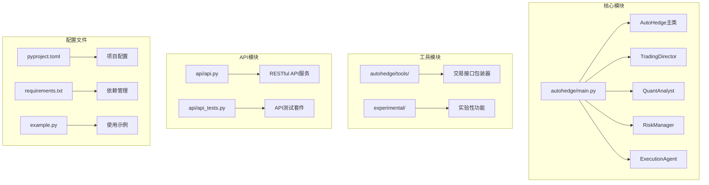
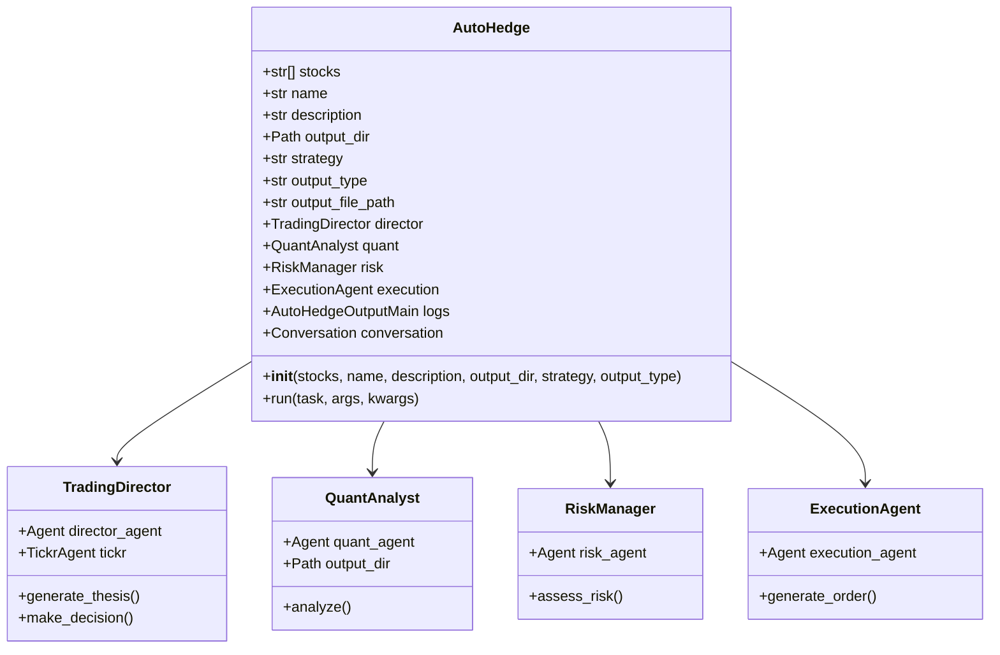
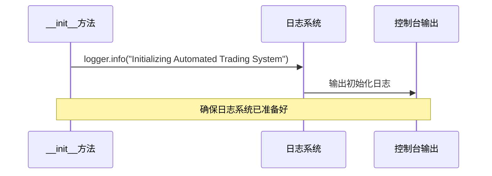
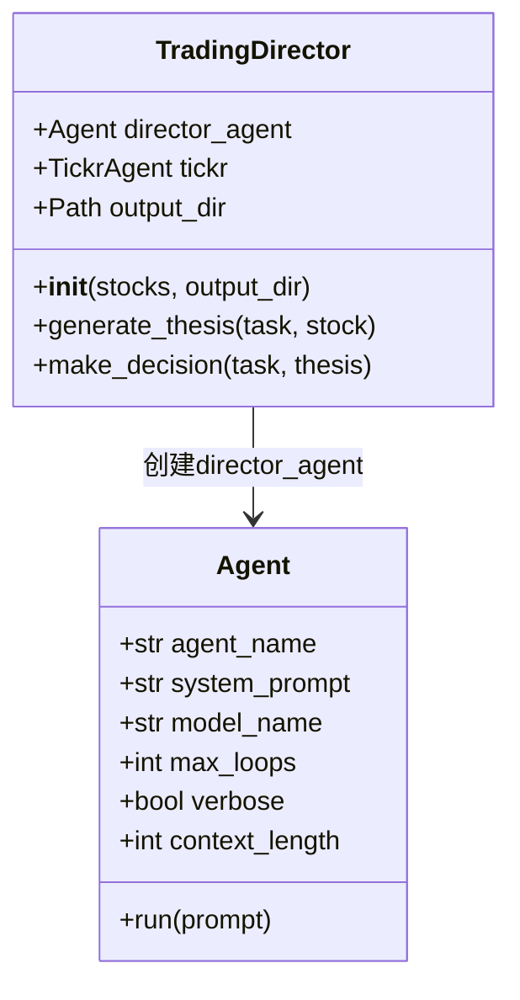
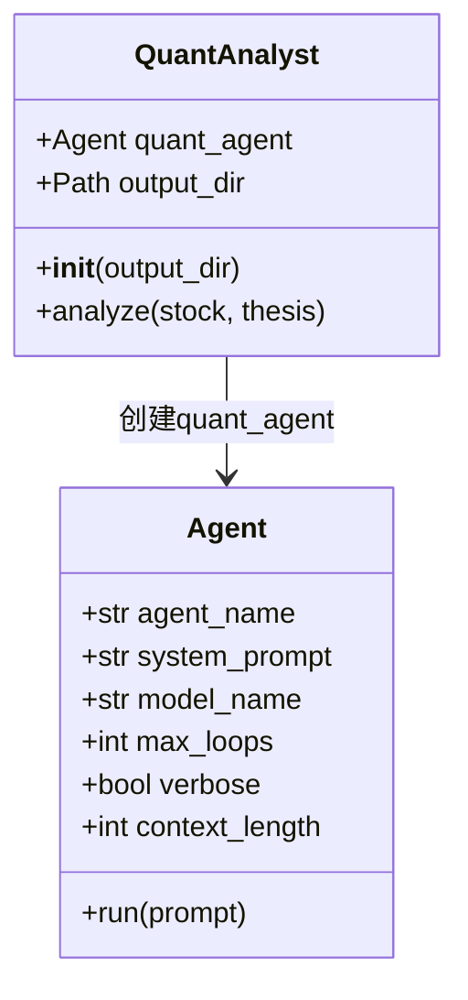
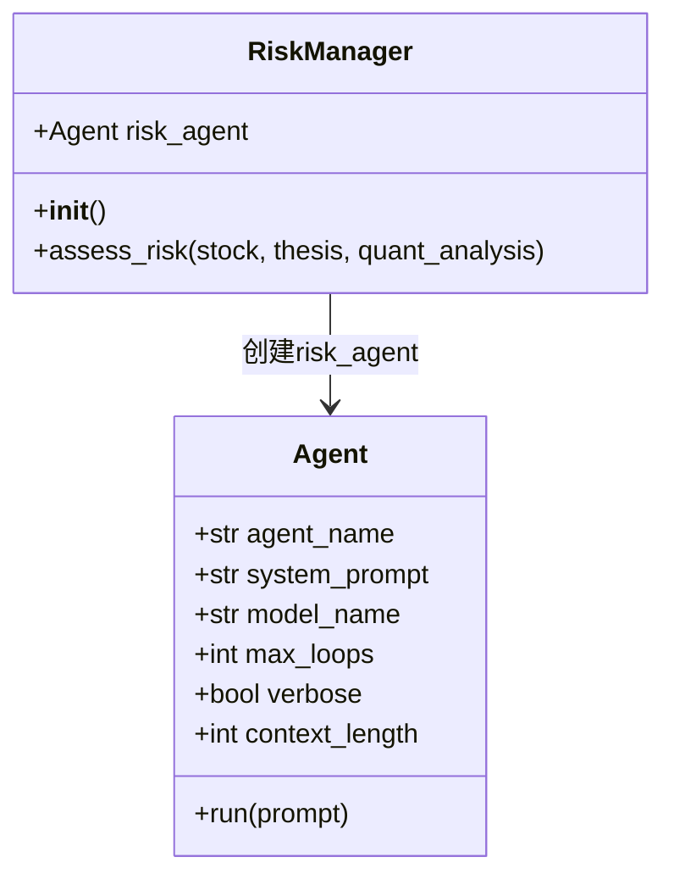
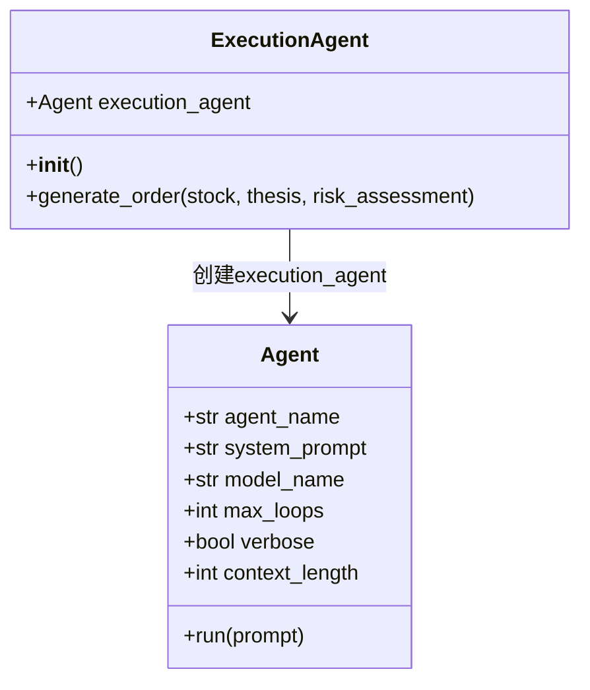
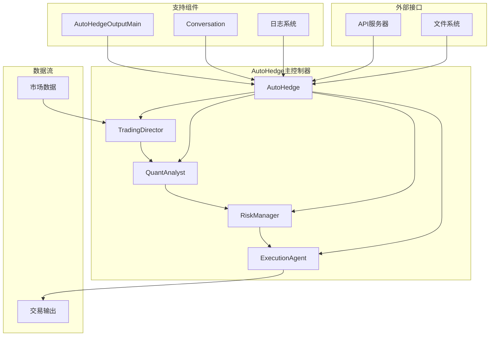
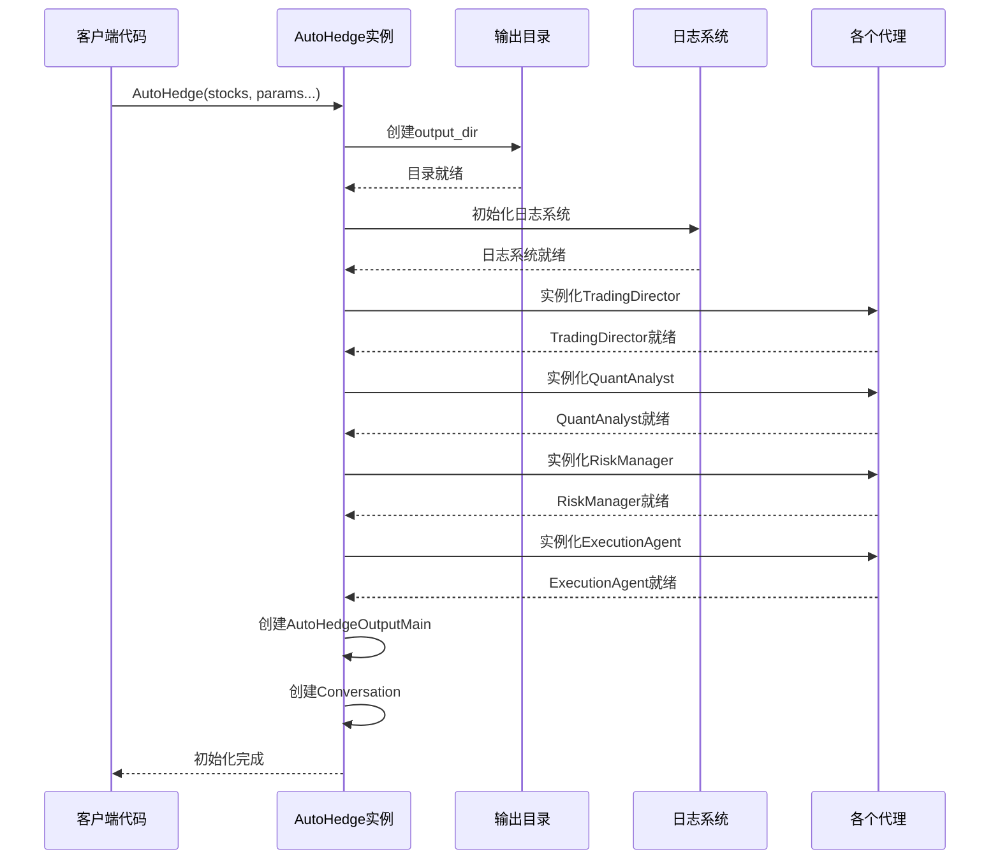
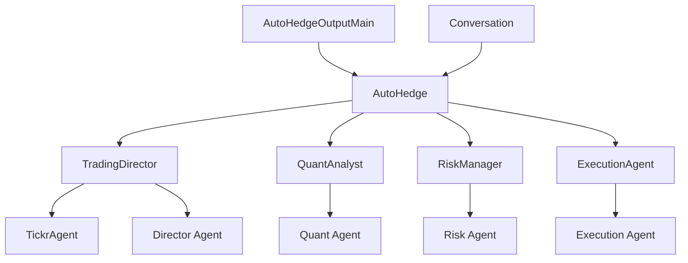

# 系统初始化流程

<cite>
**本文档中引用的文件**
- [autohedge/main.py](file://autohedge/main.py)
- [autohedge/__init__.py](file://autohedge/__init__.py)
- [example.py](file://example.py)
- [README.md](file://README.md)
</cite>

## 目录
1. [简介](#简介)
2. [项目结构概览](#项目结构概览)
3. [AutoHedge类初始化详解](#autohedge类初始化详解)
4. [核心组件初始化](#核心组件初始化)
5. [系统架构图](#系统架构图)
6. [初始化时序分析](#初始化时序分析)
7. [配置参数详解](#配置参数详解)
8. [初始化示例](#初始化示例)
9. [故障排除指南](#故障排除指南)
10. [总结](#总结)

## 简介

AutoHedge是一个基于多智能体架构的自动化交易系统，通过AI代理协同工作来实现市场分析、风险管理和交易执行。系统的核心是`AutoHedge`类，它负责协调所有子代理并管理整个交易周期。本文档将深入分析AutoHedge系统的初始化流程，从`__init__`方法开始，详细说明每个组件的创建过程和配置方式。

## 项目结构概览

AutoHedge项目采用模块化设计，主要包含以下核心组件：



**图表来源**
- [autohedge/main.py](file://autohedge/main.py#L1-L583)
- [autohedge/__init__.py](file://autohedge/__init__.py#L1-L4)

**章节来源**
- [autohedge/main.py](file://autohedge/main.py#L1-L583)
- [autohedge/__init__.py](file://autohedge/__init__.py#L1-L4)

## AutoHedge类初始化详解

### 初始化方法签名

AutoHedge类的`__init__`方法提供了灵活的配置选项，允许用户根据具体需求定制系统行为：



**图表来源**
- [autohedge/main.py](file://autohedge/main.py#L422-L476)

### 参数配置详解

#### 核心参数

| 参数名 | 类型 | 默认值 | 描述 |
|--------|------|--------|------|
| `stocks` | `List[str]` | 必需 | 要分析的股票代码列表 |
| `name` | `str` | `"autohedge"` | 交易系统的名称标识 |
| `description` | `str` | `"fully autonomous hedgefund"` | 系统的功能描述 |
| `output_dir` | `str` | `"outputs"` | 输出文件存储目录 |
| `strategy` | `str` | `None` | 特定的交易策略类型 |
| `output_type` | `str` | `"list"` | 输出格式类型（list/dict/str） |

#### 可选参数

| 参数名 | 类型 | 默认值 | 描述 |
|--------|------|--------|------|
| `output_file_path` | `str` | `None` | 指定输出文件路径 |

**章节来源**
- [autohedge/main.py](file://autohedge/main.py#L435-L462)

## 核心组件初始化

### 输出目录创建

系统首先创建输出目录，确保文件存储位置的可用性：

```mermaid
flowchart TD
A[开始初始化] --> B[设置output_dir路径]
B --> C[调用Path.mkdir(exist_ok=True)]
C --> D{目录是否存在?}
D --> |否| E[创建新目录]
D --> |是| F[跳过创建]
E --> G[设置成功标志]
F --> G
G --> H[继续初始化其他组件]
```

**图表来源**
- [autohedge/main.py](file://autohedge/main.py#L458-L459)

### 日志记录器初始化

系统使用`loguru`库进行日志记录，自动添加系统初始化信息：



**图表来源**
- [autohedge/main.py](file://autohedge/main.py#L463)

### 四个核心代理实例化

#### 1. TradingDirector（交易总监）

TradingDirector负责生成交易主题并协调整体策略：



**图表来源**
- [autohedge/main.py](file://autohedge/main.py#L242-L272)

#### 2. QuantAnalyst（量化分析师）

QuantAnalyst专注于技术分析和统计模式评估：



**图表来源**
- [autohedge/main.py](file://autohedge/main.py#L356-L378)

#### 3. RiskManager（风险管理器）

RiskManager负责风险评估和仓位大小确定：



**图表来源**
- [autohedge/main.py](file://autohedge/main.py#L159-L169)

#### 4. ExecutionAgent（执行代理）

ExecutionAgent生成具体的交易订单：



**图表来源**
- [autohedge/main.py](file://autohedge/main.py#L210-L220)

**章节来源**
- [autohedge/main.py](file://autohedge/main.py#L464-L476)

## 系统架构图

AutoHedge采用多智能体协作架构，各组件之间存在明确的职责分工：



**图表来源**
- [autohedge/main.py](file://autohedge/main.py#L422-L476)

## 初始化时序分析

### 对象创建顺序

AutoHedge的初始化遵循严格的顺序，确保依赖关系正确建立：



**图表来源**
- [autohedge/main.py](file://autohedge/main.py#L458-L476)

### 依赖关系分析

各个组件之间的依赖关系清晰明确：



**图表来源**
- [autohedge/main.py](file://autohedge/main.py#L464-L476)

**章节来源**
- [autohedge/main.py](file://autohedge/main.py#L458-L476)

## 配置参数详解

### stocks参数

`stocks`参数是必需的，指定要分析的股票列表：

```python
# 基本用法
stocks = ["NVDA", "TSLA", "MSFT", "GOOG"]

# 不同行业的股票组合
stocks = ["AAPL", "AMZN", "META", "NFLX"]  # 科技股
stocks = ["JPM", "BAC", "V", "MA"]         # 银行股
stocks = ["XOM", "CVX", "COP", "PTR"]     # 能源股
```

### name和description参数

这两个参数用于标识和描述交易系统：

```python
# 自定义系统名称
trading_system = AutoHedge(
    stocks=["NVDA"],
    name="AI-Investments-Fund",
    description="专门投资人工智能相关公司的对冲基金"
)

# 使用默认配置
trading_system = AutoHedge(stocks=["NVDA"])
```

### output_dir参数

输出目录控制结果文件的存储位置：

```python
# 指定自定义输出目录
trading_system = AutoHedge(
    stocks=["NVDA"],
    output_dir="/path/to/custom/outputs"
)

# 相对路径
trading_system = AutoHedge(
    stocks=["NVDA"],
    output_dir="my_trading_results"
)
```

### output_type参数

控制输出格式的不同选项：

| 输出类型 | 描述 | 返回值类型 |
|----------|------|------------|
| `"list"` | 消息列表格式 | `List[Dict]` |
| `"dict"` | 字典格式 | `Dict` |
| `"str"` | 字符串格式 | `str` |

```python
# 列表格式（默认）
trading_system = AutoHedge(
    stocks=["NVDA"],
    output_type="list"
)

# 字典格式
trading_system = AutoHedge(
    stocks=["NVDA"],
    output_type="dict"
)

# 字符串格式
trading_system = AutoHedge(
    stocks=["NVDA"],
    output_type="str"
)
```

**章节来源**
- [autohedge/main.py](file://autohedge/main.py#L435-L462)

## 初始化示例

### 基础初始化示例

最简单的初始化方式适用于单只股票的基本分析：

```python
from autohedge import AutoHedge

# 基础配置
stocks = ["NVDA"]
trading_system = AutoHedge(stocks=stocks)

# 运行交易周期
task = "分析英伟达是否值得买入，我们有5万美元的预算"
results = trading_system.run(task=task)
print(results)
```

### 高级配置示例

复杂的配置满足专业交易需求：

```python
from autohedge import AutoHedge

# 多股票组合分析
stocks = ["NVDA", "TSLA", "MSFT", "GOOG", "AMZN"]

# 专业配置
trading_system = AutoHedge(
    stocks=stocks,
    name="Swarm-Fund-Alpha",
    description="基于AI驱动的量化对冲基金",
    output_dir="professional_analysis",
    strategy="momentum",
    output_type="dict"
)

# 大规模资金配置任务
task = "作为桥水基金，评估科技巨头公司，为50亿美元的投资组合寻找平衡的风险回报比"
results = trading_system.run(task=task)
```

### 环境特定配置

根据不同环境调整配置：

```python
import os
from autohedge import AutoHedge

# 开发环境配置
def create_development_system():
    return AutoHedge(
        stocks=["NVDA", "AAPL"],
        name="Dev-System",
        output_dir="dev_outputs",
        output_type="list"
    )

# 生产环境配置
def create_production_system():
    return AutoHedge(
        stocks=["NVDA", "TSLA", "MSFT", "GOOG", "AMZN"],
        name="Prod-System",
        description="生产环境的自动化交易系统",
        output_dir=os.getenv("PROD_OUTPUT_DIR", "prod_outputs"),
        output_type="dict"
    )

# 测试环境配置
def create_test_system():
    return AutoHedge(
        stocks=["NVDA"],
        name="Test-System",
        output_dir="test_outputs",
        output_type="str"
    )
```

### 错误处理配置

包含错误处理的健壮初始化：

```python
from autohedge import AutoHedge
import logging

# 配置日志级别
logging.basicConfig(level=logging.INFO)

try:
    # 尝试初始化
    trading_system = AutoHedge(
        stocks=["INVALID_STOCK"],  # 错误的股票代码
        name="Robust-System",
        output_dir="robust_outputs"
    )
    
    # 执行交易
    task = "分析这只股票的投资价值"
    results = trading_system.run(task=task)
    
except Exception as e:
    logging.error(f"系统初始化失败: {e}")
    # 提供降级方案
    fallback_system = AutoHedge(
        stocks=["NVDA"],  # 使用有效的股票代码
        name="Fallback-System"
    )
```

**章节来源**
- [example.py](file://example.py#L1-L22)
- [autohedge/main.py](file://autohedge/main.py#L435-L462)

## 故障排除指南

### 常见初始化问题

#### 1. 输出目录权限问题

**问题症状：**
```
PermissionError: [Errno 13] Permission denied: 'outputs'
```

**解决方案：**
```python
import os
from autohedge import AutoHedge

# 检查目录权限
output_dir = "secure_outputs"
if not os.access(os.getcwd(), os.W_OK):
    output_dir = os.path.join(os.path.expanduser("~"), "autohedge_outputs")

trading_system = AutoHedge(
    stocks=["NVDA"],
    output_dir=output_dir
)
```

#### 2. 内存不足问题

**问题症状：**
```
MemoryError: Unable to allocate memory for context
```

**解决方案：**
```python
# 减少上下文长度
from autohedge import AutoHedge

trading_system = AutoHedge(
    stocks=["NVDA"],
    output_dir="memory_efficient",
    # 其他参数保持不变
)
```

#### 3. API密钥配置问题

**问题症状：**
```
AuthenticationError: No API key provided
```

**解决方案：**
```python
import os
from autohedge import AutoHedge

# 设置环境变量
os.environ["OPENAI_API_KEY"] = "your-api-key-here"

# 或者在代码中设置
trading_system = AutoHedge(
    stocks=["NVDA"],
    output_dir="configured_outputs"
)
```

### 性能优化建议

#### 1. 并行处理配置

```python
from autohedge import AutoHedge

# 针对多股票配置优化
trading_system = AutoHedge(
    stocks=["NVDA", "TSLA", "MSFT", "GOOG"],  # 批量处理
    output_dir="optimized_outputs",
    output_type="dict"  # 减少内存占用
)
```

#### 2. 缓存机制

```python
from autohedge import AutoHedge
import functools

@functools.lru_cache(maxsize=100)
def cached_analysis(stock):
    trading_system = AutoHedge(stocks=[stock])
    task = f"分析{stock}的投资机会"
    return trading_system.run(task=task)

# 使用缓存的结果
results = cached_analysis("NVDA")
```

**章节来源**
- [autohedge/main.py](file://autohedge/main.py#L458-L476)

## 总结

AutoHedge系统的初始化流程体现了现代AI驱动交易系统的设计精髓。通过精心设计的多智能体架构，系统实现了从市场分析到交易执行的完整自动化流程。

### 关键特性回顾

1. **模块化设计**：每个智能体都有明确的职责分工
2. **灵活配置**：丰富的参数选项满足不同场景需求
3. **健壮性**：完善的错误处理和资源管理机制
4. **可扩展性**：清晰的架构便于功能扩展和定制

### 最佳实践建议

1. **合理配置输出目录**：确保有足够的磁盘空间和适当的权限
2. **选择合适的输出格式**：根据下游处理需求选择最适合的格式
3. **监控系统资源**：特别是内存和API调用限制
4. **实施错误处理**：为异常情况准备降级方案

### 发展方向

AutoHedge系统为未来的AI交易系统提供了优秀的参考架构，其设计理念和实现方式可以应用于更广泛的金融科技创新领域。随着AI技术的不断发展，这样的系统将在金融市场中发挥越来越重要的作用。

通过深入理解AutoHedge的初始化流程，开发者可以更好地利用这个强大的工具，构建符合自己需求的自动化交易解决方案。