# 测试策略与实践

<cite>
**本文档引用的文件**
- [api/api_tests.py](file://api/api_tests.py)
- [api/api.py](file://api/api.py)
- [autohedge/main.py](file://autohedge/main.py)
- [pyproject.toml](file://pyproject.toml)
- [requirements.txt](file://requirements.txt)
- [README.md](file://README.md)
- [experimental/crypto_agent_wrapper.py](file://experimental/crypto_agent_wrapper.py)
- [experimental/btc_agent.py](file://experimental/btc_agent.py)
</cite>

## 目录
1. [项目概述](#项目概述)
2. [测试架构概览](#测试架构概览)
3. [API测试策略](#api测试策略)
4. [单元测试设计原则](#单元测试设计原则)
5. [集成测试覆盖范围](#集成测试覆盖范围)
6. [测试工具与框架](#测试工具与框架)
7. [测试执行与CI流程](#测试执行与ci流程)
8. [测试驱动开发实践](#测试驱动开发实践)
9. [测试最佳实践指南](#测试最佳实践指南)
10. [故障排除与调试](#故障排除与调试)

## 项目概述

AutoHedge是一个基于多智能体架构的自动化交易系统，采用Swarm智能体框架构建。该项目包含核心交易引擎、API服务、实验性功能模块等多个组件，需要完善的测试策略来确保系统的稳定性和可靠性。

### 核心组件架构

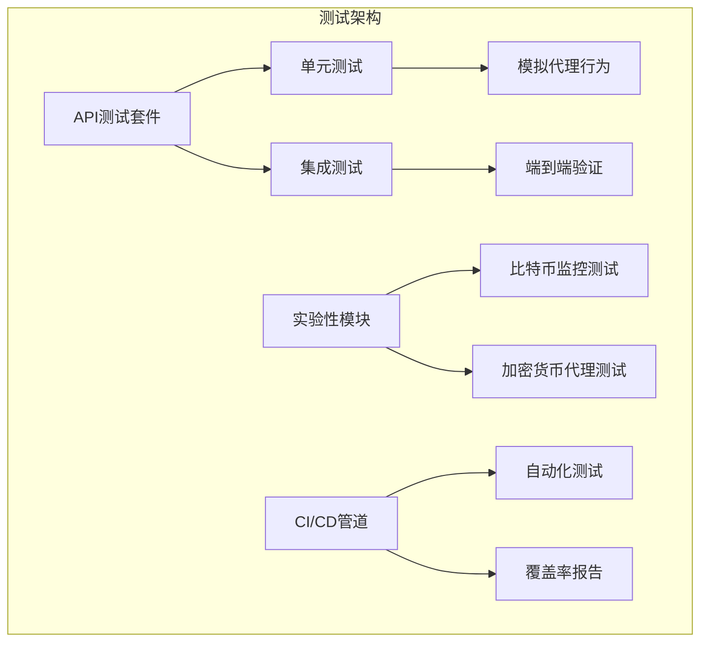

**图表来源**
- [api/api_tests.py](file://api/api_tests.py#L1-L187)
- [api/api.py](file://api/api.py#L1-L476)

## 测试架构概览

### 当前测试现状

目前项目主要包含以下测试组件：

1. **API功能测试**：位于`api/api_tests.py`的完整API端点测试套件
2. **实验性模块测试**：比特币交易监控和加密货币代理的测试基础
3. **配置支持**：通过`pyproject.toml`和`requirements.txt`定义依赖关系

### 测试覆盖层次

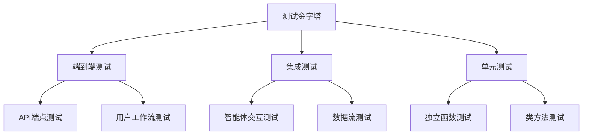

**节来源**
- [api/api_tests.py](file://api/api_tests.py#L151-L171)
- [api/api.py](file://api/api.py#L201-L444)

## API测试策略

### API测试套件设计

AutoHedge的API测试套件提供了完整的RESTful API功能验证，采用面向对象的设计模式。

#### 核心测试类结构

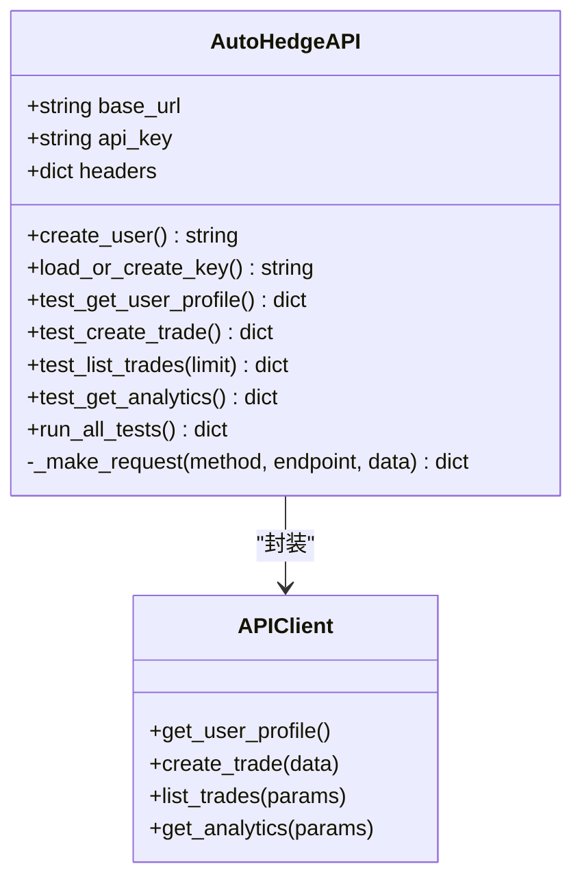

**图表来源**
- [api/api_tests.py](file://api/api_tests.py#L8-L187)

#### API端点测试覆盖

| 测试类别 | 端点路径 | 功能描述 | 验证要点 |
|---------|----------|----------|----------|
| 用户管理 | `/users` (POST) | 创建新用户账户 | API密钥生成、用户信息验证 |
| 用户管理 | `/users/me` (GET) | 获取当前用户信息 | 身份验证、权限控制 |
| 交易操作 | `/trades` (POST) | 创建新交易任务 | 参数验证、交易执行 |
| 交易操作 | `/trades` (GET) | 列出用户交易记录 | 分页查询、状态过滤 |
| 交易操作 | `/trades/{id}` (GET) | 获取特定交易详情 | 权限验证、数据完整性 |
| 交易操作 | `/trades/{id}` (DELETE) | 删除交易记录 | 权限控制、数据清理 |
| 数据分析 | `/analytics/history` | 获取历史分析数据 | 时间范围、统计计算 |

### 模拟代理行为

API测试通过HTTP请求模拟真实环境中的代理行为：

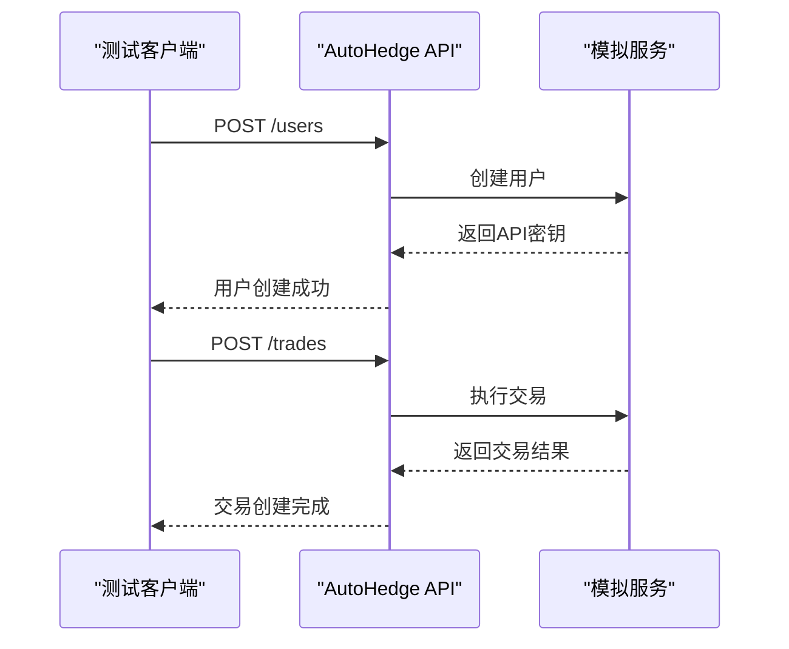

**图表来源**
- [api/api_tests.py](file://api/api_tests.py#L15-L52)
- [api/api.py](file://api/api.py#L202-L310)

**节来源**
- [api/api_tests.py](file://api/api_tests.py#L15-L187)
- [api/api.py](file://api/api.py#L202-L310)

## 单元测试设计原则

### 测试用例设计原则

#### 1. 模拟代理行为

单元测试应通过mock对象模拟外部依赖，确保测试的独立性和可重复性：

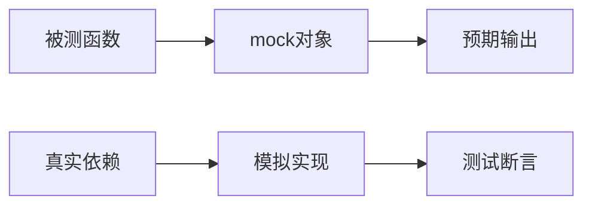

#### 2. 伪造交易平台响应

对于交易相关的功能，需要伪造市场数据和交易平台响应：

- **市场数据模拟**：生成虚拟的股票价格、成交量等数据
- **交易执行模拟**：模拟买卖指令的执行过程
- **错误场景模拟**：测试网络超时、API限制等异常情况

#### 3. 测试隔离性

每个测试用例应该：
- 独立运行，不依赖其他测试的状态
- 清理测试产生的临时数据
- 使用固定的种子值确保结果可重现

### 多智能体系统测试

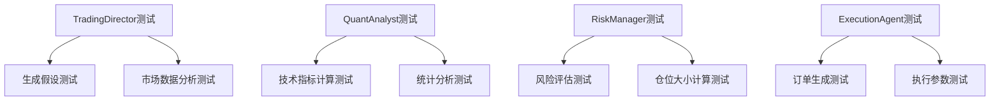

**节来源**
- [autohedge/main.py](file://autohedge/main.py#L242-L583)

## 集成测试覆盖范围

### 核心业务流程测试

#### 1. 完整交易周期测试

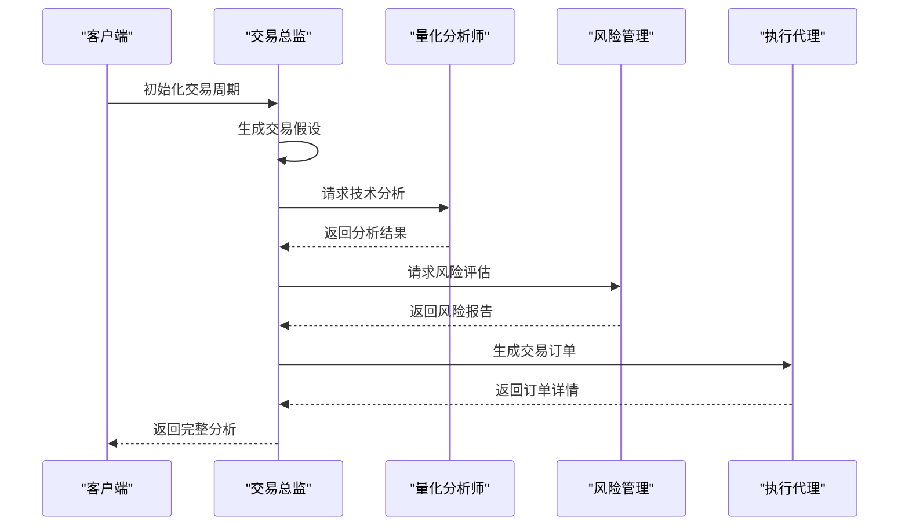

#### 2. API与后端集成测试

API测试不仅验证单个端点，还测试整个业务流程：

- **用户注册流程**：从创建用户到获取API密钥
- **交易执行流程**：从任务提交到结果返回
- **数据分析流程**：从历史数据查询到统计报告

#### 3. 实验性功能测试

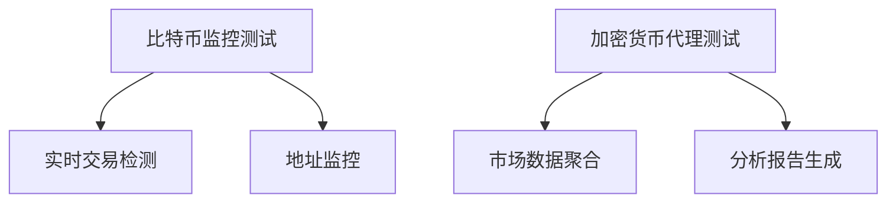

**图表来源**
- [experimental/btc_agent.py](file://experimental/btc_agent.py#L36-L243)
- [experimental/crypto_agent_wrapper.py](file://experimental/crypto_agent_wrapper.py#L10-L52)

**节来源**
- [experimental/btc_agent.py](file://experimental/btc_agent.py#L36-L243)
- [experimental/crypto_agent_wrapper.py](file://experimental/crypto_agent_wrapper.py#L10-L52)

## 测试工具与框架

### 当前测试基础设施

基于项目配置文件分析，测试基础设施包括：

#### 依赖包分析

| 包名 | 版本要求 | 用途 |
|------|----------|------|
| `swarms` | * | 多智能体框架 |
| `tickr-agent` | * | 市场数据获取 |
| `pydantic` | * | 数据验证模型 |
| `loguru` | * | 日志记录 |
| `swarm-models` | * | AI模型集成 |
| `fastapi` | * | API框架 |
| `uvicorn` | * | ASGI服务器 |
| `requests` | * | HTTP客户端 |

#### 开发工具配置

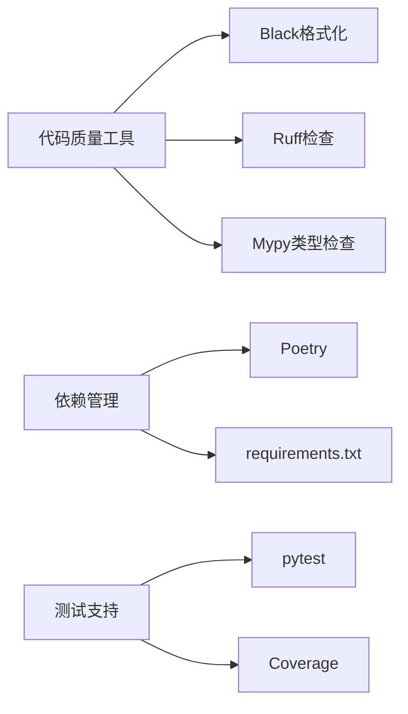

**图表来源**
- [pyproject.toml](file://pyproject.toml#L24-L31)
- [requirements.txt](file://requirements.txt#L1-L8)

### 推荐的测试框架

虽然当前项目主要使用自定义测试脚本，但建议引入以下测试框架：

#### 1. pytest框架优势

- **丰富的插件生态**：fixture管理、参数化测试
- **强大的断言库**：内置的assertions和比较工具
- **灵活的测试发现**：自动发现测试文件和函数
- **详细的报告**：多种输出格式和覆盖率报告

#### 2. 异步测试支持

对于FastAPI应用，需要支持异步测试：

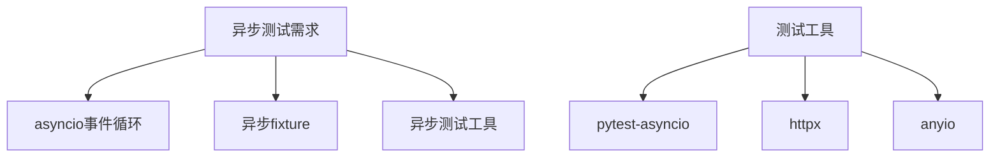

**节来源**
- [pyproject.toml](file://pyproject.toml#L24-L58)
- [requirements.txt](file://requirements.txt#L1-L8)

## 测试执行与CI流程

### 测试命令与配置

#### 运行测试套件

基于现有代码，可以执行以下测试命令：

```bash
# 运行API测试套件
python api/api_tests.py

# 启动API服务器进行测试
python api/api.py
```

#### 生成覆盖率报告

虽然当前项目没有明确的覆盖率配置，但可以通过以下方式添加：

```bash
# 使用coverage.py生成覆盖率报告
pip install coverage
coverage run -m pytest
coverage report -m
coverage html
```

### CI/CD集成策略

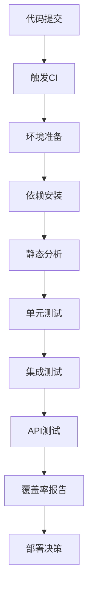

#### 持续集成检查清单

1. **代码质量检查**
   - 静态代码分析（Ruff）
   - 类型检查（Mypy）
   - 代码格式化（Black）

2. **测试执行**
   - 单元测试覆盖率 ≥ 80%
   - 集成测试完整性验证
   - API端点功能测试

3. **安全扫描**
   - 依赖项漏洞扫描
   - 敏感信息检查

4. **性能测试**
   - API响应时间测试
   - 并发处理能力测试

**节来源**
- [pyproject.toml](file://pyproject.toml#L33-L58)

## 测试驱动开发实践

### TDD在系统稳定性中的作用

#### 1. 测试驱动开发流程

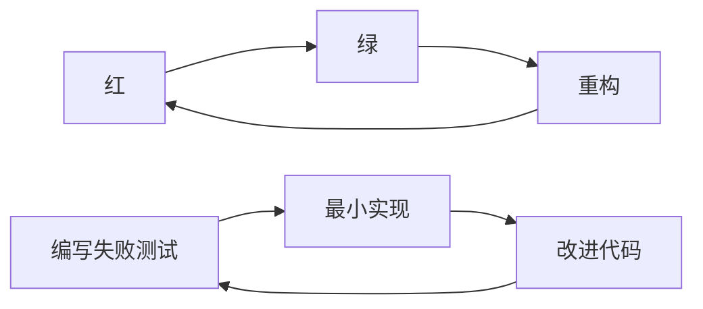

#### 2. 新功能测试编写指南

##### 使用pytest的fixture管理

```python
# 示例：智能体测试fixture
@pytest.fixture
def trading_director():
    """创建交易总监实例用于测试"""
    return TradingDirector(stocks=["NVDA"])

@pytest.fixture
def quant_analyst():
    """创建量化分析师实例用于测试"""
    return QuantAnalyst()

@pytest.fixture
def risk_manager():
    """创建风险管理器实例用于测试"""
    return RiskManager()
```

##### 异步测试处理

```python
# 示例：异步API测试
@pytest.mark.asyncio
async def test_async_trade_creation():
    """测试异步交易创建"""
    async with httpx.AsyncClient() as client:
        response = await client.post(
            "/trades",
            json={"stocks": ["NVDA"], "task": "test"},
            headers={"X-API-Key": "test_key"}
        )
        assert response.status_code == 200
```

##### Mock对象使用技巧

```python
# 示例：模拟市场数据获取
@patch("tickr_agent.main.TickrAgent.run")
def test_market_data_mock(mock_tickr):
    """测试市场数据模拟"""
    mock_tickr.return_value = "模拟市场数据"
    
    director = TradingDirector(stocks=["NVDA"])
    thesis, market_data = director.generate_thesis(
        task="测试任务", 
        stock="NVDA"
    )
    
    assert "模拟市场数据" in market_data
    mock_tickr.assert_called_once()
```

### 测试用例设计模式

#### 1. AAA模式（Arrange-Act-Assert）

```python
def test_create_trade_success():
    """测试成功创建交易"""
    # Arrange - 准备测试数据
    api_client = AutoHedgeAPI()
    trade_data = {
        "stocks": ["NVDA", "AAPL"],
        "task": "测试交易",
        "allocation": 1000000.0
    }
    
    # Act - 执行测试操作
    result = api_client.test_create_trade()
    
    # Assert - 验证结果
    assert "id" in result
    assert result["status"] == "executing"
    assert result["task"]["allocation"] == 1000000.0
```

#### 2. 参数化测试

```python
@pytest.mark.parametrize("stock_symbols,expected_count", [
    (["NVDA"], 1),
    (["NVDA", "AAPL"], 2),
    (["NVDA", "AAPL", "GOOGL"], 3),
])
def test_multiple_stocks(stock_symbols, expected_count):
    """测试多股票交易"""
    director = TradingDirector(stocks=stock_symbols)
    thesis, _ = director.generate_thesis("测试")
    
    assert len(thesis.split("Stock:")) == expected_count + 1
```

**节来源**
- [api/api_tests.py](file://api/api_tests.py#L106-L150)

## 测试最佳实践指南

### 开发者测试编写指南

#### 1. 测试命名规范

```python
# 好的测试命名示例
def test_create_trade_with_valid_parameters():
def test_get_user_profile_unauthorized_access():
def test_calculate_position_size_risk_level_high():
```

#### 2. 测试数据管理

```python
# 测试数据工厂模式
class TestDataFactory:
    @staticmethod
    def create_trade_data(allocation=1000000.0):
        return {
            "stocks": ["NVDA", "AAPL"],
            "task": f"测试交易 ${allocation}",
            "allocation": allocation,
            "strategy_type": "momentum",
            "risk_level": 7
        }
    
    @staticmethod
    def create_user_data(username="test_user"):
        return {
            "username": username,
            "email": f"{username}@example.com",
            "fund_name": "Test Fund",
            "fund_description": "Test Description"
        }
```

#### 3. 错误处理测试

```python
def test_invalid_api_key_authentication():
    """测试无效API密钥认证"""
    api_client = AutoHedgeAPI()
    
    # 设置无效的API密钥
    api_client.api_key = "invalid_key"
    api_client.headers["X-API-Key"] = "invalid_key"
    
    # 尝试访问受保护的端点
    with pytest.raises(HTTPException) as exc_info:
        api_client.test_get_user_profile()
    
    assert exc_info.value.status_code == 401
```

### 性能测试考虑

#### 1. 响应时间测试

```python
def test_api_response_time():
    """测试API响应时间"""
    api_client = AutoHedgeAPI()
    
    start_time = time.time()
    api_client.test_get_user_profile()
    response_time = time.time() - start_time
    
    assert response_time < 2.0  # 响应时间应小于2秒
```

#### 2. 并发测试

```python
@pytest.mark.asyncio
async def test_concurrent_requests():
    """测试并发请求处理"""
    async def make_request():
        async with httpx.AsyncClient() as client:
            return await client.get("/users/me", 
                                  headers={"X-API-Key": "test_key"})
    
    # 并发执行多个请求
    tasks = [make_request() for _ in range(10)]
    responses = await asyncio.gather(*tasks)
    
    assert all(r.status_code == 200 for r in responses)
```

### 测试环境管理

#### 1. 环境隔离

```python
# 测试环境配置
TEST_CONFIG = {
    "base_url": "http://localhost:8000",
    "api_key": "test_api_key",
    "timeout": 30,
    "max_retries": 3
}

@pytest.fixture(scope="session")
def test_environment():
    """设置测试环境"""
    # 启动测试服务器
    server_process = subprocess.Popen(["python", "api/api.py"])
    
    # 等待服务器启动
    time.sleep(2)
    
    yield TEST_CONFIG
    
    # 清理资源
    server_process.terminate()
    server_process.wait()
```

#### 2. 数据清理策略

```python
@pytest.fixture(autouse=True)
def clean_test_data():
    """自动清理测试数据"""
    # 测试开始前清理
    cleanup_database()
    
    yield
    
    # 测试结束后清理
    cleanup_test_users()
    cleanup_test_trades()
```

**节来源**
- [api/api_tests.py](file://api/api_tests.py#L151-L187)

## 故障排除与调试

### 常见测试问题及解决方案

#### 1. 网络连接问题

```python
# 调试网络连接问题
def debug_api_connection():
    """调试API连接问题"""
    try:
        response = requests.get("http://localhost:8000/users/me")
        print(f"响应状态: {response.status_code}")
        print(f"响应内容: {response.text}")
    except requests.ConnectionError as e:
        print(f"连接错误: {e}")
        print("请确保API服务器正在运行")
```

#### 2. 认证失败调试

```python
def debug_auth_issues():
    """调试认证问题"""
    api_client = AutoHedgeAPI()
    
    # 检查API密钥是否正确
    print(f"当前API密钥: {api_client.api_key}")
    
    # 测试基本认证
    try:
        result = api_client.test_get_user_profile()
        print("认证成功")
    except Exception as e:
        print(f"认证失败: {e}")
        print("请检查API密钥有效性")
```

#### 3. 数据验证错误

```python
def debug_validation_errors():
    """调试数据验证错误"""
    test_data = {
        "stocks": [],  # 缺少股票代码
        "task": "短任务描述",  # 描述过短
        "allocation": -1000,  # 负金额
    }
    
    try:
        # 尝试创建交易
        api_client = AutoHedgeAPI()
        api_client.test_create_trade(test_data)
    except ValidationError as e:
        print("数据验证错误:")
        for error in e.errors():
            print(f"- 字段: {error['loc'][0]}, 错误: {error['msg']}")
```

### 调试工具和技术

#### 1. 日志记录增强

```python
# 增强的日志配置
import logging

logging.basicConfig(
    level=logging.DEBUG,
    format='%(asctime)s - %(name)s - %(levelname)s - %(message)s',
    handlers=[
        logging.FileHandler('test_debug.log'),
        logging.StreamHandler()
    ]
)

logger = logging.getLogger(__name__)
```

#### 2. 断点调试

```python
def debug_with_breakpoint():
    """使用断点调试"""
    import pdb
    
    api_client = AutoHedgeAPI()
    
    # 设置断点
    pdb.set_trace()
    
    # 继续执行
    result = api_client.test_create_trade()
    return result
```

#### 3. 性能分析

```python
import cProfile
import pstats

def profile_test_function():
    """性能分析测试函数"""
    profiler = cProfile.Profile()
    profiler.enable()
    
    # 执行测试
    api_client = AutoHedgeAPI()
    api_client.run_all_tests()
    
    profiler.disable()
    
    # 输出性能报告
    stats = pstats.Stats(profiler)
    stats.sort_stats('cumulative')
    stats.print_stats(10)
```

### 测试维护策略

#### 1. 测试重构指南

```python
# 测试重构检查清单
def test_refactoring_checklist():
    """测试重构检查清单"""
    checks = [
        "测试名称是否清晰描述了测试目的",
        "测试是否遵循AAA模式",
        "是否有重复的测试代码",
        "测试数据是否易于理解和维护",
        "是否使用了适当的断言",
        "测试是否独立且可重复",
    ]
    
    for check in checks:
        print(f"✓ {check}")
```

#### 2. 测试文档维护

```python
# 测试文档模板
def test_documentation_template():
    """测试文档模板"""
    template = {
        "测试名称": "",
        "测试目的": "",
        "前置条件": "",
        "测试步骤": [],
        "预期结果": "",
        "实际结果": "",
        "测试状态": "PASS/FAIL",
        "备注": ""
    }
    return template
```

**节来源**
- [api/api_tests.py](file://api/api_tests.py#L48-L52)
- [api/api_tests.py](file://api/api_tests.py#L70-L94)

## 结论

AutoHedge项目的测试策略需要从现有的API功能测试扩展到更全面的测试体系。通过实施上述测试策略和最佳实践，可以显著提高系统的质量和可靠性：

### 关键收益

1. **系统稳定性提升**：通过全面的测试覆盖，减少生产环境中的错误
2. **开发效率提高**：测试驱动开发加快新功能的开发速度
3. **维护成本降低**：完善的测试套件简化了系统维护工作
4. **团队协作改善**：标准化的测试流程促进团队协作

### 未来发展方向

1. **扩展测试框架**：引入pytest等现代测试框架
2. **完善CI/CD流程**：建立自动化的测试流水线
3. **增加覆盖率**：目标达到90%以上的测试覆盖率
4. **性能测试集成**：加入性能和压力测试

通过持续改进测试策略，AutoHedge项目将能够更好地应对复杂交易场景，为用户提供可靠、稳定的自动化交易服务。