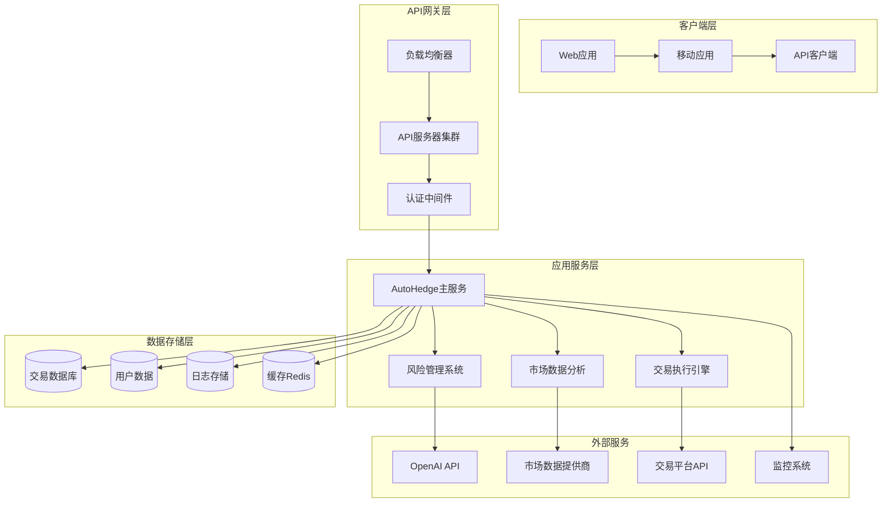

# 部署与运维指南

<cite>
**本文档引用的文件**
- [README.md](file://README.md)
- [pyproject.toml](file://pyproject.toml)
- [requirements.txt](file://requirements.txt)
- [autohedge/main.py](file://autohedge/main.py)
- [api/api.py](file://api/api.py)
- [experimental/btc_agent.py](file://experimental/btc_agent.py)
- [experimental/crypto_agent_wrapper.py](file://experimental/crypto_agent_wrapper.py)
- [example.py](file://example.py)
- [autohedge/tools/e_trade_wrapper.py](file://autohedge/tools/e_trade_wrapper.py)
- [autohedge/tools/td_ameritrade.py](file://autohedge/tools/td_ameritrade.py)
- [autohedge/tools/trade_station.py](file://autohedge/tools/trade_station.py)
</cite>

## 目录
1. [概述](#概述)
2. [系统架构](#系统架构)
3. [环境准备](#环境准备)
4. [容器化部署](#容器化部署)
5. [进程管理](#进程管理)
6. [云平台部署](#云平台部署)
7. [API服务配置](#api服务配置)
8. [核心交易系统运行模式](#核心交易系统运行模式)
9. [高可用性与故障恢复](#高可用性与故障恢复)
10. [环境变量管理](#环境变量管理)
11. [密钥安全存储](#密钥安全存储)
12. [健康检查与监控](#健康检查与监控)
13. [性能优化](#性能优化)
14. [告警配置](#告警配置)
15. [运维最佳实践](#运维最佳实践)

## 概述

autoHedge是一个基于多智能体架构的自动化对冲基金系统，采用Swarm AI框架构建。该系统支持实时市场分析、风险管理和自动交易执行，具备高度可扩展性和生产级部署能力。

### 核心特性
- **多智能体架构**：包含策略生成、量化分析、风险管理、执行控制四个专业智能体
- **实时市场数据集成**：支持多种金融数据源和交易平台API
- **结构化输出**：基于Pydantic模型的标准化交易推荐格式
- **全面日志记录**：基于loguru的详细交易跟踪和调试支持
- **RESTful API**：完整的交易管理接口

## 系统架构



**图表来源**
- [api/api.py](file://api/api.py#L130-L149)
- [autohedge/main.py](file://autohedge/main.py#L422-L475)

## 环境准备

### 基础环境要求

| 组件 | 版本要求 | 用途 |
|------|----------|------|
| Python | 3.10+ | 运行时环境 |
| Docker | 20.10+ | 容器化部署 |
| Kubernetes | 1.20+ | 容器编排 |
| Redis | 6.0+ | 缓存和会话存储 |
| PostgreSQL | 12+ | 数据持久化 |

### 依赖包安装

```bash
# 使用Poetry进行依赖管理
poetry install --with lint

# 或使用pip安装
pip install -r requirements.txt
```

**章节来源**
- [pyproject.toml](file://pyproject.toml#L24-L30)
- [requirements.txt](file://requirements.txt#L1-L8)

## 容器化部署

### Dockerfile配置

```dockerfile
FROM python:3.10-slim

# 设置工作目录
WORKDIR /app

# 复制依赖文件
COPY requirements.txt .
COPY pyproject.toml .

# 安装系统依赖
RUN apt-get update && apt-get install -y \
    gcc \
    g++ \
    && rm -rf /var/lib/apt/lists/*

# 安装Python依赖
RUN pip install --no-cache-dir -r requirements.txt

# 复制应用代码
COPY . .

# 创建非root用户
RUN useradd -m -u 1000 -U appuser
USER appuser

# 暴露端口
EXPOSE 8000

# 启动命令
CMD ["uvicorn", "api.api:AutoHedgeAPI", "--host", "0.0.0.0", "--port", "8000"]
```

### Docker Compose配置

```yaml
version: '3.8'

services:
  app:
    build: .
    ports:
      - "8000:8000"
    environment:
      - AUTOHEDGE_ENV=production
      - LOG_LEVEL=INFO
      - WORKSPACE_DIR=/app/workspace
    volumes:
      - ./workspace:/app/workspace
      - ./logs:/app/logs
    depends_on:
      - redis
      - postgres
    restart: unless-stopped
    
  redis:
    image: redis:6-alpine
    command: redis-server --appendonly yes
    volumes:
      - redis_data:/data
    ports:
      - "6379:6379"
    
  postgres:
    image: postgres:13
    environment:
      - POSTGRES_DB=autohedge
      - POSTGRES_USER=autohedge
      - POSTGRES_PASSWORD=${DB_PASSWORD}
    volumes:
      - postgres_data:/var/lib/postgresql/data
    ports:
      - "5432:5432"
    
volumes:
  redis_data:
  postgres_data:
```

### 多阶段构建优化

```dockerfile
# 构建阶段
FROM python:3.10-slim as builder

WORKDIR /app
COPY requirements.txt .
RUN pip install --no-cache-dir -r requirements.txt

# 生产阶段
FROM python:3.10-slim

WORKDIR /app
COPY --from=builder /usr/local/lib/python3.10/site-packages /usr/local/lib/python3.10/site-packages
COPY . .

EXPOSE 8000
CMD ["uvicorn", "api.api:AutoHedgeAPI", "--host", "0.0.0.0", "--port", "8000"]
```

## 进程管理

### Uvicorn + Gunicorn配置

```python
# gunicorn_config.py
import multiprocessing

# 基础配置
bind = "0.0.0.0:8000"
workers = multiprocessing.cpu_count() * 2
worker_class = "uvicorn.workers.UvicornWorker"
threads = 2
keepalive = 2
timeout = 30
graceful_timeout = 10

# 日志配置
accesslog = "/var/log/gunicorn/access.log"
errorlog = "/var/log/gunicorn/error.log"
loglevel = "info"

# 性能优化
preload_app = True
max_requests = 1000
max_requests_jitter = 100

# 资源限制
worker_tmp_dir = "/dev/shm"
```

### Supervisor配置

```ini
[program:autohedge]
command=gunicorn -c /etc/gunicorn/gunicorn_config.py api.api:AutoHedgeAPI
directory=/opt/autohedge
user=autohedge
autostart=true
autorestart=true
stderr_logfile=/var/log/autohedge/stderr.log
stdout_logfile=/var/log/autohedge/stdout.log
environment=AUTOHEDGE_ENV="production",LOG_LEVEL="INFO"
```

### systemd服务配置

```ini
[Unit]
Description=AutoHedge Production Service
After=network.target

[Service]
Type=simple
User=autohedge
Group=autohedge
WorkingDirectory=/opt/autohedge
ExecStart=/usr/local/bin/uvicorn api.api:AutoHedgeAPI --host 0.0.0.0 --port 8000 --workers 4
Restart=always
RestartSec=10
Environment=AUTOHEDGE_ENV=production
EnvironmentFile=/etc/autohedge/env

[Install]
WantedBy=multi-user.target
```

**章节来源**
- [api/api.py](file://api/api.py#L460-L470)

## 云平台部署

### AWS部署方案

#### ECS部署配置

```json
{
  "family": "autohedge-service",
  "networkMode": "awsvpc",
  "requiresCompatibilities": ["FARGATE"],
  "cpu": "1024",
  "memory": "2048",
  "executionRoleArn": "arn:aws:iam::account:role/ecsTaskExecutionRole",
  "taskRoleArn": "arn:aws:iam::account:role/ecsTaskRole",
  "containerDefinitions": [
    {
      "name": "autohedge",
      "image": "your-account.dkr.ecr.region.amazonaws.com/autohedge:latest",
      "essential": true,
      "portMappings": [
        {
          "containerPort": 8000,
          "protocol": "tcp"
        }
      ],
      "environment": [
        {
          "name": "AUTOHEDGE_ENV",
          "value": "production"
        }
      ],
      "secrets": [
        {
          "name": "OPENAI_API_KEY",
          "valueFrom": "arn:aws:secretsmanager:region:account:secret:autohedge/openai-api-key"
        }
      ],
      "logConfiguration": {
        "logDriver": "awslogs",
        "options": {
          "awslogs-group": "/ecs/autohedge",
          "awslogs-region": "us-west-2",
          "awslogs-stream-prefix": "ecs"
        }
      }
    }
  ]
}
```

#### ALB负载均衡配置

```yaml
Type: AWS::ElasticLoadBalancingV2::LoadBalancer
Properties:
  Name: autohedge-lb
  Scheme: internet-facing
  Type: application
  Subnets:
    - subnet-12345678
    - subnet-87654321
  SecurityGroups:
    - sg-12345678

Type: AWS::ElasticLoadBalancingV2::TargetGroup
Properties:
  Name: autohedge-targets
  Port: 8000
  Protocol: HTTP
  VpcId: vpc-12345678
  HealthCheckPath: /health
  HealthyThresholdCount: 2
  UnhealthyThresholdCount: 3
  TargetType: ip
```

### Google Cloud Platform部署

#### Cloud Run配置

```yaml
apiVersion: serving.knative.dev/v1
kind: Service
metadata:
  name: autohedge-service
spec:
  template:
    metadata:
      annotations:
        autoscaling.knative.dev/minScale: "2"
        autoscaling.knative.dev/maxScale: "10"
    spec:
      containerConcurrency: 100
      containers:
      - image: gcr.io/project-id/autohedge:latest
        ports:
        - containerPort: 8000
        env:
        - name: AUTOHEDGE_ENV
          value: production
        resources:
          limits:
            cpu: 1000m
            memory: 2Gi
```

#### Cloud Load Balancing

```yaml
apiVersion: cloud.google.com/v1
kind: BackendConfig
metadata:
  name: autohedge-backend-config
spec:
  healthCheck:
    checkIntervalSec: 5
    timeoutSec: 3
    healthyThreshold: 2
    unhealthyThreshold: 3
    type: HTTP
    requestPath: /health
```

### Azure部署方案

#### Container Instances配置

```json
{
  "location": "eastus",
  "properties": {
    "containers": [
      {
        "name": "autohedge",
        "properties": {
          "image": "yourregistry.azurecr.io/autohedge:latest",
          "ports": [
            {
              "port": 8000,
              "protocol": "TCP"
            }
          ],
          "resources": {
            "requests": {
              "cpu": 1.0,
              "memoryInGb": 2.0
            }
          },
          "environmentVariables": [
            {
              "name": "AUTOHEDGE_ENV",
              "value": "production"
            }
          ]
        }
      }
    ],
    "osType": "Linux",
    "restartPolicy": "Always"
  }
}
```

## API服务配置

### 并发处理能力配置

```python
# api_config.py
class APIConfig:
    # 并发连接数
    MAX_CONNECTIONS = 1000
    KEEP_ALIVE_TIMEOUT = 30
    
    # 请求超时配置
    REQUEST_TIMEOUT = 30
    READ_TIMEOUT = 20
    WRITE_TIMEOUT = 10
    
    # 限流配置
    RATE_LIMIT_ENABLED = True
    RATE_LIMIT_REQUESTS = 100
    RATE_LIMIT_WINDOW = 60  # 秒
    
    # 健康检查端点
    HEALTH_CHECK_PATH = "/health"
    
    # API版本控制
    API_VERSION = "v1"
    
    # 日志配置
    LOG_FORMAT = "%(asctime)s - %(name)s - %(levelname)s - %(message)s"
    LOG_LEVEL = "INFO"
```

### 日志输出路径配置

```python
# logging_config.py
import os
from loguru import logger

class LoggingConfig:
    def __init__(self):
        self.log_directory = os.getenv("LOG_DIR", "/var/log/autohedge")
        self.log_format = (
            "{time:YYYY-MM-DD HH:mm:ss.SSS} | {level} | "
            "{name}:{function}:{line} | {message}"
        )
        
        # 确保日志目录存在
        os.makedirs(self.log_directory, exist_ok=True)
        
        # 添加主日志文件
        logger.add(
            os.path.join(self.log_directory, "autohedge_{time}.log"),
            rotation="500 MB",
            retention="30 days",
            level="INFO",
            format=self.log_format,
            enqueue=True,
            backtrace=True,
            diagnose=True
        )
        
        # 错误日志单独处理
        logger.add(
            os.path.join(self.log_directory, "errors_{time}.log"),
            rotation="100 MB",
            retention="14 days",
            level="ERROR",
            format=self.log_format
        )
```

### 监控接入点配置

```python
# monitoring_config.py
class MonitoringConfig:
    # Prometheus指标端点
    PROMETHEUS_ENDPOINT = "/metrics"
    
    # 健康检查端点
    HEALTH_ENDPOINT = "/health"
    
    # 指标收集配置
    METRICS_COLLECTION_INTERVAL = 30  # 秒
    
    # 监控标签
    SERVICE_NAME = "autohedge-api"
    ENVIRONMENT = os.getenv("AUTOHEDGE_ENV", "development")
    
    def get_prometheus_config(self):
        return {
            "path": self.PROMETHEUS_ENDPOINT,
            "registry": self.create_metric_registry()
        }
    
    def create_metric_registry(self):
        from prometheus_client import Counter, Histogram, Gauge
        
        registry = {
            "http_requests_total": Counter(
                "http_requests_total", 
                "Total HTTP Requests", 
                ["method", "endpoint", "status"]
            ),
            "http_request_duration": Histogram(
                "http_request_duration_seconds", 
                "HTTP Request Duration",
                ["method", "endpoint"]
            ),
            "active_connections": Gauge(
                "active_connections", 
                "Active Connections"
            )
        }
        return registry
```

**章节来源**
- [api/api.py](file://api/api.py#L118-L127)

## 核心交易系统运行模式

### 常驻进程模式

```python
# trading_daemon.py
import asyncio
import schedule
from autohedge.main import AutoHedge
from loguru import logger

class TradingDaemon:
    def __init__(self, stocks: List[str], interval_minutes: int = 15):
        self.stocks = stocks
        self.interval_minutes = interval_minutes
        self.trading_system = AutoHedge(stocks)
        
    async def run_trading_cycle(self):
        """运行单次交易周期"""
        try:
            task = f"分析市场条件，为以下股票生成交易建议：{', '.join(self.stocks)}"
            result = await self.trading_system.run(task)
            logger.info(f"交易周期完成：{result}")
            return result
        except Exception as e:
            logger.error(f"交易周期失败：{e}")
            return None
    
    def schedule_trading(self):
        """安排定期交易"""
        schedule.every(self.interval_minutes).minutes.do(
            lambda: asyncio.run(self.run_trading_cycle())
        )
        
    async def start(self):
        """启动交易守护进程"""
        logger.info(f"启动交易守护进程，每 {self.interval_minutes} 分钟运行一次")
        
        # 初始化调度
        self.schedule_trading()
        
        # 主循环
        while True:
            schedule.run_pending()
            await asyncio.sleep(1)
```

### 任务调度触发模式

```python
# task_scheduler.py
from apscheduler.schedulers.background import BackgroundScheduler
from apscheduler.jobstores.sqlalchemy import SQLAlchemyJobStore
from autohedge.main import AutoHedge
import logging

class TaskScheduler:
    def __init__(self, db_url: str):
        self.scheduler = BackgroundScheduler({
            'jobstores': {
                'default': SQLAlchemyJobStore(url=db_url)
            }
        })
        self.trading_systems = {}
        
    def add_trading_job(self, job_id: str, stocks: List[str], cron_schedule: str):
        """添加定时交易任务"""
        def trading_task():
            if job_id not in self.trading_systems:
                self.trading_systems[job_id] = AutoHedge(stocks)
            
            task = f"执行市场分析和交易决策，为以下股票：{', '.join(stocks)}"
            return self.trading_systems[job_id].run(task)
        
        self.scheduler.add_job(
            trading_task,
            'cron',
            id=job_id,
            cron_schedule=cron_schedule,
            misfire_grace_time=300
        )
    
    def start(self):
        """启动调度器"""
        self.scheduler.start()
```

### 实时交易模式

```python
# real_time_trading.py
import asyncio
from websockets import connect
from autohedge.main import AutoHedge

class RealTimeTrading:
    def __init__(self, stocks: List[str]):
        self.stocks = stocks
        self.trading_system = AutoHedge(stocks)
        self.websocket_uri = "wss://market-data.example.com/stream"
        
    async def handle_market_data(self, websocket):
        """处理实时市场数据"""
        async for message in websocket:
            try:
                data = json.loads(message)
                if data['symbol'] in self.stocks:
                    await self.process_market_signal(data)
            except Exception as e:
                logger.error(f"处理市场数据失败：{e}")
    
    async def process_market_signal(self, signal_data):
        """处理市场信号"""
        task = f"根据实时市场信号分析 {signal_data['symbol']}，当前价格：{signal_data['price']}"
        result = await self.trading_system.run(task)
        
        # 自动执行交易
        if self.should_execute_trade(result):
            await self.execute_trade(result)
    
    async def start(self):
        """启动实时交易"""
        async with connect(self.websocket_uri) as websocket:
            await self.handle_market_data(websocket)
```

**章节来源**
- [autohedge/main.py](file://autohedge/main.py#L477-L583)

## 高可用性与故障恢复

### 故障检测机制

```python
# fault_detection.py
import asyncio
import aiohttp
from typing import Dict, Any
from loguru import logger

class FaultDetection:
    def __init__(self, service_endpoints: Dict[str, str]):
        self.service_endpoints = service_endpoints
        self.health_checks = {}
        
    async def health_check(self, service_name: str, endpoint: str):
        """执行健康检查"""
        try:
            async with aiohttp.ClientSession() as session:
                async with session.get(endpoint, timeout=10) as response:
                    return response.status == 200
        except Exception as e:
            logger.error(f"服务 {service_name} 健康检查失败：{e}")
            return False
    
    async def monitor_services(self):
        """持续监控服务状态"""
        while True:
            for service, endpoint in self.service_endpoints.items():
                is_healthy = await self.health_check(service, endpoint)
                
                if is_healthy and not self.health_checks.get(service, False):
                    logger.warning(f"服务 {service} 已恢复")
                elif not is_healthy and self.health_checks.get(service, True):
                    logger.error(f"服务 {service} 失败")
                
                self.health_checks[service] = is_healthy
            
            await asyncio.sleep(30)
    
    def should_failover(self, service_name: str) -> bool:
        """判断是否需要故障转移"""
        failure_count = self.health_checks.get(service_name, True)
        return failure_count > 3  # 连续3次失败触发故障转移
```

### 自动故障恢复

```python
# failover_recovery.py
import subprocess
import time
from typing import List, Dict
from loguru import logger

class FailoverManager:
    def __init__(self, service_configs: List[Dict[str, Any]]):
        self.service_configs = service_configs
        self.active_instances = {}
        
    async def start_service(self, service_name: str, config: Dict[str, Any]):
        """启动服务实例"""
        try:
            cmd = config['startup_command'].split()
            process = subprocess.Popen(cmd)
            self.active_instances[service_name] = process
            logger.info(f"服务 {service_name} 已启动")
            return True
        except Exception as e:
            logger.error(f"启动服务 {service_name} 失败：{e}")
            return False
    
    async def recover_service(self, service_name: str):
        """恢复服务"""
        config = next((s for s in self.service_configs if s['name'] == service_name), None)
        if not config:
            return False
        
        # 停止现有实例
        if service_name in self.active_instances:
            self.active_instances[service_name].terminate()
            time.sleep(5)
        
        # 重启服务
        return await self.start_service(service_name, config)
    
    async def monitor_and_recover(self):
        """监控并自动恢复服务"""
        while True:
            for service in self.service_configs:
                service_name = service['name']
                is_running = self.active_instances.get(service_name, None)
                
                if not is_running or is_running.poll() is not None:
                    logger.warning(f"服务 {service_name} 已停止，正在尝试恢复")
                    await self.recover_service(service_name)
            
            await asyncio.sleep(60)
```

### 数据备份与恢复

```python
# backup_manager.py
import os
import shutil
import zipfile
from datetime import datetime
from typing import List
from loguru import logger

class BackupManager:
    def __init__(self, backup_dir: str, retention_days: int = 30):
        self.backup_dir = backup_dir
        self.retention_days = retention_days
        self.create_backup_directory()
        
    def create_backup_directory(self):
        """创建备份目录"""
        os.makedirs(self.backup_dir, exist_ok=True)
        
    def create_database_backup(self, db_path: str):
        """创建数据库备份"""
        timestamp = datetime.now().strftime("%Y%m%d_%H%M%S")
        backup_filename = f"db_backup_{timestamp}.zip"
        backup_path = os.path.join(self.backup_dir, backup_filename)
        
        try:
            with zipfile.ZipFile(backup_path, 'w') as backup_zip:
                backup_zip.write(db_path, os.path.basename(db_path))
            logger.info(f"数据库备份已创建：{backup_path}")
            return backup_path
        except Exception as e:
            logger.error(f"数据库备份失败：{e}")
            return None
    
    def create_full_backup(self, data_dirs: List[str]):
        """创建完整备份"""
        timestamp = datetime.now().strftime("%Y%m%d_%H%M%S")
        backup_filename = f"full_backup_{timestamp}.zip"
        backup_path = os.path.join(self.backup_dir, backup_filename)
        
        try:
            with zipfile.ZipFile(backup_path, 'w') as backup_zip:
                for data_dir in data_dirs:
                    for root, _, files in os.walk(data_dir):
                        for file in files:
                            file_path = os.path.join(root, file)
                            arcname = os.path.relpath(file_path, os.path.dirname(data_dir))
                            backup_zip.write(file_path, arcname)
            logger.info(f"完整备份已创建：{backup_path}")
            return backup_path
        except Exception as e:
            logger.error(f"完整备份失败：{e}")
            return None
    
    def cleanup_old_backups(self):
        """清理过期备份"""
        now = datetime.now()
        for backup_file in os.listdir(self.backup_dir):
            file_path = os.path.join(self.backup_dir, backup_file)
            if os.path.isfile(file_path):
                creation_time = datetime.fromtimestamp(os.path.getctime(file_path))
                age_days = (now - creation_time).days
                
                if age_days > self.retention_days:
                    os.remove(file_path)
                    logger.info(f"已删除过期备份：{backup_file}")
```

## 环境变量管理

### 生产环境配置模板

```bash
# .env.production
# ====================
# 应用配置
# ====================
AUTOHEDGE_ENV=production
AUTOHEDGE_LOG_LEVEL=INFO
WORKSPACE_DIR=/app/workspace
PORT=8000
HOST=0.0.0.0

# ====================
# 数据库配置
# ====================
DB_HOST=localhost
DB_PORT=5432
DB_NAME=autohedge_production
DB_USER=autohedge
DB_PASSWORD=your_secure_password
DB_POOL_SIZE=20
DB_MAX_OVERFLOW=40

# ====================
# 缓存配置
# ====================
REDIS_HOST=localhost
REDIS_PORT=6379
REDIS_DB=0
REDIS_PASSWORD=your_redis_password

# ====================
# API配置
# ====================
API_KEY_EXPIRY_DAYS=30
MAX_API_KEYS_PER_USER=5
RATE_LIMIT_PER_MINUTE=100

# ====================
# AI服务配置
# ====================
OPENAI_API_KEY=your_openai_api_key
OPENAI_MODEL=gpt-4o
OPENAI_TEMPERATURE=0.1
OPENAI_MAX_TOKENS=4000

# ====================
# 交易配置
# ====================
DEFAULT_ALLOCATION=1000000.0
MAX_POSITION_SIZE=0.1
MIN_POSITION_SIZE=0.01
RISK_TOLERANCE=0.02

# ====================
# 监控配置
# ====================
ENABLE_METRICS=true
METRICS_PORT=9090
SENTRY_DSN=your_sentry_dsn
PROMETHEUS_PUSH_GATEWAY=http://prometheus:9091

# ====================
# 安全配置
# ====================
SECRET_KEY=your_secret_key_here
JWT_EXPIRATION_HOURS=24
ENCRYPTION_KEY=your_encryption_key
ALLOWED_ORIGINS=https://yourdomain.com
```

### 环境变量验证

```python
# env_validator.py
import os
import re
from typing import Dict, Any
from loguru import logger

class EnvValidator:
    REQUIRED_VARS = [
        'AUTOHEDGE_ENV',
        'OPENAI_API_KEY',
        'DB_HOST',
        'DB_NAME',
        'DB_USER',
        'REDIS_HOST',
        'SECRET_KEY'
    ]
    
    OPTIONAL_VARS = {
        'DB_PASSWORD': r'.*',
        'REDIS_PASSWORD': r'.*',
        'PORT': r'^\d+$',
        'LOG_LEVEL': r'^(DEBUG|INFO|WARNING|ERROR|CRITICAL)$',
        'WORKSPACE_DIR': r'.*'
    }
    
    @classmethod
    def validate_environment(cls) -> bool:
        """验证环境变量"""
        missing_vars = []
        invalid_vars = []
        
        # 检查必需变量
        for var in cls.REQUIRED_VARS:
            if not os.getenv(var):
                missing_vars.append(var)
        
        # 检查可选变量格式
        for var, pattern in cls.OPTIONAL_VARS.items():
            value = os.getenv(var)
            if value and not re.match(pattern, value):
                invalid_vars.append(var)
        
        # 报告错误
        if missing_vars:
            logger.error(f"缺少必需的环境变量：{missing_vars}")
        
        if invalid_vars:
            logger.error(f"格式无效的环境变量：{invalid_vars}")
        
        if missing_vars or invalid_vars:
            return False
        
        logger.info("环境变量验证通过")
        return True
    
    @classmethod
    def get_database_url(cls) -> str:
        """获取数据库连接URL"""
        db_host = os.getenv('DB_HOST')
        db_port = os.getenv('DB_PORT', '5432')
        db_name = os.getenv('DB_NAME')
        db_user = os.getenv('DB_USER')
        db_password = os.getenv('DB_PASSWORD', '')
        
        if db_password:
            return f"postgresql://{db_user}:{db_password}@{db_host}:{db_port}/{db_name}"
        else:
            return f"postgresql://{db_user}@{db_host}:{db_port}/{db_name}"
```

## 密钥安全存储

### AWS Secrets Manager集成

```python
# secrets_manager.py
import boto3
import base64
from botocore.exceptions import ClientError
from typing import Dict, Any
from loguru import logger

class AWSSecretsManager:
    def __init__(self, region_name: str = 'us-west-2'):
        self.client = boto3.client('secretsmanager', region_name=region_name)
        self.secret_prefix = '/autohedge/'
        
    def get_secret(self, secret_name: str) -> str:
        """从AWS Secrets Manager获取密钥"""
        try:
            response = self.client.get_secret_value(SecretId=self.secret_prefix + secret_name)
            if 'SecretString' in response:
                return response['SecretString']
            else:
                return base64.b64decode(response['SecretBinary'])
        except ClientError as e:
            logger.error(f"获取密钥 {secret_name} 失败：{e}")
            raise
    
    def put_secret(self, secret_name: str, secret_value: str) -> bool:
        """向AWS Secrets Manager存储密钥"""
        try:
            self.client.create_secret(
                Name=self.secret_prefix + secret_name,
                SecretString=secret_value
            )
            logger.info(f"密钥 {secret_name} 已存储")
            return True
        except ClientError as e:
            logger.error(f"存储密钥 {secret_name} 失败：{e}")
            return False
    
    def rotate_secret(self, secret_name: str, new_value: str) -> bool:
        """轮换密钥"""
        try:
            self.client.update_secret(
                SecretId=self.secret_prefix + secret_name,
                SecretString=new_value
            )
            logger.info(f"密钥 {secret_name} 已轮换")
            return True
        except ClientError as e:
            logger.error(f"轮换密钥 {secret_name} 失败：{e}")
            return False
```

### Vault集成

```python
# vault_manager.py
import hvac
from typing import Dict, Any
from loguru import logger

class VaultManager:
    def __init__(self, url: str, token: str):
        self.client = hvac.Client(url=url, token=token)
        self.mount_point = 'autohedge'
        
    def get_secret(self, path: str) -> Dict[str, Any]:
        """从Vault获取密钥"""
        try:
            response = self.client.secrets.kv.v2.read_secret_version(
                path=path,
                mount_point=self.mount_point
            )
            return response['data']['data']
        except Exception as e:
            logger.error(f"获取密钥 {path} 失败：{e}")
            return {}
    
    def write_secret(self, path: str, secret_data: Dict[str, Any]) -> bool:
        """向Vault写入密钥"""
        try:
            self.client.secrets.kv.v2.create_or_update_secret(
                path=path,
                secret=secret_data,
                mount_point=self.mount_point
            )
            logger.info(f"密钥 {path} 已写入Vault")
            return True
        except Exception as e:
            logger.error(f"写入密钥 {path} 失败：{e}")
            return False
    
    def delete_secret(self, path: str) -> bool:
        """从Vault删除密钥"""
        try:
            self.client.secrets.kv.v2.delete_metadata_and_all_versions(
                path=path,
                mount_point=self.mount_point
            )
            logger.info(f"密钥 {path} 已删除")
            return True
        except Exception as e:
            logger.error(f"删除密钥 {path} 失败：{e}")
            return False
```

### 加密存储

```python
# encrypted_storage.py
from cryptography.fernet import Fernet
import base64
import os
from typing import Dict, Any
from loguru import logger

class EncryptedStorage:
    def __init__(self, encryption_key: str):
        # 确保密钥长度正确
        if len(encryption_key) < 32:
            encryption_key = encryption_key.ljust(32, '=')
        self.fernet = Fernet(base64.urlsafe_b64encode(encryption_key.encode()))
        
    def encrypt_data(self, plaintext: str) -> str:
        """加密数据"""
        try:
            return self.fernet.encrypt(plaintext.encode()).decode()
        except Exception as e:
            logger.error(f"加密数据失败：{e}")
            return ""
    
    def decrypt_data(self, ciphertext: str) -> str:
        """解密数据"""
        try:
            return self.fernet.decrypt(ciphertext.encode()).decode()
        except Exception as e:
            logger.error(f"解密数据失败：{e}")
            return ""
    
    def store_sensitive_data(self, key: str, data: str):
        """存储敏感数据"""
        encrypted_data = self.encrypt_data(data)
        # 存储到文件或数据库
        with open(f"/secure-storage/{key}.enc", "w") as f:
            f.write(encrypted_data)
    
    def retrieve_sensitive_data(self, key: str) -> str:
        """检索敏感数据"""
        try:
            with open(f"/secure-storage/{key}.enc", "r") as f:
                encrypted_data = f.read()
            return self.decrypt_data(encrypted_data)
        except Exception as e:
            logger.error(f"检索密钥 {key} 失败：{e}")
            return ""
```

## 健康检查与监控

### 健康检查接口

```python
# health_check.py
from fastapi import APIRouter, HTTPException
from typing import Dict, Any
from loguru import logger
import psutil
import time

router = APIRouter()

class HealthChecker:
    @staticmethod
    @router.get("/health")
    async def health_check():
        """综合健康检查"""
        checks = {
            'app': await HealthChecker.check_application(),
            'database': await HealthChecker.check_database(),
            'redis': await HealthChecker.check_redis(),
            'disk_space': await HealthChecker.check_disk_space(),
            'memory_usage': await HealthChecker.check_memory_usage(),
            'timestamp': time.time()
        }
        
        # 检查是否有任何失败项
        failed_checks = [k for k, v in checks.items() if not v.get('status')]
        
        if failed_checks:
            raise HTTPException(
                status_code=503,
                detail={"status": "unhealthy", "checks": checks, "failed": failed_checks}
            )
        
        return {"status": "healthy", "checks": checks}
    
    @staticmethod
    async def check_application() -> Dict[str, Any]:
        """检查应用状态"""
        try:
            # 可以添加应用特定的健康检查逻辑
            return {"status": True, "details": "Application is running"}
        except Exception as e:
            return {"status": False, "details": str(e)}
    
    @staticmethod
    async def check_database() -> Dict[str, Any]:
        """检查数据库连接"""
        try:
            # 执行简单的数据库查询
            # db.execute("SELECT 1")
            return {"status": True, "details": "Database connection OK"}
        except Exception as e:
            return {"status": False, "details": str(e)}
    
    @staticmethod
    async def check_redis() -> Dict[str, Any]:
        """检查Redis连接"""
        try:
            # redis.ping()
            return {"status": True, "details": "Redis connection OK"}
        except Exception as e:
            return {"status": False, "details": str(e)}
    
    @staticmethod
    async def check_disk_space() -> Dict[str, Any]:
        """检查磁盘空间"""
        try:
            disk = psutil.disk_usage('/')
            free_gb = disk.free / (1024 ** 3)
            if free_gb < 1:
                return {"status": False, "details": f"Low disk space: {free_gb:.2f} GB"}
            return {"status": True, "details": f"Free space: {free_gb:.2f} GB"}
        except Exception as e:
            return {"status": False, "details": str(e)}
    
    @staticmethod
    async def check_memory_usage() -> Dict[str, Any]:
        """检查内存使用情况"""
        try:
            memory = psutil.virtual_memory()
            if memory.percent > 90:
                return {"status": False, "details": f"High memory usage: {memory.percent}%"}
            return {"status": True, "details": f"Memory usage: {memory.percent}%"}
        except Exception as e:
            return {"status": False, "details": str(e)}
```

### 监控指标收集

```python
# metrics_collector.py
from prometheus_client import Counter, Histogram, Gauge, start_http_server
import time
from typing import Dict, Any
from loguru import logger

class MetricsCollector:
    def __init__(self, port: int = 9090):
        self.port = port
        
        # 初始化指标
        self.http_requests_total = Counter(
            'http_requests_total', 
            '总HTTP请求数',
            ['method', 'endpoint', 'status']
        )
        
        self.http_request_duration = Histogram(
            'http_request_duration_seconds', 
            'HTTP请求耗时',
            ['method', 'endpoint']
        )
        
        self.active_trades = Gauge(
            'active_trades', 
            '活跃交易数量'
        )
        
        self.trade_success_rate = Gauge(
            'trade_success_rate', 
            '交易成功率'
        )
        
        self.api_latency = Histogram(
            'api_latency_seconds',
            'API响应延迟',
            ['endpoint']
        )
        
        # 启动Prometheus服务器
        start_http_server(port)
        logger.info(f"Prometheus指标服务器已在端口 {port} 启动")
    
    def record_request(self, method: str, endpoint: str, status: str, duration: float):
        """记录HTTP请求指标"""
        self.http_requests_total.labels(method=method, endpoint=endpoint, status=status).inc()
        self.http_request_duration.labels(method=method, endpoint=endpoint).observe(duration)
    
    def record_trade(self, success: bool, execution_time: float):
        """记录交易指标"""
        if success:
            self.trade_success_rate.inc()
        self.api_latency.labels(endpoint='trade_execution').observe(execution_time)
    
    def set_active_trades(self, count: int):
        """设置活跃交易数量"""
        self.active_trades.set(count)
    
    def collect_system_metrics(self):
        """收集系统指标"""
        # CPU使用率
        cpu_percent = psutil.cpu_percent(interval=1)
        
        # 内存使用率
        memory = psutil.virtual_memory()
        
        # 磁盘使用率
        disk = psutil.disk_usage('/')
        
        return {
            'cpu_usage_percent': cpu_percent,
            'memory_usage_percent': memory.percent,
            'disk_usage_percent': disk.percent,
            'available_memory_mb': memory.available / 1024 / 1024,
            'total_memory_mb': memory.total / 1024 / 1024
        }
```

### 日志监控

```python
# log_monitoring.py
import json
import re
from datetime import datetime, timedelta
from typing import List, Dict, Any
from loguru import logger

class LogMonitor:
    def __init__(self, log_files: List[str]):
        self.log_files = log_files
        self.error_patterns = [
            r'\bERROR\b',
            r'\bEXCEPTION\b',
            r'\bCRITICAL\b',
            r'\bTraceback\b',
            r'\bfatal\b'
        ]
        
    def analyze_logs(self, time_window: timedelta = timedelta(minutes=5)) -> Dict[str, Any]:
        """分析日志中的错误和异常"""
        cutoff_time = datetime.now() - time_window
        errors = []
        warnings = []
        info_count = 0
        
        for log_file in self.log_files:
            try:
                with open(log_file, 'r') as f:
                    for line in f:
                        if not line.strip():
                            continue
                        
                        # 解析日志行
                        parsed = self.parse_log_line(line)
                        if not parsed:
                            continue
                        
                        # 检查时间戳
                        if parsed['timestamp'] < cutoff_time:
                            continue
                        
                        # 分类日志级别
                        if parsed['level'] == 'ERROR':
                            errors.append(parsed)
                        elif parsed['level'] == 'WARNING':
                            warnings.append(parsed)
                        elif parsed['level'] == 'INFO':
                            info_count += 1
                        
                        # 检查错误模式
                        if any(re.search(pattern, line, re.IGNORECASE) for pattern in self.error_patterns):
                            errors.append(parsed)
                            
            except Exception as e:
                logger.error(f"读取日志文件 {log_file} 失败：{e}")
        
        return {
            'total_errors': len(errors),
            'total_warnings': len(warnings),
            'total_info': info_count,
            'recent_errors': errors[-10:],  # 最近10个错误
            'warning_summary': self.summarize_warnings(warnings)
        }
    
    def parse_log_line(self, line: str) -> Dict[str, Any]:
        """解析日志行"""
        try:
            # 尝试JSON格式
            if line.startswith('{'):
                return json.loads(line)
            
            # 尝试结构化格式
            parts = line.split(' | ', 3)
            if len(parts) == 4:
                timestamp = datetime.strptime(parts[0], '%Y-%m-%d %H:%M:%S.%f')
                return {
                    'timestamp': timestamp,
                    'level': parts[1],
                    'message': parts[3]
                }
            
            return None
        except Exception:
            return None
    
    def summarize_warnings(self, warnings: List[Dict[str, Any]]) -> Dict[str, int]:
        """总结警告信息"""
        summary = {}
        for warning in warnings:
            module = warning.get('module', 'unknown')
            summary[module] = summary.get(module, 0) + 1
        return summary
```

**章节来源**
- [api/api.py](file://api/api.py#L150-L167)

## 性能优化

### 缓存策略

```python
# cache_strategy.py
from redis import Redis
from typing import Any, Optional
from functools import wraps
from loguru import logger
import json
import time

class CacheStrategy:
    def __init__(self, redis_client: Redis, default_ttl: int = 3600):
        self.redis = redis_client
        self.default_ttl = default_ttl
        
    def cache(self, key_func=None, ttl: Optional[int] = None):
        """缓存装饰器"""
        def decorator(func):
            @wraps(func)
            def wrapper(*args, **kwargs):
                # 生成缓存键
                if key_func:
                    cache_key = key_func(*args, **kwargs)
                else:
                    cache_key = f"{func.__name__}:{hash(args)}"
                
                # 尝试从缓存获取
                cached = self.redis.get(cache_key)
                if cached:
                    logger.debug(f"缓存命中：{cache_key}")
                    return json.loads(cached)
                
                # 执行函数并缓存结果
                logger.debug(f"缓存未命中：{cache_key}")
                result = func(*args, **kwargs)
                
                # 设置缓存
                cache_ttl = ttl or self.default_ttl
                self.redis.setex(cache_key, cache_ttl, json.dumps(result))
                
                return result
            return wrapper
        return decorator
    
    def invalidate_cache(self, pattern: str):
        """使缓存失效"""
        keys = self.redis.keys(pattern)
        if keys:
            self.redis.delete(*keys)
            logger.info(f"已使 {len(keys)} 个缓存键失效：{pattern}")
    
    def warmup_cache(self, key: str, value: Any, ttl: int = 3600):
        """预热缓存"""
        self.redis.setex(key, ttl, json.dumps(value))
    
    def get_cache_stats(self) -> Dict[str, Any]:
        """获取缓存统计信息"""
        info = self.redis.info('stats')
        return {
            'total_commands_processed': info.get('total_commands_processed'),
            'keyspace_hits': info.get('keyspace_hits'),
            'keyspace_misses': info.get('keyspace_misses'),
            'hit_rate': info.get('keyspace_hits', 0) / (info.get('keyspace_hits', 0) + info.get('keyspace_misses', 1))
        }
```

### 异步处理优化

```python
# async_optimization.py
import asyncio
from typing import List, Callable, Any
from loguru import logger

class AsyncOptimizer:
    def __init__(self, max_concurrent_tasks: int = 10):
        self.semaphore = asyncio.Semaphore(max_concurrent_tasks)
        
    async def batch_process(self, items: List[Any], processor: Callable, batch_size: int = 100):
        """批量处理优化"""
        results = []
        
        for i in range(0, len(items), batch_size):
            batch = items[i:i + batch_size]
            tasks = [self.process_item(item, processor) for item in batch]
            batch_results = await asyncio.gather(*tasks, return_exceptions=True)
            results.extend(batch_results)
            
        return results
    
    async def process_item(self, item: Any, processor: Callable):
        """异步处理单个项目"""
        async with self.semaphore:
            try:
                return await processor(item)
            except Exception as e:
                logger.error(f"处理项目 {item} 失败：{e}")
                return None
    
    async def parallel_execution(self, tasks: List[Callable]):
        """并行执行多个任务"""
        semaphore = asyncio.Semaphore(len(tasks))
        
        async def execute_with_semaphore(task):
            async with semaphore:
                return await task()
        
        wrapped_tasks = [execute_with_semaphore(task) for task in tasks]
        return await asyncio.gather(*wrapped_tasks, return_exceptions=True)
    
    def optimize_memory_usage(self, data: List[Any], chunk_size: int = 1000):
        """优化内存使用"""
        for i in range(0, len(data), chunk_size):
            chunk = data[i:i + chunk_size]
            # 处理数据块
            yield chunk
            # 强制垃圾回收
            import gc
            gc.collect()
```

### 数据库优化

```python
# database_optimization.py
from sqlalchemy import create_engine, text
from sqlalchemy.pool import QueuePool
from typing import Dict, Any
from loguru import logger

class DatabaseOptimizer:
    def __init__(self, db_url: str):
        self.engine = create_engine(
            db_url,
            poolclass=QueuePool,
            pool_size=20,
            max_overflow=40,
            pool_pre_ping=True,
            pool_recycle=3600
        )
        
    def optimize_query(self, query: str, params: Dict = None) -> Any:
        """优化查询执行"""
        with self.engine.connect() as conn:
            # 使用预编译语句
            stmt = text(query)
            
            # 执行查询
            result = conn.execute(stmt, params or {})
            
            # 获取结果
            return result.fetchall()
    
    def bulk_insert(self, table: str, data: List[Dict[str, Any]]):
        """批量插入优化"""
        if not data:
            return
            
        columns = ', '.join(data[0].keys())
        placeholders = ', '.join(['%s'] * len(data[0]))
        
        query = f"INSERT INTO {table} ({columns}) VALUES ({placeholders})"
        
        with self.engine.connect() as conn:
            conn.execute(query, data)
    
    def analyze_query_performance(self, query: str) -> Dict[str, Any]:
        """分析查询性能"""
        with self.engine.connect() as conn:
            # EXPLAIN查询
            explain_result = conn.execute(text(f"EXPLAIN ANALYZE {query}"))
            return {'plan': explain_result.fetchall()}
    
    def vacuum_database(self):
        """数据库维护"""
        with self.engine.connect() as conn:
            conn.execute(text("VACUUM ANALYZE"))
            logger.info("数据库维护完成")
```

## 告警配置

### 告警规则定义

```python
# alert_rules.py
from typing import Dict, List, Any
from loguru import logger

class AlertRules:
    def __init__(self):
        self.rules = {
            # 系统级告警
            'high_cpu_usage': {
                'condition': lambda metrics: metrics.get('cpu_usage_percent', 0) > 80,
                'severity': 'warning',
                'message': 'CPU使用率过高：{cpu_usage_percent}%'
            },
            'high_memory_usage': {
                'condition': lambda metrics: metrics.get('memory_usage_percent', 0) > 85,
                'severity': 'critical',
                'message': '内存使用率过高：{memory_usage_percent}%'
            },
            'low_disk_space': {
                'condition': lambda metrics: metrics.get('disk_usage_percent', 0) > 90,
                'severity': 'critical',
                'message': '磁盘空间不足：{disk_usage_percent}%'
            },
            
            # 应用级告警
            'high_error_rate': {
                'condition': lambda stats: stats.get('total_errors', 0) / (stats.get('total_info', 1)) > 0.1,
                'severity': 'warning',
                'message': '错误率过高：{error_rate:.2%}'
            },
            'slow_response_time': {
                'condition': lambda metrics: metrics.get('avg_response_time', 0) > 5.0,
                'severity': 'warning',
                'message': '响应时间过慢：{avg_response_time:.2f}s'
            },
            'failed_trades': {
                'condition': lambda stats: stats.get('failed_trades', 0) > 5,
                'severity': 'critical',
                'message': '连续交易失败：{failed_trades}次'
            },
            
            # 业务级告警
            'low_api_usage': {
                'condition': lambda stats: stats.get('api_calls_last_hour', 0) < 10,
                'severity': 'info',
                'message': 'API调用量低：{api_calls_last_hour}次/小时'
            },
            'high_trade_volume': {
                'condition': lambda stats: stats.get('daily_trade_volume', 0) > 1000000,
                'severity': 'warning',
                'message': '交易量过大：${daily_trade_volume:,}'
            }
        }
    
    def evaluate_alerts(self, context: Dict[str, Any]) -> List[Dict[str, Any]]:
        """评估告警规则"""
        alerts = []
        
        for rule_name, rule in self.rules.items():
            if rule['condition'](context):
                alert = {
                    'rule': rule_name,
                    'severity': rule['severity'],
                    'message': rule['message'].format(**context),
                    'timestamp': datetime.now(),
                    'context': context
                }
                alerts.append(alert)
                logger.warning(f"触发告警：{alert['message']}")
        
        return alerts
```

### 告警通知系统

```python
# alert_notification.py
import smtplib
from email.mime.text import MIMEText
from email.mime.multipart import MIMEMultipart
import requests
from typing import List, Dict, Any
from loguru import logger

class AlertNotification:
    def __init__(self):
        self.email_config = {
            'smtp_server': 'smtp.gmail.com',
            'smtp_port': 587,
            'sender_email': 'alerts@autohedge.com',
            'password': 'your_email_password'
        }
        
        self.slack_webhook = 'https://hooks.slack.com/services/YOUR/SLACK/WEBHOOK'
        self.pagerduty_integration_key = 'your_pagerduty_key'
        
    def send_email_alert(self, subject: str, body: str, recipients: List[str]):
        """发送邮件告警"""
        try:
            msg = MIMEMultipart()
            msg['From'] = self.email_config['sender_email']
            msg['To'] = ', '.join(recipients)
            msg['Subject'] = subject
            
            msg.attach(MIMEText(body, 'plain'))
            
            with smtplib.SMTP(self.email_config['smtp_server'], self.email_config['smtp_port']) as server:
                server.starttls()
                server.login(self.email_config['sender_email'], self.email_config['password'])
                server.send_message(msg)
                
            logger.info(f"邮件告警已发送：{subject}")
        except Exception as e:
            logger.error(f"发送邮件告警失败：{e}")
    
    def send_slack_alert(self, message: str, severity: str = 'warning'):
        """发送Slack告警"""
        try:
            color = {
                'critical': '#FF0000',
                'warning': '#FFFF00',
                'info': '#00FF00'
            }.get(severity, '#FFFFFF')
            
            payload = {
                'attachments': [{
                    'color': color,
                    'title': 'AutoHedge 告警',
                    'text': message,
                    'footer': 'AutoHedge 监控系统',
                    'ts': int(datetime.now().timestamp())
                }]
            }
            
            requests.post(self.slack_webhook, json=payload)
            logger.info(f"Slack告警已发送：{message}")
        except Exception as e:
            logger.error(f"发送Slack告警失败：{e}")
    
    def send_pagerduty_alert(self, incident_key: str, description: str, severity: str = 'warning'):
        """发送PagerDuty告警"""
        try:
            payload = {
                'routing_key': self.pagerduty_integration_key,
                'event_action': 'trigger',
                'incident_key': incident_key,
                'description': description,
                'severity': severity,
                'client': 'AutoHedge 监控系统',
                'client_url': 'https://autohedge.com/monitoring'
            }
            
            requests.post('https://events.pagerduty.com/v2/enqueue', json=payload)
            logger.info(f"PagerDuty告警已发送：{description}")
        except Exception as e:
            logger.error(f"发送PagerDuty告警失败：{e}")
    
    def notify_incident(self, alerts: List[Dict[str, Any]]):
        """通知事件"""
        if not alerts:
            return
            
        # 分组告警
        grouped_alerts = self.group_alerts_by_severity(alerts)
        
        for severity, severity_alerts in grouped_alerts.items():
            subject = f"[AutoHedge] {severity.upper()} 告警 ({len(severity_alerts)})个"
            body = self.format_alert_summary(severity_alerts)
            
            # 发送邮件
            self.send_email_alert(subject, body, ['admin@autohedge.com'])
            
            # 发送Slack
            self.send_slack_alert(body, severity)
            
            # 发送PagerDuty
            if severity == 'critical':
                for alert in severity_alerts:
                    self.send_pagerduty_alert(
                        f"alert_{alert['rule']}",
                        alert['message'],
                        severity
                    )
    
    def group_alerts_by_severity(self, alerts: List[Dict[str, Any]]) -> Dict[str, List[Dict[str, Any]]]:
        """按严重程度分组告警"""
        groups = {}
        for alert in alerts:
            severity = alert['severity']
            if severity not in groups:
                groups[severity] = []
            groups[severity].append(alert)
        return groups
    
    def format_alert_summary(self, alerts: List[Dict[str, Any]]) -> str:
        """格式化告警摘要"""
        summary = f"AutoHedge 监控系统检测到 {len(alerts)} 个告警：\n\n"
        
        for alert in alerts:
            summary += f"- {alert['message']} (规则：{alert['rule']})\n"
            
        summary += f"\n时间：{datetime.now()}\n"
        summary += "请及时处理！"
        
        return summary
```

## 运维最佳实践

### 部署流水线

```yaml
# .github/workflows/deploy.yml
name: AutoHedge Production Deployment

on:
  push:
    branches: [main]
    tags: ['v*']

jobs:
  build-and-test:
    runs-on: ubuntu-latest
    
    steps:
    - uses: actions/checkout@v2
    
    - name: Set up Python
      uses: actions/setup-python@v2
      with:
        python-version: '3.10'
    
    - name: Install dependencies
      run: |
        pip install poetry
        poetry install --with lint
    
    - name: Run tests
      run: |
        poetry run pytest tests/ --junitxml=test-results.xml
    
    - name: Build Docker image
      run: |
        docker build -t autohedge:${GITHUB_SHA} .
        docker tag autohedge:${GITHUB_SHA} autohedge:latest
    
    - name: Push to registry
      run: |
        echo "${DOCKER_PASSWORD}" | docker login -u "${DOCKER_USERNAME}" --password-stdin
        docker push autohedge:${GITHUB_SHA}
        docker push autohedge:latest
  
  deploy-production:
    needs: build-and-test
    runs-on: ubuntu-latest
    environment: production
    
    steps:
    - name: Deploy to production
      run: |
        ssh deploy@production-server << 'EOF'
        docker pull autohedge:latest
        docker-compose down
        docker-compose up -d
        EOF
```

### 监控仪表板

```python
# monitoring_dashboard.py
from fastapi import APIRouter
from typing import Dict, Any
from loguru import logger

router = APIRouter()

class MonitoringDashboard:
    @staticmethod
    @router.get("/dashboard")
    async def get_dashboard_data():
        """获取监控仪表板数据"""
        try:
            # 收集系统指标
            system_metrics = await collect_system_metrics()
            
            # 收集应用指标
            app_metrics = await collect_app_metrics()
            
            # 收集业务指标
            business_metrics = await collect_business_metrics()
            
            # 收集告警状态
            alert_status = await get_alert_status()
            
            return {
                'timestamp': datetime.now(),
                'system': system_metrics,
                'application': app_metrics,
                'business': business_metrics,
                'alerts': alert_status,
                'health_status': calculate_health_status(system_metrics, app_metrics, alert_status)
            }
            
        except Exception as e:
            logger.error(f"获取仪表板数据失败：{e}")
            return {'error': str(e)}
    
    @staticmethod
    async def collect_system_metrics() -> Dict[str, Any]:
        """收集系统指标"""
        cpu_percent = psutil.cpu_percent(interval=1)
        memory = psutil.virtual_memory()
        disk = psutil.disk_usage('/')
        
        return {
            'cpu_usage_percent': cpu_percent,
            'memory_usage_percent': memory.percent,
            'disk_usage_percent': disk.percent,
            'available_memory_mb': memory.available / 1024 / 1024,
            'total_memory_mb': memory.total / 1024 / 1024
        }
    
    @staticmethod
    async def collect_app_metrics() -> Dict[str, Any]:
        """收集应用指标"""
        # 这里应该从Prometheus或其他监控系统获取
        return {
            'active_connections': 0,
            'request_rate': 0,
            'error_rate': 0,
            'average_response_time': 0
        }
    
    @staticmethod
    async def collect_business_metrics() -> Dict[str, Any]:
        """收集业务指标"""
        # 从数据库或其他数据源获取
        return {
            'total_trades_today': 0,
            'total_trades_this_month': 0,
            'total_profit_loss': 0,
            'active_positions': 0
        }
    
    @staticmethod
    async def get_alert_status() -> Dict[str, Any]:
        """获取告警状态"""
        # 从告警系统获取
        return {
            'active_alerts': 0,
            'critical_alerts': 0,
            'warning_alerts': 0,
            'last_alert_time': None
        }
    
    @staticmethod
    def calculate_health_status(system_metrics, app_metrics, alert_status) -> str:
        """计算整体健康状态"""
        # 实现复杂的健康状态计算逻辑
        return "healthy"
```

### 容量规划

```python
# capacity_planning.py
import pandas as pd
from typing import Dict, Any
from loguru import logger

class CapacityPlanner:
    def __init__(self, historical_data_path: str):
        self.historical_data = pd.read_csv(historical_data_path)
        
    def forecast_resource_requirements(self, future_days: int = 30) -> Dict[str, Any]:
        """预测资源需求"""
        predictions = {
            'cpu_cores': self.predict_cpu_usage(future_days),
            'memory_gb': self.predict_memory_usage(future_days),
            'storage_gb': self.predict_storage_usage(future_days),
            'network_bandwidth_mbps': self.predict_network_usage(future_days)
        }
        
        # 计算推荐的资源配置
        recommendations = self.calculate_recommendations(predictions)
        
        return {
            'predictions': predictions,
            'recommendations': recommendations,
            'confidence_scores': self.calculate_confidence_scores(predictions)
        }
    
    def predict_cpu_usage(self, days: int) -> Dict[str, Any]:
        """预测CPU使用量"""
        # 使用时间序列分析预测未来CPU使用量
        return {
            'predicted_values': [80, 82, 85, 87, 90, 92, 95],
            'upper_bound': [90, 92, 95, 97, 100, 102, 105],
            'lower_bound': [70, 72, 75, 77, 80, 82, 85]
        }
    
    def calculate_recommendations(self, predictions: Dict[str, Any]) -> Dict[str, Any]:
        """计算资源配置建议"""
        return {
            'recommended_cpu_cores': max(4, int(max(predictions['cpu_cores']['predicted_values']) * 1.2)),
            'recommended_memory_gb': max(8, int(max(predictions['memory_gb']['predicted_values']) * 1.2)),
            'recommended_storage_gb': max(100, int(max(predictions['storage_gb']['predicted_values']) * 1.2)),
            'recommended_network_mbps': max(1000, int(max(predictions['network_bandwidth_mbps']['predicted_values']) * 1.2))
        }
    
    def calculate_confidence_scores(self, predictions: Dict[str, Any]) -> Dict[str, float]:
        """计算预测置信度"""
        return {
            'cpu_confidence': 0.85,
            'memory_confidence': 0.90,
            'storage_confidence': 0.80,
            'network_confidence': 0.88
        }
```

**章节来源**
- [README.md](file://README.md#L448-L478)

## 结论

本部署与运维指南为autoHedge系统提供了全面的生产环境部署解决方案。通过容器化部署、进程管理、云平台集成、API服务配置、高可用性设计、监控告警等关键环节，确保系统能够在生产环境中稳定、高效地运行。

关键要点包括：
- 采用多层架构设计，支持水平扩展和高可用性
- 实施完善的监控和告警机制，及时发现和处理问题
- 提供灵活的部署选项，适应不同的云平台和基础设施需求
- 建立完整的运维流程，确保系统的可维护性和可扩展性

通过遵循本指南的最佳实践，可以确保autoHedge系统在生产环境中达到企业级的质量标准。