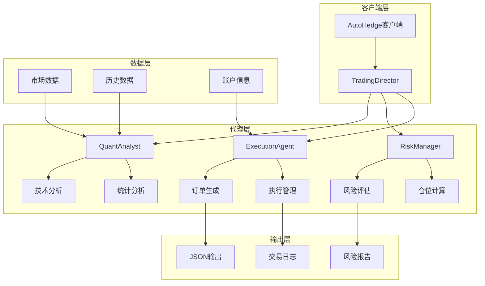
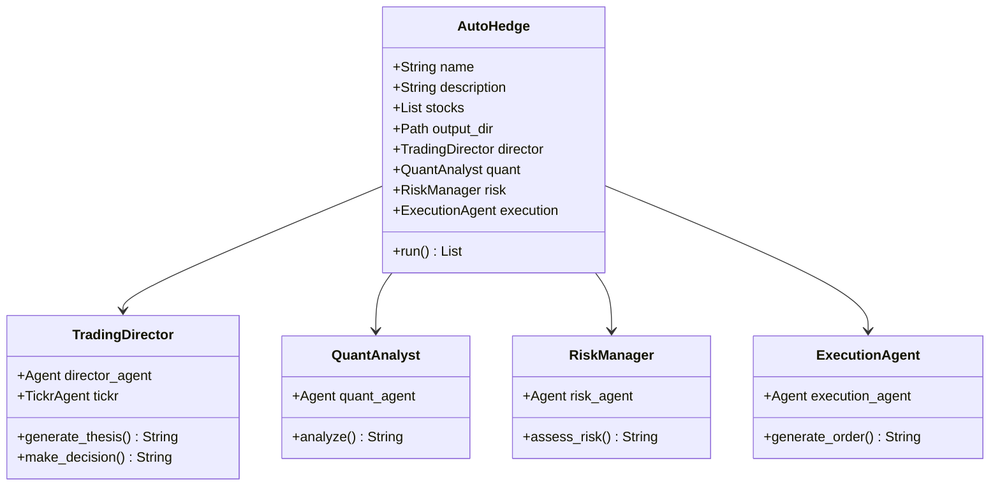
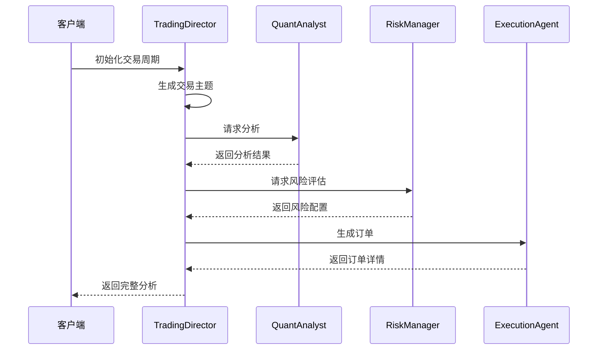
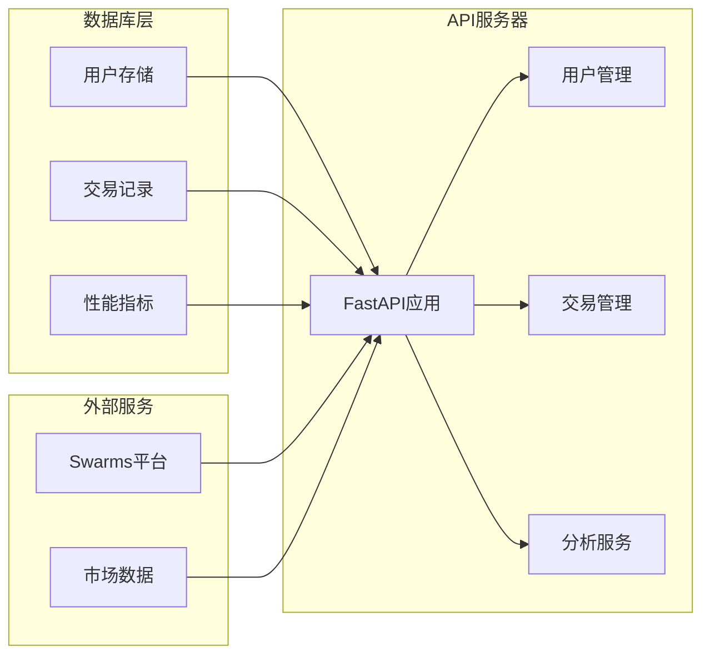
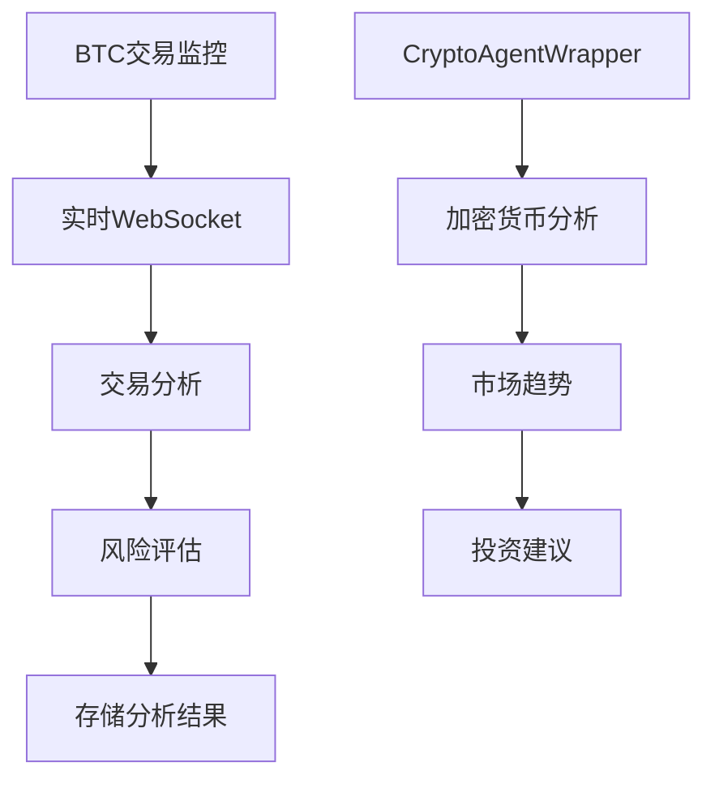

# AutoHedge项目概述

<cite>
**本文档中引用的文件**
- [README.md](file://README.md)
- [example.py](file://example.py)
- [autohedge/main.py](file://autohedge/main.py)
- [autohedge/__init__.py](file://autohedge/__init__.py)
- [pyproject.toml](file://pyproject.toml)
- [requirements.txt](file://requirements.txt)
- [api/api.py](file://api/api.py)
- [experimental/btc_agent.py](file://experimental/btc_agent.py)
- [experimental/crypto_agent_wrapper.py](file://experimental/crypto_agent_wrapper.py)
- [autohedge/tools/td_ameritrade.py](file://autohedge/tools/td_ameritrade.py)
</cite>

## 目录
1. [项目简介](#项目简介)
2. [核心架构](#核心架构)
3. [多代理系统](#多代理系统)
4. [技术特性](#技术特性)
5. [使用示例](#使用示例)
6. [API接口](#api接口)
7. [扩展功能](#扩展功能)
8. [部署指南](#部署指南)
9. [最佳实践](#最佳实践)
10. [总结](#总结)

## 项目简介

AutoHedge是一个基于人工智能代理的自动化对冲基金管理系统，利用群体智能和AI代理技术实现市场分析、风险管理与交易执行的全流程自动化。该项目旨在为量化交易和AI金融应用开发提供一个完整的解决方案框架。

### 核心目标

- **自动化交易**：通过多智能体协作实现从市场分析到交易执行的全自动化流程
- **风险优先**：内置风险管理和仓位控制机制，确保交易安全
- **结构化输出**：提供JSON格式的标准化交易建议和分析报告
- **可扩展架构**：支持自定义和扩展新功能的能力

### 技术优势

- 基于Swarm框架的分布式AI代理系统
- 集成多种市场数据源和交易平台
- 实时市场监控和分析能力
- 完善的日志记录和调试系统

**章节来源**
- [README.md](file://README.md#L12-L27)
- [autohedge/main.py](file://autohedge/main.py#L1-L50)

## 核心架构

AutoHedge采用模块化的多代理架构设计，每个代理负责特定的交易环节，通过协调器实现整体流程的自动化管理。



**图表来源**
- [autohedge/main.py](file://autohedge/main.py#L422-L475)
- [README.md](file://README.md#L185-L215)

### 系统边界

AutoHedge系统具有清晰的功能边界：

- **输入边界**：市场数据、交易指令、配置参数
- **处理边界**：多代理协作、数据分析、决策制定
- **输出边界**：交易订单、分析报告、性能指标
- **接口边界**：API服务、工具集成、外部连接

**章节来源**
- [autohedge/main.py](file://autohedge/main.py#L422-L475)
- [README.md](file://README.md#L185-L215)

## 多代理系统

AutoHedge的核心是基于多代理模式的分布式系统，每个代理都有明确的专业职责和协作机制。

### 代理角色与职责



**图表来源**
- [autohedge/main.py](file://autohedge/main.py#L242-L475)

### 代理协作流程



**图表来源**
- [autohedge/main.py](file://autohedge/main.py#L477-L583)
- [README.md](file://README.md#L218-L242)

### 设计模式

AutoHedge采用了多种设计模式来确保系统的灵活性和可维护性：

- **代理模式**：每个专业功能由独立的代理实现
- **策略模式**：不同交易策略可以通过配置切换
- **观察者模式**：实时监控和事件通知机制
- **工厂模式**：动态创建和管理代理实例

**章节来源**
- [autohedge/main.py](file://autohedge/main.py#L242-L475)

## 技术特性

### 1. 多代理协作机制

每个代理都经过精心设计，具有以下特点：

- **专业化分工**：TradingDirector负责战略制定，QuantAnalyst进行技术分析，RiskManager评估风险，ExecutionAgent执行交易
- **异步通信**：代理之间通过消息传递实现松耦合协作
- **容错机制**：单个代理故障不影响整体系统运行

### 2. 实时市场分析

系统集成了多种市场数据源，提供实时分析能力：

- **技术指标分析**：移动平均线、相对强弱指数、布林带等
- **统计模式识别**：均值回归、动量分析、波动率计算
- **风险度量**：VaR、预期损失、希腊字母等

### 3. 结构化输出

所有分析结果都以标准化的Pydantic模型输出：

```python
class AutoHedgeOutput(BaseModel):
    id: str
    thesis: Optional[str] = None
    risk_assessment: Optional[str] = None
    order: Optional[str] = None
    decision: str = None
    timestamp: str = datetime.now().isoformat()
    current_stock: str
```

### 4. 风险管理

内置完善的风险管理体系：

- **仓位控制**：基于风险承受能力和市场条件确定投资比例
- **止损设置**：自动计算和设置止损点位
- **组合分散**：避免过度集中投资单一资产

**章节来源**
- [autohedge/main.py](file://autohedge/main.py#L102-L119)
- [autohedge/main.py](file://autohedge/main.py#L159-L239)

## 使用示例

### 基础使用

以下是典型的使用场景：

```python
from autohedge import AutoHedge
from dotenv import load_dotenv

load_dotenv()

# 定义要分析的股票
stocks = ["NVDA", "TSLA", "MSFT", "GOOG"]

# 初始化交易系统
trading_system = AutoHedge(
    name="swarms-fund",
    description="Private Hedge Fund for Swarms Corp",
    stocks=stocks,
)

# 定义交易任务
task = "As BlackRock, let's evaluate AI companies for a portfolio with $500 million in allocation, aiming for a balanced risk-reward profile."

# 执行交易周期
result = trading_system.run(task=task)
print(result)
```

### 高级配置

系统支持多种配置选项：

```python
# 自定义代理配置
trading_system = AutoHedge(
    name="CustomStrategy",
    description="My Trading Strategy",
    stocks=["NVDA", "AAPL"],
    output_dir="custom_outputs",
    strategy="momentum",
    output_type="dict"
)
```

**章节来源**
- [example.py](file://example.py#L1-L22)
- [autohedge/main.py](file://autohedge/main.py#L435-L475)

## API接口

AutoHedge提供了完整的RESTful API服务，支持生产环境部署。

### API架构



**图表来源**
- [api/api.py](file://api/api.py#L130-L475)

### 主要端点

| 端点 | 方法 | 描述 |
|------|------|------|
| `/users` | POST | 创建新用户 |
| `/users/me` | GET | 获取当前用户信息 |
| `/trades` | POST | 创建新交易 |
| `/trades` | GET | 列出交易记录 |
| `/trades/{id}` | GET | 获取特定交易 |
| `/analytics/history` | GET | 获取历史分析 |

### 认证机制

API使用基于API密钥的身份验证：

```python
headers = {
    "X-API-Key": "your-api-key",
    "Content-Type": "application/json"
}
```

**章节来源**
- [api/api.py](file://api/api.py#L202-L475)

## 扩展功能

### 加密货币支持

项目包含专门的加密货币分析功能：



**图表来源**
- [experimental/btc_agent.py](file://experimental/btc_agent.py#L36-L243)
- [experimental/crypto_agent_wrapper.py](file://experimental/crypto_agent_wrapper.py#L10-L52)

### 交易平台集成

支持多种交易平台的API集成：

- **TD Ameritrade**：完整的交易和账户管理功能
- **eTrade**：易趣证券交易平台接口
- **TradeStation**：专业交易平台集成

### 实验性功能

项目包含多个实验性功能模块：

- **比特币交易监控**：实时监控特定地址的交易活动
- **市场做市**：自动市场做市策略实现
- **高级分析**：更复杂的量化分析工具

**章节来源**
- [experimental/btc_agent.py](file://experimental/btc_agent.py#L1-L243)
- [autohedge/tools/td_ameritrade.py](file://autohedge/tools/td_ameritrade.py#L1-L209)

## 部署指南

### 环境要求

- Python 3.10+
- swarms包
- tickr-agent
- pydantic
- loguru
- swarm-models

### 生产部署

使用ASGI服务器进行生产部署：

```bash
uvicorn main:app --host 0.0.0.0 --port 8000 --workers 4
```

### 环境变量配置

```bash
export OPENAI_API_KEY="your-openai-key"
export WORKSPACE_DIR="agent_workspace"
export TD_API_KEY="your-td-key"
export TD_ACCESS_TOKEN="your-access-token"
```

**章节来源**
- [requirements.txt](file://requirements.txt#L1-L8)
- [pyproject.toml](file://pyproject.toml#L24-L31)

## 最佳实践

### 开发建议

1. **模块化开发**：充分利用现有的代理模块进行功能扩展
2. **错误处理**：实现完善的异常处理和重试机制
3. **日志记录**：使用系统提供的日志功能进行调试和监控
4. **测试策略**：编写单元测试和集成测试确保系统稳定性

### 运维要点

1. **监控告警**：建立系统健康状态监控
2. **备份策略**：定期备份交易数据和配置
3. **性能优化**：根据实际负载调整并发参数
4. **安全防护**：保护API密钥和敏感数据

### 性能优化

- 使用异步编程提高并发处理能力
- 实现缓存机制减少重复计算
- 优化网络请求和数据库查询
- 合理配置资源限制和超时设置

## 总结

AutoHedge作为一个创新的AI驱动的自动化交易系统，在以下几个方面表现出色：

### 技术创新

- **多代理架构**：通过专业化代理实现复杂交易流程的自动化
- **实时分析**：集成多种数据源提供实时市场洞察
- **风险导向**：内置完善的风险管理体系
- **可扩展设计**：模块化架构支持功能扩展和定制

### 应用价值

- **量化交易**：为量化投资者提供完整的自动化解决方案
- **AI金融**：展示AI代理在金融领域的实际应用
- **教育培训**：为学习者提供实践性强的项目案例
- **企业应用**：可直接应用于小型对冲基金和投资机构

### 发展前景

AutoHedge项目展现了AI代理技术在金融领域的巨大潜力，其模块化的设计和丰富的功能为未来的扩展和改进奠定了坚实基础。随着AI技术的不断发展，该系统有望在智能投顾、算法交易等领域发挥更大的作用。

通过本文档的详细介绍，读者可以全面了解AutoHedge项目的核心理念、技术架构和应用场景，为实际使用和进一步开发提供指导。