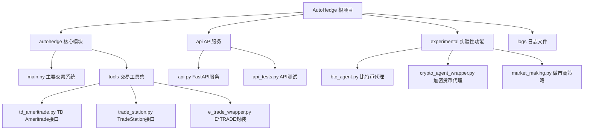

# AutoHedge 项目文档

## 项目愿景

AutoHedge 是一个基于群体智能和AI代理的自动化对冲基金系统，旨在通过多代理架构实现市场分析、风险管理和交易执行的完全自动化。

## 架构总览



## 模块索引

| 模块路径 | 语言 | 职责描述 | 状态 |
|---------|------|----------|------|
| `autohedge/` | Python | 核心交易系统和多代理框架 | ✅ 活跃 |
| `api/` | Python | FastAPI REST API服务 | ✅ 活跃 |
| `experimental/` | Python | 实验性功能和原型 | 🚧 开发中 |
| `logs/` | - | 交易日志和CSV数据 | 📁 数据存储 |

## 运行与开发

### 环境要求
- Python 3.10+
- 依赖包：`swarms`, `tickr-agent`, `pydantic`, `loguru`, `fastapi`, `uvicorn`

### 快速启动

1. **安装依赖**
   ```bash
   pip install -r requirements.txt
   ```

2. **运行核心交易系统**
   ```python
   from autohedge import AutoHedge

   trading_system = AutoHedge(stocks=["NVDA", "AAPL"])
   result = trading_system.run(task="分析科技股，分配10万美元")
   ```

3. **启动API服务**
   ```bash
   python api/api.py
   # 或使用 uvicorn
   uvicorn api.api:app --host 0.0.0.0 --port 8000
   ```

### 环境变量配置
```bash
OPENAI_API_KEY=""
WORKSPACE_DIR="agent_workspace"
TD_API_KEY=""          # TD Ameritrade API
TD_ACCESS_TOKEN=""     # TD Ameritrade 访问令牌
```

## 测试策略

- **API测试**: `api/api_tests.py`
- **单元测试**: 需要扩展
- **集成测试**: 需要扩展
- **性能测试**: 需要扩展

## 编码规范

- **代码风格**: Black (line-length=70)
- **类型检查**: mypy
- **代码质量**: ruff
- **文档**: 遵循Google风格docstring

## AI使用指引

### 多代理架构
1. **TradingDirector**: 生成交易论点和策略协调
2. **QuantAnalyst**: 技术分析和统计分析
3. **RiskManager**: 风险评估和仓位管理
4. **ExecutionAgent**: 订单生成和执行
5. **SentimentAgent**: 情绪分析（已集成但注释）

### 代理使用模式
- 每个代理使用Swarms框架初始化
- 支持多种LLM模型（GPT-4, DeepSeek等）
- 采用结构化输出和错误处理
- 支持对话上下文和日志记录

## 变更记录 (Changelog)

### 2025-01-19
- 初始化项目文档
- 完成根级架构分析
- 识别核心模块和功能组件

## 项目统计

- **总文件数**: 16个主要文件
- **主要语言**: Python (100%)
- **代码行数**: 约2000+行
- **测试覆盖率**: 需要提升
- **文档完整性**: 进行中