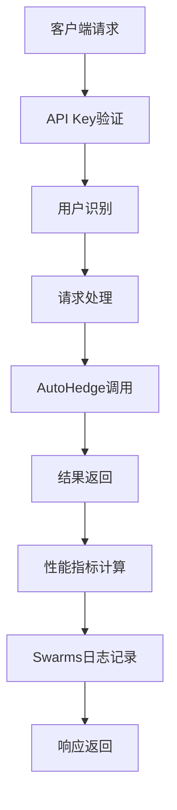

[根目录](../CLAUDE.md) > **api**

# API 服务模块

## 模块职责

API模块提供基于FastAPI的RESTful API服务，为AutoHedge交易系统提供生产级的HTTP接口，支持用户管理、交易执行和历史数据分析。

## 入口与启动

### 主要文件
- **`api.py`**: FastAPI应用主文件 (476行)
- **`api_tests.py`**: API测试客户端 (187行)

### 启动方式
```bash
# 直接运行
python api/api.py

# 使用uvicorn
uvicorn api.api:app --host 0.0.0.0 --port 8000

# 生产环境
uvicorn api.api:app --host 0.0.0.0 --port 8000 --workers 4
```

### 访问地址
- **API服务**: `http://localhost:8000`
- **Swagger文档**: `http://localhost:8000/docs`
- **ReDoc文档**: `http://localhost:8000/redoc`

## 对外接口

### 认证机制
- **API Key**: 通过 `X-API-Key` 请求头进行认证
- **用户管理**: 支持用户注册、更新、查询

### 核心端点

#### 用户管理
```http
POST   /users              # 创建用户并获取API Key
GET    /users/me           # 获取当前用户信息
PUT    /users/me           # 更新用户信息
```

#### 交易操作
```http
POST   /trades             # 创建交易任务
GET    /trades             # 列出交易记录
GET    /trades/{trade_id}  # 获取特定交易详情
DELETE /trades/{trade_id}  # 删除交易记录
```

#### 分析数据
```http
GET    /analytics/history  # 获取历史分析数据
```

### 数据模型

#### UserCreate (用户创建)
```python
class UserCreate(BaseModel):
    username: str = Field(..., min_length=3, max_length=50)
    email: EmailStr
    fund_name: str = Field(..., min_length=3, max_length=100)
    fund_description: Optional[str] = Field(None, max_length=500)
```

#### TradingTask (交易任务)
```python
class TradingTask(BaseModel):
    stocks: List[str] = Field(..., min_items=1)
    task: str = Field(..., min_length=10)
    allocation: float = Field(..., gt=0)
    strategy_type: Optional[str] = Field(None)
    risk_level: Optional[int] = Field(None, ge=1, le=10)
```

#### TradeResponse (交易响应)
```python
class TradeResponse(BaseModel):
    id: str
    user_id: str
    task: TradingTask
    status: TradeStatus
    created_at: datetime
    executed_at: Optional[datetime]
    result: Optional[Dict[str, Any]]
    performance_metrics: Optional[Dict[str, float]]
```

#### HistoricalAnalytics (历史分析)
```python
class HistoricalAnalytics(BaseModel):
    total_trades: int
    success_rate: float
    average_return: float
    total_allocation: float
    risk_adjusted_return: float
    top_performing_stocks: List[Tuple[str, float]]
```

## 关键依赖与配置

### 外部依赖
- **fastapi**: Web框架
- **uvicorn**: ASGI服务器
- **pydantic**: 数据验证
- **requests**: HTTP客户端
- **loguru**: 日志记录
- **autohedge.main**: 核心交易系统

### 环境变量
```bash
AUTOHEDGE_ENV=production      # 运行环境
AUTOHEDGE_LOG_LEVEL=INFO      # 日志级别
```

### 日志配置
- **文件**: `logs/autohedge_{time}.log`
- **轮转**: 500MB
- **保留**: 10天
- **格式**: 详细时间戳和模块信息

## 架构设计

### AutoHedgeAPI类
```python
class AutoHedgeAPI:
    def __init__(self, *args, **kwargs)
    def run(self, host: str = "0.0.0.0", port: int = 8000)

    # 私有方法
    async def _get_current_user(self) -> User
    def _calculate_performance_metrics(self, trade_result: Dict) -> Dict
    def _setup_routes(self)
    def _log_to_swarms(self, data_dict: dict) -> None
```

### 执行流程


## 测试与质量

### 测试覆盖
- ✅ API集成测试 (`api_tests.py`)
- ✅ 端到端测试
- ✅ 错误处理测试
- ❌ 单元测试缺失
- ❌ 负载测试缺失

### 测试功能
- 用户创建和认证
- 交易任务执行
- 历史数据获取
- 性能指标计算

### 运行测试
```bash
python api/api_tests.py
```

## 性能特性

### 并发处理
- **异步支持**: FastAPI原生异步
- **生产部署**: 支持多worker部署
- **请求追踪**: 执行时间监控

### 错误处理
- **HTTP异常**: 标准HTTP状态码
- **输入验证**: Pydantic模型验证
- **详细错误**: 结构化错误信息

### 安全特性
- **API Key认证**: 基于请求头的认证
- **用户隔离**: 用户只能访问自己的数据
- **输入验证**: 严格的参数验证

## 监控与日志

### 性能监控
```python
@contextmanager
def _log_execution_time(self, operation: str, user_id: Optional[str] = None)
```

### 外部集成
- **Swarms集成**: 交易数据自动记录到Swarms平台
- **失败重试**: 日志记录失败时的重试机制

## 常见问题 (FAQ)

### Q: 如何部署到生产环境？
A: 使用uvicorn多worker模式，配置环境变量和负载均衡器。

### Q: 如何添加新的API端点？
A: 在 `_setup_routes()` 方法中添加新的路由处理器。

### Q: 如何处理大量并发请求？
A: 调整worker数量，使用异步数据库连接，考虑消息队列。

### Q: API Key如何管理？
A: 当前使用内存存储，生产环境建议使用Redis或数据库。

## 相关文件清单

- `api.py` - FastAPI主应用 (476行)
- `api_tests.py` - API测试客户端 (187行)

## 变更记录 (Changelog)

### 2025-01-19
- 完成API模块详细分析
- 创建模块级文档
- 识别所有核心端点和数据模型
- 标记测试覆盖情况