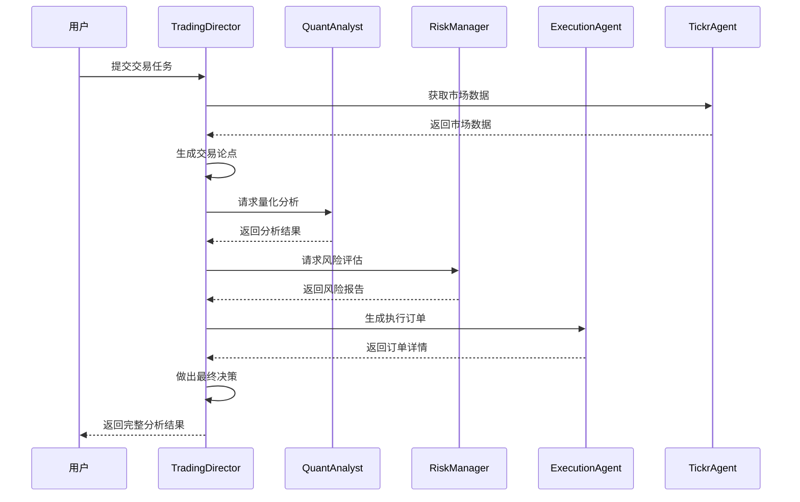

[根目录](../../CLAUDE.md) > **autohedge**

# AutoHedge 核心模块

## 模块职责

AutoHedge 核心模块是整个自动化对冲基金系统的心脏，提供基于多代理架构的智能交易决策、风险管理和执行能力。

## 入口与启动

### 主要入口点
- **`__init__.py`**: 暴露 `AutoHedge` 主类
- **`main.py`**: 核心交易系统实现，约580行代码

### 启动示例
```python
from autohedge import AutoHedge

# 初始化交易系统
trading_system = AutoHedge(
    stocks=["NVDA", "AAPL"],
    name="my-fund",
    description="Automated trading strategy"
)

# 执行交易分析
result = trading_system.run(task="分析科技股投资机会")
```

## 对外接口

### 核心类

#### AutoHedge
```python
class AutoHedge:
    def __init__(self, stocks: List[str], name: str, description: str, ...)
    def run(self, task: str) -> Union[List, Dict, str]
```

#### TradingDirector
```python
class TradingDirector:
    def __init__(self, stocks: List[str], output_dir: str)
    def generate_thesis(self, task: str, stock: str) -> Tuple[str, str]
    def make_decision(self, task: str, thesis: str) -> str
```

#### QuantAnalyst
```python
class QuantAnalyst:
    def __init__(self, output_dir: str)
    def analyze(self, stock: str, thesis: str) -> str
```

#### RiskManager
```python
class RiskManager:
    def __init__(self)
    def assess_risk(self, stock: str, thesis: str, quant_analysis: str) -> str
```

#### ExecutionAgent
```python
class ExecutionAgent:
    def __init__(self)
    def generate_order(self, stock: str, thesis: Dict, risk_assessment: Dict) -> str
```

## 关键依赖与配置

### 外部依赖
- **swarms**: AI代理框架
- **tickr-agent**: 市场数据获取
- **pydantic**: 数据验证
- **loguru**: 日志记录
- **swarm-models**: AI模型集成

### 环境变量
```bash
OPENAI_API_KEY=""           # OpenAI API密钥
WORKSPACE_DIR="agent_workspace"  # 工作目录
```

### AI模型配置
- **Director Agent**: `groq/deepseek-r1-distill-llama-70b`
- **Quant Agent**: `groq/deepseek-r1-distill-llama-70b`
- **Risk Manager**: `groq/deepseek-r1-distill-llama-70b`
- **Execution Agent**: `groq/deepseek-r1-distill-llama-70b`
- **Sentiment Agent**: `gpt-4o-mini` (已集成但注释)

## 数据模型

### AutoHedgeOutput
```python
class AutoHedgeOutput(BaseModel):
    id: str
    thesis: Optional[str]
    risk_assessment: Optional[str]
    order: Optional[str]
    decision: str
    timestamp: str
    current_stock: str
```

### AutoHedgeOutputMain
```python
class AutoHedgeOutputMain(BaseModel):
    name: Optional[str]
    description: Optional[str]
    id: str
    stocks: Optional[list]
    task: Optional[str]
    timestamp: str
    logs: List[AutoHedgeOutput]
```

## 交易流程



## 测试与质量

### 测试覆盖
- ✅ 基础功能测试通过 `example.py`
- ❌ 单元测试缺失
- ❌ 集成测试缺失
- ❌ 性能测试缺失

### 代码质量
- **代码风格**: 遵循Black规范
- **类型提示**: 部分覆盖
- **错误处理**: 基础异常处理
- **日志记录**: 使用loguru

## 常见问题 (FAQ)

### Q: 如何添加新的券商接口？
A: 在 `tools/` 目录下创建新的券商客户端类，参考现有的 `td_ameritrade.py`。

### Q: 如何自定义AI模型？
A: 修改各代理类中的 `model_name` 参数，支持GPT、DeepSeek等模型。

### Q: 如何处理实时交易？
A: 当前版本为模拟交易，实际交易需要集成券商API并添加风控机制。

### Q: 如何扩展分析功能？
A: 可以添加新的分析代理，如情绪分析、技术指标分析等。

## 相关文件清单

### 核心文件
- `__init__.py` - 模块入口
- `main.py` - 主要交易系统 (580行)

### 工具模块
- `tools/__init__.py` - 工具模块初始化
- `tools/td_ameritrade.py` - TD Ameritrade接口
- `tools/trade_station.py` - TradeStation接口
- `tools/e_trade_wrapper.py` - E*TRADE封装

## 变更记录 (Changelog)

### 2025-01-19
- 完成模块详细分析
- 创建模块级文档
- 识别核心架构和接口
- 标记测试覆盖率缺口