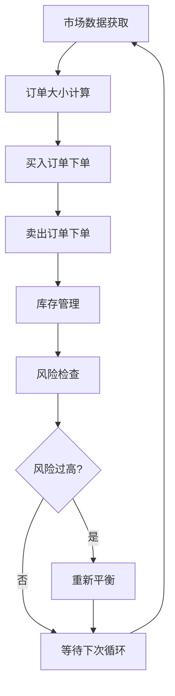
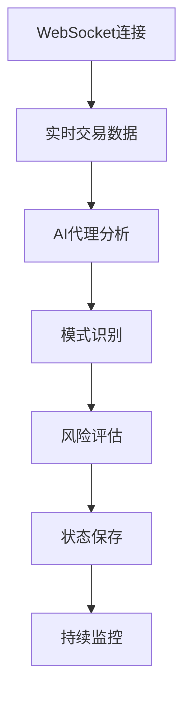

[根目录](../CLAUDE.md) > **experimental**

# 实验性功能模块

## 模块职责

Experimental模块包含各种创新性交易策略的原型实现，专注于加密货币交易、实时监控和高级算法交易策略的研发。

## 入口与启动

### 主要文件
- **`btc_agent.py`**: 比特币交易实时监控代理
- **`crypto_agent_wrapper.py`**: 加密货币分析代理封装
- **`market_making.py`**: 做市商策略实现

### 启动示例
```python
# 比特币监控
from experimental.btc_agent import BTCTransactionMonitor
monitor = BTCTransactionMonitor()

# 做市商策略
from experimental.market_making import MarketMaker, MarketMakingConfig
config = MarketMakingConfig(trading_pair='BTC/USDT', total_capital=10000.0)
market_maker = MarketMaker(config)
```

## 对外接口

### BTCTransactionMonitor
```python
class BTCTransactionMonitor:
    def __init__(self)
    def run(self) -> None  # 启动实时监控
```

### CryptoAgentWrapper
```python
class CryptoAgentWrapper:
    def __init__(self)
    def run(self, coin_id: str, analysis_prompt: str) -> str
```

### MarketMaker
```python
class MarketMaker:
    def __init__(self, config: MarketMakingConfig)
    async def fetch_market_data(self) -> MarketData
    def calculate_order_size(self) -> float
    def simulate_order(self, order_type: str, price: float, amount: float) -> Dict
    async def market_making_strategy(self)
    async def run(self)
```

## 关键依赖与配置

### 外部依赖
- **websockets**: 实时数据流
- **aiohttp**: 异步HTTP客户端
- **numpy/pandas**: 数据分析
- **cryptoagent**: 加密货币代理库
- **swarm-models**: AI模型集成

### 环境变量
```bash
OPENAI_API_KEY=""           # OpenAI API密钥
```

### AI模型配置
- **BTC Agent**: `gpt-4o`
- **Crypto Agent**: `gpt-4o-mini`

## 数据模型

### MarketMakingConfig
```python
@dataclass
class MarketMakingConfig:
    trading_pair: str = 'BTC/USDT'
    total_capital: float = 10000.0
    spread_percentage: float = 0.001
    order_size_percentage: float = 0.01
    max_inventory_exposure: float = 0.2
    rebalance_threshold: float = 0.1
    min_profit_threshold: float = 0.002
```

### MarketData
```python
@dataclass
class MarketData:
    timestamp: float
    best_bid: float
    best_ask: float
    last_price: float
    volume: float
```

## 核心功能

### 比特币实时监控 (btc_agent.py)
- **WebSocket连接**: 实时比特币交易数据流
- **AI分析**: 使用GPT-4进行交易模式分析
- **风险评估**: 实时风险指标监控
- **自动化状态保存**: JSON格式状态持久化

#### 监控指标
- 交易价值和市场意义
- 历史地址行为分析
- 异常模式识别
- 网络流量关系分析

### 加密货币分析 (crypto_agent_wrapper.py)
- **多币种支持**: 支持比特币、以太坊等主流加密货币
- **集成分析**: 使用cryptoagent库进行深度分析
- **提示驱动**: 支持自定义分析提示

### 做市商策略 (market_making.py)
- **实时数据获取**: 多数据源支持 (Coinbase, Binance)
- **风险管理**: 库存暴露和资金管理
- **订单模拟**: 完整的模拟交易环境
- **回测支持**: 历史数据策略验证

#### 策略特点
- **动态价差**: 基于市场条件调整价差
- **库存管理**: 防止单边暴露过多
- **利润目标**: 最小利润阈值保护
- **CSV日志**: 详细的交易记录

## 架构设计

### 做市商策略流程


### 比特币监控架构


## 测试与质量

### 测试覆盖
- ❌ 单元测试缺失
- ❌ 集成测试缺失
- ❌ 性能测试缺失
- ✅ 模拟环境验证

### 代码质量
- **异步编程**: 使用asyncio进行并发处理
- **错误处理**: 基础异常捕获
- **日志记录**: loguru集成
- **状态管理**: JSON持久化

## 配置示例

### 做市商配置
```python
config = MarketMakingConfig(
    trading_pair='BTC/USDT',
    total_capital=10000.0,
    spread_percentage=0.001,  # 0.1% 价差
    order_size_percentage=0.01,  # 1% 资金每单
    max_inventory_exposure=0.2,  # 20% 最大库存
    min_profit_threshold=0.002   # 0.2% 最小利润
)
```

### 加密货币分析提示
```python
analysis_prompt = """
全面分析以下加密货币：
1. 技术指标分析
2. 市场情绪评估
3. 风险因素识别
4. 投资建议
"""
```

## 性能特性

### 实时处理
- **低延迟**: WebSocket直接数据流
- **并发处理**: asyncio异步架构
- **资源管理**: 自动连接池管理

### 风险管理
- **库存限制**: 防止过度暴露
- **价差保护**: 动态价差调整
- **止损机制**: 可配置风险阈值

## 常见问题 (FAQ)

### Q: 如何连接到实时比特币数据？
A: 修改WebSocket端点，确保网络连接稳定。

### Q: 做市商策略如何进行实盘交易？
A: 需要集成交易所API，替换模拟交易部分。

### Q: 如何添加新的加密货币支持？
A: 在配置中添加新的交易对，确保数据源支持。

### Q: AI代理分析结果如何优化？
A: 调整系统提示词，使用更强大的模型。

## 相关文件清单

- `btc_agent.py` - 比特币实时监控代理
- `crypto_agent_wrapper.py` - 加密货币分析封装
- `market_making.py` - 做市商策略实现

## 变更记录 (Changelog)

### 2025-01-19
- 完成实验模块详细分析
- 创建模块级文档
- 识别核心实验功能
- 标记测试和部署需求